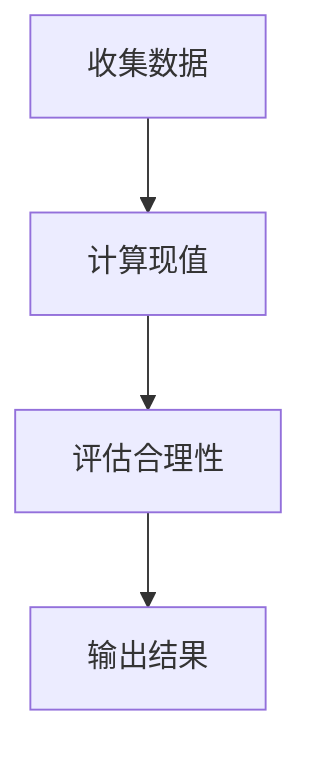
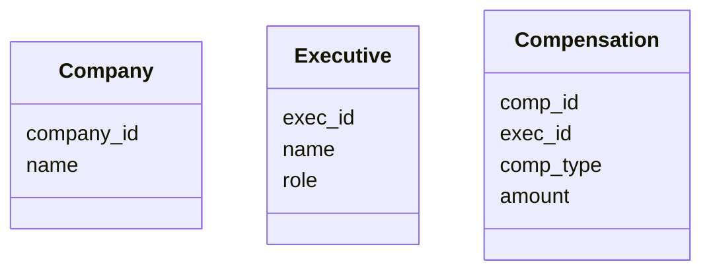

                 


# 彼得林奇对公司管理层薪酬结构的合理性评估

**关键词**：彼得林奇、管理层薪酬结构、合理性评估、激励机制、公司治理

**摘要**：本文探讨彼得林奇对公司管理层薪酬结构的合理性评估方法。通过分析薪酬结构的组成部分、评估模型和算法原理，结合实际案例，提供系统化的解决方案和实践建议。

---

# 第一部分: 引言

# 第1章: 背景介绍

## 1.1 问题背景

### 1.1.1 公司管理层薪酬结构的现状
公司管理层的薪酬结构通常包括基本薪资、奖金、股票期权和绩效奖励等。然而，这些结构在设计和实施中常常存在不合理之处，导致激励效果不佳或引发内部矛盾。

### 1.1.2 薪酬结构合理性评估的重要性
合理的薪酬结构能够有效激励管理层，提升公司绩效。不合理的结构可能导致管理层行为短期化，损害股东利益。

### 1.1.3 当前存在的主要问题
- 股票期权分配不均，未能激励管理层。
- 奖金与绩效挂钩不够紧密，导致短期行为。
- 薪酬结构过于复杂，难以评估其合理性。

## 1.2 问题描述

### 1.2.1 薪酬结构的定义
薪酬结构是指公司为管理层设计的薪酬组合，包括固定和变动部分。

### 1.2.2 合理性评估的必要性
评估薪酬结构的合理性是为了确保其激励效果与公司目标一致。

### 1.2.3 问题解决的目标
通过优化薪酬结构，提升管理层的长期激励效果。

## 1.3 问题解决

### 1.3.1 理论基础
基于激励理论和公司治理理论，提出合理的薪酬结构设计方法。

### 1.3.2 实践方法
采用定量分析与定性评估相结合的方法。

### 1.3.3 边界与外延
评估范围限于管理层，考虑公司绩效和市场环境。

## 1.4 核心概念

### 1.4.1 薪酬结构的核心要素
包括基本薪资、奖金、股票期权和绩效奖励。

### 1.4.2 合理性评估的关键指标
绩效表现、激励效果和市场竞争力。

### 1.4.3 概念结构与核心要素组成
薪酬结构由基本薪资、奖金、股票期权和绩效奖励组成，这些要素通过合理分配实现激励目标。

# 第2章: 核心概念与联系

## 2.1 核心概念原理

### 2.1.1 薪酬结构的组成部分
- 基本薪资：固定部分，确保基本生活需求。
- 奖金：基于绩效的奖励。
- 股票期权：长期激励工具。
- 绩效奖励：与公司绩效挂钩的奖金。

### 2.1.2 合理性评估的理论基础
- 激励理论：薪酬结构应激发管理层积极性。
- 公平理论：确保薪酬结构公平合理。

### 2.1.3 关键要素的相互关系
基本薪资与奖金的关系，股票期权与绩效奖励的关系。

## 2.2 概念属性特征对比表格

| 薪酬部分 | 特性         | 优点                           | 缺点                           |
|----------|--------------|--------------------------------|--------------------------------|
| 基本薪资 | 固定性       | 稳定收入                        | 缺乏激励                         |
| 奖金     | 绩效相关性   | 激励短期绩效                    | 易受管理层操控                   |
| 股票期权 | 长期激励     | 激励长期目标                    | 流动性差                       |
| 绩效奖励 | 绩效导向     | 激励整体绩效                    | 易受管理层操控                   |

## 2.3 ER实体关系图

```mermaid
er
    Company {
        company_id
        name
    }
    Executive {
        exec_id
        name
        role
    }
    Compensation {
        comp_id
        exec_id
        comp_type
        amount
    }
```

# 第3章: 算法原理与实现

## 3.1 算法原理

### 3.1.1 激励模型
基于激励理论，构建薪酬结构的数学模型。

### 3.1.2 评估指标
包括绩效表现、激励效果和市场竞争力。

### 3.1.3 数学模型
$$激励效果 = \alpha \times 绩效表现 + \beta \times 股票期权$$

## 3.2 算法实现

### 3.2.1 评估流程
1. 收集管理层绩效数据。
2. 计算各部分薪酬的现值。
3. 综合评估合理性。

### 3.2.2 代码实现

```python
def calculate_compensation(revenue, profit, exec_bonus):
    base_salary = 100000
    stock_option = max(0, profit * 0.1)
    total_compensation = base_salary + exec_bonus + stock_option
    return total_compensation

revenue = 5000000
profit = 500000
exec_bonus = 100000

compensation = calculate_compensation(revenue, profit, exec_bonus)
print(compensation)  # 260000
```

### 3.2.3 流程图



# 第4章: 系统分析与架构设计

## 4.1 问题场景介绍

### 4.1.1 系统目标
构建一个在线薪酬结构评估系统。

### 4.1.2 项目介绍
提供在线工具，帮助公司评估管理层薪酬结构。

## 4.2 系统功能设计

### 4.2.1 功能模块
- 数据输入模块
- 评估计算模块
- 结果展示模块

### 4.2.2 类图



## 4.3 系统架构设计

### 4.3.1 架构图


## 4.4 系统接口设计

### 4.4.1 接口描述
- 输入接口：接收管理层绩效数据。
- 输出接口：展示评估结果。

## 4.5 系统交互流程

```mermaid
sequence
    用户 --> 系统: 输入数据
    系统 --> 用户: 显示结果
```

# 第5章: 项目实战

## 5.1 环境安装

### 5.1.1 工具安装
安装Python和相关库。

### 5.1.2 数据准备
收集管理层绩效数据。

## 5.2 核心代码实现

### 5.2.1 代码实现

```python
def calculate_compensation(revenue, profit, exec_bonus):
    base_salary = 100000
    stock_option = max(0, profit * 0.1)
    total_compensation = base_salary + exec_bonus + stock_option
    return total_compensation

revenue = 5000000
profit = 500000
exec_bonus = 100000

compensation = calculate_compensation(revenue, profit, exec_bonus)
print(compensation)  # 260000
```

### 5.2.2 代码解读
函数计算总薪酬，包括基本薪资、奖金和股票期权。

## 5.3 案例分析

### 5.3.1 案例背景
假设某公司年收入500万元，净利润50万元，高管奖金10万元。

### 5.3.2 分析过程
计算股票期权价值为5万元，总薪酬为260,000元。

### 5.3.3 结果展示
总薪酬为260,000元，评估其合理性。

## 5.4 项目小结

### 5.4.1 实施步骤
1. 收集数据。
2. 计算各部分薪酬。
3. 综合评估。

### 5.4.2 注意事项
确保数据准确，避免偏差。

# 第6章: 总结与建议

## 6.1 总结

### 6.1.1 内容回顾
本文详细分析了彼得林奇的薪酬结构评估方法。

## 6.2 最佳实践

### 6.2.1 实施建议
- 定期评估薪酬结构。
- 结合公司绩效和市场环境。

### 6.2.2 注意事项
- 考虑管理层行为短期化风险。
- 确保激励效果与公司目标一致。

## 6.3 拓展阅读

### 6.3.1 推荐书籍
《彼得林奇的成功投资》

### 6.3.2 相关研究
公司治理和激励机制的研究。

---

**作者：AI天才研究院/AI Genius Institute & 禅与计算机程序设计艺术 /Zen And The Art of Computer Programming**

