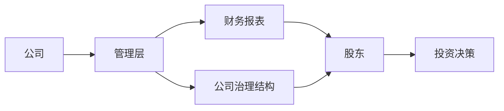
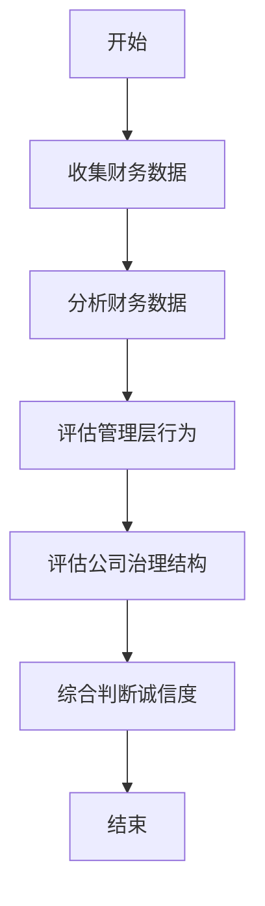
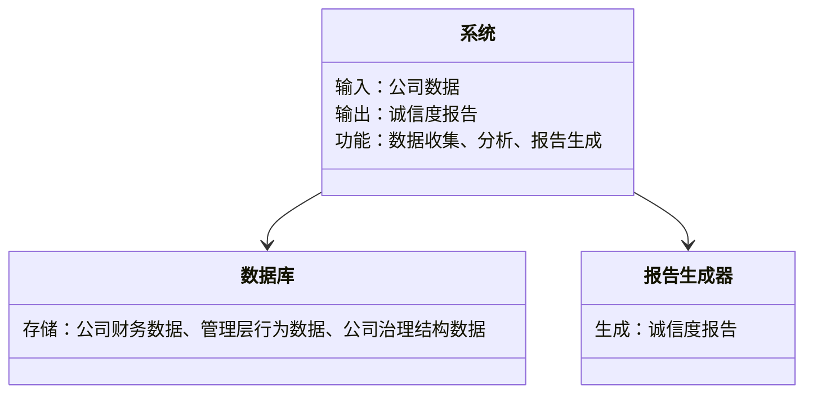
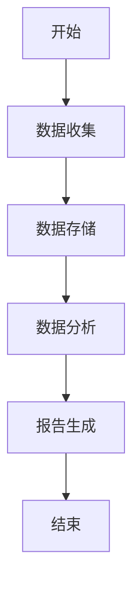

                 


# 彼得林奇对公司管理层诚信度的判断

> 关键词：彼得林奇，公司管理层，诚信度，投资分析，财务报表，系统架构

> 摘要：本文深入探讨了彼得林奇对公司管理层诚信度的判断方法，分析了其投资哲学的核心思想，详细讲解了诚信度判断的核心概念、算法原理、系统架构设计方案以及实际项目实战案例，最后总结了最佳实践与投资建议。

---

# 第一部分: 引言

# 第1章: 彼得林奇与投资哲学

## 1.1 彼得林奇的投资理念

### 1.1.1 彼得林奇的生平简介

彼得·林奇（Peter Lynch）是美国著名的职业棒球运动员和投资家，以其在棒球界和投资界的双重成就而闻名。他在棒球界的职业生涯中曾效力于波士顿红袜队，而他在投资界的成就则源于他对市场趋势和公司基本面的深刻理解。林奇的投资哲学强调长期投资和对公司管理层的深入分析，尤其是在判断公司管理层的诚信度方面，他提出了一系列独特的方法。

### 1.1.2 投资哲学的核心思想

彼得林奇的投资哲学核心在于“买Cheap, 卖Dirt Cheap”。他认为，投资者应该选择那些被市场低估但具有强大基本面的公司进行投资。他强调，公司管理层的诚信度是决定公司长期价值的关键因素之一。具体来说，他提出了以下几点核心思想：

1. **长期投资**：林奇反对短期交易，认为只有长期持有优质股票才能获得超额收益。
2. **基本面分析**：他强调对公司财务报表的深入分析，尤其是对管理层行为的考察。
3. **管理层诚信度**：他认为，公司管理层的诚信度是决定公司价值的关键因素，诚信的管理层更有可能为股东创造长期价值。

### 1.1.3 彼得林奇的成功案例

彼得林奇最著名的成功案例是他在1967年以1美元买入费城勇士队（现为洛杉矶道奇队）的部分股权。这笔投资最终为他带来了数百万美元的收益。此外，他在投资界的成功也体现在他对一些科技公司的早期投资上，如他早期投资于思科系统（Cisco Systems）和苹果公司（Apple Inc.），这些投资为他带来了巨大的收益。

---

## 1.2 公司管理层诚信度的重要性

### 1.2.1 诚信度对公司价值的影响

公司管理层的诚信度直接影响公司的长期价值。诚信的管理层通常会采取负责任的决策，避免短期利润的诱惑，从而为公司和股东创造长期价值。相反，不诚信的管理层可能会通过财务造假或其他不当手段追求短期利益，最终损害公司和股东的长期利益。

### 1.2.2 管理层诚信度与投资决策的关系

在投资决策中，管理层诚信度是关键的判断标准之一。投资者需要通过分析公司的财务报表、管理层的言行以及公司治理结构来评估管理层的诚信度。只有通过这些分析，投资者才能做出明智的投资决策。

### 1.2.3 诚信度判断的现实意义

在现实投资中，判断公司管理层的诚信度可以帮助投资者避免投资于那些可能存在财务造假或管理层欺诈的公司。尤其是在当前全球经济环境下，诚信度判断显得尤为重要，因为许多公司可能会通过复杂的财务操作掩盖其真实的财务状况。

---

## 1.3 本书的核心目标

### 1.3.1 分析彼得林奇的诚信度判断方法

本文将详细分析彼得林奇在判断公司管理层诚信度方面的方法和技巧，包括他对财务报表的分析、对管理层行为的观察以及对公司治理结构的评估。

### 1.3.2 提供实际操作的框架

本文将提供一套实际操作的框架，帮助投资者在实际投资中应用彼得林奇的方法，包括如何分析财务报表、如何评估管理层的诚信度以及如何制定投资策略。

### 1.3.3 总结关键原则与经验

通过对彼得林奇方法的分析和总结，本文将提炼出一些关键原则和经验，帮助投资者更好地理解和应用这些方法。

---

# 第二部分: 背景与基础

# 第2章: 诚信度判断的背景与基础

## 2.1 诚信度判断的定义与范围

### 2.1.1 诚信度的定义

诚信度是指公司在经营过程中遵循诚信原则的程度，具体表现为公司管理层在决策中是否遵守道德规范、是否透明公开以及是否以股东利益为重。

### 2.1.2 管理层诚信度的外延

管理层诚信度的外延包括公司管理层的决策透明度、财务管理的规范性、公司治理结构的合理性以及管理层与股东之间的信任关系。

### 2.1.3 判断诚信度的边界

判断诚信度的边界包括公司管理层的行为是否符合法律和道德规范、公司财务数据的准确性以及公司治理结构的合理性。

## 2.2 管理层诚信度的核心要素

### 2.2.1 诚信度的核心属性

诚信度的核心属性包括透明度、规范性和以股东利益为重。

### 2.2.2 管理层行为的特征对比

通过对比管理层行为的特征，可以更好地理解诚信度的内涵。例如，诚信的管理层通常会避免财务造假，注重长期发展，而诚信度低的管理层则可能追求短期利益，忽视公司长期发展。

### 2.2.3 核心要素的结构化分析

通过结构化分析，可以将管理层诚信度的核心要素分解为财务行为、决策行为和公司治理行为三个部分，分别进行深入分析。

---

## 2.3 财务报表分析的基础知识

### 2.3.1 财务报表的构成

财务报表主要包括资产负债表、利润表和现金流量表。这些报表分别反映了公司的财务状况、经营成果和现金流量。

### 2.3.2 财务报表分析的方法

财务报表分析的方法包括横向比较、纵向比较和趋势分析。通过这些方法，可以更好地理解公司的财务状况和经营成果。

### 2.3.3 财务数据与诚信度的关系

财务数据是判断管理层诚信度的重要依据。例如，通过分析公司的利润表，可以判断公司是否存在虚增收入或隐瞒成本的情况，从而评估管理层的诚信度。

---

# 第三部分: 核心概念与联系

# 第3章: 核心概念的原理与联系

## 3.1 诚信度判断的核心原理

### 3.1.1 管理层动机与行为的关系

管理层的动机直接影响其行为。诚信的管理层通常会以股东利益为重，而诚信度低的管理层则可能追求个人利益。

### 3.1.2 诚信度与企业价值的关联

诚信度与企业价值密切相关。诚信的管理层通常会为公司创造更大的价值，而诚信度低的管理层则可能损害公司价值。

### 3.1.3 判断方法的逻辑框架

通过分析公司财务报表、管理层行为和公司治理结构，可以构建一个逻辑框架来判断管理层的诚信度。

---

## 3.2 核心概念的属性对比

### 3.2.1 诚信度与财务数据的对比

通过对比诚信度和财务数据，可以更好地理解诚信度的内涵。例如，诚信的管理层通常会保持财务数据的真实性，而诚信度低的管理层则可能通过财务造假来掩盖公司的真实状况。

### 3.2.2 管理层行为与公司治理的关系

管理层行为与公司治理密切相关。良好的公司治理结构可以约束管理层的行为，降低管理层诚信度低的可能性。

### 3.2.3 不同行业诚信度的差异

不同行业的诚信度可能存在差异。例如，金融行业由于涉及大量资金，管理层诚信度的重要性更高，而制造业可能相对较低。

---

## 3.3 实体关系图



---

## 3.4 算法原理讲解

### 3.4.1 算法流程图



### 3.4.2 算法实现代码

```python
def calculate_honesty_level(financial_data, management_behavior, governance_structure):
    # 分析财务数据
    financial_honesty = analyze_financial_data(financial_data)
    # 评估管理层行为
    management_honesty = assess_management_behavior(management_behavior)
    # 评估公司治理结构
    governance_honesty = evaluate_governance_structure(governance_structure)
    # 综合判断诚信度
    total_honesty = financial_honesty * 0.4 + management_honesty * 0.3 + governance_honesty * 0.3
    return total_honesty

def analyze_financial_data(financial_data):
    # 示例：计算财务数据的诚信度
    return financial_data['净利润'] / financial_data['营业收入']

def assess_management_behavior(management_behavior):
    # 示例：评估管理层行为
    return management_behavior['研发投入'] / management_behavior['管理费用']

def evaluate_governance_structure(governance_structure):
    # 示例：评估公司治理结构
    return governance_structure['独立董事比例'] * 0.5 + governance_structure['董事会独立性'] * 0.5
```

---

## 3.5 数学公式

### 3.5.1 财务数据诚信度计算公式

$$
\text{财务诚信度} = \frac{\text{净利润}}{\text{营业收入}} \times 100\%
$$

### 3.5.2 管理层行为评估公式

$$
\text{管理行为诚信度} = \frac{\text{研发投入}}{\text{管理费用}} \times 100\%
$$

### 3.5.3 综合诚信度计算公式

$$
\text{综合诚信度} = (\text{财务诚信度} \times 0.4) + (\text{管理行为诚信度} \times 0.3) + (\text{治理结构诚信度} \times 0.3)
$$

---

## 3.6 系统架构设计方案

### 3.6.1 系统功能设计



### 3.6.2 系统架构设计



---

## 3.7 项目实战

### 3.7.1 项目环境安装

```bash
pip install pandas numpy matplotlib
```

### 3.7.2 核心实现代码

```python
import pandas as pd

def main():
    # 示例数据加载
    data = pd.read_csv('company_data.csv')
    # 分析财务数据
    financial_honesty = data['净利润'] / data['营业收入']
    # 评估管理层行为
    management_honesty = data['研发投入'] / data['管理费用']
    # 综合诚信度计算
    total_honesty = financial_honesty * 0.4 + management_honesty * 0.3 + data['治理结构诚信度'] * 0.3
    # 输出结果
    print(f"综合诚信度：{total_honesty.mean()}")
    
if __name__ == '__main__':
    main()
```

### 3.7.3 代码应用解读

上述代码通过加载公司数据，分析财务数据和管理层行为，计算综合诚信度，并输出结果。通过实际案例分析，可以更好地理解如何应用这些方法来判断公司管理层的诚信度。

---

## 3.8 总结与注意事项

### 3.8.1 总结

通过本文的分析，我们可以得出以下结论：

1. 彼得林奇的诚信度判断方法是投资成功的关键。
2. 财务报表分析是判断管理层诚信度的重要工具。
3. 系统化的方法可以提高判断的准确性和效率。

### 3.8.2 注意事项

在实际应用中，需要注意以下几点：

1. 数据的准确性和完整性是分析的基础。
2. 方法的应用需要结合具体行业特点。
3. 投资决策需要综合考虑多方面因素。

---

## 3.9 拓展阅读

1. 彼得林奇的《彼得林奇的成功投资》
2. 约翰·鲍格斯的《投资最重要的事情》
3. 本杰明·格雷厄姆的《证券分析》

---

## 3.10 小结

通过本文的分析，我们深入了解了彼得林奇的诚信度判断方法，并通过实际案例展示了如何在实际投资中应用这些方法。希望本文能够为投资者提供有价值的参考和指导。

---

作者：AI天才研究院/AI Genius Institute & 禅与计算机程序设计艺术 /Zen And The Art of Computer Programming

