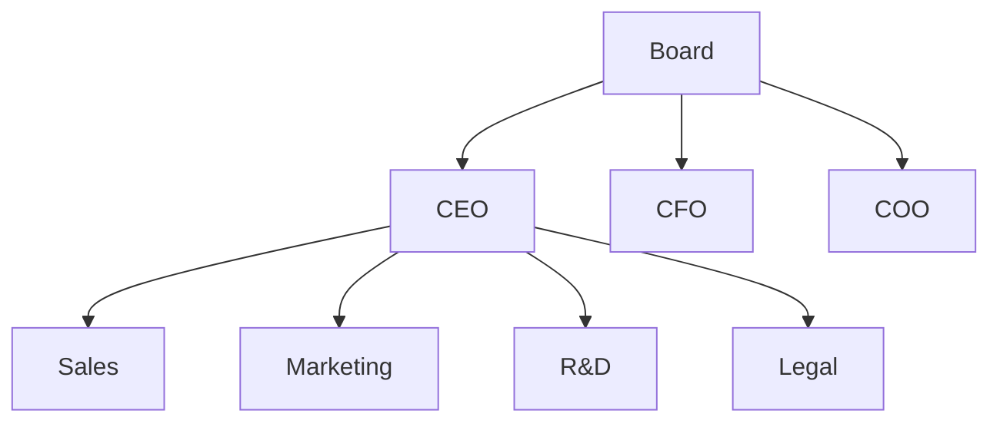
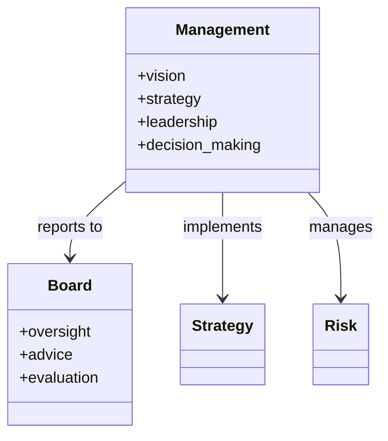

                 


# 彼得林奇对公司管理层质量的要求

## 关键词：
- 彼得·林奇
- 公司管理层
- 管理层质量
- 投资理念
- 企业治理

## 摘要：
彼得·林奇是美国著名投资家，以其独特的投资理念和对管理层质量的高度重视而闻名。本文从彼得·林奇的投资哲学出发，分析他对公司管理层质量的要求，包括领导力、决策能力、企业治理、专业能力和战略思维等方面。文章详细阐述了如何评估和提高管理层质量，为投资者提供了实用的参考。

---

## 第一部分：引言

### 第1章：彼得·林奇与投资理念概述

#### 1.1 彼得·林奇的背景与投资风格
- **1.1.1 彼得·林奇的生平简介**
  彼得·林奇（Peter Lynch）是美国著名投资家，曾担任麦哲伦基金的经理，创造了该基金的辉煌业绩。他以其独特的投资风格和对管理层质量的高度重视而闻名。

- **1.1.2 林奇的投资理念与风格**
  林奇的投资理念强调长期持有优质股票，注重公司的基本面和管理层的能力。他认为，投资成功的关键在于选择一家优秀公司并长期持有。

- **1.1.3 林奇对管理层质量的重视**
  林奇认为，公司管理层的质量是决定公司能否成功的重要因素。他特别关注管理层的领导力、决策能力和道德标准。

#### 1.2 投资中的管理层质量问题
- **1.2.1 管理层质量对投资决策的重要性**
  管理层的质量直接影响公司的业绩和股价表现。优秀的管理层能够带领公司克服困难，实现持续增长。

- **1.2.2 林奇对管理层质量的定义与标准**
  林奇认为，管理层质量包括领导力、决策能力、道德标准和专业能力等多个方面。他特别强调管理层的诚信和责任感。

- **1.2.3 管理层质量与公司长期发展的关系**
  优秀的管理层能够制定清晰的战略，带领公司应对市场变化，实现长期发展。

---

## 第2章：管理层质量的核心要素

### 2.1 领导力与决策能力
- **2.1.1 领导力的定义与特征**
  领导力是管理层的核心能力之一。优秀的领导者能够激励团队、制定愿景，并带领公司实现目标。

- **2.1.2 管理层的决策风格与能力**
  管理层的决策能力直接影响公司的战略方向和经营效果。林奇特别关注管理层在面对复杂问题时的决策风格和能力。

- **2.1.3 领导力对公司业绩的影响**
  优秀的领导力能够提升公司凝聚力和执行力，从而提高公司业绩。

### 2.2 企业治理与道德标准
- **2.2.1 公司治理的基本原则**
  企业治理是确保公司健康发展的基石。林奇认为，有效的公司治理能够确保管理层的决策符合公司和股东的利益。

- **2.2.2 管理层的道德与诚信**
  林奇强调，管理层的道德和诚信是公司长期发展的关键。他特别关注管理层是否存在道德风险。

- **2.2.3 企业治理中的利益相关者关系**
  管理层需要平衡股东、员工、客户和其他利益相关者的关系，确保公司的可持续发展。

### 2.3 专业能力与行业知识
- **2.3.1 管理层的专业背景与经验**
  管理层的专业背景和经验是公司成功的重要保障。林奇认为，专业的管理层能够更好地应对行业挑战。

- **2.3.2 行业知识的重要性**
  管理层需要深入了解所在行业的特点和趋势，才能制定有效的战略。

- **2.3.3 专业能力对战略制定的影响**
  专业能力强的管理层能够制定更具前瞻性的战略，带领公司抓住市场机会。

---

## 第3章：管理层质量的评估方法

### 3.1 评估管理层的维度
- **3.1.1 领导力与决策能力评估**
  评估管理层的领导力和决策能力时，需要关注其过往的业绩和应对危机的能力。

- **3.1.2 企业治理与道德标准评估**
  需要评估公司的治理结构、管理层的道德记录以及利益相关者的关系处理。

- **3.1.3 专业能力与行业知识评估**
  评估管理层的专业能力时，需要关注其行业经验、技术能力和团队管理能力。

### 3.2 林奇的管理层质量评分体系
- **3.2.1 林奇的评分标准与方法**
  林奇通过分析公司的财务数据、管理层的背景和行业地位，对公司管理层进行评分。

- **3.2.2 评分体系的实际**
  林奇的评分体系帮助投资者识别出具有优秀管理层的公司，从而实现长期投资收益。

---

## 第4章：系统分析与架构设计

### 4.1 公司治理结构分析
- **4.1.1 公司治理的实体关系**
  使用Mermaid图展示公司治理的实体关系，包括董事会、管理层、股东等。



- **4.1.2 公司治理流程**
  详细描述公司治理的流程，包括董事会决策、管理层执行和监督机制。

### 4.2 管理层决策的系统架构
- **4.2.1 系统功能设计**
  使用Mermaid类图展示系统功能，包括战略制定、风险管理、团队管理等。



---

## 第5章：项目实战

### 5.1 环境安装与工具配置
- **5.1.1 环境配置**
  安装必要的工具和软件，如数据分析工具、项目管理软件等。

### 5.2 核心实现源代码
- **5.2.1 管理层评估工具的实现**
  使用Python编写一个简单的管理层评估工具，帮助投资者快速评估公司管理层的质量。

```python
def assess_management(leadership, decision-making, governance):
    score = leadership * 0.4 + decision-making * 0.4 + governance * 0.2
    return "Excellent" if score >= 80 else "Good" if score >= 60 else "Needs Improvement"
```

### 5.3 案例分析
- **5.3.1 案例背景介绍**
  选取一家公司，分析其管理层的质量和公司的业绩表现。

- **5.3.2 案例分析与解读**
  详细解读公司管理层的领导力、决策能力和治理结构，评估其质量。

---

## 第6章：总结与展望

### 6.1 核心观点总结
- 彼得·林奇对管理层质量的要求涵盖了领导力、决策能力、企业治理、专业能力和战略思维等多个方面。

### 6.2 投资建议
- 投资者在选择公司时，应重点关注管理层的质量，选择具有优秀领导力和道德标准的公司。

### 6.3 未来展望
- 随着企业治理的不断发展，对管理层质量的要求也将越来越高。投资者需要不断提升自己的分析能力，以识别出优秀的管理层。

---

## 作者：AI天才研究院/AI Genius Institute & 禅与计算机程序设计艺术 /Zen And The Art of Computer Programming

