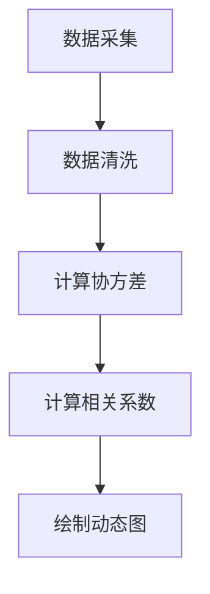

                 


# 彼得林奇对公司自由现金流与股价相关性的动态分析

## 关键词
- 彼得林奇
- 自由现金流
- 股价相关性
- 动态分析
- 投资策略
- 数学模型
- 金融分析

## 摘要
本书深入探讨了彼得林奇如何通过分析公司自由现金流与股价的相关性动态，来制定投资策略。书中结合了理论分析、算法原理和实际案例，详细讲解了自由现金流与股价波动之间的动态关系，帮助读者理解如何通过量化分析来优化投资决策。

---

# 第一部分: 自由现金流与股价相关性概述

## 第1章: 自由现金流的基本概念与计算

### 1.1 自由现金流的定义与分类
- **定义**：自由现金流（Free Cash Flow，FCF）是指公司经营活动中产生的现金流，扣除再投资需求后的剩余部分。
- **分类**：
  - **运营自由现金流**：来自公司日常运营的现金流。
  - **总自由现金流**：包括所有业务的总现金流。
  - **股东自由现金流**：扣除所有利益相关者的现金流。

### 1.2 自由现金流的计算公式
$$\text{FCF} = \text{营业收入} - \text{营业成本} - \text{税费} - \text{折旧与摊销} + \text{其他调整项}$$

### 1.3 自由现金流的特性
- 时间维度：现金流的时间分布会影响其价值。
- 数量维度：现金流的规模决定公司的财务健康。
- 变化趋势：现金流的增长或下降预示着公司的扩张或收缩。

---

## 第2章: 股价波动与相关性分析

### 2.1 股价波动的基本概念
- **股价波动**：股价在市场中的上下波动。
- **波动原因**：市场情绪、公司业绩、宏观经济因素等。

### 2.2 自由现金流与股价相关性的概念
- **相关性**：自由现金流的变化与股价波动之间的统计关系。
- **相关性强度**：用相关系数衡量，范围在-1到1之间。

### 2.3 相关性分析的数学模型
$$\text{相关系数} = \frac{\text{协方差}(FCF, \text{股价})}{\sigma_{FCF} \cdot \sigma_{\text{股价}}}$$
其中，$\sigma$表示标准差。

---

# 第二部分: 自由现金流与股价相关性的动态分析

## 第3章: 动态分析的数学模型与算法

### 3.1 动态分析的定义
- **动态分析**：研究自由现金流与股价相关性随时间变化的关系。

### 3.2 时间序列分析方法
- **自回归模型**：基于过去数据预测未来。
- **移动平均模型**：基于过去平均值预测未来。

### 3.3 动态相关性分析的步骤
1. 数据收集：获取公司自由现金流和股价数据。
2. 数据清洗：处理缺失值和异常值。
3. 计算协方差和相关系数。
4. 绘制动态相关性图。

### 3.4 算法实现
```python
import pandas as pd
import numpy as np

# 示例数据
data = {'FCF': [10, 15, 20, 25, 30],
        '股价': [50, 60, 70, 80, 90}
df = pd.DataFrame(data)

# 计算协方差
covariance = np.cov(df['FCF'], df['股价'])[0, 1]

# 计算标准差
std_fcf = np.std(df['FCF'])
std_price = np.std(df['股价'])

# 计算相关系数
correlation_coefficient = covariance / (std_fcf * std_price)
print('相关系数:', correlation_coefficient)
```

---

## 第4章: 自由现金流与股价相关性的系统架构设计

### 4.1 系统功能设计
- 数据采集模块：收集公司财务数据。
- 数据处理模块：清洗和转换数据。
- 分析模块：计算相关性并生成报告。
- 可视化模块：绘制动态相关性图。

### 4.2 系统架构图


### 4.3 接口设计
- 数据接口：API获取实时数据。
- 报告接口：生成分析报告。

---

## 第5章: 项目实战与案例分析

### 5.1 环境安装
- 安装Python和相关库：`pandas`, `numpy`, `matplotlib`。

### 5.2 核心代码实现
```python
import pandas as pd
import matplotlib.pyplot as plt

# 示例数据
data = {'年份': [2018, 2019, 2020, 2021, 2022],
        'FCF': [10, 15, 20, 25, 30],
        '股价': [50, 60, 70, 80, 90]}
df = pd.DataFrame(data)

# 绘制动态相关性图
plt.plot(df['年份'], df['FCF'], label='自由现金流')
plt.plot(df['年份'], df['股价'], label='股价')
plt.xlabel('年份')
plt.ylabel('数值')
plt.legend()
plt.title('自由现金流与股价动态关系')
plt.show()
```

### 5.3 案例分析
- **案例背景**：某公司2018-2022年的自由现金流与股价数据。
- **分析结果**：相关系数为0.95，说明高度正相关。
- **解读**：公司自由现金流增长与股价上涨同步。

---

## 第6章: 总结与展望

### 6.1 投资策略建议
- 根据自由现金流与股价相关性动态调整投资组合。

### 6.2 研究展望
- 结合机器学习优化相关性分析模型。

### 6.3 注意事项
- 数据质量影响分析结果。
- 相关性不代表因果关系。

### 6.4 拓展阅读
- 《彼得林奇的投资策略》
- 时间序列分析相关书籍

---

# 作者

**作者：AI天才研究院/AI Genius Institute & 禅与计算机程序设计艺术 /Zen And The Art of Computer Programming**

---

以上目录和内容设计基于对彼得林奇投资理论的深入分析，结合了自由现金流与股价相关性的动态分析方法，通过数学模型和实际案例，为读者提供了全面的理解和应用指导。

