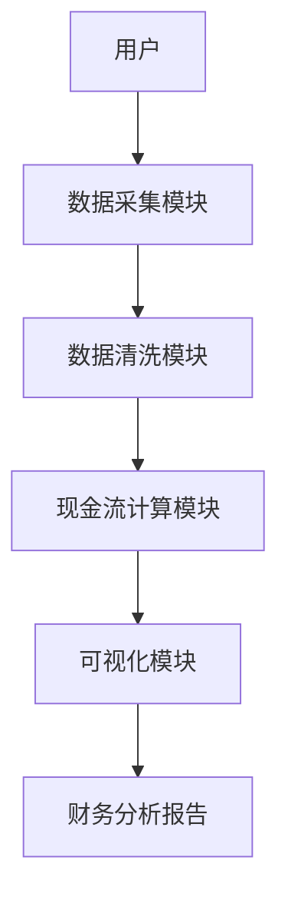
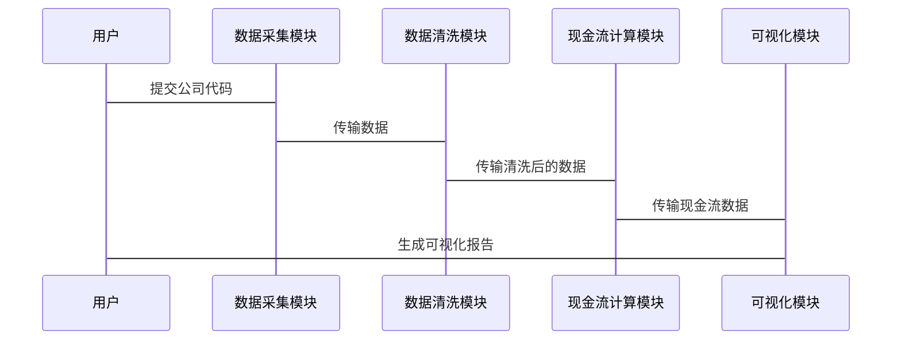

                 


# 彼得林奇对公司自由现金流增长的分析

## 关键词：彼得林奇，自由现金流，投资策略，财务分析，现金流增长

## 摘要：本文深入分析了彼得林奇对公司自由现金流增长的分析方法，探讨了自由现金流在企业估值和投资决策中的重要性，详细讲解了自由现金流的计算、预测、系统架构设计以及实际案例分析，结合数学模型和项目实战，总结了彼得林奇的投资策略和最佳实践。

---

# 第一部分：自由现金流的背景与重要性

## 第1章：自由现金流的定义与重要性

### 1.1 自由现金流的定义

#### 1.1.1 什么是自由现金流
自由现金流（Free Cash Flow，FCF）是指公司在扣除所有运营成本、税费和必要的再投资支出后，剩余的可用于偿还债务、支付股息或进行其他投资的资金。它是企业财务健康的重要指标，反映了公司产生现金的能力。

#### 1.1.2 自由现金流的核心要素
- 经营活动现金流：公司日常运营中产生的现金流。
- 资本支出：用于维护或扩展生产能力的支出。
- 净收益：公司税后利润。

#### 1.1.3 自由现金流与企业价值的关系
自由现金流是企业价值的核心驱动因素，因为它是企业创造价值的能力的直接体现。

### 1.2 自由现金流的重要性

#### 1.2.1 自由现金流在企业估值中的作用
自由现金流用于计算公司价值，特别是通过贴现现金流模型（DCF模型）。

#### 1.2.2 自由现金流与投资决策的关系
投资者通过分析自由现金流的增长情况，评估公司的盈利能力和未来的增长潜力。

#### 1.2.3 自由现金流对企业财务健康的影响
健康的自由现金流表明公司能够维持运营并进行再投资，而负的自由现金流可能意味着公司需要外部融资。

---

## 第2章：自由现金流的增长与彼得林奇的投资策略

### 2.1 彼得林奇的投资理念

#### 2.1.1 彼得林奇的投资风格概述
彼得林奇以基本面分析著称，注重对公司财务状况和行业地位的深入研究。

#### 2.1.2 彼得林奇对自由现金流的关注点
他特别关注自由现金流的增长，认为这是衡量公司健康和未来增长潜力的关键指标。

#### 2.1.3 彼得林奇投资策略的核心思想
投资于具有稳定自由现金流增长和良好管理的公司，避免短期波动，长期持有优质资产。

### 2.2 彼得林奇分析自由现金流的方法

#### 2.2.1 自由现金流的计算公式
$$\text{FCF} = \text{EBITDA} - \text{利息支出} - \text{税费} - \text{资本支出}$$

#### 2.2.2 彼得林奇对自由现金流的调整方法
根据行业特点和公司具体情况，对现金流进行调整，确保数据的准确性和可比性。

#### 2.2.3 自由现金流与企业未来增长的预测
通过分析历史自由现金流数据和行业趋势，预测未来现金流的增长情况。

### 2.3 彼得林奇对自由现金流增长的评价标准

#### 2.3.1 自由现金流增长的合理性分析
检查现金流增长是否与营业收入增长同步，避免虚假增长。

#### 2.3.2 自由现金流增长的可持续性评估
考虑行业周期性、市场竞争和公司管理能力，判断现金流增长是否能够持续。

#### 2.3.3 自由现金流增长与行业周期的关系
在行业上行周期，现金流增长可能加速；在下行周期，现金流可能受到压力。

---

# 第二部分：自由现金流的核心概念与联系

## 第3章：自由现金流与企业财务报表的联系

### 3.1 现金流与利润的对比

#### 3.1.1 现金流与利润的定义
- 现金流：实际流入和流出的现金。
- 利润：会计利润，可能包含非现金项目。

#### 3.1.2 现金流与利润的区别
- 现金流反映企业的流动性，利润反映企业的盈利能力。
- 利润可能包含虚增或虚减的项目，而现金流更为真实。

#### 3.1.3 现金流对投资的影响
健康的现金流表明公司能够产生足够的现金来支持运营和扩张，而高利润但低现金流的公司可能存在问题。

---

## 第3章：自由现金流的计算与预测

### 3.2 自由现金流的计算步骤

#### 3.2.1 收集财务数据
包括营业收入、营业成本、税费、利息支出和资本支出。

#### 3.2.2 计算经营现金流
$$\text{经营活动现金流} = \text{营业收入} - \text{营业成本} - \text{税费} - \text{其他费用}$$

#### 3.2.3 计算自由现金流
$$\text{FCF} = \text{经营活动现金流} - \text{资本支出}$$

---

## 第3章：自由现金流与投资决策的关系

### 3.3 自由现金流在投资决策中的应用

#### 3.3.1 评估公司价值
使用DCF模型计算公司股权价值。

#### 3.3.2 判断投资可行性
通过净现值（NPV）分析投资项目是否可行。

#### 3.3.3 分析公司财务健康
健康的自由现金流表明公司具有较强的偿债能力和扩张能力。

---

# 第三部分：自由现金流的系统分析与架构设计

## 第4章：自由现金流分析系统的设计

### 4.1 系统功能设计

#### 4.1.1 数据采集模块
- 从财务报表中提取数据。
- 数据清洗和预处理。

#### 4.1.2 现金流计算模块
- 计算经营活动现金流和自由现金流。
- 自动生成财务分析报告。

#### 4.1.3 可视化模块
- 生成现金流趋势图。
- 对比分析不同公司的现金流情况。

### 4.2 系统架构设计

#### 4.2.1 系统架构图


#### 4.2.2 系统接口设计
- 数据接口：从数据库或API获取财务数据。
- 报告接口：生成PDF或Excel格式的分析报告。

#### 4.2.3 系统交互流程


---

# 第四部分：自由现金流的项目实战

## 第5章：自由现金流增长分析的实战案例

### 5.1 环境安装

#### 5.1.1 安装Python
```bash
python --version
pip install numpy pandas matplotlib
```

#### 5.1.2 安装数据获取工具
使用`yfinance`库获取股票数据。

### 5.2 核心实现代码

#### 5.2.1 数据获取
```python
import yfinance as yf
import pandas as pd

# 下载苹果公司的财务数据
apple = yf.Ticker("AAPL")
data = apple.info
```

#### 5.2.2 现金流计算
```python
def calculate_fcf(revenue, cost_of_goods_sold, operating_expenses, taxes, capital_expenditure):
    ebitda = revenue - cost_of_goods_sold - operating_expenses
    fcf = ebitda - taxes - capital_expenditure
    return fcf

# 示例数据
revenue = 100000
cost_of_goods_sold = 60000
operating_expenses = 20000
taxes = 10000
capital_expenditure = 15000

# 计算自由现金流
fcf = calculate_fcf(revenue, cost_of_goods_sold, operating_expenses, taxes, capital_expenditure)
print(fcf)  # 输出结果
```

#### 5.2.3 可视化
```python
import matplotlib.pyplot as plt

# 示例数据
years = [2018, 2019, 2020, 2021, 2022]
fcf_values = [5000, 6000, 7000, 8000, 9000]

# 绘制折线图
plt.plot(years, fcf_values)
plt.title('自由现金流增长趋势')
plt.xlabel('年份')
plt.ylabel('自由现金流')
plt.show()
```

### 5.3 案例分析

#### 5.3.1 公司背景
以苹果公司为例，分析其自由现金流的增长情况。

#### 5.3.2 数据分析
计算苹果公司过去五年的自由现金流，观察其增长趋势。

#### 5.3.3 投资建议
根据现金流增长情况，评估公司的投资价值。

---

# 第五部分：总结与建议

## 第6章：总结与最佳实践

### 6.1 总结
自由现金流是衡量公司财务健康和投资价值的重要指标，彼得林奇的方法为我们提供了一个有效的分析框架。

### 6.2 投资建议
- 选择具有稳定自由现金流增长的公司。
- 结合行业趋势和公司基本面进行综合分析。
- 长期持有优质资产，避免短期波动。

### 6.3 注意事项
- 确保数据的准确性和完整性。
- 考虑宏观经济和行业周期的影响。
- 定期更新和调整分析模型。

### 6.4 拓展阅读
推荐阅读彼得林奇的《股票投资策略》和《投资最重要的事情》。

---

# 作者：AI天才研究院/AI Genius Institute & 禅与计算机程序设计艺术 /Zen And The Art of Computer Programming

