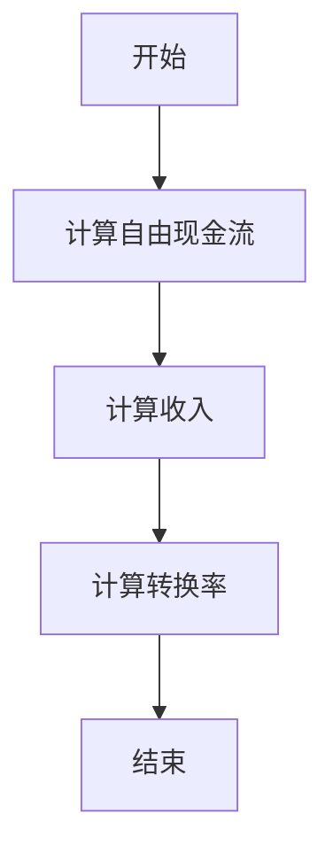
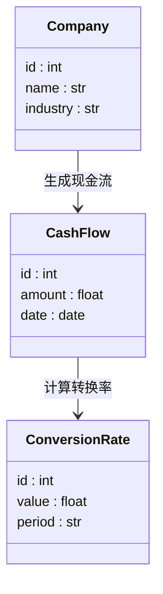
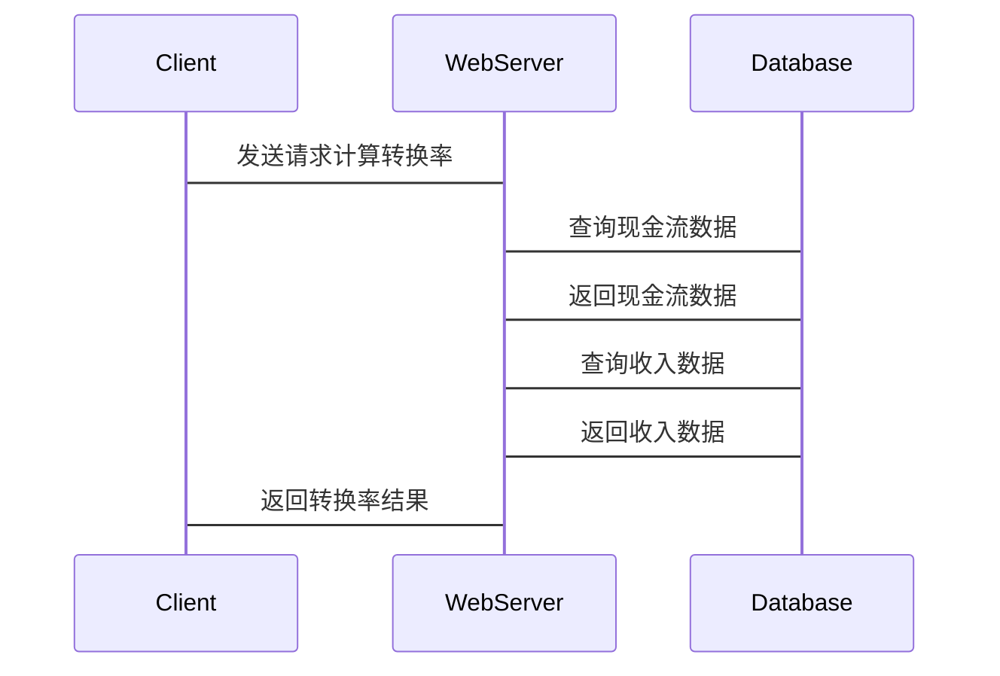

                 


# 彼得林奇对公司自由现金流转换率的分析

## 关键词：
彼得林奇、自由现金流转换率、投资分析、财务指标、现金流分析、投资策略、企业价值评估

## 摘要：
本文深入分析了彼得林奇对公司自由现金流转换率的研究，探讨了其在投资分析中的重要性。通过详细阐述自由现金流转换率的定义、计算方法及其在企业价值评估中的应用，本文揭示了如何通过这一指标优化投资决策。结合实际案例和系统设计，本文为投资者提供了实用的分析工具和策略建议。

---

# 第一部分：自由现金流转换率的背景与基础

## 第1章：财务分析基础

### 1.1 财务分析的基本概念
#### 1.1.1 财务分析的定义与作用
财务分析是通过对企业的财务报表（资产负债表、利润表、现金流量表）进行研究，评估企业的财务状况、盈利能力和未来发展潜力。它帮助企业识别潜在风险和机会，为投资决策提供依据。

#### 1.1.2 财务报表的核心内容
- 资产负债表：记录企业在某一特定日期的资产、负债和所有者权益。
- 利润表：展示企业在一定会计期间的收入、费用和利润。
- 现金流量表：反映企业在一定会计期间内现金流入和流出的情况。

#### 1.1.3 自由现金流在财务分析中的地位
自由现金流（Free Cash Flow，FCF）是企业经营活动中产生的现金流，用于偿还债务、投资和分红。它是衡量企业财务健康的重要指标，也是彼得林奇投资分析的核心之一。

### 1.2 自由现金流的定义与计算公式
#### 1.2.1 自由现金流的定义
自由现金流是指企业在扣除所有运营成本、税费和资本支出后的剩余现金流。它反映了企业实际产生的现金收益能力。

#### 1.2.2 自由现金流的计算公式
$$\text{自由现金流} = \text{净利润} + \text{折旧} + \text{摊销} - \text{资本支出}$$

#### 1.2.3 自由现金流与净利润的区别
- 净利润是企业的会计利润，包含非现金项目（如折旧、摊销）。
- 自由现金流考虑了企业的实际现金流入和流出，更贴近企业的真实财务状况。

### 1.3 自由现金流转换率的背景介绍
#### 1.3.1 自由现金流转换率的定义
自由现金流转换率是自由现金流与企业收入或净利润的比率，用于衡量企业将收入转化为现金的能力。

#### 1.3.2 自由现金流转换率的重要性
高转换率表明企业能够高效地将收入转化为现金流，反映企业的盈利能力和运营效率。

#### 1.3.3 彼得林奇对自由现金流转换率的重视
彼得林奇认为，自由现金流转换率是评估企业价值的重要指标，能够揭示企业的实际盈利能力和现金流健康状况。

---

## 第2章：自由现金流转换率的核心概念

### 2.1 自由现金流转换率的定义与公式
#### 2.1.1 自由现金流转换率的定义
$$\text{自由现金流转换率} = \frac{\text{自由现金流}}{\text{收入}}$$

#### 2.1.2 自由现金流转换率的指标范围
- 通常，健康的公司自由现金流转换率在1.0到2.0之间。
- 过低的转换率可能表明企业盈利能力不足或运营效率低下。
- 过高的转换率可能表明企业收入增长快于现金流增长，可能存在潜在风险。

### 2.2 自由现金流转换率的属性特征对比
| 属性         | 自由现金流转换率 | 净利润 | 营业收入 |
|--------------|------------------|--------|----------|
| 计算基础     | 自由现金流       | 净利润 | 营业收入 |
| 时间跨度     | 按年或按季       | 按年   | 按年     |
| 主要用途     | 评估现金流健康   | 利润能力 | 营销能力 |

### 2.3 自由现金流转换率的ER实体关系图
```mermaid
erDiagram
    company {
        id
        name
        industry
    }
    cash_flow {
        id
        amount
        date
    }
    conversion_rate {
        id
        value
        period
    }
    company --|> cash_flow : 生成现金流
    cash_flow --|> conversion_rate : 计算转换率
```

---

## 第3章：自由现金流转换率的算法原理

### 3.1 自由现金流转换率的计算流程


### 3.2 自由现金流转换率的数学模型
$$\text{转换率} = \frac{\text{自由现金流}}{\text{收入}} \times 100\%$$

### 3.3 自由现金流转换率的Python实现
```python
import pandas as pd

# 假设data为包含收入和自由现金流的DataFrame
def calculate_conversion_rate(data):
    data['Free Cash Flow Conversion Rate'] = (data['Free Cash Flow'] / data['Revenue']) * 100
    return data

# 示例数据
data = pd.DataFrame({
    'Revenue': [100, 200, 300],
    'Free Cash Flow': [50, 100, 150]
})

result = calculate_conversion_rate(data)
print(result)
```

---

## 第4章：自由现金流转换率的系统分析与架构设计

### 4.1 系统功能设计


### 4.2 系统架构设计


### 4.3 系统交互设计


---

## 第5章：自由现金流转换率的项目实战

### 5.1 项目环境安装
- 安装Python和相关库（pandas, numpy, matplotlib）
- 安装Jupyter Notebook用于数据分析和可视化

### 5.2 核心代码实现
```python
import pandas as pd
import matplotlib.pyplot as plt

# 示例数据
data = pd.DataFrame({
    'Revenue': [100, 200, 300],
    'Free Cash Flow': [50, 100, 150]
})

# 计算转换率
data['Conversion Rate'] = (data['Free Cash Flow'] / data['Revenue']) * 100

# 可视化
plt.figure(figsize=(10, 6))
plt.plot(data['Revenue'], data['Conversion Rate'], 'b-o')
plt.xlabel('Revenue')
plt.ylabel('Conversion Rate (%)')
plt.title('Free Cash Flow Conversion Rate Analysis')
plt.show()
```

### 5.3 实际案例分析
以苹果公司为例，分析其自由现金流转换率的变化趋势，评估其财务健康状况。

---

## 第6章：自由现金流转换率的总结与最佳实践

### 6.1 总结
- 自由现金流转换率是评估企业财务健康的重要指标。
- 彼得林奇的投资策略强调对自由现金流的关注，以识别高价值企业。

### 6.2 最佳实践
- 定期计算和监控企业的自由现金流转换率。
- 结合其他财务指标（如ROE、毛利率）进行综合分析。
- 选择具有稳定且增长的自由现金流转换率的企业进行投资。

### 6.3 注意事项
- 财务数据的质量和准确性至关重要。
- 转换率分析应结合行业特点和企业具体情况。

### 6.4 拓展阅读
- 彼得林奇的《股票 investing》
- 现金流分析的经典文献

---

# 作者：AI天才研究院/AI Genius Institute & 禅与计算机程序设计艺术 /Zen And The Art of Computer Programming

