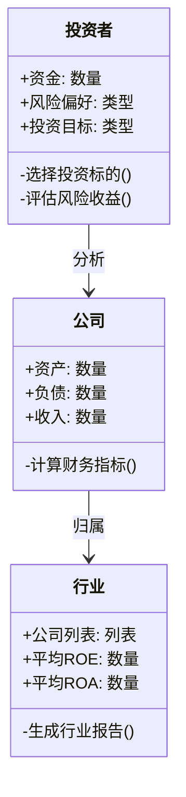

                 


# 彼得林奇对公司营运效率的跨行业比较

---

## 关键词：
彼得·林奇，投资分析，营运效率，跨行业比较，财务指标，投资策略

---

## 摘要：
本文深入探讨了彼得·林奇的投资理念，特别是他在不同行业间比较公司营运效率的方法。通过分析关键财务指标，如ROE、ROA和销售利润率，本文揭示了跨行业比较的核心概念和实际应用。文章结合数学模型和系统架构，详细阐述了彼得·林奇的方法及其对现代投资决策的启示。

---

## 正文：

### 第一部分：彼得·林奇的背景与投资理念

#### 第1章：彼得·林奇的生平简介

##### 1.1 彼得·林奇的职业生涯
彼得·林奇（Peter Lynch）是美国著名的投资经理人，以其在富达投资管理公司的卓越表现而闻名。他的职业生涯始于1967年，管理着麦哲伦基金，该基金在他的领导下取得了高达29%的年平均回报率。

##### 1.2 彼得·林奇的投资风格与特点
林奇的投资风格以价值投资和基本面分析为核心，注重对公司营运效率的深入研究。他认为，营运效率是决定公司长期盈利能力的关键因素。

#### 第2章：彼得·林奇的投资理念

##### 2.1 价值投资的核心思想
林奇强调，投资的本质是寻找那些被市场低估的公司。他通过分析财务报表，评估公司的盈利能力、成长潜力和竞争优势。

##### 2.2 营运效率在投资中的重要性
营运效率是衡量公司管理能力和资源利用效率的关键指标。林奇认为，高营运效率的公司能够在同行业内脱颖而出。

##### 2.3 跨行业比较的必要性与优势
通过跨行业比较，投资者可以发现不同行业间的差异，识别出那些在效率上具有竞争优势的公司。

---

### 第二部分：营运效率的定义与衡量指标

#### 第3章：营运效率的定义

##### 3.1 营运效率的内涵
营运效率指的是公司在利用资产、劳动力和其他资源方面的能力。它反映了公司如何有效地将资源转化为利润。

##### 3.2 营运效率与企业绩效的关系
营运效率直接影响企业的盈利能力。高效率的企业通常具有更高的ROE和ROA。

#### 第4章：营运效率的主要衡量指标

##### 4.1 净资产收益率（ROE）
ROE是衡量公司盈利能力的重要指标，公式为：
$$ROE = \frac{净利润}{平均股东权益}$$

##### 4.2 资产回报率（ROA）
ROA衡量的是公司每单位资产的盈利能力，公式为：
$$ROA = \frac{净利润}{平均总资产}$$

##### 4.3 销售利润率
销售利润率是净利润与营业收入的比率，公式为：
$$销售利润率 = \frac{净利润}{营业收入}$$

##### 4.4 资产周转率
资产周转率衡量的是公司资产的使用效率，公式为：
$$资产周转率 = \frac{营业收入}{平均总资产}$$

#### 第5章：不同行业营运效率的差异

##### 5.1 行业特点对营运效率的影响
不同行业的营运效率差异显著。例如，科技行业通常具有高资产周转率，而制造业则注重资产回报率。

##### 5.2 不同行业营运效率的对比
通过跨行业比较，可以识别出哪些行业的公司在特定指标上表现优异。

---

### 第三部分：跨行业比较的理论与方法

#### 第6章：跨行业比较的核心概念与联系

##### 6.1 跨行业比较的定义
跨行业比较是指在不同行业间，对公司的财务指标进行对比分析，以识别行业间的差异和优势。

##### 6.2 跨行业比较的关键要素
- 行业特性
- 企业规模
- 市场环境
- 财务指标

#### 第7章：跨行业比较的数学模型与公式

##### 7.1 营运效率的数学模型
通过数学模型，我们可以量化不同行业的营运效率。例如，使用ROE和ROA进行对比分析。

##### 7.2 跨行业比较的标准化方法
- 行业平均值计算
- 标准差与离差分析
- 超额收益分析

##### 7.3 实例分析与计算
以科技行业和制造业为例，分析其ROE和ROA的差异。

---

### 第四部分：系统分析与架构设计方案

#### 第8章：问题场景介绍

##### 8.1 投资者面临的挑战
投资者需要在复杂多变的市场环境中，找到那些具有高营运效率的公司。

#### 第9章：系统功能设计

##### 9.1 领域模型Mermaid类图


#### 第10章：系统架构设计Mermaid架构图


---

### 第五部分：项目实战

#### 第11章：环境安装与核心实现

##### 11.1 环境安装
- 安装Python和必要的库（如Pandas、Matplotlib）
- 安装Mermaid和LaTeX工具

##### 11.2 核心实现代码
```python
import pandas as pd

def calculate_roe(net_income, shareholders_equity):
    return net_income / shareholders_equity

def calculate_roa(net_income, total_assets):
    return net_income / total_assets

# 示例数据
data = {
    '公司': ['A', 'B', 'C'],
    '净收入': [100, 150, 200],
    '股东权益': [500, 600, 700],
    '总资产': [1000, 1200, 1400]
}

df = pd.DataFrame(data)
df['ROE'] = df.apply(lambda x: calculate_roe(x['净收入'], x['股东权益']), axis=1)
df['ROA'] = df.apply(lambda x: calculate_roa(x['净收入'], x['总资产']), axis=1)
print(df)
```

---

### 第六部分：最佳实践与总结

#### 第12章：最佳实践Tips

##### 12.1 小结
跨行业比较是评估公司营运效率的重要工具，能够帮助投资者发现潜在的投资机会。

##### 12.2 注意事项
- 数据的准确性和完整性
- 行业特性的考虑
- 综合分析，避免片面

##### 12.3 拓展阅读
建议阅读彼得·林奇的原著《彼得·林奇的 investing》以及相关投资分析书籍。

---

## 作者信息：

作者：AI天才研究院 & 禅与计算机程序设计艺术

