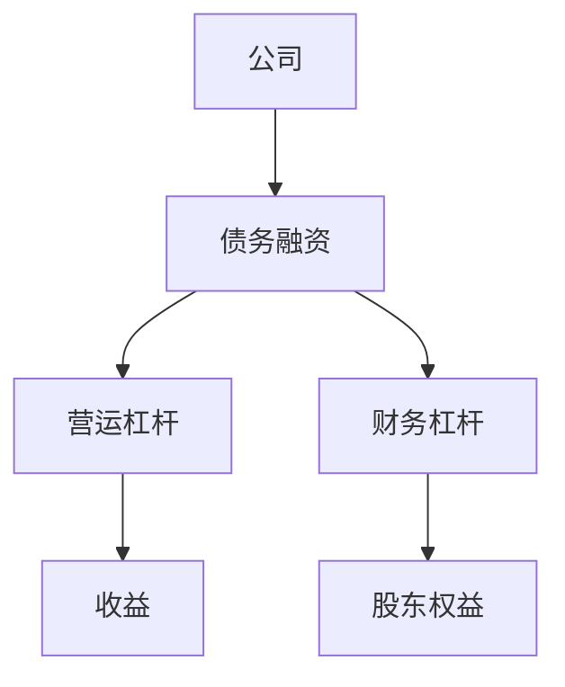
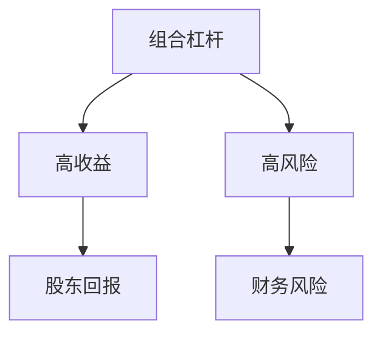
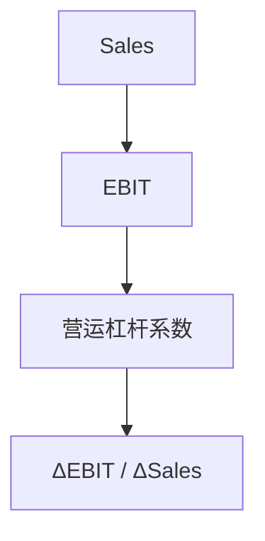
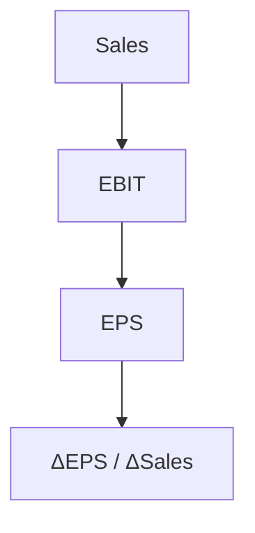
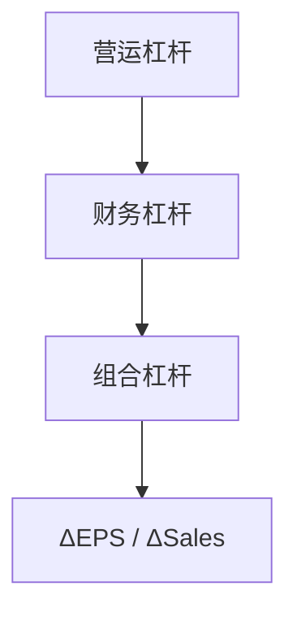
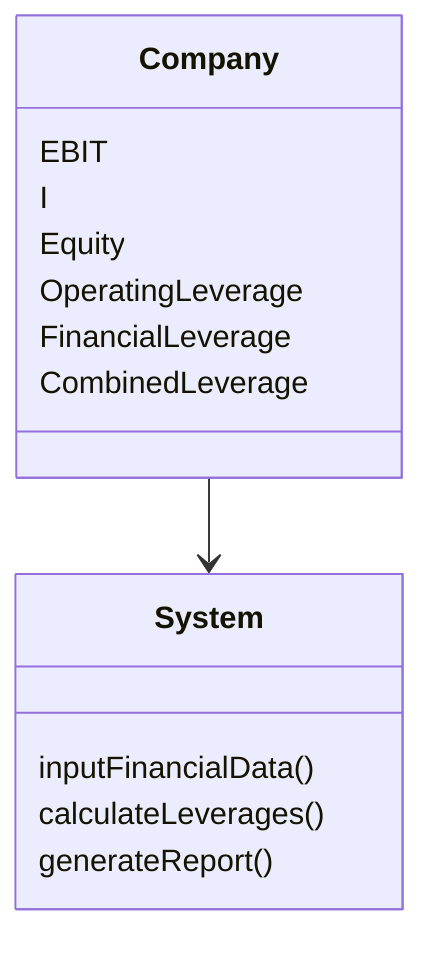
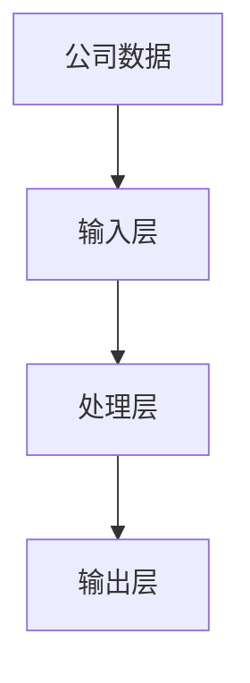
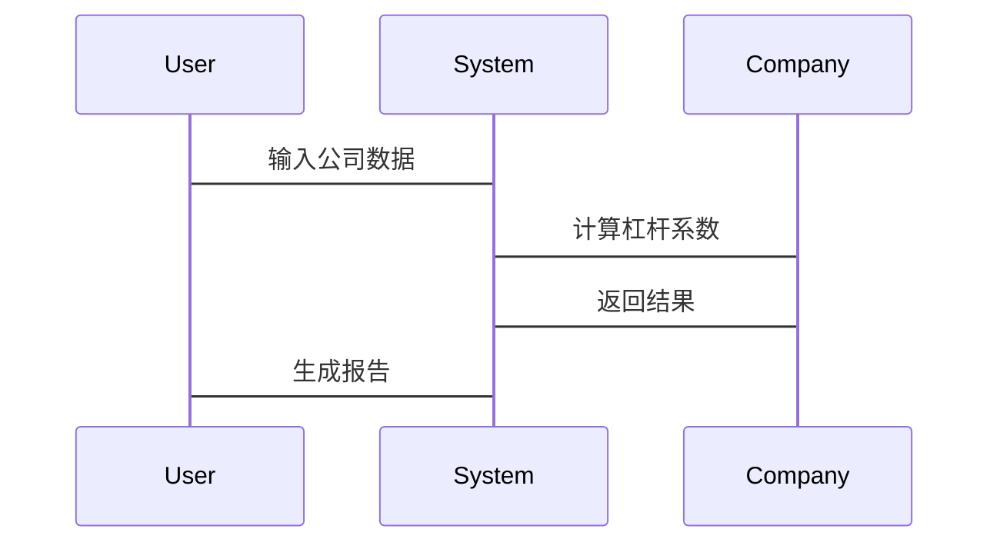

                 


```markdown
# 彼得林奇对公司营运杠杆与财务杠杆组合效应的分析

> 关键词：彼得·林奇，杠杆效应，财务杠杆，营运杠杆，组合效应，投资分析，系统架构，Python代码

> 摘要：本文深入分析了彼得·林奇对公司营运杠杆与财务杠杆组合效应的分析方法。通过背景介绍、核心概念、算法原理、系统分析、项目实战和最佳实践等部分，详细阐述了彼得·林奇的分析思路、数学模型和实际应用。结合Mermaid图和Python代码，帮助读者理解如何利用杠杆效应优化投资决策。

---

## 第一部分：背景介绍

### 第1章：彼得·林奇与公司杠杆分析概述

#### 1.1 彼得·林奇的背景与投资理念
- 彼得·林奇的生平简介
  - 1940年出生于美国波士顿
  - 哈佛大学经济学学士，宾夕法尼亚大学沃顿商学院MBA
  - 曾任富达投资集团麦哲伦基金的经理人，管理资产规模高达1400亿美元
- 彼得·林奇的投资哲学
  - 价值投资
  - 长期持有优质股票
  - 通过基本面分析选择投资标的

#### 1.2 公司杠杆的基本概念
- 营运杠杆的定义与特征
  - 营运杠杆衡量的是公司通过债务融资来扩大收益的能力
  - 主要通过固定成本和可变成本的比例来体现
  - 营运杠杆高的公司，收益波动较大
- 财务杠杆的定义与特征
  - 财务杠杆衡量的是公司通过债务融资来提高股东权益回报的能力
  - 通过债务利息和股权资本的比例来体现
  - 财务杠杆高的公司，财务风险较高

#### 1.3 营运杠杆与财务杠杆的定义与属性对比
- 营运杠杆与财务杠杆的属性对比表格
| 属性              | 营运杠杆               | 财务杠杆               |
|--------------------|------------------------|------------------------|
| 定义              | 通过债务融资扩大收益的能力 | 通过债务融资提高股东回报的能力 |
| 计算公式          | EBIT / EBIT - I       | EBIT - I / Equity      |
| 风险              | 收益波动风险           | 财务偿债风险           |
| 目标              | 提高收益               | 提高股东回报           |

- 营运杠杆与财务杠杆的实体关系图（Mermaid）


---

## 第二部分：核心概念与联系

### 第2章：营运杠杆与财务杠杆的组合效应

#### 2.1 营运杠杆与财务杠杆的组合模型
- 营运杠杆与财务杠杆的组合公式
  - 组合杠杆系数 = 营运杠杆系数 × 财务杠杆系数
  - 组合杠杆系数 = (EBIT / EBIT - I) × ((EBIT - I) / Equity)
- 组合效应的数学模型（Mermaid）
```mermaid
graph TD
    A[EBIT] --> B[EBIT - I] 
    B --> C[(EBIT - I) / Equity]
    A --> D[营运杠杆]
    D --> C[财务杠杆]
    C --> E[股东回报]
```

#### 2.2 营运杠杆与财务杠杆的相互作用
- 营运杠杆对财务杠杆的影响
  - 营运杠杆高的公司，收益波动大，财务杠杆的风险也随之增加
- 财务杠杆对营运杠杆的影响
  - 财务杠杆高的公司，利息支出增加，影响营运杠杆的收益
- 组合效应对企业价值的影响
  - 组合杠杆高的公司，收益波动大，但潜在回报也高

#### 2.3 营运杠杆与财务杠杆的组合效应分析
- 组合效应的正向影响
  - 提高股东回报
  - 优化资本结构
- 组合效应的负向影响
  - 增加财务风险
  - 收益波动增加
- 组合效应的风险与收益平衡（Mermaid）


---

## 第三部分：算法原理讲解

### 第3章：营运杠杆与财务杠杆的数学模型

#### 3.1 营运杠杆的数学模型
- 营运杠杆系数的公式推导
  - 营运杠杆系数 = ΔEBIT / ΔSales
- 营运杠杆系数的计算方法（Mermaid）


#### 3.2 财务杠杆的数学模型
- 财务杠杆系数的公式推导
  - 财务杠杆系数 = ΔEPS / ΔSales
- 财务杠杆系数的计算方法（Mermaid）


#### 3.3 组合效应的数学模型
- 组合杠杆系数的公式推导
  - 组合杠杆系数 = 营运杠杆系数 × 财务杠杆系数
- 组合杠杆系数的计算方法（Mermaid）


### 第4章：组合效应的数学公式与代码实现

#### 4.1 营运杠杆与财务杠杆的组合公式
- 组合杠杆系数的数学公式
  - 组合杠杆系数 = (EBIT / (EBIT - I)) × ((EBIT - I) / Equity)
  - 其中，EBIT为息税前利润，I为利息支出，Equity为股东权益

#### 4.2 组合效应的数学公式
- 组合效应的数学模型
  - 组合杠杆效应 = 营运杠杆效应 × 财务杠杆效应

#### 4.3 Python代码实现
- 计算营运杠杆系数
```python
def operating_leverage(EBIT, I):
    return EBIT / (EBIT - I)
```

- 计算财务杠杆系数
```python
def financial_leverage(EBIT, I, equity):
    return (EBIT - I) / equity
```

- 计算组合杠杆系数
```python
def combined_leverage(EBIT, I, equity):
    return (EBIT / (EBIT - I)) * ((EBIT - I) / equity)
```

---

## 第四部分：系统分析与架构设计

### 第4章：系统分析与架构设计方案

#### 4.1 问题场景介绍
- 企业财务分析系统的设计
- 系统功能需求
  - 输入公司财务数据
  - 计算营运杠杆和财务杠杆
  - 分析组合效应
  - 生成可视化报告

#### 4.2 系统功能设计（领域模型）


#### 4.3 系统架构设计


#### 4.4 系统接口设计
- 输入接口
  - 接收EBIT、I、Equity等参数
- 输出接口
  - 生成可视化报告

#### 4.5 系统交互流程


---

## 第五部分：项目实战

### 第5章：项目实战与案例分析

#### 5.1 环境配置
- Python 3.8以上版本
- 导入必要的库
  ```python
  import pandas as pd
  import matplotlib.pyplot as plt
  ```

#### 5.2 核心实现代码
```python
def calculate_leverages(EBIT, I, equity):
    operating_leverage = EBIT / (EBIT - I)
    financial_leverage = (EBIT - I) / equity
    combined_leverage = operating_leverage * financial_leverage
    return operating_leverage, financial_leverage, combined_leverage

EBIT = 1000000
I = 100000
equity = 5000000

operating_leverage, financial_leverage, combined_leverage = calculate_leverages(EBIT, I, equity)
print(f"营运杠杆系数: {operating_leverage}")
print(f"财务杠杆系数: {financial_leverage}")
print(f"组合杠杆系数: {combined_leverage}")
```

#### 5.3 案例分析
- 某零售企业的杠杆分析
  - 计算营运杠杆和财务杠杆
  - 分析组合效应对企业价值的影响

---

## 第六部分：最佳实践

### 第6章：最佳实践与小结

#### 6.1 小结
- 彼得·林奇的分析方法总结
- 组合杠杆系数的应用价值

#### 6.2 注意事项
- 营运杠杆和财务杠杆的风险控制
- 组合效应的实际应用场景

#### 6.3 拓展阅读
- 财务杠杆与公司估值
- 营运杠杆与企业盈利能力

---

## 作者：AI天才研究院/AI Genius Institute & 禅与计算机程序设计艺术 /Zen And The Art of Computer Programming
```

