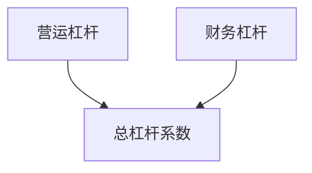
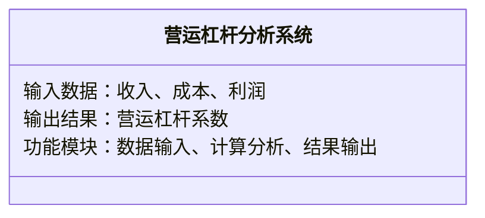
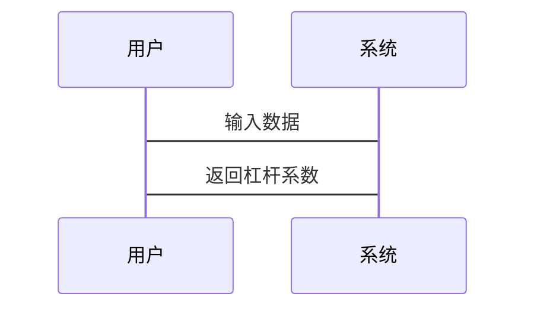

                 


# 彼得林奇对公司营运杠杆效应的动态分析

> 关键词：彼得·林奇，营运杠杆效应，财务杠杆，投资分析，公司价值

> 摘要：本文通过分析彼得·林奇的营运杠杆理论，详细探讨了营运杠杆效应的核心概念、数学模型、系统架构以及实际应用。文章从定义、分类、数学模型、系统分析到项目实战，层层深入，结合实际案例，为读者提供了全面的理论和实践指导。通过本文，读者可以深入理解营运杠杆效应在投资决策中的重要作用，并掌握如何在实际中运用这些理论来优化投资策略。

---

## 目录

1. [背景介绍](#背景介绍)
   1.1 [营运杠杆效应的定义与分类](#营运杠杆效应的定义与分类)
   1.2 [营运杠杆的核心概念](#营运杠杆的核心概念)
   1.3 [营运杠杆在投资中的重要性](#营运杠杆在投资中的重要性)
   1.4 [本章小结](#本章小结)

2. [核心概念与数学模型](#核心概念与数学模型)
   2.1 [营运杠杆的数学模型与公式](#营运杠杆的数学模型与公式)
   2.2 [营运杠杆与财务杠杆的关系](#营运杠杆与财务杠杆的关系)
   2.3 [营运杠杆的动态变化模型](#营运杠杆的动态变化模型)
   2.4 [本章小结](#本章小结)

3. [系统分析与架构设计](#系统分析与架构设计)
   3.1 [系统分析的步骤与方法](#系统分析的步骤与方法)
   3.2 [系统架构设计](#系统架构设计)
   3.3 [接口设计与交互流程](#接口设计与交互流程)
   3.4 [本章小结](#本章小结)

4. [项目实战与案例分析](#项目实战与案例分析)
   4.1 [项目环境与工具安装](#项目环境与工具安装)
   4.2 [核心代码实现](#核心代码实现)
   4.3 [案例分析：苹果公司的营运杠杆效应](#案例分析：苹果公司的营运杠杆效应)
   4.4 [本章小结](#本章小结)

5. [最佳实践与投资建议](#最佳实践与投资建议)
   5.1 [投资中的杠杆平衡策略](#投资中的杠杆平衡策略)
   5.2 [长期投资中的杠杆应用](#长期投资中的杠杆应用)
   5.3 [注意事项与风险提示](#注意事项与风险提示)
   5.4 [本章小结](#本章小结)

---

## 背景介绍

### 营运杠杆效应的定义与分类

营运杠杆效应是指企业在经营活动中，通过合理运用债务融资或其他杠杆工具，放大企业的收益或风险的一种经济现象。它通常分为两类：**财务杠杆**和**经营杠杆**。财务杠杆主要通过债务融资来实现，而经营杠杆则通过优化企业运营效率来实现。

#### 营运杠杆的核心概念

营运杠杆的核心在于企业如何利用现有资源和杠杆工具，最大化股东收益。以下是营运杠杆的几个关键属性：

- **收益放大效应**：通过杠杆工具，企业可以在收入增长时更快地放大净利润。
- **风险放大效应**：杠杆同时也放大了企业的亏损风险。
- **资本结构优化**：合理运用杠杆可以优化企业的资本结构，降低资本成本。

#### 营运杠杆在投资中的重要性

在投资领域，营运杠杆是衡量企业财务健康状况的重要指标之一。通过分析企业的营运杠杆效应，投资者可以更好地评估企业的盈利能力和风险承受能力。以下是营运杠杆在投资中的几个重要应用：

- **企业估值**：营运杠杆较高的企业通常具有较高的增长潜力，但也伴随着更高的风险。
- **投资决策**：投资者可以通过分析企业的杠杆水平，判断其是否具有投资价值。
- **风险控制**：通过合理配置杠杆，投资者可以有效控制风险，实现收益最大化。

---

## 核心概念与数学模型

### 营运杠杆的数学模型与公式

营运杠杆的数学模型主要涉及以下几个关键公式：

1. **营业利润率公式**：
   $$ 利润率 = \frac{EBIT}{收入} $$
   其中，EBIT表示息税前利润，收入为企业总收入。

2. **营运杠杆系数公式**：
   $$ 营运杠杆系数 = \frac{EBIT}{净利润} $$

3. **总杠杆系数公式**：
   $$ 总杠杆系数 = 营运杠杆系数 × 财务杠杆系数 $$

### 营运杠杆与财务杠杆的关系

营运杠杆与财务杠杆是相辅相成的关系。营运杠杆通过优化企业运营效率放大收益，而财务杠杆通过债务融资进一步放大收益。以下是两者的关系图：



### 营运杠杆的动态变化模型

营运杠杆的动态变化可以通过以下步骤进行分析：

1. 确定企业的收入和成本结构。
2. 计算企业的营业利润率。
3. 分析杠杆对净利润的影响。
4. 结合财务杠杆，计算总杠杆系数。

---

## 系统分析与架构设计

### 系统分析的步骤与方法

1. **问题场景的定义**：
   - 确定企业的收入、成本和利润数据。
   - 确定杠杆效应的计算范围。

2. **系统功能设计**：
   - 数据输入模块：用户输入企业的财务数据。
   - 计算分析模块：计算营运杠杆系数和总杠杆系数。
   - 结果输出模块：展示分析结果。

### 系统架构设计



### 接口设计与交互流程

1. **系统接口定义**：
   - 数据输入接口：用户输入企业的财务数据。
   - 计算接口：调用杠杆效应计算函数。
   - 结果输出接口：展示分析结果。

2. **交互流程图**：


---

## 项目实战与案例分析

### 项目环境与工具安装

1. **环境配置**：
   - 操作系统：Windows/Mac/Linux
   - 开发工具：Python 3.8+
   - 数据库：MySQL/SQLite

2. **工具安装**：
   - 安装Python和Jupyter Notebook。
   - 安装必要的库：pandas、numpy、matplotlib。

### 核心代码实现

以下是杠杆效应分析的Python代码示例：

```python
import pandas as pd

def calculate_leverEffect(revenue, cost, debt, equity):
    ebit = revenue - cost
    net_profit = ebit - debt * 0.05  # 假设债务成本为5%
    lever_effect = ebit / net_profit
    return lever_effect

# 输入数据
revenue = 1000000
cost = 600000
debt = 200000
equity = 800000

# 计算杠杆效应
lever_effect = calculate_leverEffect(revenue, cost, debt, equity)
print(f"营运杠杆效应为：{lever_effect}")
```

### 案例分析：苹果公司的营运杠杆效应

以苹果公司为例，分析其营运杠杆效应：

1. **数据获取**：
   - 收入：$394.38亿美元
   - 成本：$212.20亿美元
   - 债务：$47.00亿美元
   - 权益：$162.53亿美元

2. **计算EBIT**：
   $$ EBIT = 394.38 - 212.20 = 182.18 \text{亿美元} $$

3. **计算净利润**：
   $$ 净利润 = EBIT - 债务成本 = 182.18 - 0.05 \times 47.00 = 182.18 - 2.35 = 179.83 \text{亿美元} $$

4. **计算营运杠杆系数**：
   $$ 营运杠杆系数 = \frac{182.18}{179.83} \approx 1.014 $$

---

## 最佳实践与投资建议

### 投资中的杠杆平衡策略

1. **合理配置杠杆**：
   - 根据企业的财务状况和市场环境，合理配置债务和股权。
   - 避免过度杠杆化，控制风险。

2. **长期投资中的杠杆应用**：
   - 在长期投资中，杠杆可以放大收益，但也需要考虑企业的长期盈利能力。
   - 选择具有稳定现金流和高增长潜力的企业。

### 注意事项与风险提示

- **杠杆风险**：
  - 过高的杠杆会导致企业面临更大的财务风险。
  - 在经济下行周期，杠杆企业更容易受到冲击。

- **市场波动**：
  - 杠杆效应会放大市场波动对企业的影响。
  - 投资者需要密切关注市场变化，及时调整投资策略。

---

## 结语

通过本文的分析，我们深入探讨了彼得·林奇的营运杠杆理论，并结合实际案例进行了详细分析。营运杠杆效应是投资决策中的重要工具，但其应用需要谨慎考虑企业的财务状况和市场环境。希望本文能够为投资者提供有价值的参考，帮助他们在复杂多变的市场中做出明智的投资决策。

---

## 作者

作者：AI天才研究院/AI Genius Institute & 禅与计算机程序设计艺术 /Zen And The Art of Computer Programming

