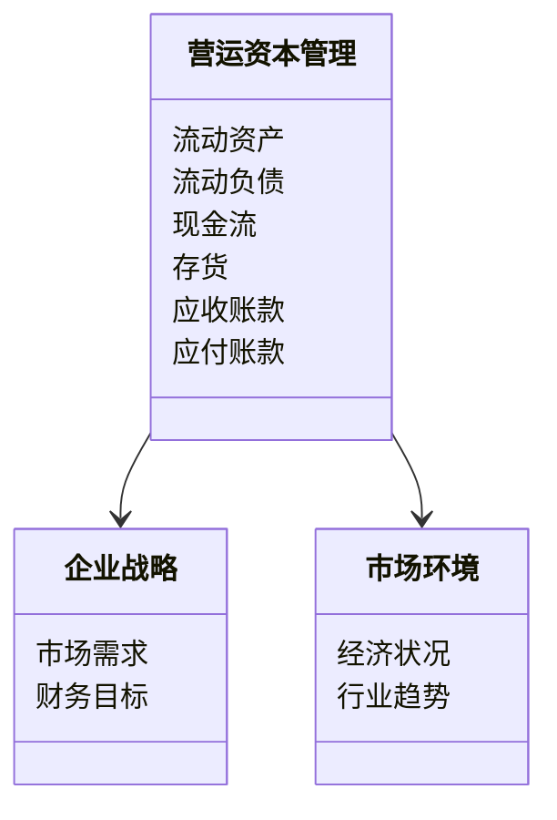
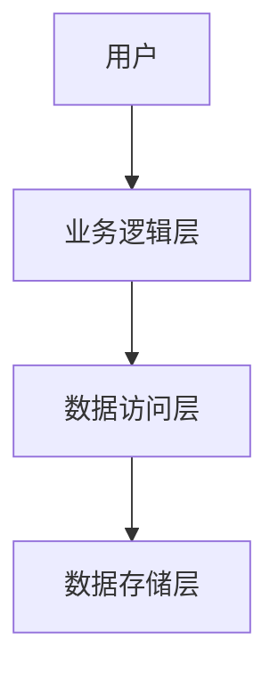

                 


# 彼得林奇对公司营运资本管理效率的看法

## 关键词：彼得·林奇，公司营运资本管理，效率，投资策略，现金流，财务分析，风险管理

## 摘要：本文深入探讨了投资大师彼得·林奇对公司营运资本管理效率的独到见解。从营运资本管理的基本概念到其对投资策略的影响，文章结合实际案例和数学模型，分析了林奇如何通过优化营运资本管理来提升企业价值。文章还详细阐述了现金流、财务指标和风险管理在营运资本管理中的作用，为读者提供了全面的理论和实践指导。

---

## 第一部分：背景介绍

### 第1章：公司营运资本管理效率概述

#### 1.1 营运资本管理的基本概念

##### 1.1.1 营运资本的定义与组成
营运资本是指企业在日常经营活动中使用的流动资产减去流动负债的部分，主要包括现金、存货、应收账款和应付账款等。它反映了企业的短期偿债能力和运营效率。

##### 1.1.2 营运资本管理的核心目标
营运资本管理的核心目标是通过优化资产和负债的结构，提高资金使用效率，降低企业风险，同时确保企业日常运营的流动性。

##### 1.1.3 营运资本管理的重要性
营运资本管理是企业财务管理的重要组成部分，直接影响企业的盈利能力、流动性和抗风险能力。有效的营运资本管理能够帮助企业降低成本，提高市场竞争力。

#### 1.2 彼得·林奇与投资管理的独特视角

##### 1.2.1 彼得·林奇的投资哲学
彼得·林奇是全球著名投资经理人，他认为投资的核心在于选择优秀的公司，而非追涨杀跌。他强调对公司基本面的深入分析，尤其是对营运资本管理的关注。

##### 1.2.2 林奇对财务分析的重视
林奇认为，财务报表是评估公司价值的关键工具。他特别关注公司的流动资产和流动负债的结构，认为这能够揭示企业的运营效率和财务健康状况。

##### 1.2.3 林奇对营运资本管理的看法
林奇认为，营运资本管理是企业能否长期盈利的关键因素之一。他强调，企业应通过优化营运资本配置，提高资金周转效率，降低财务风险。

---

### 第2章：营运资本管理效率的背景与问题

#### 2.1 营运资本管理的现状

##### 2.1.1 当前企业面临的营运资本管理挑战
现代企业面临市场竞争加剧、供应链复杂化等挑战，营运资本管理的效率显得尤为重要。企业需要在资金周转和风险控制之间找到平衡点。

##### 2.1.2 营运资本管理效率对企业竞争力的影响
营运资本管理效率高，能够提高企业的资金利用率，降低成本，增强企业的市场竞争力。反之，低效的营运资本管理可能导致企业资金链断裂，影响经营稳定性。

#### 2.2 林奇视角下的营运资本管理问题

##### 2.2.1 营运资本管理中的常见误区
许多企业在营运资本管理中存在误区，例如过度依赖短期负债融资，忽视现金流的重要性，或者对存货和应收账款管理不够精细。

##### 2.2.2 林奇对低效率营运资本管理的批评
林奇指出，许多企业在营运资本管理中过于注重短期利润，忽视了长期的财务健康。他强调，企业应关注现金流的健康，避免过度依赖外部融资。

##### 2.2.3 提高营运资本管理效率的必要性
高效的营运资本管理能够优化企业的资金结构，降低融资成本，提高企业的抗风险能力。这对于企业长期发展至关重要。

---

## 第二部分：核心概念与联系

### 第3章：营运资本管理的核心要素

#### 3.1 营运资本管理的关键维度

##### 3.1.1 流动资产与流动负债的平衡
流动资产包括现金、存货、应收账款等，流动负债包括应付账款、短期借款等。平衡流动资产和流动负债是营运资本管理的核心。

##### 3.1.2 存货管理的重要性
存货管理是营运资本管理的重要组成部分。过多的存货可能导致资金积压，过少的存货则可能影响生产 continuity。林奇认为，企业应根据市场需求合理调整存货水平。

##### 3.1.3 应收账款与应付账款的管理
应收账款和应付账款的管理直接影响企业的现金流。林奇强调，企业应优化信用政策，缩短应收账款周期，延长应付账款周期。

#### 3.2 营运资本与现金流的关系

##### 3.2.1 现金流在营运资本管理中的作用
现金流是营运资本管理的核心。健康的现金流能够确保企业的正常运营和偿还债务。林奇认为，企业应优先关注经营活动现金流。

##### 3.2.2 林奇对现金流管理的重视
林奇认为，现金流是衡量企业财务健康的重要指标。他强调，企业应通过优化营运资本管理，确保现金流的稳定性和可持续性。

##### 3.2.3 现金流与企业短期偿债能力的关联
健康的现金流能够增强企业的短期偿债能力，降低财务风险。林奇认为，企业应通过优化营运资本管理，提高现金流的周转效率。

---

### 第4章：营运资本管理的效率指标

#### 4.1 常见的营运资本效率指标

##### 4.1.1 存货周转率
存货周转率是衡量存货管理效率的重要指标。存货周转率越高，说明企业的存货管理越高效。

##### 4.1.2 应收账款周转率
应收账款周转率是衡量企业应收账款管理效率的指标。周转率越高，说明企业回收账款的速度越快。

##### 4.1.3 流动资产周转率
流动资产周转率是衡量企业流动资产使用效率的指标。周转率越高，说明企业的资金利用效率越高。

#### 4.2 林奇对这些指标的独特见解

##### 4.2.1 林奇如何评估存货周转率
林奇认为，存货周转率是衡量企业供应链管理效率的重要指标。他建议企业根据市场需求合理调整存货水平，避免过度库存。

##### 4.2.2 应收账款周转率与企业信用政策的关系
林奇认为，应收账款周转率与企业的信用政策密切相关。他建议企业优化信用政策，缩短应收账款周期，降低坏账风险。

##### 4.2.3 流动资产周转率与企业运营效率的联系
林奇认为，流动资产周转率是衡量企业整体运营效率的重要指标。他建议企业通过优化资产配置，提高流动资产周转率。

---

## 第三部分：核心概念与联系的系统分析

### 第5章：营运资本管理的系统架构

#### 5.1 营运资本管理的系统模型

##### 5.1.1 系统输入：市场环境与企业战略
市场环境和企业战略是营运资本管理的外部输入。企业应根据市场需求和战略目标，调整营运资本管理策略。

##### 5.1.2 系统处理：营运资本的优化配置
系统处理的核心是优化营运资本的配置。企业应通过合理配置流动资产和流动负债，提高资金利用效率。

##### 5.1.3 系统输出：财务健康与竞争力提升
系统的输出是企业的财务健康和市场竞争力。优化的营运资本管理能够增强企业的财务健康，提高市场竞争力。

---

### 第6章：领域模型与架构设计

#### 6.1 领域模型

##### 6.1.1 领域模型的定义与作用
领域模型是对业务领域的抽象和建模。在营运资本管理中，领域模型能够帮助企业更好地理解业务流程和关键因素。

##### 6.1.2 营运资本管理的领域模型
以下是营运资本管理的领域模型：



---

#### 6.2 系统架构设计

##### 6.2.1 系统架构的定义与作用
系统架构设计是整个系统设计的核心，它决定了系统的模块划分、功能分配和数据流。

##### 6.2.2 营运资本管理系统的架构图
以下是营运资本管理系统的架构图：



---

## 第四部分：算法原理

### 第7章：财务分析的数学模型

#### 7.1 净现值法

##### 7.1.1 净现值法的定义与公式
净现值法是财务分析中常用的一种方法，其公式为：

$$ NPV = \sum_{t=1}^{n} \frac{C_t}{(1+r)^t} $$

其中，\( C_t \) 是第 \( t \) 年的现金流，\( r \) 是贴现率。

##### 7.1.2 净现值法的实现步骤
1. 确定项目的现金流。
2. 确定贴现率。
3. 计算各年的现值。
4. 求和得到净现值。

##### 7.1.3 净现值法的优缺点
优点：能够准确反映项目的真实价值。缺点：需要准确估计贴现率和未来现金流。

#### 7.2 内部收益率法

##### 7.2.1 内部收益率法的定义与公式
内部收益率法是财务分析中另一种常用的方法，其公式为：

$$ IRR = r \) 使得 \( NPV = 0 $$

##### 7.2.2 内部收益率法的实现步骤
1. 确定项目的现金流。
2. 通过试算法或插值法计算内部收益率。

##### 7.2.3 内部收益率法的优缺点
优点：能够反映项目的盈利能力。缺点：计算复杂，且可能不准确。

---

## 第五部分：项目实战

### 第8章：优化库存管理的实战案例

#### 8.1 项目介绍
本项目旨在通过优化库存管理，提高企业的营运资本管理效率。

#### 8.2 环境安装
需要安装以下工具：
- Python 3.x
- Pandas库
- Matplotlib库

#### 8.3 核心实现源代码

##### 8.3.1 数据预处理
```python
import pandas as pd

# 读取数据
data = pd.read_csv('inventory.csv')

# 删除缺失值
data.dropna(inplace=True)
```

##### 8.3.2 库存周转率计算
```python
# 计算存货周转率
data['inventory_turnover'] = data['COGS'] / data['average_inventory']
```

##### 8.3.3 数据可视化
```python
import matplotlib.pyplot as plt

# 绘制库存周转率分布图
plt.hist(data['inventory_turnover'], bins=10)
plt.title('Inventory Turnover Distribution')
plt.show()
```

#### 8.4 案例分析与解读
通过分析库存周转率，企业可以发现库存管理中的问题，并采取相应措施，如优化采购策略、调整库存水平等。

---

### 第9章：应收账款管理优化的实战案例

#### 9.1 项目介绍
本项目旨在通过优化应收账款管理，提高企业的现金流效率。

#### 9.2 环境安装
需要安装以下工具：
- Python 3.x
- Pandas库
- Scikit-learn库

#### 9.3 核心实现源代码

##### 9.3.1 数据预处理
```python
import pandas as pd

# 读取数据
data = pd.read_csv('accounts_receivable.csv')

# 删除缺失值
data.dropna(inplace=True)
```

##### 9.3.2 应收账款周转率计算
```python
# 计算应收账款周转率
data['receivables_turnover'] = data[' revenue'] / data['average_accounts_receivable']
```

##### 9.3.3 数据可视化
```python
import matplotlib.pyplot as plt

# 绘制应收账款周转率分布图
plt.hist(data['receivables_turnover'], bins=10)
plt.title('Receivables Turnover Distribution')
plt.show()
```

#### 9.4 案例分析与解读
通过分析应收账款周转率，企业可以发现应收账款管理中的问题，并采取相应措施，如优化信用政策、加强催收等。

---

## 第六部分：最佳实践与总结

### 第10章：最佳实践与小结

#### 10.1 彼得·林奇的关键策略
林奇认为，企业应关注现金流、优化资产配置、合理管理负债，并通过持续改进提高营运资本管理效率。

#### 10.2 注意事项
- 营运资本管理需要结合企业的实际情况。
- 应关注市场环境的变化，及时调整管理策略。
- 需要建立完善的监控机制，定期评估管理效果。

#### 10.3 拓展阅读
- 《彼得·林奇的投资哲学》
- 《财务报表分析》
- 《企业风险管理》

---

## 作者：AI天才研究院/AI Genius Institute & 禅与计算机程序设计艺术/Zen And The Art of Computer Programming

