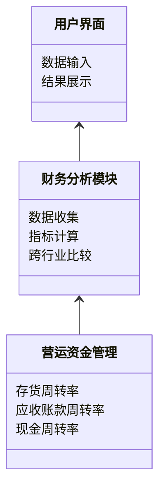

                 


# 彼得林奇对公司营运资金管理效率的跨行业比较

> 关键词：彼得林奇，营运资金管理，跨行业比较，财务分析，行业分析

> 摘要：本文通过分析彼得·林奇的投资哲学和行业分析方法，探讨如何将营运资金管理效率的跨行业比较应用于实际投资决策中。文章首先介绍了营运资金管理的基本概念和跨行业比较的意义，然后详细阐述了彼得·林奇的分析框架，接着从核心概念、算法原理、系统架构等多个维度展开分析，并结合实际案例进行实战指导，最后总结了跨行业比较的关键点和最佳实践。

---

## 第一部分：背景介绍

### 第1章：公司营运资金管理效率概述

#### 1.1 营运资金管理的基本概念

##### 1.1.1 营运资金的定义与组成
营运资金是企业在日常经营活动中用于支持运营的核心资金，主要包括现金、存货、应收账款等流动资产。这些资产的管理和优化直接影响企业的资金流动性、盈利能力和抗风险能力。

##### 1.1.2 营运资金管理的目标与意义
营运资金管理的目标是最大化资金使用效率，降低资金浪费，同时确保企业运营的连续性和稳定性。良好的营运资金管理能够提高企业的偿债能力、营运能力和盈利能力。

##### 1.1.3 彼得·林奇与营运资金管理效率
彼得·林奇是全球著名投资经理人，他强调通过深入分析企业的财务数据和行业特点，寻找具有竞争优势的投资标的。营运资金管理效率是林奇分析企业财务健康状况的重要指标之一。

#### 1.2 跨行业比较的必要性

##### 1.2.1 不同行业营运资金管理的特点
不同行业的营运资金管理存在显著差异。例如，制造业需要大量存货周转，而服务业则更依赖应收账款管理。跨行业比较能够帮助企业识别行业间的最佳实践和优化空间。

##### 1.2.2 跨行业比较的意义与价值
通过跨行业比较，可以发现不同行业在营运资金管理上的优劣势，为企业的财务管理提供参考。同时，跨行业比较还能帮助投资者识别行业周期性风险和结构性机会。

##### 1.2.3 跨行业比较的挑战与解决方案
跨行业比较的挑战包括数据可比性不足、行业特性差异大等问题。解决方案包括选择具有可比性的行业、建立统一的分析框架等。

---

### 第2章：彼得·林奇的分析框架

#### 2.1 彼得·林奇的投资策略

##### 2.1.1 林奇的投资哲学
林奇强调基本面分析和长期投资，他注重企业的财务健康状况、行业地位和管理能力。他认为，企业的财务数据是判断其投资价值的关键。

##### 2.1.2 林奇的选股标准
林奇选股的核心标准包括企业盈利能力稳定、财务杠杆合理、营运资金管理高效等。他特别关注企业的现金流状况和应收账款周转率。

##### 2.1.3 林奇对营运资金管理的关注
林奇认为，营运资金管理效率是衡量企业财务健康的重要指标。他通过分析企业的存货周转率、应收账款周转率等指标，评估企业的资金使用效率和管理能力。

#### 2.2 林奇的行业分析方法

##### 2.2.1 行业分析的基本步骤
林奇的行业分析包括行业基本面分析、行业生命周期判断、行业竞争格局分析等步骤。他特别注重行业的财务数据和经营指标。

##### 2.2.2 林奇的行业比较法
林奇通过跨行业比较，寻找那些在行业内具有竞争优势但被市场忽视的企业。他特别关注那些营运资金管理效率高于行业平均水平的企业。

##### 2.2.3 林奇的行业指标选择
林奇选择的行业指标包括存货周转率、应收账款周转率、现金周转率等。他认为这些指标能够反映企业的资金使用效率和管理能力。

---

## 第二部分：核心概念与联系

### 第3章：营运资金管理效率的核心要素

#### 3.1 营运资金管理的关键指标

##### 3.1.1 存货周转率
存货周转率是衡量企业存货管理效率的重要指标。公式为：
$$ \text{存货周转率} = \frac{\text{营业成本}}{\text{平均存货}} $$

##### 3.1.2 应收账款周转率
应收账款周转率是衡量企业应收账款管理效率的指标。公式为：
$$ \text{应收账款周转率} = \frac{\text{营业收入}}{\text{平均应收账款}} $$

##### 3.1.3 现金周转率
现金周转率是衡量企业现金使用效率的指标。公式为：
$$ \text{现金周转率} = \frac{\text{营业收入}}{\text{平均现金及现金等价物}} $$

#### 3.2 不同行业营运资金管理的差异

##### 3.2.1 制造业的营运资金管理
制造业的营运资金管理以存货周转为核心，通常需要较高的存货周转率和合理的库存水平。

##### 3.2.2 零售业的营运资金管理
零售业的营运资金管理以现金管理和应收账款管理为核心，注重资金的快速周转和流动性。

##### 3.2.3 服务业的营运资金管理
服务业的营运资金管理相对灵活，通常注重现金流管理和客户信用控制。

#### 3.3 营运资金管理效率的核心要素

##### 3.3.1 营运资金的流动效率
流动效率是指资金在不同环节中的周转速度，直接影响企业的资金使用效率。

##### 3.3.2 营运资金的周转速度
周转速度是衡量资金使用效率的重要指标，通常通过周转率来反映。

##### 3.3.3 营运资金的风险控制
风险控制是营运资金管理的重要组成部分，包括信用风险、流动性风险和操作风险。

---

### 第4章：营运资金管理效率的跨行业比较方法

#### 4.1 跨行业比较的基本步骤

##### 4.1.1 数据收集与整理
数据收集是跨行业比较的基础，需要获取不同行业的财务数据和经营指标。

##### 4.1.2 指标计算与分析
根据收集的数据，计算存货周转率、应收账款周转率等指标，并进行横向比较。

##### 4.1.3 比较结果的解读
通过比较结果，识别行业间的差异和优势，为企业的财务管理提供参考。

#### 4.2 跨行业比较的注意事项

##### 4.2.1 数据的可比性问题
不同行业之间的数据可能存在不可比性，需要进行数据标准化处理。

##### 4.2.2 行业生命周期的影响
行业生命周期的不同阶段会影响营运资金管理效率，需要在比较中考虑行业周期因素。

##### 4.2.3 宏观经济环境的影响
宏观经济环境的变化会影响企业的营运资金管理，需要在比较中考虑宏观因素。

---

## 第三部分：算法原理与系统架构

### 第5章：算法原理

#### 5.1 营运资金周转率计算算法

##### 5.1.1 算法步骤
1. 收集企业的财务数据。
2. 计算存货周转率、应收账款周转率等指标。
3. 进行跨行业比较。

##### 5.1.2 算法实现
```python
def calculate_turnover_ratio(revenue, cost_of_goods_sold, average_inventory, average_receivables):
    inventory_turnover = cost_of_goods_sold / average_inventory
    receivables_turnover = revenue / average_receivables
    return inventory_turnover, receivables_turnover
```

##### 5.1.3 算法示例
假设某制造企业的营业收入为1000万元，营业成本为600万元，平均存货为300万元，平均应收账款为200万元。则：
$$ \text{存货周转率} = 600 / 300 = 2 $$
$$ \text{应收账款周转率} = 1000 / 200 = 5 $$

---

### 第6章：系统架构

#### 6.1 系统功能设计

##### 6.1.1 领域模型


#### 6.2 系统架构设计

##### 6.2.1 系统架构


#### 6.3 系统接口设计

##### 6.3.1 接口描述
- 数据输入接口：接收企业的财务数据。
- 计算接口：调用周转率计算算法。
- 展示接口：显示跨行业比较结果。

---

## 第四部分：项目实战

### 第7章：项目实战

#### 7.1 环境安装

##### 7.1.1 安装Python
```bash
python --version
pip install numpy pandas matplotlib
```

#### 7.2 核心代码实现

##### 7.2.1 数据处理
```python
import pandas as pd

data = pd.read_csv('financial_data.csv')
inventory_turnover = data['cost_of_goods_sold'] / data['average_inventory']
receivables_turnover = data['revenue'] / data['average_receivables']
```

##### 7.2.2 可视化
```python
import matplotlib.pyplot as plt

plt.figure(figsize=(10, 6))
plt.plot(inventory_turnover, label='Inventory Turnover')
plt.plot(receivables_turnover, label='Receivables Turnover')
plt.xlabel('Company')
plt.ylabel('Turnover Rate')
plt.legend()
plt.show()
```

#### 7.3 实际案例分析

##### 7.3.1 案例选择
选择不同行业的企业，计算其营运资金周转率。

##### 7.3.2 案例分析
比较不同行业企业的周转率，识别行业间的差异和优势。

---

## 第五部分：总结与最佳实践

### 第8章：总结与最佳实践

#### 8.1 总结
通过跨行业比较，可以发现不同行业的营运资金管理特点，为企业的财务管理提供参考。彼得·林奇的分析框架和行业比较方法是实现这一目标的有效工具。

#### 8.2 最佳实践

##### 8.2.1 数据收集与处理
确保数据的准确性和可比性，选择具有代表性的行业和企业。

##### 8.2.2 指标计算与分析
合理选择指标，进行横向比较，识别行业间的优劣势。

##### 8.2.3 风险控制与优化
根据比较结果，制定优化策略，降低营运资金管理风险。

---

作者：AI天才研究院/AI Genius Institute & 禅与计算机程序设计艺术 /Zen And The Art of Computer Programming

