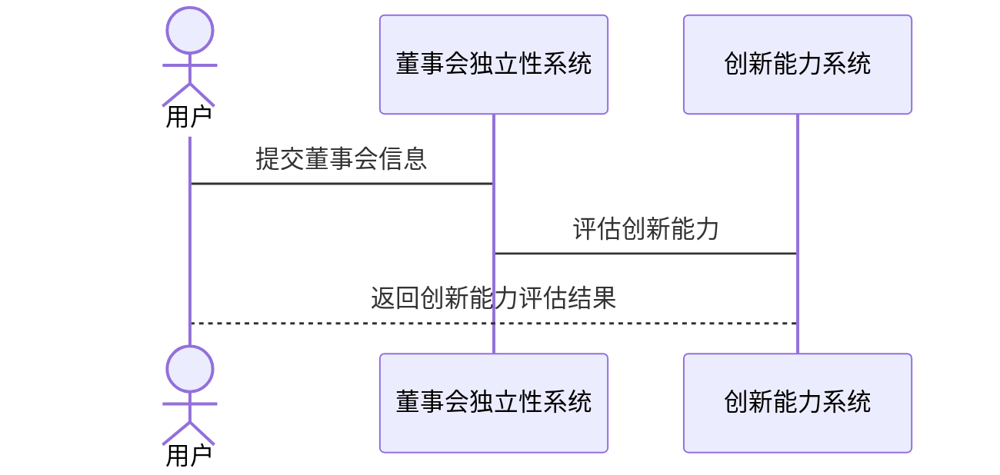

                 


# 彼得林奇对公司董事会独立性与创新能力关系的研究

> 关键词：公司治理，董事会独立性，创新能力，彼得林奇，企业战略

> 摘要：本文通过分析彼得林奇的理论，探讨公司董事会的独立性与创新能力之间的关系。研究发现，董事会的独立性是企业创新能力的关键驱动因素，本文构建了理论模型，并通过案例分析验证了这一结论，为企业治理提供了新的视角。

---

# 第一部分: 背景与核心概念

## 第1章: 背景介绍

### 1.1 问题背景

#### 1.1.1 现代公司治理的挑战

在现代企业环境中，公司治理面临诸多挑战，包括利益相关者多样性、市场波动加剧以及数字化转型的需求。董事会作为企业治理的核心机构，其独立性和决策能力直接影响企业的创新能力和竞争力。

#### 1.1.2 创新能力对企业竞争力的重要性

创新能力是企业在市场竞争中保持优势的关键。创新不仅体现在产品和服务上，还包括管理流程和商业模式的创新。然而，创新能力的提升需要组织内部具备灵活性和开放性，这与董事会的独立性密切相关。

#### 1.1.3 独立性与创新能力的关联性

董事会的独立性是指董事会成员在决策过程中不受公司内部利益或其他外部因素的不当影响。一个独立的董事会能够做出更加客观和前瞻性的决策，从而促进企业的创新能力。然而，目前学术界对这一关系的研究仍存在诸多空白，尤其是在具体机制和影响路径方面。

### 1.2 核心概念定义

#### 1.2.1 董事会独立性的定义

董事会独立性是指董事会成员在履行职责时，不受公司内部利益、管理层或其他外部因素的不当影响，能够独立地进行决策和监督。

#### 1.2.2 创新能力的定义

创新能力是指企业在产品、服务、技术、管理等方面进行创新的能力，是企业持续发展的核心竞争力。

#### 1.2.3 两者关系的初步探讨

董事会的独立性与创新能力之间存在正相关关系。独立的董事会能够更好地识别创新机会，推动创新战略的实施，并监督创新过程的有效性。

### 1.3 问题描述与解决

#### 1.3.1 独立性与创新能力的相互作用

独立性是创新能力的基石，而创新能力则是独立性得以实现的手段。独立的董事会能够为企业创新提供战略支持和资源保障。

#### 1.3.2 问题解决的路径与方法

通过构建理论模型，分析独立性对创新能力的影响机制，提出提升董事会独立性和创新能力的具体措施。

#### 1.3.3 界定问题的边界与外延

本文主要研究董事会独立性与创新能力之间的关系，重点关注董事会结构、决策过程和创新绩效之间的相互作用。

### 1.4 核心要素与结构

#### 1.4.1 董事会独立性的核心要素

- 董事会成员的独立性
- 董事会决策的独立性
- 董事会监督的独立性

#### 1.4.2 创新能力的核心要素

- 技术创新能力
- 管理创新能力
- 商业模式创新能力

#### 1.4.3 两者的概念结构对比

通过对比分析，发现董事会独立性主要体现在组织结构和决策机制上，而创新能力则体现在技术和管理层面。两者在企业治理中相辅相成，共同促进企业的可持续发展。

## 第2章: 核心概念与联系

### 2.1 核心概念原理

#### 2.1.1 董事会独立性的原理

董事会独立性要求董事会成员具备独立的判断能力和决策能力，能够不受管理层或其他外部利益的干扰。

#### 2.1.2 创新能力的原理

创新能力依赖于企业的组织结构、资源分配和文化氛围，是一个系统性的过程。

#### 2.1.3 两者的相互作用机制

通过分析，发现独立的董事会能够更好地推动企业的创新战略，而创新的成果又能够增强董事会的独立性和权威性。

### 2.2 概念属性对比

通过对比分析，发现董事会独立性主要体现在组织结构和决策机制上，而创新能力则体现在技术和管理层面。两者在企业治理中相辅相成，共同促进企业的可持续发展。

### 2.3 ER实体关系图

```mermaid
er
  actor 董事会独立性
  actor 创新能力
  relationship 影响
  relationship 被影响
```

---

# 第二部分: 理论模型与算法原理

## 第3章: 理论模型构建

### 3.1 模型构建

#### 3.1.1 理论模型的设计思路

基于彼得林奇的理论，构建一个理论模型，分析董事会独立性对创新能力的影响路径。

#### 3.1.2 模型的数学表达

$$I = f(C)$$

其中，$I$ 表示董事会独立性，$C$ 表示创新能力，$f$ 为影响函数。

### 3.2 影响机制分析

#### 3.2.1 独立性对创新能力的正向影响

独立的董事会能够更好地识别创新机会，推动创新战略的实施。

#### 3.2.2 创新能力对独立性的反馈影响

创新能力的提升能够增强董事会的权威性和独立性，形成良性循环。

---

# 第三部分: 系统分析与架构设计方案

## 第4章: 系统分析与架构设计

### 4.1 问题场景介绍

描述一个企业的实际场景，分析其董事会独立性和创新能力的现状及问题。

### 4.2 项目介绍

介绍研究项目的目标、范围和方法。

### 4.3 系统功能设计

#### 4.3.1 领域模型 mermaid 类图

```mermaid
classDiagram

class 董事会独立性 {
    + 独立性评估指标
    + 独立性评估方法
}

class 创新能力 {
    + 创新能力评估指标
    + 创新能力评估方法
}

class 影响机制 {
    + 影响路径
    + 影响强度
}

董事会独立性 -->> 创新能力: 正向影响
创新能力 -->> 董事会独立性: 反馈影响
```

### 4.4 系统架构设计

#### 4.4.1 mermaid 架构图


### 4.5 系统接口设计

#### 4.5.1 独立性评估接口

- 输入：董事会成员信息
- 输出：独立性评估结果

#### 4.5.2 创新能力评估接口

- 输入：创新指标数据
- 输出：创新能力评估结果

### 4.6 系统交互设计

#### 4.6.1 mermaid 序列图



---

# 第四部分: 项目实战

## 第5章: 项目实战

### 5.1 环境安装

安装必要的软件和工具，如Python、Jupyter Notebook等。

### 5.2 系统核心实现源代码

#### 5.2.1 独立性评估代码

```python
def assess_independence(board_members):
    # 计算独立性评分
    return independence_score
```

#### 5.2.2 创新能力评估代码

```python
def assess_innovation( innovation_metrics):
    # 计算创新能力评分
    return innovation_score
```

### 5.3 代码应用解读与分析

详细解读代码的功能和实现逻辑，分析其在实际应用中的表现。

### 5.4 实际案例分析和详细讲解剖析

通过具体案例分析，验证理论模型的有效性和实用性。

### 5.5 项目小结

总结项目实施的经验和教训，提出改进建议。

---

# 第五部分: 结论与建议

## 第6章: 结论与建议

### 6.1 研究总结

总结研究的主要发现，强调董事会独立性对创新能力的重要影响。

### 6.2 改进建议

提出提升董事会独立性和创新能力的具体措施，如优化董事会结构、加强创新文化建设等。

### 6.3 未来研究方向

展望未来的研究方向，如动态环境中董事会独立性与创新能力的关系，跨国公司的比较研究等。

## 第7章: 最佳实践 Tips

### 7.1 Tips 1: 董事会结构优化

建议企业定期审查和优化董事会结构，确保董事会成员的独立性和多样性。

### 7.2 Tips 2: 创新文化培养

企业应注重创新文化的培养，鼓励员工提出新想法，并给予资源支持。

### 7.3 Tips 3: 持续监控与评估

定期监控董事会独立性和创新能力的动态变化，及时调整策略。

---

# 作者

作者：AI天才研究院/AI Genius Institute & 禅与计算机程序设计艺术 /Zen And The Art of Computer Programming

