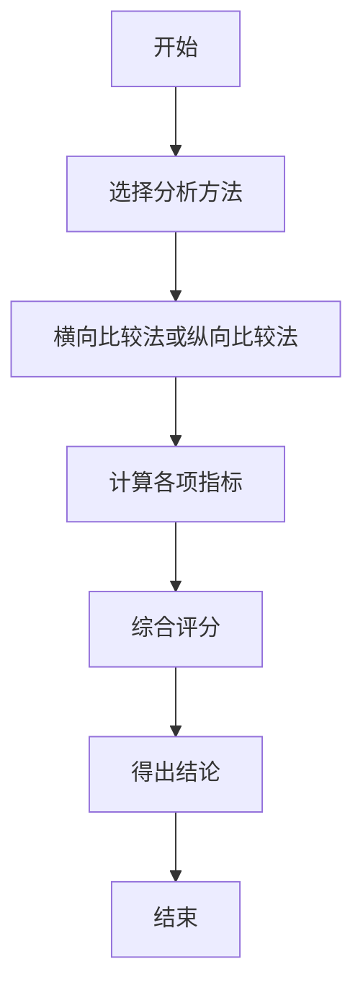
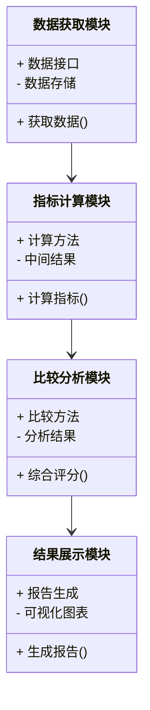

                 


# 彼得林奇对公司财务健康度的分析

> 关键词：彼得林奇、财务健康度、投资分析、价值投资、财务指标

> 摘要：本文深入分析了彼得·林奇对公司财务健康度的评估方法，探讨了其投资理念和财务指标分析的核心要素，结合实际案例，展示了如何通过财务数据来判断公司的健康状况，进而做出投资决策。

---

## 第1章: 彼得林奇的投资理念与财务分析背景

### 1.1 彼得·林奇的投资哲学

#### 1.1.1 价值投资的核心理念
彼得·林奇是价值投资的代表人物之一，他主张以低于内在价值的价格买入优质股票。他认为市场的波动性为投资者提供了低价买入的机会，而公司的基本面是决定股价长期走势的关键因素。

#### 1.1.2 财务健康度在投资中的重要性
财务健康度是公司长期盈利能力的体现，决定了其在市场波动中的抗风险能力。林奇认为，只有财务健康、管理优秀且具有成长性的公司才能为股东创造持续价值。

#### 1.1.3 彼得·林奇的选股标准
林奇选股的核心标准包括：
- 公司具有持续的盈利能力和成长性。
- 财务杠杆适度，避免过高负债。
- 现金流健康，能够支持公司的运营和扩张。

### 1.2 公司财务健康度的定义与意义

#### 1.2.1 财务健康度的定义
财务健康度是通过分析公司财务报表中的关键指标，评估其盈利能力、成长能力、财务杠杆和现金流健康程度的综合评价。

#### 1.2.2 财务健康度对投资决策的影响
- 帮助投资者识别财务状况良好的公司，降低投资风险。
- 通过财务指标的趋势分析，预测公司的未来表现。

#### 1.2.3 财务健康度的边界与外延
财务健康度的分析不包括市场风险、行业周期性等因素，但可以结合这些因素进行综合判断。

### 1.3 本书的核心分析框架

#### 1.3.1 财务健康度的五个核心维度
- 盈利能力
- 成长能力
- 财务杠杆
- 现金流健康度
- 股东权益质量

#### 1.3.2 核心维度之间的关系
盈利能力是核心，成长能力是目标，财务杠杆和现金流是支撑，股东权益是基础。

#### 1.3.3 分析框架的适用范围与限制
适用于成熟行业中的上市公司，不适用于初创期或亏损严重的企业。

## 第2章: 财务健康度的核心指标与分析方法

### 2.1 财务健康度的核心指标

#### 2.1.1 盈利能力指标
- 净利润率（Net Profit Margin）= 净利润 / 收入
- 净资产收益率（ROE）= 净利润 / 平均股东权益
- 每股收益（EPS）= 净利润 / 普通股股数

#### 2.1.2 成长能力指标
- 收入增长率 = (本年收入 - 上年收入) / 上年收入
- 净利润增长率 = (本年净利润 - 上年净利润) / 上年净利润

#### 2.1.3 财务杠杆指标
- 资产负债率 = 总负债 / 总资产
- 利息覆盖率 = 息税前利润（EBIT） / 利息支出

#### 2.1.4 现金流指标
- 经营活动现金流净额
- 现金流量比率 = 经营活动现金流净额 / 流动负债

#### 2.1.5 股东权益指标
- 股东权益增长率 = (本年股东权益 - 上年股东权益) / 上年股东权益

### 2.2 核心指标的对比分析

#### 2.2.1 盈利能力与成长能力的对比
通过对比ROE和收入增长率，评估公司当前盈利能力与未来增长潜力的平衡。

#### 2.2.2 财务杠杆与现金流的对比
高杠杆可能带来高收益，但也会增加财务风险；现金流健康是维持公司运营的关键。

#### 2.2.3 核心指标的综合评价方法
使用加权评分法，根据各指标的重要性和实际表现，综合评估公司的财务健康度。

### 2.3 彼得·林奇的财务分析方法

#### 2.3.1 横向比较法
比较同行业公司各项财务指标，找出表现优异的公司。

#### 2.3.2 纵向比较法
分析同一公司不同年度的财务数据，观察趋势变化。

#### 2.3.3 财务指标的权重分配
根据行业特点和投资目标，调整各项指标的权重，如盈利能力占40%，成长能力占30%，财务杠杆占20%，现金流占10%。

## 第3章: 财务健康度的算法原理与数学模型

### 3.1 财务健康度的算法原理

#### 3.1.1 横向比较法的实现步骤
1. 收集同行业多家公司的财务数据。
2. 计算各项核心财务指标。
3. 对比分析，找出表现优于行业平均水平的公司。

#### 3.1.2 纵向比较法的实现步骤
1. 收集公司过去几年的财务报表。
2. 计算各年的财务指标。
3. 分析趋势，判断公司的财务健康状况是否稳定或改善。

#### 3.1.3 综合评分法的实现步骤
1. 确定各项指标的权重。
2. 根据指标实际表现评分。
3. 计算综合得分，判断公司的财务健康等级。

### 3.2 财务健康度的数学模型

#### 3.2.1 盈利能力指标的计算公式
$$ \text{ROE} = \frac{\text{净利润}}{\text{平均股东权益}} $$

#### 3.2.2 成长能力指标的计算公式
$$ \text{收入增长率} = \frac{\text{本年收入} - \text{上年收入}}{\text{上年收入}} $$

#### 3.2.3 财务杠杆指标的计算公式
$$ \text{资产负债率} = \frac{\text{总负债}}{\text{总资产}} $$

### 3.3 算法流程图



### 3.4 系统分析与架构设计

#### 3.4.1 项目介绍
构建一个基于彼得·林奇分析方法的财务健康评估系统，帮助投资者快速评估公司财务状况。

#### 3.4.2 系统功能设计
- 数据获取模块：从财务报表中提取数据。
- 指标计算模块：计算各项财务指标。
- 比较分析模块：横向和纵向比较。
- 结果展示模块：生成评分报告。

#### 3.4.3 系统架构设计



#### 3.4.4 系统接口设计
- 数据获取接口：接收财务数据，返回计算结果。
- 结果展示接口：返回评分报告和可视化图表。

### 3.5 项目实战

#### 3.5.1 环境安装
- 安装Python和相关库（Pandas, Matplotlib）。

#### 3.5.2 核心实现源代码

```python
import pandas as pd
import matplotlib.pyplot as plt

def calculate_roe(net_profit, avg_equity):
    return net_profit / avg_equity

def calculate_growth(revenue_current, revenue_previous):
    return (revenue_current - revenue_previous) / revenue_previous

# 示例数据
net_profit = 100
avg_equity = 500
revenue_current = 2000
revenue_previous = 1800

roe = calculate_roe(net_profit, avg_equity)
growth = calculate_growth(revenue_current, revenue_previous)

print(f"ROE: {roe}")
print(f"Revenue Growth: {growth}")

plt.figure(figsize=(10,6))
plt.plot([2019,2020,2021], [0.15,0.18,0.22], label='ROE Trend')
plt.title('ROE Trend Analysis')
plt.xlabel('Year')
plt.ylabel('ROE')
plt.legend()
plt.show()
```

#### 3.5.3 案例分析与解读
以苹果公司为例，分析其ROE和收入增长率，评估其财务健康状况。

### 3.6 最佳实践 tips

- 数据准确性是关键，确保财务数据的来源可靠。
- 结合行业特点调整分析指标和权重。
- 定期更新分析结果，跟踪公司财务状况的变化。

### 3.7 小结
通过系统化的财务分析方法，投资者可以更准确地评估公司的财务健康状况，做出更明智的投资决策。

---

## 结语

彼得·林奇的财务健康度分析方法为投资者提供了科学的评估工具。通过本文的系统介绍和实战案例，读者可以掌握这一方法，并在实际投资中灵活应用。未来，随着市场环境的变化，财务分析方法也需要不断创新和优化，以适应新的挑战和机遇。

---

作者：AI天才研究院/AI Genius Institute & 禅与计算机程序设计艺术 /Zen And The Art of Computer Programming

