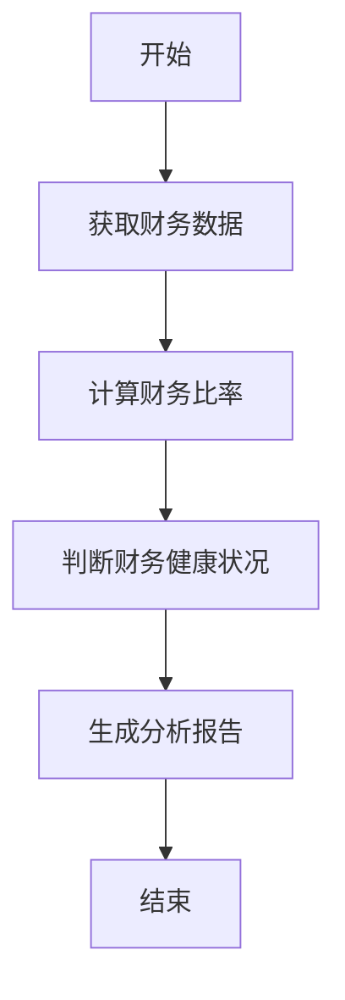

                 


# 彼得林奇对公司财务报表趋势的解读

**关键词：彼得·林奇，财务报表，趋势分析，投资策略，财务比率**

**摘要：** 本文深入探讨彼得·林奇如何通过分析公司财务报表的趋势来做出投资决策。文章首先介绍财务报表的基本知识和彼得·林奇的投资理念，然后详细讲解财务报表分析的核心指标和方法，包括盈利能力、偿债能力、运营能力等指标的计算与应用。接着，分析彼得·林奇的财务分析策略，并结合实际案例进行详细解读。最后，总结最佳实践，提供投资者在实际操作中的注意事项和拓展阅读建议。

---

## 第1章：财务报表分析的背景与重要性

### 1.1 财务报表分析的基本概念

#### 1.1.1 财务报表的定义与组成
- 财务报表是反映企业财务状况、经营成果和现金流量的重要文件。
- 主要包括利润表、资产负债表和现金流量表。
- 利润表：展示公司在一定时期内的收入和支出情况。
- 资产负债表：展示公司在某一特定日期的资产、负债和所有者权益情况。
- 现金流量表：展示公司在一定时期内的现金流情况。

#### 1.1.2 财务报表分析的目的与意义
- 帮助投资者评估公司的财务健康状况。
- 通过分析财务数据，识别公司的财务风险和投资机会。
- 为投资决策提供数据支持。

#### 1.1.3 彼得·林奇投资理念的核心要素
- 价值投资：寻找那些被市场低估的优质公司。
- 长期持有：耐心持有优质资产，避免频繁交易。
- 财务报表分析：通过分析财务报表，识别公司的盈利能力和成长潜力。

### 1.2 公司财务报表的基本结构

#### 1.2.1 利润表：公司盈利能力的展示
- 收入：公司一定时期内通过销售商品或服务获得的总收入。
- 成本：生产商品或提供服务所发生的直接成本。
- 净利润：收入减去成本和各项费用后的利润。

#### 1.2.2 资产负债表：公司财务状况的呈现
- 资产：公司拥有的资源，包括流动资产和非流动资产。
- 负债：公司欠款的债务，包括短期负债和长期负债。
- 所有者权益：公司资产减去负债后的剩余部分，代表股东的权益。

#### 1.2.3 现金流量表：公司现金流的记录
- 经营活动现金流：公司日常经营活动中产生的现金流。
- 投资活动现金流：公司投资活动产生的现金流。
- 筹资活动现金流：公司通过筹资活动获得或支出的现金流。

### 1.3 财务报表趋势分析的重要性

#### 1.3.1 财务数据变化的内在逻辑
- 通过分析财务数据的变化趋势，识别公司的财务健康状况。
- 判断公司的盈利能力、偿债能力和运营能力的变化。

#### 1.3.2 财务趋势与公司未来发展的关联
- 利润率持续上升可能意味着公司具有较强的盈利能力。
- 负债率上升可能意味着公司面临较大的财务压力。

#### 1.3.3 彼得·林奇如何利用财务趋势做出投资决策
- 通过分析财务报表的趋势，识别公司的成长潜力。
- 寻找那些盈利能力稳定且有增长潜力的公司。

---

## 第2章：彼得·林奇的财务报表分析方法

### 2.1 财务比率分析

#### 2.1.1 常用财务比率的分类与计算

##### 1. 盈利能力分析指标
- 净利润率（Net Profit Margin）：净利润 / 收入。
- 毛利率（Gross Profit Margin）：毛利 / 收入。
- 净资产收益率（ROE）：净利润 / 所有者权益。

##### 2. 偿债能力分析指标
- 速动比率（Quick Ratio）：（流动资产 - 存货） / 流动负债。
- 负债率（Debt-to-Asset Ratio）：总负债 / 总资产。
- 利息保障倍数（Interest Coverage Ratio）：EBIT / 利息支出。

##### 3. 运营能力分析指标
- 存货周转率（Inventory Turnover）：成本 of goods sold / 平均存货。
- 资产周转率（Asset Turnover）：收入 / 平均总资产。
- 应收账款周转率（Receivables Turnover）：收入 / 平均应收账款。

#### 2.1.2 彼得·林奇如何运用财务比率评估公司价值
- 通过分析财务比率，评估公司的盈利能力、偿债能力和运营效率。
- 寻找那些盈利能力稳定且有增长潜力的公司。

#### 2.1.3 财务比率分析的局限性
- 财务比率分析受到行业差异的影响。
- 财务比率分析不能单独使用，需要结合其他分析方法。

### 2.2 财务报表项目趋势分析

#### 2.2.1 收入与利润趋势分析
- 分析收入和利润的增长趋势。
- 判断公司的盈利能力是否稳定且有增长潜力。

#### 2.2.2 资产与负债趋势分析
- 分析资产和负债的增长趋势。
- 判断公司是否存在较大的财务压力。

#### 2.2.3 现金流量趋势分析
- 分析经营活动、投资活动和筹资活动的现金流趋势。
- 判断公司的现金流是否健康。

### 2.3 财务数据质量分析

#### 2.3.1 财务数据的真实性判断
- 通过分析财务数据的合理性，判断数据的真实性。
- 检查财务数据是否符合行业平均水平。

#### 2.3.2 财务数据的可比性分析
- 分析财务数据的可比性，确保数据的准确性。
- 考虑行业特点和会计政策的影响。

#### 2.3.3 财务数据的异常情况识别
- 识别财务数据中的异常波动。
- 分析异常波动的原因，判断其对公司的影响。

---

## 第3章：财务报表分析的核心指标与计算公式

### 3.1 利润能力分析指标

#### 3.1.1 净利润率（Net Profit Margin）
- 公式：净利润率 = 净利润 / 收入。
- 例如：公司净利润为100万元，收入为1000万元，净利润率为10%。

#### 3.1.2 毛利率（Gross Profit Margin）
- 公式：毛利率 = 毛利 / 收入。
- 例如：公司毛利为800万元，收入为1000万元，毛利率为80%。

#### 3.1.3 净资产收益率（ROE）
- 公式：ROE = 净利润 / 所有者权益。
- 例如：公司净利润为100万元，所有者权益为500万元，ROE为20%。

### 3.2 偿债能力分析指标

#### 3.2.1 速动比率（Quick Ratio）
- 公式：速动比率 = （流动资产 - 存货） / 流动负债。
- 例如：公司流动资产为500万元，存货为200万元，流动负债为300万元，速动比率 = (500 - 200) / 300 = 1。

#### 3.2.2 负债率（Debt-to-Asset Ratio）
- 公式：负债率 = 总负债 / 总资产。
- 例如：公司总负债为400万元，总资产为1000万元，负债率为40%。

#### 3.2.3 利息保障倍数（Interest Coverage Ratio）
- 公式：利息保障倍数 = EBIT / 利息支出。
- 例如：公司EBIT为200万元，利息支出为50万元，利息保障倍数为4。

### 3.3 运营能力分析指标

#### 3.3.1 存货周转率（Inventory Turnover）
- 公式：存货周转率 = 成本 of goods sold / 平均存货。
- 例如：公司成本 of goods sold为800万元，平均存货为400万元，存货周转率为2。

#### 3.3.2 资产周转率（Asset Turnover）
- 公式：资产周转率 = 收入 / 平均总资产。
- 例如：公司收入为1000万元，平均总资产为500万元，资产周转率为2。

#### 3.3.3 应收账款周转率（Receivables Turnover）
- 公式：应收账款周转率 = 收入 / 平均应收账款。
- 例如：公司收入为1000万元，平均应收账款为200万元，应收账款周转率为5。

---

## 第4章：彼得·林奇投资策略中的财务报表分析

### 4.1 价值投资与财务报表分析

#### 4.1.1 价值投资的基本原则
- 寻找那些被市场低估的优质公司。
- 长期持有，耐心等待价值的实现。

#### 4.1.2 价值投资中的财务报表分析
- 分析公司的盈利能力、偿债能力和运营能力。
- 判断公司是否具有持续的盈利能力。

### 4.2 投资决策中的财务报表分析

#### 4.2.1 分析公司的财务健康状况
- 通过分析财务报表，判断公司的财务健康状况。
- 判断公司是否具有持续的盈利能力。

#### 4.2.2 识别公司的财务风险
- 分析公司的偿债能力，判断公司是否存在较大的财务压力。
- 识别公司的财务数据中的异常情况。

### 4.3 投资决策中的趋势分析

#### 4.3.1 分析财务数据的趋势
- 通过分析财务数据的趋势，判断公司的财务健康状况。
- 判断公司是否存在较大的财务压力。

#### 4.3.2 判断公司的成长潜力
- 分析公司的收入和利润趋势，判断公司的成长潜力。
- 判断公司是否具有持续的盈利能力。

---

## 第5章：项目实战——苹果公司的财务报表分析

### 5.1 项目背景介绍
- 苹果公司是全球知名的科技公司，具有较强的盈利能力。
- 通过分析苹果公司的财务报表，判断其财务健康状况和投资价值。

### 5.2 财务报表分析的核心指标

#### 5.2.1 利润表分析
- 收入和利润的增长趋势。
- 判断苹果公司的盈利能力是否稳定且有增长潜力。

#### 5.2.2 资产负债表分析
- 分析苹果公司的资产和负债情况。
- 判断苹果公司是否存在较大的财务压力。

#### 5.2.3 现金流量表分析
- 分析苹果公司的现金流情况。
- 判断苹果公司的现金流是否健康。

### 5.3 投资决策分析

#### 5.3.1 分析苹果公司的财务健康状况
- 判断苹果公司是否具有持续的盈利能力。
- 判断苹果公司是否存在较大的财务压力。

#### 5.3.2 判断苹果公司的投资价值
- 判断苹果公司是否具有较大的成长潜力。
- 判断苹果公司是否具有投资价值。

---

## 第6章：系统分析与架构设计方案

### 6.1 系统功能设计

#### 6.1.1 问题场景介绍
- 投资者需要通过分析财务报表，做出投资决策。
- 需要一个系统来帮助投资者分析财务报表，判断公司的财务健康状况和投资价值。

#### 6.1.2 领域模型设计（Mermaid类图）
```mermaid
classDiagram
    class 投资者 {
        +姓名
        +投资金额
        +投资目标
        +分析报告
    }
    class 公司财务报表 {
        +利润表
        +资产负债表
        +现金流量表
    }
    class 系统 {
        +分析模块
        +报告生成模块
        +用户界面
    }
    投资者 --> 系统：提交投资目标
    系统 --> 公司财务报表：获取财务数据
    系统 --> 投资者：生成分析报告
```

#### 6.1.3 系统架构设计（Mermaid架构图）


#### 6.1.4 系统接口设计
- 投资者提交投资目标，系统获取财务数据。
- 系统分析模块调用财务分析算法，生成分析报告。
- 系统通过用户界面展示分析结果。

#### 6.1.5 系统交互设计（Mermaid序列图）
```mermaid
sequenceDiagram
    投资者 -> 系统：提交投资目标
    系统 -> 数据库：查询财务数据
    数据库 -> 系统：返回财务数据
    系统 -> 分析模块：调用分析算法
    分析模块 -> 系统：返回分析结果
    系统 -> 投资者：展示分析报告
```

### 6.2 算法原理与实现

#### 6.2.1 财务比率分析算法（Mermaid流程图）


#### 6.2.2 Python实现代码
```python
def calculate_profit_margin(net_profit, revenue):
    return net_profit / revenue

def calculate_debt_to_asset_ratio(total_liabilities, total_assets):
    return total_liabilities / total_assets

def calculate_interest_coverage_ratio(ebit, interest_expense):
    return ebit / interest_expense

def main():
    # 示例数据
    net_profit = 1000000
    revenue = 10000000
    total_liabilities = 4000000
    total_assets = 10000000
    ebit = 2000000
    interest_expense = 500000

    profit_margin = calculate_profit_margin(net_profit, revenue)
    debt_to_asset_ratio = calculate_debt_to_asset_ratio(total_liabilities, total_assets)
    interest_coverage_ratio = calculate_interest_coverage_ratio(ebit, interest_expense)

    print(f"净利润率：{profit_margin}")
    print(f"负债率：{debt_to_asset_ratio}")
    print(f"利息保障倍数：{interest_coverage_ratio}")

if __name__ == "__main__":
    main()
```

---

## 第7章：最佳实践与小结

### 7.1 最佳实践

#### 7.1.1 小结
- 彼得·林奇通过分析财务报表的趋势，做出投资决策。
- 财务报表分析是投资决策的重要工具。
- 通过分析财务比率，判断公司的财务健康状况和投资价值。

#### 7.1.2 注意事项
- 财务报表分析需要结合行业特点和公司具体情况。
- 财务报表分析不能单独使用，需要结合其他分析方法。
- 投资者需要持续关注公司的财务状况，及时调整投资策略。

#### 7.1.3 拓展阅读
- 《彼得·林奇的投资哲学》
- 《财务报表分析》
- 《投资学》

---

## 作者：AI天才研究院/AI Genius Institute & 禅与计算机程序设计艺术 /Zen And The Art of Computer Programming

---

本文通过详细讲解彼得·林奇如何通过分析公司财务报表的趋势，做出投资决策，帮助投资者掌握财务报表分析的核心指标和方法。通过实际案例分析和系统设计，进一步巩固所学内容，为投资者在实际操作中提供参考和指导。

