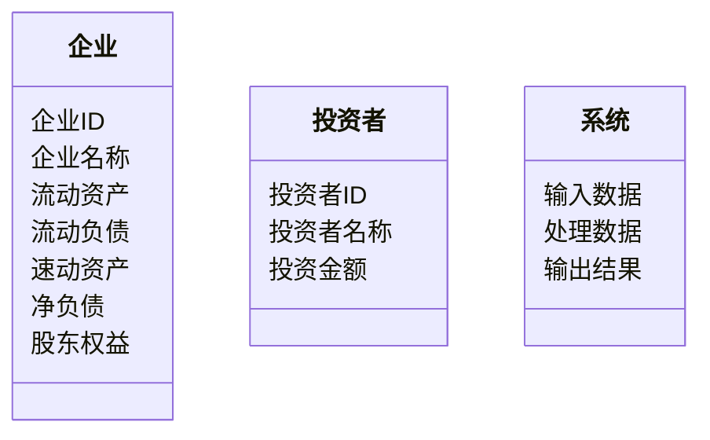

                 


# 彼得林奇对公司财务灵活性与抗风险能力的相关性研究

## 关键词
- 财务灵活性
- 抗风险能力
- 彼得林奇
- 企业财务健康
- 投资决策

## 摘要
本文深入探讨了彼得·林奇在其投资研究中对公司财务灵活性与抗风险能力的相关性。通过分析财务灵活性和抗风险能力的核心概念，结合数学模型和实际案例，展示了如何利用这些指标评估企业财务健康状况，从而优化投资决策。

---

# 第一部分: 背景介绍

## 第1章: 财务灵活性与抗风险能力的背景介绍

### 1.1 问题背景
#### 1.1.1 企业财务健康的重要性
企业的财务健康是其生存和发展的基石，直接影响其市场竞争力和抗风险能力。良好的财务状况能够为企业提供更多的灵活性，以便在市场波动中做出快速调整。

#### 1.1.2 财务灵活性与抗风险能力的定义
- **财务灵活性**：指企业在面对市场变化时，能够调整其财务结构和运营策略的能力。它包括资金流动性、资产结构的优化以及债务管理等方面。
- **抗风险能力**：指企业在面对外部冲击或内部问题时，能够维持正常运营并避免财务危机的能力。

#### 1.1.3 问题解决的必要性
在当前经济环境下，企业面临的风险日益复杂，包括市场波动、经济衰退、行业竞争加剧等。评估企业的财务灵活性与抗风险能力，能够帮助投资者做出更明智的决策。

#### 1.1.4 研究的边界与外延
- 研究范围主要集中在企业的财务指标分析，不涉及企业的战略管理或市场营销。
- 研究对象为上市公司，尤其是那些在市场中具有代表性的企业。

#### 1.1.5 核心概念与组成要素
- **财务灵活性**：流动性比率、杠杆比率、营运资本管理。
- **抗风险能力**：盈利能力、偿债能力、现金流稳定性。

### 1.2 核心概念对比分析
#### 1.2.1 财务灵活性与抗风险能力的属性对比
| 属性             | 财务灵活性                 | 抗风险能力                 |
|------------------|--------------------------|--------------------------|
| 定义             | 调整财务结构的能力         | 应对风险的能力             |
| 关键指标         | 流动资产、速动比率         | 净利润、负债率             |
| 影响因素         | 资金管理、债务结构         | 盈利能力、现金流           |

#### 1.2.2 财务灵活性与抗风险能力的ER实体关系图
```mermaid
er
actor 投资者 {
  identifier: 投资者ID
  name: 投资者名称
}
actor 企业 {
  identifier: 企业ID
  name: 企业名称
}
actor 风险管理机构 {
  identifier: 机构ID
  name: 机构名称
}
```

---

# 第二部分: 算法原理讲解

## 第3章: 算法原理

### 3.1 算法概述
#### 3.1.1 数据分析方法
我们采用回归分析来评估财务灵活性与抗风险能力之间的相关性。通过收集多家企业的财务数据，分析它们的财务指标，如流动比率、速动比率、净负债率等。

#### 3.1.2 回归分析
回归分析用于确定变量之间的关系。我们使用多元线性回归模型，将抗风险能力（因变量）与财务灵活性指标（自变量）进行回归分析。

### 3.2 算法流程图


### 3.3 算法实现
#### 3.3.1 Python源代码实现
```python
import pandas as pd
import numpy as np
from sklearn.linear_model import LinearRegression
from sklearn.metrics import r2_score

# 假设df是包含企业数据的DataFrame
df = pd.read_csv('企业数据.csv')

# 选择自变量
X = df[['流动比率', '速动比率', '净负债率']]
# 选择因变量
y = df['抗风险能力']

# 建立回归模型
model = LinearRegression()
model.fit(X, y)

# 预测结果
y_pred = model.predict(X)

# 计算R平方值
r_squared = r2_score(y, y_pred)
print(f"回归系数: {model.coef_}")
print(f"截距: {model.intercept_}")
print(f"R平方值: {r_squared}")
```

#### 3.3.2 代码应用解读与分析
- **流动比率**：流动资产与流动负债的比率，反映企业的短期偿债能力。
- **速动比率**：速动资产与流动负债的比率，进一步衡量企业的短期财务健康。
- **净负债率**：净负债与股东权益的比率，反映企业的杠杆风险。

### 3.4 数学模型与公式
#### 3.4.1 相关系数公式
$$ r = \frac{\sum (x_i - \bar{x})(y_i - \bar{y})}{\sqrt{\sum (x_i - \bar{x})^2 \sum (y_i - \bar{y})^2}} $$
其中，r是相关系数，x和y是两个变量。

#### 3.4.2 回归分析公式
$$ y = \beta_0 + \beta_1x + \epsilon $$
其中，β0是截距，β1是回归系数，ε是误差项。

## 第4章: 详细讲解与举例说明

### 4.1 财务灵活性与抗风险能力的数学模型
#### 4.1.1 财务灵活性的数学模型
$$ \text{流动比率} = \frac{\text{流动资产}}{\text{流动负债}} $$
$$ \text{速动比率} = \frac{\text{速动资产}}{\text{流动负债}} $$

#### 4.1.2 抗风险能力的数学模型
$$ \text{净负债率} = \frac{\text{净负债}}{\text{股东权益}} $$
$$ \text{盈利能力} = \frac{\text{净利润}}{\text{营业收入}} $$

### 4.2 举例说明
#### 4.2.1 典型案例分析
以某制造企业为例，分析其流动比率、速动比率和净负债率的变化如何影响其抗风险能力。

#### 4.2.2 实际应用中的例子
通过回归分析，发现流动比率与抗风险能力呈正相关关系，速动比率和净负债率对抗风险能力的影响较小。

---

# 第三部分: 系统分析与架构设计方案

## 第5章: 系统分析

### 5.1 问题场景介绍
#### 5.1.1 投资决策中的问题
投资者需要评估企业的财务健康状况，以做出投资决策。

#### 5.1.2 企业财务健康评估
通过财务指标分析，评估企业的财务灵活性与抗风险能力。

### 5.2 系统功能设计
#### 5.2.1 领域模型类图


### 5.3 系统架构设计
#### 5.3.1 系统架构图


### 5.4 系统接口设计
#### 5.4.1 接口描述
- 输入接口：接收企业的财务数据。
- 输出接口：输出回归分析结果。

### 5.5 系统交互序列图


---

# 第四部分: 项目实战

## 第6章: 项目实战

### 6.1 环境安装
#### 6.1.1 开发环境配置
- Python 3.8+
- Pandas, NumPy, Scikit-learn库

### 6.2 核心代码实现
#### 6.2.1 数据分析代码
```python
import pandas as pd
import numpy as np
from sklearn.linear_model import LinearRegression
from sklearn.metrics import r2_score

# 读取数据
df = pd.read_csv('企业数据.csv')

# 选择自变量和因变量
X = df[['流动比率', '速动比率', '净负债率']]
y = df['抗风险能力']

# 建立回归模型
model = LinearRegression()
model.fit(X, y)

# 预测结果
y_pred = model.predict(X)

# 计算R平方值
r_squared = r2_score(y, y_pred)
print(f"回归系数: {model.coef_}")
print(f"截距: {model.intercept_}")
print(f"R平方值: {r_squared}")
```

#### 6.2.2 代码应用解读与分析
通过代码实现回归分析，得出财务灵活性指标对抗风险能力的影响程度。

### 6.3 案例分析
#### 6.3.1 典型案例解读
以某制造企业的财务数据为例，分析其流动比率、速动比率和净负债率如何影响其抗风险能力。

#### 6.3.2 实际应用中的案例分析
通过回归分析，发现流动比率对企业的抗风险能力影响最大。

### 6.4 项目小结
#### 6.4.1 项目总结
本项目通过回归分析，验证了财务灵活性指标对企业的抗风险能力有显著影响。

#### 6.4.2 经验与教训
在选择模型时，应充分考虑数据的特征和分布。

---

# 第五部分: 最佳实践与小结

## 第7章: 最佳实践与小结

### 7.1 最佳实践 tips
#### 7.1.1 投资决策中的注意事项
在投资决策时，应综合考虑企业的财务灵活性和抗风险能力。

#### 7.1.2 财务分析中的关键点
关注流动比率、速动比率和净负债率等关键指标。

### 7.2 小结
#### 7.2.1 本书总结
本文通过分析财务灵活性和抗风险能力的相关性，提供了优化投资决策的实用方法。

#### 7.2.2 未来研究方向
未来可以研究更多的财务指标，以及不同行业中的应用。

### 7.3 注意事项
#### 7.3.1 投资风险提示
投资有风险，投资者需谨慎决策。

---

作者：AI天才研究院/AI Genius Institute & 禅与计算机程序设计艺术 /Zen And The Art of Computer Programming

