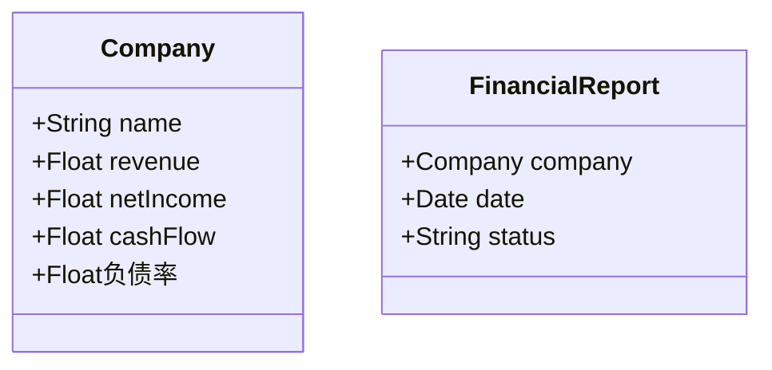
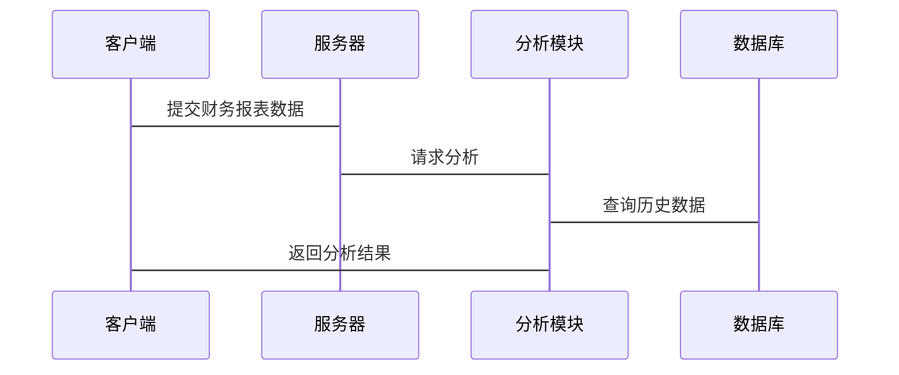

                 


# 彼得林奇对公司财务透明度的要求

> **关键词：** 彼得·林奇, 财务透明度, 财务报表分析, 投资策略, 企业价值评估

> **摘要：** 本文详细探讨了彼得·林奇对财务透明度的要求及其在投资决策中的重要性。通过分析财务报表的核心要素、财务比率、现金流等关键指标，结合实际案例，阐述了如何通过财务透明度评估企业的健康状况和投资价值。文章内容涵盖背景介绍、财务报表分析、财务透明度的核心概念、数学模型与公式、系统分析与架构设计、项目实战以及总结等部分。

---

## 第一部分: 背景介绍

### 第1章: 财务透明度的定义与重要性

#### 1.1 财务透明度的定义
财务透明度是指企业在财务报表、会计记录和其他财务信息中，清晰、准确地反映其财务状况、经营成果和现金流量的程度。它是投资者、分析师和利益相关者评估企业信用状况、投资价值和管理质量的重要依据。

#### 1.2 财务透明度的重要性
- **投资者决策的基础：** 财务透明度是投资者评估企业价值和投资风险的关键依据。通过透明的财务信息，投资者可以更好地判断企业的盈利能力和财务健康状况。
- **企业信用评级的核心：** 企业的信用评级往往依赖于其财务报表的透明度和准确性。透明的财务信息有助于企业获得更低的融资成本和更多的投资机会。
- **管理质量的体现：** 财务透明度反映了企业管理层的诚信和专业性。透明的财务信息能够增强投资者和利益相关者的信任。

#### 1.3 财务透明度与企业价值的关系
- 财务透明度高的企业通常具有较高的市场信任度，从而获得更高的估值。
- 透明的财务信息有助于降低信息不对称，提升企业的市场地位和竞争力。

### 第2章: 彼得·林奇与财务透明度

#### 2.1 彼得·林奇的简介
彼得·林奇（Peter Lynch）是美国著名的投资经理人，以其在富达投资管理公司管理麦哲伦基金的业绩而闻名。他的投资策略注重长期成长，善于通过分析财务报表和行业趋势来寻找具有竞争优势的企业。

#### 2.2 彼得·林奇对财务透明度的关注
彼得·林奇认为，财务透明度是评估企业价值的关键因素之一。他强调，投资者必须仔细分析财务报表，识别潜在的风险和机会，以做出明智的投资决策。

#### 2.3 彼得·林奇投资理念的核心要素
- **深入分析财务报表：** 林奇认为，财务报表是评估企业价值的核心工具。他特别关注收入增长、利润率、资产负债状况和现金流等关键指标。
- **关注企业的竞争优势：** 林奇注重企业是否具备可持续的竞争优势，例如独特的技术、品牌影响力或市场地位。
- **长期投资与价值发现：** 林奇的投资策略强调长期持有优质股票，避免短期市场波动的干扰。

---

## 第二部分: 财务报表分析基础

### 第3章: 利润表分析

#### 3.1 利润表的构成
利润表反映了企业在一定会计期间内的收入、费用和利润情况。主要构成包括：
- **营业收入：** 包括主营业务收入和其他业务收入。
- **营业成本：** 与营业收入直接相关的成本。
- **毛利润：** 营业收入减去营业成本。
- **营业费用：** 包括销售费用、管理费用和研发费用等。
- **净利润：** 最终的利润，是衡量企业盈利能力的核心指标。

#### 3.2 收入与成本的分析
- **收入分析：** 通过比较不同会计期间的收入增长，判断企业的市场表现和业务稳定性。
- **成本分析：** 关注成本的变化趋势，识别是否存在成本失控的风险。

#### 3.3 净利润的计算与解读
$$ \text{净利润} = \text{营业收入} - \text{营业成本} - \text{营业费用} - \text{税费} $$
净利润是衡量企业盈利能力的关键指标，反映了企业的经营效率和财务健康状况。

### 第4章: 资产负债表分析

#### 4.1 资产、负债与所有者权益的构成
- **资产：** 包括流动资产（如现金、应收账款、存货）和非流动资产（如固定资产、无形资产）。
- **负债：** 包括流动负债（如应付账款、短期借款）和非流动负债（如长期借款）。
- **所有者权益：** 包括股本、资本公积、盈余公积和未分配利润等。

#### 4.2 资产结构的分析
- **流动资产与非流动资产的比例：** 反映企业的资产流动性。
- **固定资产比例：** 行业不同，固定资产比例差异较大，但过高可能意味着企业资本密集，风险较大。

#### 4.3 负债结构的分析
- **流动负债与非流动负债的比例：** 流动负债比例过高可能意味着短期偿债压力较大。
- **负债与所有者权益的比例：** 负债率过高可能意味着企业财务杠杆过高，风险增加。

### 第5章: 现金流量表分析

#### 5.1 现金流量表的构成
现金流量表分为经营活动、投资活动和筹资活动三部分，反映了企业在一定会计期间内的现金流入和流出情况。

#### 5.2 经营活动、投资活动与筹资活动的现金流分析
- **经营活动现金流：** 反映企业主营业务的现金流入和流出情况。
- **投资活动现金流：** 反映企业投资于长期资产或出售长期资产的现金流量。
- **筹资活动现金流：** 反映企业通过融资活动获得或偿还的现金流量。

#### 5.3 现金流量与企业运营的关系
健康的现金流是企业持续运营的基础。经营活动现金流为正，表明企业主营业务能够产生足够的现金流支持运营。

---

## 第三部分: 财务透明度的核心概念与联系

### 第6章: 财务报表的核心要素

#### 6.1 收入与利润的关系
- 收入是利润的来源，但利润还受到成本、费用和税费的影响。
- 通过分析收入与利润的关系，可以判断企业的成本控制能力和盈利能力。

#### 6.2 资产与负债的平衡
- 资产与负债的平衡是财务健康的重要体现。通过分析资产负债率，可以判断企业的财务杠杆和偿债能力。
$$ \text{资产负债率} = \frac{\text{总负债}}{\text{总资产}} \times 100\% $$

#### 6.3 现金流与企业运营的关系
- 现金流是企业的血液，健康的现金流是企业持续发展的基础。
- 通过分析现金流，可以判断企业的盈利质量和发展潜力。

### 第7章: 财务报表的对比分析

#### 7.1 不同财务报表的对比
- **利润表与资产负债表的对比：** 利润表反映了企业的盈利能力，资产负债表反映了企业的资产和负债结构。
- **利润表与现金流量表的对比：** 利润表反映的是会计利润，现金流量表反映的是实际现金流。

#### 7.2 财务报表之间的勾稽关系
- 利润表中的净利润应与现金流量表中的经营活动现金流相关联。
- 资产负债表中的资产和负债变化应与现金流量表中的流入和流出相关联。

#### 7.3 财务报表分析的误区
- **只关注财务比率：** 忽视了企业所处的行业和市场环境。
- **过于依赖历史数据：** 忽视了未来的增长潜力和行业趋势。

---

## 第四部分: 彼得·林奇的财务透明度分析方法

### 第8章: 财务比率分析

#### 8.1 常见财务比率的计算公式
- **净利润率：**
$$ \text{净利润率} = \frac{\text{净利润}}{\text{营业收入}} \times 100\% $$
- **资产负债率：**
$$ \text{资产负债率} = \frac{\text{总负债}}{\text{总资产}} \times 100\% $$
- **流动比率：**
$$ \text{流动比率} = \frac{\text{流动资产}}{\text{流动负债}} $$

#### 8.2 财务比率在投资决策中的应用
- **净利润率：** 反映企业的盈利能力，净利润率越高，企业的盈利质量越好。
- **资产负债率：** 资产负债率过高可能意味着企业财务杠杆过高，风险较大。
- **流动比率：** 流动比率过低可能意味着企业短期偿债能力较弱。

#### 8.3 彼得·林奇对财务比率的特别关注点
- 林奇特别关注企业的收入增长和利润率的变化趋势，认为持续稳定的收入增长是企业价值的基石。

### 第9章: 财务报表质量分析

#### 9.1 财务报表的真实性与完整性
- 真实性：财务报表是否真实反映了企业的财务状况。
- 完整性：财务报表是否包含了所有重要的财务信息。

#### 9.2 财务报表的可比性与一致性
- 可比性：不同会计期间的财务报表是否具有可比性。
- 一致性：企业在不同会计期间是否保持了财务政策和会计处理的一致性。

#### 9.3 财务报表的透明度评估标准
- 透明的财务报表应具备清晰的结构、合理的会计政策和充分的披露。

---

## 第五部分: 数学模型与公式

### 第10章: 常见财务比率的数学模型

#### 10.1 净利润率公式
$$ \text{净利润率} = \frac{\text{净利润}}{\text{营业收入}} \times 100\% $$

#### 10.2 资产负债率公式
$$ \text{资产负债率} = \frac{\text{总负债}}{\text{总资产}} \times 100\% $$

#### 10.3 现金流比率公式
$$ \text{现金流比率} = \frac{\text{经营活动现金流净额}}{\text{流动负债}} $$

---

## 第六部分: 系统分析与架构设计

### 第11章: 系统分析与架构设计

#### 11.1 问题场景介绍
- 本文通过分析一家虚构的公司（例如：Tech Corp）的财务报表，展示如何通过财务透明度评估企业的投资价值。

#### 11.2 系统功能设计
- **领域模型（Mermaid 类图）：**


- **系统架构设计（Mermaid 架构图）：**


- **系统接口设计：**
  - 输入接口：接收财务报表数据。
  - 输出接口：生成财务分析报告。

- **系统交互（Mermaid 序列图）：**


---

## 第七部分: 项目实战

### 第12章: 项目实战

#### 12.1 环境安装
- 安装Python和相关数据分析库（如Pandas、Matplotlib）。
- 安装财务分析工具（如Excel、QuickBooks）。

#### 12.2 系统核心实现源代码
```python
import pandas as pd

# 示例：计算净利润率
def calculate_net_profit_margin(revenue, net_income):
    return (net_income / revenue) * 100

# 示例：计算资产负债率
def calculate_debt_to_assets_ratio(total_liabilities, total_assets):
    return (total_liabilities / total_assets) * 100

# 示例：计算现金流比率
def calculate_cash_flow_ratio(cash_flow_from_operations, current_liabilities):
    return cash_flow_from_operations / current_liabilities
```

#### 12.3 代码应用解读与分析
- **净利润率计算：** 用于评估企业的盈利能力。
- **资产负债率计算：** 用于评估企业的财务杠杆和偿债能力。
- **现金流比率计算：** 用于评估企业的短期偿债能力。

#### 12.4 实际案例分析
- 以Tech Corp为例，分析其过去三年的财务报表，计算关键财务比率，评估企业的财务健康状况和投资价值。

#### 12.5 项目小结
通过实际案例分析，展示了如何通过财务透明度评估企业的投资价值。关键在于结合企业的行业特点和市场环境，综合分析财务报表的核心指标。

---

## 第八部分: 总结

### 第13章: 总结

#### 13.1 最佳实践 tips
- **持续学习：** 保持对财务知识和投资策略的学习和更新。
- **深入分析：** 在分析财务报表时，注重数据的细节和趋势，避免被表面现象迷惑。
- **结合行业特点：** 不同行业的财务指标和分析方法有所不同，需结合行业特点进行分析。

#### 13.2 小结
本文通过分析彼得·林奇对财务透明度的要求，详细探讨了财务报表的核心要素、财务比率、现金流等关键指标的分析方法。通过实际案例分析，展示了如何通过财务透明度评估企业的投资价值。

#### 13.3 注意事项
- **数据来源的可靠性：** 确保财务数据的准确性和可靠性。
- **行业差异的考虑：** 不同行业的财务指标和分析方法存在差异，需结合行业特点进行分析。
- **动态调整：** 财务分析需结合企业的最新财务数据和市场环境，动态调整分析策略。

#### 13.4 拓展阅读
- **书籍推荐：** 《彼得·林奇的成功投资：击败市场的方法》。
- **网站推荐：** 美国证券交易委员会（SEC）的官方网站，提供上市公司的财务报表和信息披露。

---

## 作者

作者：AI天才研究院/AI Genius Institute & 禅与计算机程序设计艺术 /Zen And The Art of Computer Programming

