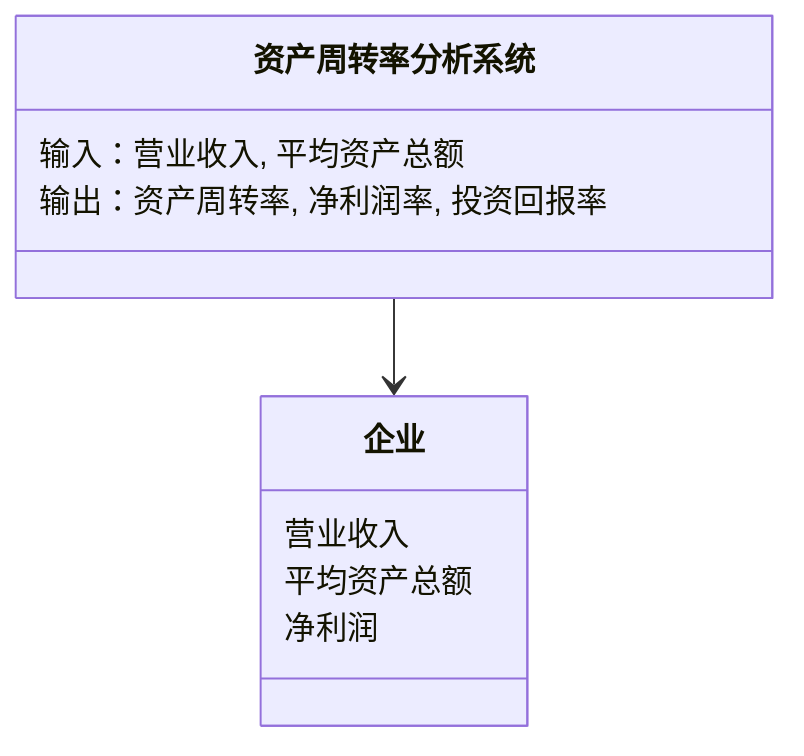
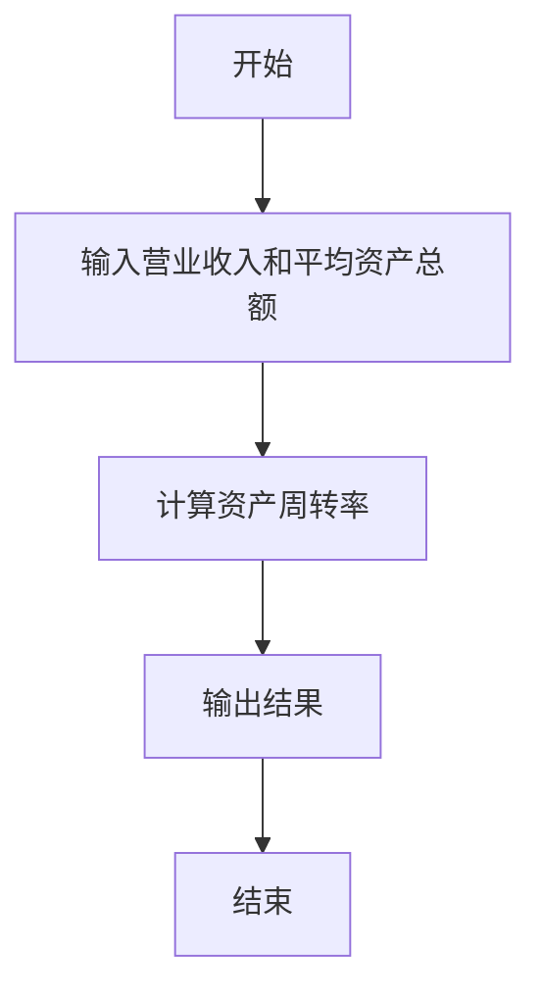

                 


# 彼得林奇对公司资产周转率趋势的分析

## 关键词：资产周转率, 彼得·林奇, 投资分析, 财务指标, 企业绩效

## 摘要：本文深入探讨了彼得·林奇如何分析公司资产周转率的趋势，结合理论与实际案例，系统地分析了资产周转率的计算方法、行业差异、数学模型以及系统架构。通过详细讲解彼得·林奇的分析框架和方法，帮助读者理解如何利用资产周转率优化企业绩效。

---

# 第一部分：资产周转率的基本概念与背景

## 第1章：资产周转率的定义与意义

### 1.1 资产周转率的定义与意义

#### 1.1.1 资产周转率的定义
资产周转率是衡量企业资产使用效率的重要财务指标，计算公式为：
$$ 资产周转率 = \frac{营业收入}{平均资产总额} $$

#### 1.1.2 资产周转率在企业绩效中的作用
资产周转率反映了企业将资产转化为收入的能力。高周转率表明企业高效利用资产，低周转率则可能意味着资产闲置或管理不善。

#### 1.1.3 资产周转率与企业竞争力的关系
资产周转率高的企业通常更具竞争力，因为它们能够更快地将投资转化为收入，从而在市场中占据优势。

### 1.2 彼得·林奇与资产周转率分析

#### 1.2.1 彼得·林奇的背景与投资理念
彼得·林奇是美国著名投资经理人，以其对基本面分析的重视而闻名。他强调通过分析财务指标来评估企业的投资价值。

#### 1.2.2 资产周转率在彼得·林奇分析体系中的地位
资产周转率是彼得·林奇分析企业效率和盈利能力的重要指标之一。他认为，资产周转率高的企业具有更强的盈利能力。

#### 1.2.3 彼得·林奇分析资产周转率的核心思想
彼得·林奇认为，资产周转率不仅反映了企业的运营效率，还与其在行业中的竞争力密切相关。他通过分析资产周转率的趋势，判断企业的长期发展潜力。

---

## 第2章：资产周转率的核心概念与计算方法

### 2.1 资产周转率的计算公式

#### 2.1.1 资产周转率的计算公式推导
资产周转率的计算公式为：
$$ 资产周转率 = \frac{营业收入}{平均资产总额} $$
其中，平均资产总额为：
$$ 平均资产总额 = \frac{年初资产总额 + 年末资产总额}{2} $$

#### 2.1.2 资产周转率与企业规模的关系
资产周转率与企业规模呈负相关关系。大型企业通常拥有更多的资产，但其周转率可能低于小型企业。

#### 2.1.3 资产周转率与行业特性的关联
不同行业的资产周转率差异显著。例如，零售业通常具有较高的资产周转率，而制造业则可能较低。

### 2.2 资产周转率的核心要素分析

#### 2.2.1 资产总额的构成与影响
资产总额包括流动资产和非流动资产。流动资产如现金、存货等对资产周转率的影响较大。

#### 2.2.2 营业收入的来源与波动
营业收入的来源和波动直接影响资产周转率。销售收入的增长可以提高资产周转率，而成本的增加则可能降低利润率。

#### 2.2.3 资产周转率与企业盈利能力的结合
资产周转率与企业盈利能力密切相关。高周转率通常意味着高盈利能力，但这也取决于行业的具体情况。

---

## 第3章：彼得·林奇的资产周转率分析方法

### 3.1 彼得·林奇的资产周转率分析框架

#### 3.1.1 分析框架的核心要素
彼得·林奇的分析框架包括资产周转率、净利润率和投资回报率三个核心指标。

#### 3.1.2 分析框架的逻辑流程
1. 计算资产周转率，评估企业的运营效率。
2. 分析净利润率，判断企业的盈利能力。
3. 综合考虑投资回报率，评估企业的整体绩效。

#### 3.1.3 分析框架的适用范围
该框架适用于制造业、零售业和科技行业等资产密集型行业。

### 3.2 彼得·林奇的资产周转率趋势分析

#### 3.2.1 趋势分析的步骤与方法
1. 收集企业的历史财务数据。
2. 计算各期资产周转率。
3. 绘制趋势图，分析波动原因。

#### 3.2.2 趋势分析的指标选择
选择资产周转率、营业收入增长率和资产总额变化率作为关键指标。

#### 3.2.3 趋势分析的案例研究
以某制造企业为例，分析其过去五年的资产周转率变化，找出影响因素并提出优化建议。

---

## 第4章：资产周转率的行业差异与企业比较

### 4.1 不同行业中的资产周转率差异

#### 4.1.1 制造业与服务业的对比
制造业的资产周转率通常低于服务业，因为制造业需要大量固定资产，而服务业的资产结构较为轻资产。

#### 4.1.2 高科技企业与传统企业的差异
高科技企业资产周转率可能较低，但其盈利能力较高，因为它们依赖知识资本而非实物资产。

#### 4.1.3 行业周期对资产周转率的影响
行业周期性波动直接影响资产周转率。例如，经济衰退期间，制造业的资产周转率可能大幅下降。

### 4.2 企业间的资产周转率比较

#### 4.2.1 同行业内的资产周转率对比
通过比较同行业内的竞争对手，找出资产周转率较高的企业作为投资目标。

#### 4.2.2 不同行业间的资产周转率差异
不同行业间的资产周转率差异显著，需结合行业特性进行分析。

#### 4.2.3 企业资产周转率的行业基准
根据行业平均水平，判断企业的资产周转率是否处于合理范围。

---

## 第5章：彼得·林奇资产周转率分析的数学模型与公式

### 5.1 资产周转率的数学模型

#### 5.1.1 资产周转率的基本公式
$$ 资产周转率 = \frac{营业收入}{平均资产总额} $$

#### 5.1.2 资产周转率的扩展公式
$$ 资产周转率 = \frac{营业收入}{(年初资产总额 + 年末资产总额)/2} $$

#### 5.1.3 资产周转率与企业绩效的关系模型
$$ 净利润率 = \frac{净利润}{营业收入} $$
$$ 投资回报率 = \frac{净利润}{平均资产总额} $$

### 5.2 彼得·林奇分析方法的数学表达

#### 5.2.1 资产周转率与净利润率的关系
$$ 净利润率 = \frac{净利润}{营业收入} $$
$$ 资产周转率 = \frac{营业收入}{平均资产总额} $$
因此，$$ 净利润率 = \frac{净利润}{平均资产总额} \times 资产周转率 $$

#### 5.2.2 投资回报率的计算
$$ 投资回报率 = \frac{净利润}{平均资产总额} $$

---

## 第6章：系统架构与算法实现

### 6.1 问题场景介绍
我们旨在构建一个基于资产周转率分析的系统，帮助投资者评估企业的运营效率和投资价值。

### 6.2 系统功能设计

#### 6.2.1 领域模型


#### 6.2.2 系统架构


### 6.3 算法实现

#### 6.3.1 Python代码实现
```python
def calculate_asset_turnover(revenue, average_assets):
    return revenue / average_assets

revenue = 1000000  # 示例收入
average_assets = 5000000  # 示例平均资产
asset_turnover = calculate_asset_turnover(revenue, average_assets)
print(f"资产周转率: {asset_turnover:.2f}")
```

#### 6.3.2 算法流程图


---

## 第7章：项目实战与案例分析

### 7.1 实际案例分析
以某制造企业为例，分析其过去五年的资产周转率变化，并提出优化建议。

### 7.2 项目小结
通过实际案例分析，验证了彼得·林奇分析方法的有效性，并展示了如何利用资产周转率优化企业绩效。

---

## 第8章：结论与建议

### 8.1 结论
彼得·林奇的资产周转率分析方法是评估企业运营效率和投资价值的重要工具。通过分析资产周转率的趋势，可以发现企业的潜在问题并制定优化策略。

### 8.2 建议
1. 投资者应结合资产周转率、净利润率和投资回报率等多种指标，全面评估企业的投资价值。
2. 企业应定期分析资产周转率，发现问题并优化资产结构，提升运营效率。

---

## 附录

### 附录A：系统架构图


### 附录B：算法流程图


### 附录C：Python代码实现
```python
def calculate_asset_turnover(revenue, average_assets):
    return revenue / average_assets

revenue = 1000000  # 示例收入
average_assets = 5000000  # 示例平均资产
asset_turnover = calculate_asset_turnover(revenue, average_assets)
print(f"资产周转率: {asset_turnover:.2f}")
```

### 附录D：数学公式
$$ 资产周转率 = \frac{营业收入}{平均资产总额} $$
$$ 净利润率 = \frac{净利润}{营业收入} $$
$$ 投资回报率 = \frac{净利润}{平均资产总额} $$

---

## 作者：AI天才研究院/AI Genius Institute & 禅与计算机程序设计艺术 /Zen And The Art of Computer Programming

---

通过以上步骤，我们详细分析了彼得·林奇对公司资产周转率趋势的分析，结合理论与实际案例，系统地探讨了资产周转率的计算方法、行业差异、数学模型以及系统架构。通过详细讲解彼得·林奇的分析框架和方法，帮助读者理解如何利用资产周转率优化企业绩效。

