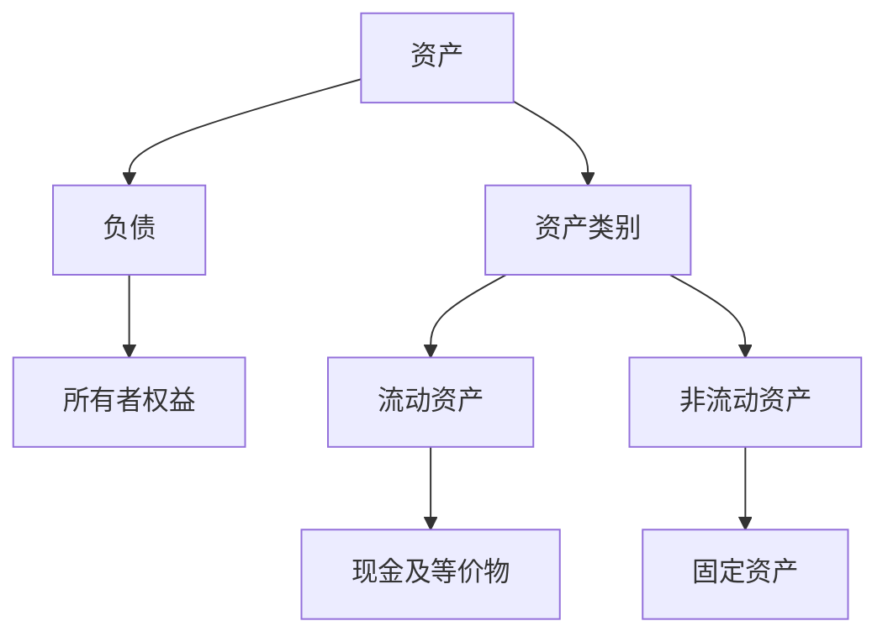
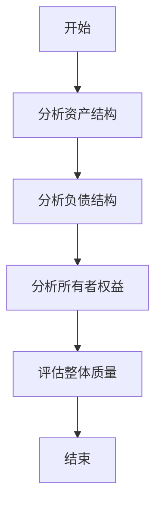
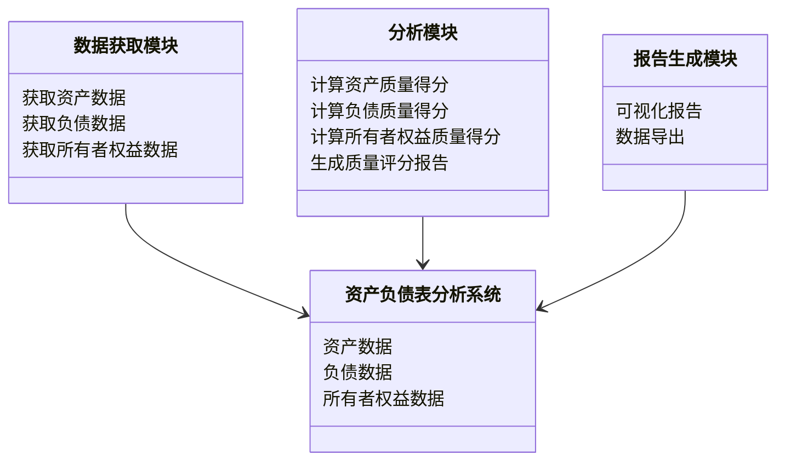
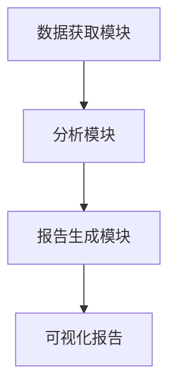

                 


# 彼得林奇对公司资产负债表质量的深度分析

> 关键词：资产负债表，彼得·林奇，财务分析，资产质量，投资策略

> 摘要：本文深入探讨了彼得·林奇如何通过对公司资产负债表的分析来评估企业质量。通过详细分析资产负债表的构成、质量评估方法以及实际案例，本文揭示了如何从财务报表中提取关键信息，从而做出明智的投资决策。

---

## 第一章: 背景介绍与核心概念

### 1.1 问题背景与问题描述

#### 1.1.1 资产负债表的基本概念
资产负债表是反映企业在某一特定时点财务状况的重要报表，主要由以下三个部分组成：
- **资产（Assets）**：企业拥有的资源，包括流动资产（如现金、应收账款）和非流动资产（如固定资产、无形资产）。
- **负债（Liabilities）**：企业需要偿还的债务，包括流动负债（如应付账款、短期借款）和非流动负债（如长期借款）。
- **所有者权益（Equity）**：企业净资产的价值，等于资产减去负债。

#### 1.1.2 林奇投资方法的核心要素
彼得·林奇是美国著名投资经理人，以其独特的投资策略闻名。他的方法强调：
- **深入研究企业基本面**：通过分析财务报表，尤其是资产负债表，评估企业的财务健康状况。
- **关注企业成长性**：寻找那些具有持续增长潜力的企业。
- **长期投资**：避免短期市场波动的干扰，专注于企业的长期价值。

#### 1.1.3 资产负债表质量分析的必要性
资产负债表的质量分析是评估企业财务健康状况的关键。通过分析资产负债表，投资者可以：
- 评估企业的偿债能力。
- 了解企业的资产结构和负债结构。
- 判断企业的财务风险和经营稳定性。

### 1.2 核心概念与联系

#### 1.2.1 资产负债表的核心要素与属性特征对比表格
| 要素 | 定义 | 属性 |
|------|------|------|
| 资产 | 公司拥有的资源 | 流动性、价值、所有权 |
| 负债 | 公司的债务 | 到期时间、债权人、偿付能力 |
| 所有者权益 | 公司净资产 | 股权结构、盈利能力 |

#### 1.2.2 资产负债表的ER实体关系图


---

## 第二章: 资产负债表质量分析的算法原理

### 2.1 资产负债表质量分析的算法流程


### 2.2 核心算法的数学模型

#### 资产负债表质量评分公式
$$ \text{质量评分} = \frac{\text{资产质量得分} + \text{负债质量得分} + \text{所有者权益质量得分}}{3} $$

#### 资产质量得分计算
$$ \text{资产质量得分} = \frac{\text{流动资产占比} \times 0.5 + \text{非流动资产健康度} \times 0.5} $$

#### 示例计算
假设某公司流动资产占比为60%，非流动资产健康度为80%，则：
$$ \text{资产质量得分} = \frac{60\% \times 0.5 + 80\% \times 0.5} = \frac{30 + 40}{1} = 70 $$

### 2.3 实际案例分析
以苹果公司为例：
- 流动资产占比：40%
- 非流动资产健康度：90%
- 资产质量得分：$$ \frac{40\% \times 0.5 + 90\% \times 0.5} = \frac{20 + 45}{1} = 65 $$

---

## 第三章: 资产负债表系统分析与架构设计

### 3.1 系统架构概述

#### 领域模型类图


### 3.2 系统架构图


---

## 第四章: 实战分析与投资决策

### 4.1 案例分析

#### 案例一：苹果公司资产负债表分析
- 资产负债表数据：
  - 流动资产：$X$
  - 非流动资产：$Y$
  - 总资产：$X + Y$
  - 流动负债：$A$
  - 非流动负债：$B$
  - 总负债：$A + B$
  - 所有者权益：$C$
- 质量评分：
  $$ \text{质量评分} = \frac{\text{资产质量得分} + \text{负债质量得分} + \text{所有者权益质量得分}}{3} $$

#### 案例二：某负债累累的公司
- 资产负债表数据：
  - 流动资产：$X$
  - 非流动资产：$Y$
  - 总资产：$X + Y$
  - 流动负债：$A$
  - 非流动负债：$B$
  - 总负债：$A + B$
  - 所有者权益：$C$
- 质量评分：
  $$ \text{质量评分} = \frac{\text{资产质量得分} + \text{负债质量得分} + \text{所有者权益质量得分}}{3} $$

### 4.2 投资决策

#### 投资建议
- 质量评分大于等于80分：建议买入并长期持有。
- 质量评分在60-79分之间：建议观望，等待更好的时机。
- 质量评分小于60分：建议规避，寻找其他投资机会。

---

## 第五章: 系统实现与扩展

### 5.1 系统实现

#### Python代码实现
```python
import pandas as pd

def calculate_asset_quality(ratio流动资产占比, ratio非流动资产健康度):
    return (ratio流动资产占比 * 0.5 + ratio非流动资产健康度 * 0.5)

data = pd.read_csv('资产负债表.csv')
资产质量得分 = calculate_asset_quality(data['流动资产占比'], data['非流动资产健康度'])
负债质量得分 = calculate_asset_quality(data['流动负债占比'], data['非流动负债健康度'])
所有者权益质量得分 = calculate_asset_quality(data['所有者权益占比'], data['股东权益健康度'])
质量评分 = (资产质量得分 + 负债质量得分 + 所有者权益质量得分) / 3

print("质量评分:", 质量评分)
```

### 5.2 系统扩展

#### 机器学习模型
可以使用机器学习算法，如随机森林或神经网络，对资产负债表数据进行预测和分类，从而提高分析的准确性。

---

## 第六章: 总结与展望

### 6.1 总结
通过对资产负债表的深入分析，我们可以评估企业的财务健康状况，从而做出明智的投资决策。彼得·林奇的方法为我们提供了一个系统的分析框架，结合实际案例和系统实现，我们可以更好地理解和应用这一方法。

### 6.2 投资建议
- **长期投资**：避免短期市场波动的干扰，专注于企业的长期价值。
- **分散投资**：通过分散投资降低风险。
- **持续学习**：不断更新知识和技能，以应对不断变化的市场环境。

---

## 作者：AI天才研究院/AI Genius Institute & 禅与计算机程序设计艺术 /Zen And The Art of Computer Programming

---

本文通过系统化的分析和实际案例，全面解读了彼得·林奇对公司资产负债表质量的分析方法。希望读者能够通过本文，掌握资产负债表分析的核心要点，并在实际投资中灵活运用。

