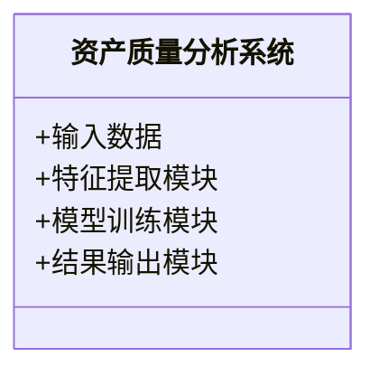
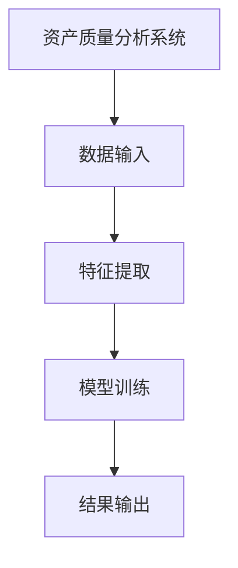

                 


# 彼得林奇对公司资产质量的深度分析

## 关键词：彼得·林奇、资产质量分析、投资策略、财务指标、公司估值

## 摘要：本文深入分析了彼得·林奇对公司资产质量的分析方法，探讨了其投资策略的核心要素，包括财务指标、行业分析、管理层评估和竞争优势分析。通过详细讲解分析框架和算法原理，结合实际案例，展示了如何应用这些方法进行公司估值和投资决策。

---

# 第一部分: 彼得·林奇与资产质量分析的背景

## 第1章: 彼得·林奇的背景与投资理念

### 1.1 彼得·林奇的生平简介
- 1.1.1 彼得·林奇的职业历程
- 1.1.2 林奇的投资哲学与方法
- 1.1.3 资产质量分析在投资中的重要性

### 1.2 资产质量分析的核心概念
- 1.2.1 资产质量的定义与分类
- 1.2.2 资产质量分析的框架
- 1.2.3 资产质量分析的边界与外延

---

# 第二部分: 资产质量分析的核心要素与框架

## 第2章: 资产质量分析的核心要素

### 2.1 资产质量的核心要素
- 2.1.1 财务指标的重要性
- 2.1.2 非财务因素的考量

### 2.2 资产质量分析的框架
- 2.2.1 行业分析与竞争地位
- 2.2.2 财务健康状况评估
- 2.2.3 管理层能力与战略

## 第3章: 林奇分析框架的构建

### 3.1 构建分析框架的步骤
- 3.1.1 确定行业地位
- 3.1.2 评估财务健康
- 3.1.3 分析管理层能力
- 3.1.4 识别竞争优势

### 3.2 分析框架的逻辑关系
- 3.2.1 行业分析与财务分析的关联
- 3.2.2 管理层评估对投资决策的影响
- 3.2.3 竞争优势的可持续性分析

---

# 第三部分: 资产质量分析的算法原理

## 第4章: 算法原理概述

### 4.1 算法的基本原理
- 4.1.1 数据收集与处理
- 4.1.2 特征提取与建模
- 4.1.3 模型训练与验证

### 4.2 算法的输入与输出
- 4.2.1 输入数据：财务指标与非财务因素
- 4.2.2 输出结果：资产质量评分与投资建议

## 第5章: 算法的数学模型与公式

### 5.1 资产质量评分模型
$$ \text{资产质量评分} = \alpha \cdot \text{ROE} + \beta \cdot \text{ROA} + \gamma \cdot \text{毛利率} $$

### 5.2 具体公式
- 5.2.1 净资产收益率（ROE）计算
$$ \text{ROE} = \frac{\text{净利润}}{\text{股东权益}} $$
- 5.2.2 资产收益率（ROA）计算
$$ \text{ROA} = \frac{\text{净利润}}{\text{总资产}} $$
- 5.2.3 毛利率计算
$$ \text{毛利率} = \frac{\text{营业收入} - \text{营业成本}}{\text{营业收入}} $$

---

# 第四部分: 系统分析与架构设计

## 第6章: 系统分析与架构设计

### 6.1 问题场景介绍
- 6.1.1 分析目标：资产质量评估
- 6.1.2 分析范围：公司财务与非财务数据
- 6.1.3 分析方法：基于林奇框架的系统分析

### 6.2 系统功能设计
- 6.2.1 领域模型 Mermaid 类图


### 6.3 系统架构设计
- 6.3.1 架构图 Mermaid


---

# 第五部分: 项目实战与案例分析

## 第7章: 项目实战

### 7.1 环境安装与配置
- 7.1.1 安装工具：Python、Jupyter、Mermaid
- 7.1.2 配置环境：数据源、库与依赖项

### 7.2 核心代码实现
- 7.2.1 数据处理
```python
import pandas as pd

# 加载数据
data = pd.read_csv('company_data.csv')

# 数据清洗
data.dropna(inplace=True)
data = data[~data['行业'].isnull()]
```

### 7.3 案例分析
- 7.3.1 某行业龙头公司分析
- 7.3.2 数据分析结果与投资建议

---

# 第六部分: 总结与扩展

## 第8章: 总结与注意事项

### 8.1 最佳实践 tips
- 8.1.1 定期更新数据与模型
- 8.1.2 结合市场变化调整分析框架
- 8.1.3 多维度验证分析结果

### 8.2 未来扩展方向
- 8.2.1 引入机器学习模型
- 8.2.2 结合ESG因素进行分析
- 8.2.3 开发自动化分析工具

## 第9章: 拓展阅读与深入思考

### 9.1 拓展阅读推荐
- 9.1.1 彼得·林奇的经典著作
- 9.1.2 资产评估与财务分析的书籍

### 9.2 深入思考与讨论
- 9.2.1 资产质量分析的局限性
- 9.2.2 如何应对市场变化与不确定性
- 9.2.3 技术进步对资产质量分析的影响

---

# 作者：AI天才研究院 & 禅与计算机程序设计艺术

