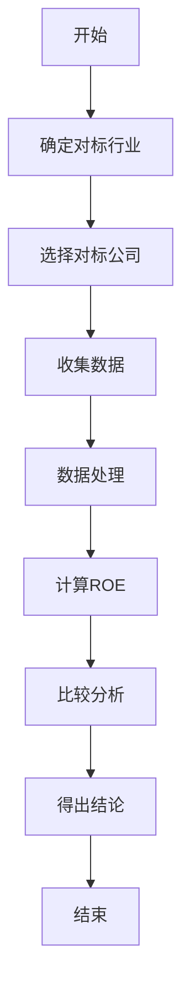

                 


# 彼得林奇对公司资本回报率的行业对标分析

---

## 关键词：资本回报率、行业对标、彼得·林奇、投资分析、财务指标

---

## 摘要：  
本文深入探讨了彼得·林奇如何通过资本回报率（ROE）进行行业对标分析，揭示其投资策略的核心逻辑和实际应用。通过分析ROE的计算方法、行业基准设定、对标公司的选择，以及如何利用这些信息做出投资决策，本文为读者提供了一套系统化的分析框架。文章结合理论与实践，详细介绍了如何利用资本回报率进行跨行业比较，评估公司投资价值，并提供了实际案例和系统设计的指导。

---

# 第1章: 资本回报率的定义与重要性

## 1.1 资本回报率的核心概念

### 1.1.1 资本回报率的定义与计算公式  
资本回报率（Return on Equity，ROE）是衡量公司盈利能力的重要指标，公式为：  
$$\text{ROE} = \frac{\text{净利润}}{\text{股东权益}}$$  
ROE反映了公司每单位股东权益创造的净利润，是评估公司管理效率和投资回报的关键指标。

### 1.1.2 资本回报率在投资决策中的作用  
ROE是投资者评估公司盈利能力的核心指标之一。高ROE通常意味着公司能够高效利用股东资金创造利润，是公司管理能力和盈利能力的体现。

### 1.1.3 彼得·林奇对资本回报率的重视  
彼得·林奇是全球著名投资专家，他强调ROE在投资分析中的重要性。他认为，ROE不仅反映了公司的盈利能力，还体现了管理层的经营效率。

## 1.2 彼得·林奇的投资理念

### 1.2.1 彼得·林奇的背景与投资风格  
彼得·林奇是富达投资集团的传奇基金经理，以长期投资、价值投资和深度研究著称。他的投资策略注重基本面分析和行业趋势。

### 1.2.2 林奇对资本回报率的关注点  
林奇认为，ROE是衡量公司投资价值的重要指标。他倾向于选择那些ROE高于行业平均水平且持续增长的公司。

### 1.2.3 林奇投资策略的核心要素  
林奇的投资策略包括：  
1. 选择ROE持续增长的公司。  
2. 重点关注行业龙头和具有竞争优势的公司。  
3. 长期持有优质资产。

## 1.3 行业对标分析的意义

### 1.3.1 什么是行业对标分析  
行业对标分析是指将目标公司与行业内的其他公司进行对比，评估其在行业中的相对位置。

### 1.3.2 行业对标分析的目的与价值  
- 识别行业内的最佳实践。  
- 发现公司的竞争优势和劣势。  
- 为投资决策提供数据支持。

### 1.3.3 行业对标与资本回报率的关系  
通过行业对标分析，可以确定目标公司的ROE是否处于行业领先水平，从而判断其投资价值。

---

# 第2章: 资本回报率的计算与分析方法

## 2.1 资本回报率的计算公式

### 2.1.1 净资产收益率（ROE）公式  
$$\text{ROE} = \frac{\text{净利润}}{\text{股东权益}}$$  
其中，股东权益 = 总资产 - 总负债。

### 2.1.2 净资产收益率的计算步骤  
1. 收集公司最近一期的财务数据。  
2. 计算净利润和股东权益。  
3. 代入公式计算ROE。

### 2.1.3 净资产收益率的优缺点  
优点：简单易懂，能够直接反映公司盈利能力。  
缺点：无法反映公司的资金使用效率，可能受行业特性影响。

## 2.2 资本回报率的行业基准

### 2.2.1 行业基准的定义与选择  
行业基准是根据行业特点设定的ROE标准，通常选择行业平均值或龙头企业作为参考。

### 2.2.2 不同行业的资本回报率差异  
不同行业由于商业模式和资产结构不同，ROE差异显著。例如，科技行业通常ROE较高，而制造业ROE可能较低。

### 2.2.3 如何确定行业基准  
- 收集行业内主要公司的ROE数据。  
- 计算行业平均值或中位数。  
- 确定行业领先水平。

## 2.3 资本回报率的比较分析

### 2.3.1 同行业公司间的资本回报率比较  
通过比较同行业公司的ROE，可以发现哪些公司具有更强的盈利能力。

### 2.3.2 跨行业公司间的资本回报率比较  
跨行业比较可以帮助识别ROE较高的公司，但需要考虑行业特性和资产结构差异。

### 2.3.3 资本回报率与公司规模的关系  
一般来说，大公司由于规模效应，ROE可能更高，但并非绝对。

---

# 第3章: 行业对标分析的核心方法

## 3.1 行业对标分析的步骤

### 3.1.1 确定对标行业  
选择与目标公司相同或相似的行业作为对标对象。

### 3.1.2 选择对标公司  
挑选行业内具有代表性的公司，尤其是龙头企业。

### 3.1.3 数据收集与处理  
收集目标公司和对标公司的ROE数据，整理并清洗数据。

### 3.1.4 分析与比较  
将目标公司的ROE与行业基准进行比较，评估其相对位置。

## 3.2 行业对标分析的工具与技巧

### 3.2.1 数据收集工具  
常用工具包括Excel、Python（Pandas库）等。

### 3.2.2 数据分析工具  
使用Python（NumPy、Matplotlib）或Excel进行数据可视化和分析。

### 3.2.3 数据处理技巧  
- 去除异常值。  
- 处理缺失值。  
- 标准化数据。

## 3.3 行业对标分析的流程图  



---

# 第4章: 资本回报率的驱动因素分析

## 4.1 净利润率的影响

### 4.1.1 净利润率的定义  
$$\text{净利润率} = \frac{\text{净利润}}{\text{营业收入}}$$  
利润率越高，ROE可能越高。

### 4.1.2 净利润率对ROE的影响  
净利润率高意味着公司盈利能力强，能够提升ROE。

## 4.2 资产周转率的影响

### 4.2.1 资产周转率的定义  
$$\text{资产周转率} = \frac{\text{营业收入}}{\text{平均资产总额}}$$  
资产周转率高意味着公司资产利用效率高。

### 4.2.2 资产周转率对ROE的影响  
资产周转率高可以提升ROE，尤其是在资产密集型行业。

## 4.3 负债的影响

### 4.3.1 负债对ROE的影响  
负债过高会增加财务风险，可能降低ROE。

### 4.3.2 杠杆效应  
适当的杠杆可以提升ROE，但过高杠杆可能引发风险。

---

# 第5章: 彼得·林奇的行业分析框架

## 5.1 林奇的行业分析方法

### 5.1.1 行业趋势分析  
分析行业发展趋势，选择处于上升期的行业。

### 5.1.2 行业竞争分析  
评估行业竞争格局，选择具有竞争优势的公司。

## 5.2 林奇的公司筛选标准

### 5.2.1 公司基本面分析  
包括收入增长、利润稳定性、资产负债表健康度等。

### 5.2.2 公司竞争优势分析  
包括市场地位、品牌影响力、技术优势等。

---

# 第6章: 系统架构与技术实现

## 6.1 系统架构设计

### 6.1.1 系统功能模块  
- 数据采集模块。  
- 数据处理模块。  
- 分析与计算模块。  
- 可视化展示模块。

### 6.1.2 系统架构图  


## 6.2 数据采集与处理

### 6.2.1 数据采集工具  
使用API接口或爬虫技术采集行业数据。

### 6.2.2 数据清洗与预处理  
去除无效数据，填补缺失值，标准化数据格式。

---

# 第7章: 项目实战与案例分析

## 7.1 实战项目介绍

### 7.1.1 项目背景  
选择一个具体行业，如科技行业，进行ROE分析。

### 7.1.2 数据来源  
使用公开的财务数据，如Yahoo Finance。

## 7.2 核心代码实现

### 7.2.1 数据加载与处理  
```python
import pandas as pd

# 加载数据
df = pd.read_csv('company_data.csv')

# 数据清洗
df = df.dropna()
df['ROE'] = df['Net Income'] / df['Equity']
```

### 7.2.2 可视化分析  
```python
import matplotlib.pyplot as plt

plt.figure(figsize=(10,6))
plt.plot(df['Company'], df['ROE'], 'b-')
plt.title('ROE Analysis')
plt.xlabel('Company')
plt.ylabel('ROE')
plt.show()
```

---

# 第8章: 总结与展望

## 8.1 本章总结  
本文系统地介绍了彼得·林奇如何通过资本回报率进行行业对标分析，并提供了实际案例和系统设计的指导。

## 8.2 未来展望  
未来，随着人工智能和大数据技术的发展，资本回报率的分析将更加智能化和精准化。

## 8.3 最佳实践tips  
- 数据质量是分析的基础。  
- 长期跟踪是投资的关键。  
- 结合行业特性进行分析。

---

# 附录

## 附录A: 术语表  
- ROE：资本回报率（Return on Equity）  
-净利润：公司利润中归属于股东的部分。  

## 附录B: 工具推荐  
- 数据处理：Pandas、Excel  
- 可视化：Matplotlib、Tableau  

## 附录C: 参考文献  
- 彼得·林奇：《彼得·林奇的股票投资策略》  
- 《财务报表分析》  

---

# 作者：AI天才研究院 & 禅与计算机程序设计艺术

