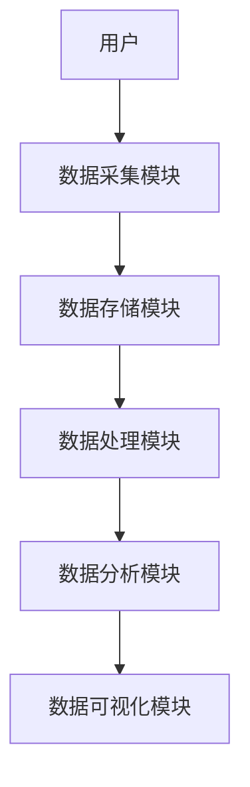

                 


# 彼得林奇对公司资本回报率的行业对标动态分析

## 关键词：资本回报率（ROE）、行业对标、彼得·林奇、动态分析、投资分析、金融指标

## 摘要：本文深入分析了彼得·林奇的资本回报率（ROE）行业对标动态分析方法，通过系统化的分析框架、数学模型和实战案例，详细阐述了ROE的计算方法、行业基准的构建、动态分析的实现步骤，以及在实际投资分析中的应用。文章从理论到实践，结合代码实现和案例分析，帮助读者全面理解和掌握资本回报率的行业对标动态分析方法。

---

## 第一部分：资本回报率（ROE）与行业对标分析基础

### 第1章：资本回报率（ROE）的基本概念

#### 1.1 ROE的定义与计算公式
ROE（Return on Equity）是衡量公司盈利能力的重要指标，公式为：

$$ROE = \frac{净利润}{股东权益}$$

ROE反映了公司每单位股东权益创造的净利润，是评估公司盈利能力的核心指标之一。

#### 1.2 行业对标分析的必要性
行业对标分析是通过将公司ROE与行业基准进行对比，评估公司相对于行业平均水平的表现。其核心作用包括：

1. 识别行业平均水平。
2. 发现公司相对于行业的优劣势。
3. 为投资决策提供数据支持。

### 第2章：彼得·林奇的ROE分析方法

#### 2.1 彼得·林奇的投资理念
彼得·林奇是著名投资经理，其核心理念是通过基本面分析寻找具有持续增长潜力的公司。他强调ROE的重要性，并通过行业对标分析筛选出具有竞争优势的公司。

#### 2.2 林奇的行业对标分析框架
林奇的行业对标分析包括以下几个步骤：

1. 确定行业基准。
2. 计算公司ROE。
3. 比较公司ROE与行业基准的差异。
4. 分析差异背后的原因。

### 第3章：ROE的动态分析方法

#### 3.1 ROE的时间序列分析
时间序列分析是通过分析公司ROE的历史数据，识别其趋势和周期性变化。步骤包括：

1. 数据收集与整理。
2. 数据清洗与预处理。
3. 数据可视化与趋势分析。

#### 3.2 行业对标动态分析的步骤
动态分析包括以下步骤：

1. 数据收集与整理。
2. 行业基准构建。
3. 动态对比与分析。

---

## 第二部分：ROE的行业对标动态分析方法

### 第4章：ROE与行业对标分析的数学模型

#### 4.1 ROE计算的数学公式
ROE的计算公式可以进一步细化为：

$$ROE = \frac{净利润}{股东权益}$$

其中，净利润和股东权益均需从公司财务报表中获取。

#### 4.2 行业对标分析的数学模型
行业基准的构建可以通过以下步骤实现：

1. 收集行业内的公司数据。
2. 计算行业平均ROE。
3. 使用回归分析优化行业基准。

### 第5章：系统分析与架构设计方案

#### 5.1 问题场景介绍
在实际投资分析中，需要解决以下问题：

1. 如何快速获取行业数据？
2. 如何构建行业基准？
3. 如何动态分析公司ROE的变化？

#### 5.2 系统功能设计
系统功能设计包括：

1. 数据采集模块。
2. 数据处理模块。
3. 数据分析模块。
4. 数据可视化模块。

#### 5.3 系统架构设计（Mermaid图）
以下是系统架构设计的Mermaid图：



---

## 第三部分：项目实战

### 第6章：项目实战

#### 6.1 环境安装与数据准备
环境安装步骤如下：

1. 安装Python。
2. 安装Pandas和Matplotlib库。

数据准备包括：

1. 收集行业数据。
2. 数据清洗与预处理。

#### 6.2 核心算法实现
以下是ROE计算的Python代码：

```python
import pandas as pd

def calculate_roe(net_profit, shareholders_equity):
    return net_profit / shareholders_equity

# 示例数据
data = {
    '公司': ['A', 'B', 'C'],
    '净利润': [100, 150, 200],
    '股东权益': [500, 600, 700]
}

df = pd.DataFrame(data)
df['ROE'] = calculate_roe(df['净利润'], df['股东权益'])
print(df)
```

#### 6.3 代码应用解读与分析
代码解读如下：

1. 使用Pandas库进行数据处理。
2. 计算每家公司的ROE，并存储在DataFrame中。
3. 输出结果。

---

## 第四部分：案例分析与详细讲解

### 第7章：案例分析与详细讲解剖析

#### 7.1 案例背景介绍
以某行业为例，分析行业内公司的ROE表现。

#### 7.2 案例分析步骤
1. 收集行业数据。
2. 计算公司ROE。
3. 构建行业基准。
4. 进行动态分析。

---

## 第五部分：最佳实践与小结

### 第8章：最佳实践 tips

1. 数据来源要可靠。
2. 行业基准要动态更新。
3. 分析结果要结合公司基本面。

### 第9章：小结与注意事项

1. 本文详细讲解了彼得·林奇的ROE行业对标动态分析方法。
2. 提供了完整的系统架构设计和代码实现。
3. 强调了数据质量和行业基准的重要性。

---

## 作者信息

作者：AI天才研究院/AI Genius Institute & 禅与计算机程序设计艺术 /Zen And The Art of Computer Programming

---

通过本文的系统化分析，读者可以全面掌握彼得·林奇的ROE行业对标动态分析方法，并在实际投资分析中加以应用。

