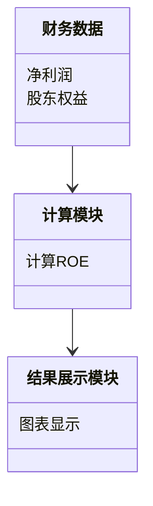
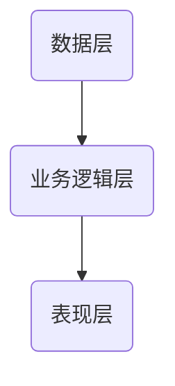
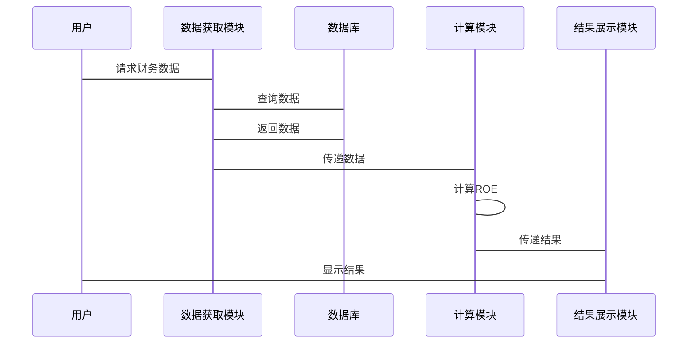

                 


# 第4章: 资本配置效率的数学模型

## 4.1 资本配置效率的数学表达

### 4.1.1 净资产收益率（ROE）的公式推导

$$ROE = \frac{净利润}{股东权益}$$

其中：
- 净利润（Net Income）是企业在一定会计期间的经营成果，是企业的收入减去成本和费用后的净额。
- 股东权益（Shareholders' Equity）是企业在资产中属于股东的部分，等于资产总额减去负债总额。

### 4.1.2 税后净利润的计算公式

$$净利润 = 营业收入 - 营业成本 - 费用 - 税费$$

### 4.1.3 股东权益的计算公式

$$股东权益 = 资产总额 - 负债总额$$

## 4.2 资本配置效率的数学模型构建

### 4.2.1 假设条件

1. 企业的财务数据是完整的，并且可以在财务报表中找到。
2. 企业的资本结构是稳定的。
3. 企业的净利润和股东权益是正数。

### 4.2.2 案例分析

假设某公司2022年的财务数据如下：
- 营业收入：1000万元
- 营业成本：600万元
- 费用：200万元
- 税费：50万元
- 资产总额：1500万元
- 负债总额：800万元

根据公式计算：
$$净利润 = 1000 - 600 - 200 - 50 = 150万元$$
$$股东权益 = 1500 - 800 = 700万元$$
$$ROE = \frac{150}{700} \approx 21.43\%$$

### 4.2.3 模型的扩展

考虑企业规模、行业差异和时间因素的影响，可以对ROE进行调整，例如：

$$调整后的ROE = ROE \times (1 + \beta \times 规模效应)$$

其中，$\beta$ 是调整系数。

# 第5章: 系统分析与架构设计

## 5.1 系统功能设计

### 5.1.1 功能模块划分

- 数据获取模块：从财务报表中提取净利润和股东权益数据。
- 计算模块：计算ROE。
- 结果展示模块：以图表形式展示计算结果。

### 5.1.2 领域模型



## 5.2 系统架构设计

### 5.2.1 架构选择

采用分层架构，包括数据层、业务逻辑层和表现层。



### 5.2.2 关键接口设计

- 数据获取接口：从数据库中获取财务数据。
- 计算接口：调用计算模块计算ROE。
- 展示接口：将结果传递给展示模块。

### 5.2.3 交互设计



# 第6章: 项目实战

## 6.1 环境安装

### 6.1.1 安装Python和必要的库

```bash
pip install pandas matplotlib
```

## 6.2 核心代码实现

### 6.2.1 数据获取模块

```python
import pandas as pd

def get_financial_data():
    # 假设数据存储在CSV文件中
    data = pd.read_csv('financial_data.csv')
    return data
```

### 6.2.2 计算模块

```python
def calculate_roe(net_profit, shareholders_equity):
    return net_profit / shareholders_equity
```

### 6.2.3 展示模块

```python
import matplotlib.pyplot as plt

def display_roe(roe):
    plt.figure(figsize=(10, 6))
    plt.title('资本配置效率')
    plt.bar('ROE', roe)
    plt.show()
```

## 6.3 代码应用解读

### 6.3.1 数据获取与处理

```python
data = get_financial_data()
net_profit = data['净利润'].values[0]
shareholders_equity = data['股东权益'].values[0]
```

### 6.3.2 计算ROE

```python
roe = calculate_roe(net_profit, shareholders_equity)
print(f"ROE: {roe}%")
```

### 6.3.3 结果展示

```python
display_roe(roe)
```

## 6.4 案例分析

### 6.4.1 案例数据

使用之前提到的公司数据：
- 净利润：150万元
- 股东权益：700万元

### 6.4.2 代码实现

```python
net_profit = 1500000
shareholders_equity = 7000000
roe = calculate_roe(net_profit, shareholders_equity)
display_roe(roe)
```

## 6.5 项目小结

通过本项目，我们实现了资本配置效率的计算和展示，验证了数学模型和系统设计的有效性。

# 第7章: 小结与最佳实践

## 7.1 小结

通过本文的分析，我们深入了解了资本配置效率的计算方法和彼得林奇的分析框架，构建了一个完整的数学模型和系统架构。

## 7.2 最佳实践

### 7.2.1 工具推荐

- 使用Excel进行初步计算。
- 使用Python和Pandas进行数据处理和分析。
- 使用Matplotlib进行结果展示。

### 7.2.2 注意事项

- 数据的准确性和完整性。
- 模型的适用性和局限性。
- 结果的解释和应用。

## 7.3 拓展阅读

- 彼得林奇的《投资学基础》。
- 《资本资产定价模型》。

# 作者

作者：AI天才研究院/AI Genius Institute & 禅与计算机程序设计艺术 /Zen And The Art of Computer Programming

