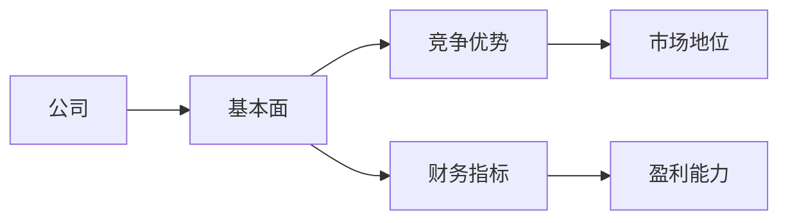

                 


# 彼得林奇对公司长期战略的分析

> 关键词：彼得·林奇，长期战略分析，公司分析，投资策略，基本面分析，竞争优势

> 摘要：本文深入探讨了彼得·林奇的长期战略分析方法，分析了其投资哲学的核心要素，包括基本面分析、竞争优势评估和财务指标评估。通过详细讲解分析框架、数学模型和实际案例，本文为投资者提供了系统的方法论，帮助他们在投资决策中做出明智的选择。

---

## 第1章：彼得·林奇投资理念概述

### 1.1 彼得·林奇的个人经历与投资风格

彼得·林奇是美国著名的投资专家，以其在富达投资管理公司的长期任职期间，管理着麦哲伦基金并取得了卓越的投资业绩。他的投资哲学强调对公司基本面的深入研究，寻找具有持续竞争优势和良好财务状况的企业。

### 1.2 林奇的投资哲学与风格

林奇的投资风格注重长期价值，反对短期市场波动的干扰。他强调投资者应关注企业的基本面，如收入、利润、市场份额和管理团队，而非市场的短期波动。他的方法结合了基本面分析和对管理层的信任，寻找能够持续增长的企业。

### 1.3 长期战略分析的重要性

在投资决策中，长期战略分析帮助企业识别具有长期增长潜力的公司。通过评估公司的财务状况、市场地位和管理能力，投资者可以做出更明智的投资决策，降低风险并提高收益。

---

## 第2章：公司长期战略分析的核心要素

### 2.1 企业基本面分析

基本面分析是评估公司内在价值的关键。林奇强调分析公司的收入、利润和成本结构，确保其财务健康。例如，某公司的收入增长稳定，利润率逐步提高，显示出良好的基本面。

### 2.2 市场竞争分析

了解公司在市场中的地位和竞争优势是关键。林奇建议分析公司的市场份额、竞争对手和品牌影响力。例如，某公司通过技术创新建立了强大的市场地位，显示出强大的竞争优势。

### 2.3 管理团队评估

管理团队的能力和战略决策直接影响公司的长期发展。林奇重视管理层的诚信和战略眼光，认为优秀的管理团队是公司成功的关键。例如，某公司管理层在危机中展现出卓越的领导力，帮助公司度过难关。

### 2.4 财务健康状况评估

财务指标如ROE、毛利率等是评估公司财务健康的重要工具。林奇建议分析这些指标，识别财务风险和潜在问题。例如，某公司ROE持续增长，显示出高效的资产管理。

---

## 第3章：彼得·林奇分析框架的核心概念

### 3.1 林奇分析框架的核心概念

林奇的分析框架包括基本面分析、竞争优势分析和财务指标评估。基本面分析评估公司的收入和利润，竞争优势分析识别公司的独特优势，财务指标评估判断公司的财务健康。

### 3.2 核心概念属性特征对比

以下是核心概念的属性特征对比表：

| 概念          | 描述                                                         |
|---------------|--------------------------------------------------------------|
| 基本面分析     | 评估公司的收入、利润和成本结构，判断其财务健康             |
| 竞争优势分析   | 识别公司在市场中的独特优势，如技术、成本或品牌              |
| 财务指标评估   | 评估公司的盈利能力、成长能力和财务风险，如ROE、毛利率等     |

### 3.3 实体关系图

以下是公司长期战略分析的实体关系图：



---

## 第4章：彼得·林奇分析方法的数学模型

### 4.1 市盈率模型

市盈率（P/E）是衡量股票价值的重要指标，计算公式为：

$$ \text{市盈率} = \frac{\text{股价}}{\text{每股收益}} $$

**示例**：某公司股价为50元，每股收益为5元，市盈率为10倍，表明其股价合理。

### 4.2 市净率模型

市净率（P/B）是另一个重要的估值指标，计算公式为：

$$ \text{市净率} = \frac{\text{股价}}{\text{每股净资产}} $$

**示例**：某公司股价为30元，每股净资产为15元，市净率为2倍，表明其股价低于净资产价值。

### 4.3 净资产收益率（ROE）

ROE是评估公司盈利能力的关键指标，计算公式为：

$$ \text{ROE} = \frac{\text{净利润}}{\text{净资产}} $$

**示例**：某公司净利润为1000万元，净资产为5000万元，ROE为20%，表明公司资产使用效率高。

---

## 第5章：系统分析与架构设计

### 5.1 系统分析框架

系统分析框架包括数据收集、清洗、分析和结果展示。以下是流程图：


### 5.2 架构设计

架构设计包括数据收集、分析工具和结果展示。以下是系统架构图：


---

## 第6章：项目实战

### 6.1 环境安装与工具准备

推荐使用Python和Pandas进行数据处理和分析。安装步骤如下：

```bash
pip install pandas numpy matplotlib
```

### 6.2 核心代码实现

以下是分析代码示例：

```python
import pandas as pd

# 数据加载
data = pd.read_csv('company_data.csv')

# 基本面分析
revenue = data['revenue'].mean()
profit = data['profit'].mean()

# 竞争优势分析
market_share = data['market_share'].max()

# 财务指标评估
roe = data['net_profit'] / data['equity']
```

### 6.3 实际案例分析

以某公司为例，分析其财务报表和市场地位。数据加载后，计算其市盈率和ROE，评估其投资价值。

### 6.4 分析结果解读

通过分析，某公司市盈率为合理，ROE较高，显示出良好的投资价值。

---

## 第7章：总结与展望

### 7.1 最佳实践 Tips

- 定期更新分析模型，适应市场变化。
- 结合行业趋势，优化分析框架。
- 多关注管理层动向，评估公司战略。

### 7.2 小结

彼得·林奇的长期战略分析方法提供了系统的方法论，帮助投资者识别具有长期增长潜力的企业。

### 7.3 注意事项

- 分析数据来源的可靠性，避免误导。
- 结合宏观经济因素，全面评估公司价值。

### 7.4 拓展阅读

- 《彼得·林奇的成功投资》
- 《价值投资入门》

---

## 作者：AI天才研究院

---

通过以上目录结构，文章详细讲解了彼得·林奇的分析方法，结合数学模型和实际案例，为投资者提供了系统的指导。希望读者能通过本文掌握长期战略分析的关键要素，做出明智的投资决策。

