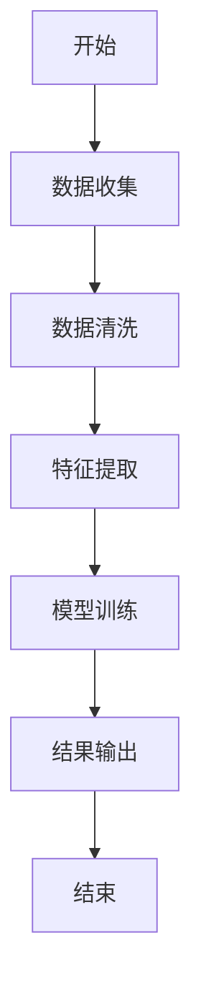

                 


# 彼得林奇对公司非财务报告质量的评估方法

> 关键词：非财务报告、彼得林奇、质量评估、投资分析、企业治理

> 摘要：本文深入探讨了彼得·林奇在评估公司非财务报告质量方面的方法，分析了非财务报告的核心概念、评估框架、算法原理及系统架构，结合实际案例，总结了最佳实践。

---

## 第一部分：非财务报告质量评估的背景与重要性

### 第1章：非财务报告的基本概念

#### 1.1 非财务报告的定义

非财务报告是指公司提供的除财务报表之外的其他重要信息，包括管理层讨论与分析（MD&A）、企业社会责任报告、战略规划等。这些报告通常包含定性信息，如公司战略、管理层观点和风险因素。

#### 1.2 非财务报告的分类

非财务报告可以分为内部报告和外部报告：
- **内部报告**：用于内部管理决策，如内部审计报告、项目进度报告。
- **外部报告**：供外部利益相关者使用，如投资者报告、社会责任报告。

#### 1.3 非财务报告在企业中的作用

- **外部透明度**：向投资者、债权人提供公司运营状况。
- **内部管理**：帮助管理层识别问题，优化决策。
- **战略规划**：支持公司长期战略的制定和实施。

---

### 第2章：非财务报告质量评估的重要性

#### 2.1 投资者视角下的非财务信息价值

- **信息完整性**：全面反映公司财务状况和经营成果。
- **信息准确性**：数据真实可靠，避免误导投资者。
- **信息相关性**：信息对投资决策具有实际参考价值。

#### 2.2 企业内部管理中的非财务报告应用

- **风险管理**：识别潜在风险，制定应对策略。
- **绩效评估**：衡量部门或项目的执行情况。
- **战略调整**：根据反馈优化公司战略。

#### 2.3 非财务报告质量与企业价值的关系

高质量的非财务报告能够增强投资者信心，提升企业价值。反之，低质量的报告可能导致投资者误判，影响企业市值。

---

## 第二部分：非财务报告质量评估的核心概念与框架

### 第3章：非财务报告质量评估的核心概念

#### 3.1 信息完整性

- 定义：报告是否涵盖了所有关键信息。
- 重要性：确保投资者全面了解公司情况。

#### 3.2 信息准确性

- 定义：报告数据的正确性和可靠性。
- 重要性：避免误导投资者，维护企业信誉。

#### 3.3 信息相关性

- 定义：信息对投资决策的有用程度。
- 重要性：帮助投资者做出明智决策。

---

### 第4章：非财务报告质量评估的框架

#### 4.1 评估框架的构建

- **步骤**：数据收集、分析、评估、反馈。
- **工具**：使用数据分析软件进行辅助评估。

#### 4.2 评估指标的选择

- **关键指标**：信息完整性、准确性、相关性。
- **指标对比表**

| 指标       | 描述                         | 重要性 |
|------------|------------------------------|--------|
| 完整性     | 报告内容的全面性             | 高     |
| 准确性     | 数据的正确性                 | 高     |
| 相关性     | 信息对决策的有用性           | 高     |

#### 4.3 评估流程的优化

- **流程图**：展示从数据收集到结果输出的完整流程。



---

## 第三部分：非财务报告质量评估的算法原理

### 第5章：评估算法的概述

#### 5.1 算法的基本原理

- **加权评分法**：对不同指标赋予不同权重，计算综合质量评分。

#### 5.2 算法的数学模型

质量评分公式：

$$
\text{质量评分} = \alpha \times \text{完整性} + \beta \times \text{准确性} + \gamma \times \text{相关性}
$$

其中，$\alpha + \beta + \gamma = 1$，权重根据具体情况进行调整。

#### 5.3 算法的实现代码

```python
def quality_score(completeness, accuracy, relevance):
    alpha = 0.4
    beta = 0.3
    gamma = 0.3
    return alpha * completeness + beta * accuracy + gamma * relevance

# 示例
score = quality_score(0.8, 0.7, 0.9)
print(score)
```

---

## 第四部分：系统分析与架构设计方案

### 第6章：系统功能设计

#### 6.1 问题场景介绍

- **目标**：开发一个非财务报告质量评估系统。
- **用户角色**：投资者、企业管理人员。

#### 6.2 系统功能模块

- **数据采集模块**：收集非财务报告数据。
- **评估模块**：计算质量评分。
- **报告生成模块**：输出评估结果。

#### 6.3 系统架构设计


---

## 第五部分：项目实战

### 第7章：非财务报告质量评估的实战分析

#### 7.1 项目背景

- **案例公司**：假设一家科技公司，分析其非财务报告。

#### 7.2 数据采集与清洗

- 使用Python脚本从公司官网下载报告，清洗数据。

#### 7.3 评估与分析

- 应用算法计算质量评分，识别报告中的不足。

#### 7.4 改进建议

- 提高信息完整性，增加管理层讨论内容。
- 确保数据准确性，更新过时信息。

---

## 第六部分：总结与展望

### 6.1 最佳实践 Tips

- **定期评估**：持续监控报告质量。
- **数据可视化**：用图表展示评估结果，便于理解。
- **结合人工审核**：算法评估与人工审核相结合，确保准确性。

### 6.2 小结

彼得林奇的非财务报告质量评估方法为投资者提供了重要的参考，企业应重视报告质量，提升透明度和信任度。

### 6.3 注意事项

- **数据隐私**：确保数据安全，遵守相关法规。
- **模型优化**：根据实际情况调整算法参数。

### 6.4 拓展阅读

- 推荐阅读《彼得林奇的投资哲学》深入理解其投资理念。

---

## 作者：AI天才研究院 & 禅与计算机程序设计艺术

通过以上结构，文章详细探讨了彼得林奇的非财务报告评估方法，结合理论与实践，为读者提供了全面的指导。

