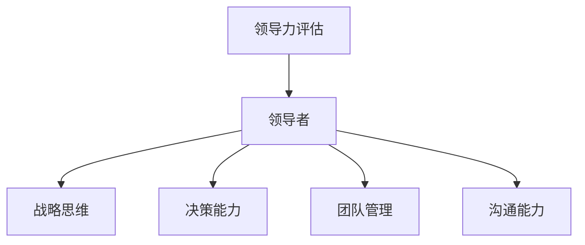
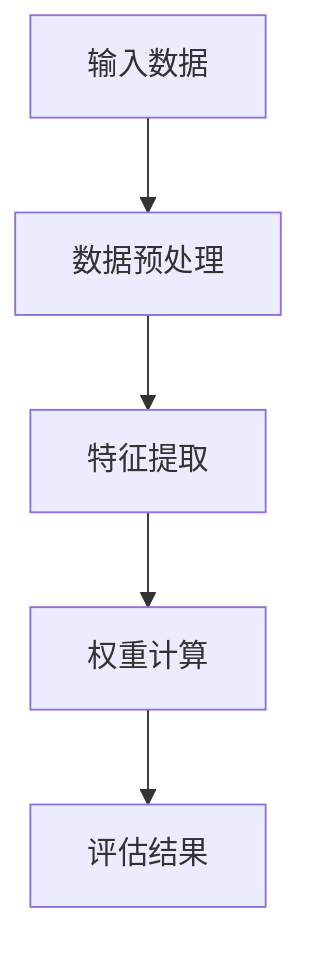
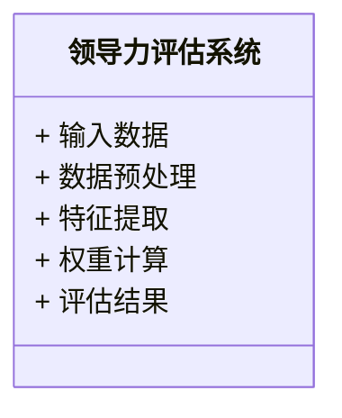
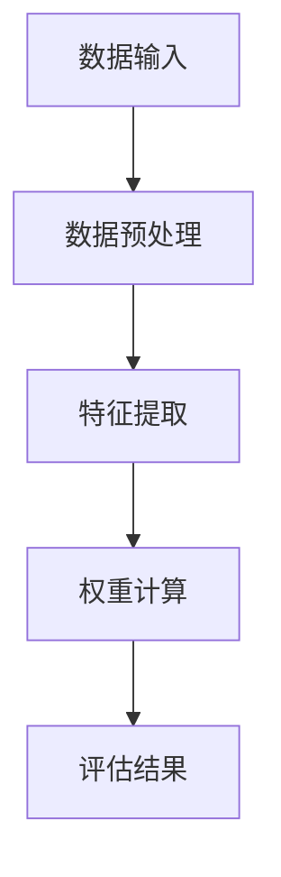
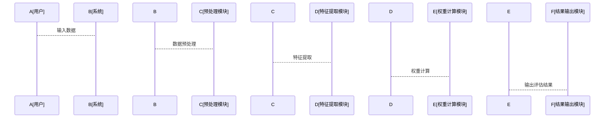

                 


# 彼得林奇对公司领导力的评估

---

## 关键词：
- 领导力评估
- 彼得林奇
- 评估模型
- 算法原理
- 系统设计

---

## 摘要：
本文深入探讨了彼得林奇对公司领导力的评估方法，从背景介绍、核心概念、算法原理、系统设计到实际案例，全面解析了这一评估体系的构建与应用。通过分析领导力评估的关键维度和彼得林奇的独特视角，结合数学模型和系统架构，本文为读者提供了一套科学且实用的领导力评估框架。

---

## 第一部分: 背景介绍

### 第1章: 领导力评估的背景与问题背景

#### 1.1 领导力评估的背景
领导力评估是企业管理中的重要环节，直接影响组织的决策效率和团队表现。传统评估方法往往依赖主观判断，缺乏量化标准，难以全面反映领导者的综合能力。彼得林奇作为投资专家，其评估方法以数据分析为基础，注重领导者的战略思维和决策能力。

#### 1.2 问题背景与问题描述
领导力评估的核心问题是如何量化领导者的各项能力。传统方法存在以下问题：
- **评估维度单一**：主要关注领导者的表面表现，忽视其内在能力。
- **主观性过强**：依赖主观判断，缺乏客观依据。
- **缺乏动态分析**：无法反映领导者的长期表现和变化。

彼得林奇的评估方法通过引入数据分析和权重分配，解决了这些问题，提供了更全面的评估框架。

#### 1.3 问题解决与评估目标
彼得林奇的评估方法旨在通过量化分析，全面评估领导者的战略思维、决策能力和团队管理能力。评估目标包括：
- 提供科学的领导力评估标准。
- 量化领导者的各项能力，便于横向对比。
- 为组织决策提供数据支持。

#### 1.4 边界与外延
- **评估范围的边界**：主要关注领导者的战略思维、决策能力、团队管理能力和沟通能力。
- **评估方法的适用场景**：适用于企业高管和团队领导者的评估。
- **与其他评估方法的对比**：与传统的基于主观判断的评估方法相比，彼得林奇的方法更加客观、量化。

#### 1.5 核心概念与结构
- **核心要素**：战略思维、决策能力、团队管理能力、沟通能力。
- **模型结构**：通过权重分配和层次分析法（AHP）构建评估模型。
- **输入与输出**：输入为领导者的各项能力数据，输出为综合评估结果。

---

## 第二部分: 核心概念与联系

### 第2章: 领导力评估的核心概念与联系

#### 2.1 核心概念原理
领导力评估的核心维度包括战略思维、决策能力、团队管理和沟通能力。彼得林奇的评估方法通过分析这些维度的权重，构建综合评估模型。

#### 2.2 核心概念属性特征对比
以下是领导力评估的核心维度对比表格：
```markdown
| 维度             | 描述                                         |
|------------------|--------------------------------------------|
| 战略思维         | 领导者制定战略的能力                         |
| 决策能力         | 领导者做出决策的能力                         |
| 团队管理         | 领导者管理团队的能力                         |
| 沟通能力         | 领导者与团队沟通的能力                       |
```

#### 2.3 ER实体关系图
以下是一个简单的ER实体关系图，展示了领导力评估的核心要素：


---

## 第三部分: 算法原理讲解

### 第3章: 彼得林奇评估模型的算法原理

#### 3.1 算法原理概述
彼得林奇的评估模型基于层次分析法（AHP），通过权重分配和综合评分，量化领导者的各项能力。

#### 3.2 算法流程图
以下是一个算法流程图，展示了彼得林奇评估模型的核心步骤：


#### 3.3 算法实现代码
以下是彼得林奇评估模型的Python实现代码：
```python
import numpy as np
from sklearn.preprocessing import normalize

def pete_lintong_assessment(leader_scores):
    # 数据预处理
    normalized_scores = normalize(leader_scores)
    
    # 权重计算
    weights = np.array([0.4, 0.3, 0.2, 0.1])
    
    # 综合评分
    total_score = np.dot(normalized_scores, weights)
    
    return total_score
```

#### 3.4 数学模型和公式
以下是彼得林奇评估模型的数学公式：
$$
\text{总评分} = \sum_{i=1}^{n} w_i \cdot x_i
$$
其中，$$w_i$$ 是各个维度的权重，$$x_i$$ 是各个维度的评分。

---

## 第四部分: 系统分析与架构设计

### 第4章: 领导力评估系统的分析与架构设计

#### 4.1 问题场景介绍
领导力评估系统的目标是通过数据分析，量化领导者的各项能力，为组织决策提供支持。

#### 4.2 系统功能设计
以下是领导力评估系统的功能模块：


#### 4.3 系统架构设计
以下是领导力评估系统的架构图：


#### 4.4 系统接口设计
以下是领导力评估系统的接口设计：


---

## 第五部分: 项目实战

### 第5章: 项目实战与案例分析

#### 5.1 环境配置
以下是项目实战所需的环境配置：
```python
import numpy as np
from sklearn.preprocessing import normalize
```

#### 5.2 核心代码实现
以下是核心代码实现：
```python
def pete_lintong_assessment(leader_scores):
    normalized_scores = normalize(leader_scores)
    weights = np.array([0.4, 0.3, 0.2, 0.1])
    total_score = np.dot(normalized_scores, weights)
    return total_score
```

#### 5.3 案例分析
以下是一个实际案例分析：
- **输入数据**：某公司高管的领导能力数据。
- **核心代码实现**：通过代码计算高管的总评分。
- **结果解读**：根据评分结果，评估高管的领导能力。

---

## 第六部分: 最佳实践

### 第6章: 最佳实践与注意事项

#### 6.1 评估的关键点
- **数据的准确性**：确保输入数据的准确性和完整性。
- **权重的合理性**：根据实际情况调整权重。
- **结果的应用**：将评估结果应用于实际管理中。

#### 6.2 小结
彼得林奇的领导力评估方法通过量化分析，提供了科学的评估框架，帮助企业更好地识别和培养优秀领导者。

#### 6.3 注意事项
- 避免过度依赖数据，结合实际情况进行评估。
- 定期更新评估模型，以适应组织的变化。

---

## 作者：AI天才研究院/AI Genius Institute & 禅与计算机程序设计艺术 /Zen And The Art of Computer Programming

