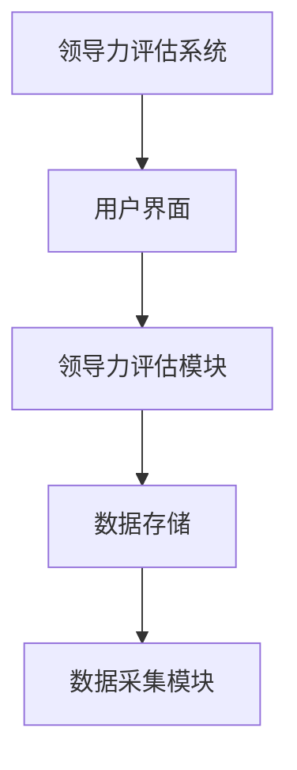
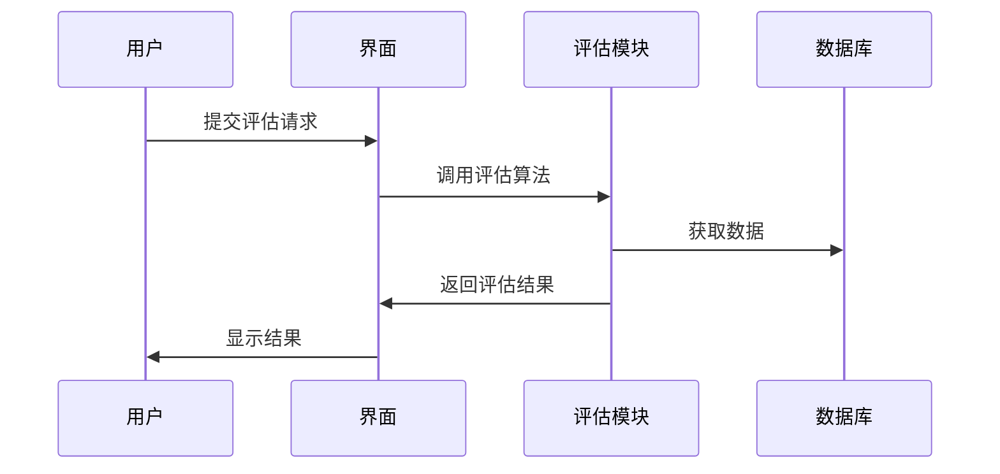

                 


# 彼得·林奇对公司领导力的评估方法

## 关键词：公司领导力、彼得·林奇、评估方法、算法、系统架构、案例分析

## 摘要：  
彼得·林奇作为投资界的传奇人物，其对公司领导力的评估方法不仅深刻影响了投资决策，也为现代公司管理提供了独特的视角。本文将结合投资学与现代技术，系统地分析和探讨如何通过技术手段实现对领导力的科学评估。从背景介绍、核心概念到算法原理、系统架构，再到实际案例分析，本文旨在为读者提供一个全面、深入且实用的领导力评估方法论。

---

## 第1章: 公司领导力评估的背景与问题背景

### 1.1 领导力评估的重要性  
领导力是企业成功的关键因素之一。有效的领导力评估能够帮助企业识别优秀领导者，优化管理结构，并提升整体绩效。  

#### 1.1.1 领导力在公司管理中的核心地位  
领导力决定了团队目标的实现、员工凝聚力以及企业的创新能力。  

#### 1.1.2 领导力评估的必要性与挑战  
- **必要性**：通过评估领导者的能力，企业可以做出更明智的人事决策。  
- **挑战**：领导力的复杂性和多样性使得评估难度较大，传统方法往往不够量化。  

#### 1.1.3 彼得·林奇的领导力评估视角  
林奇将领导力视为企业价值的核心，其评估方法结合了投资学的逻辑，注重领导者的决策能力和长期战略眼光。  

### 1.2 领导力评估的核心问题  
- **定义与范围**：明确领导力评估的边界和适用场景。  
- **关键维度**：包括领导者的决策能力、团队管理能力、创新能力和执行力。  
- **传统方法的局限性**：传统评估方法主观性强，难以量化。  

---

## 第2章: 彼得·林奇领导力评估的核心框架

### 2.1 林奇领导力评估模型  
林奇模型基于投资学原理，将领导力分解为多个可量化的维度。  

#### 2.1.1 模型的构成与核心要素  
- **决策能力**：领导者在复杂环境中的决策效率和准确性。  
- **团队管理**：领导者如何激发团队潜能。  
- **创新能力**：领导者推动变革的能力。  
- **执行力**：领导者将战略转化为结果的能力。  

#### 2.1.2 各评估维度的权重分配  
权重分配基于企业目标和行业特点，通常采用加权评分系统。  

#### 2.1.3 模型的适用场景与边界  
适用于中高层管理者评估，尤其适合需要长期战略规划的企业。  

### 2.2 核心概念与联系  
通过对比分析表和ER实体关系图，展示领导力评估的关键维度及其相互关系。  

#### 2.2.1 领导力评估的核心概念原理  
领导力评估不仅仅是对个人能力的判断，更是对企业未来发展潜力的预测。  

#### 2.2.2 关键维度对比分析表  
| 维度    | 评估标准        | 权重（%） |
|---------|-----------------|-----------|
| 决策能力 | 决策速度与质量  | 30        |
| 团队管理 | 团队凝聚力与绩效 | 25        |
| 创新能力 | 创新成果与思路  | 20        |
| 执行力   | 任务完成度      | 25        |  

#### 2.2.3 ER实体关系图架构（Mermaid流程图）  
```mermaid
erd
  顾客: 领导者
  属性: ID, 决策能力, 团队管理, 创新能力, 执行力
  关系: 领导者 -> 评估结果
```

---

## 第3章: 林奇领导力评估的算法原理

### 3.1 评估算法的数学模型  
采用加权评分系统，结合模糊评价方法，将领导力各维度进行量化评估。  

#### 3.1.1 加权评分系统  
$$ 总分 = \sum_{i=1}^{n} (权重_i \times 评分_i) $$  

#### 3.1.2 综合评分计算公式  
$$ 综合评分 = \frac{\sum (权重_i \times 评分_i)}{\sum 权重_i} $$  

#### 3.1.3 模糊评价的处理方法  
通过模糊数学方法，将主观评分转化为可量化的指标。  

### 3.2 算法实现的Python代码  
以下代码实现了一个简单的领导力评估算法：  

```python
def leadership_score(weights, scores):
    total = 0
    for weight, score in zip(weights, scores):
        total += weight * score
    return total / sum(weights)

# 示例
weights = [0.3, 0.25, 0.2, 0.25]
scores = [0.8, 0.7, 0.6, 0.7]
print(leadership_score(weights, scores))  # 输出：0.71
```

---

## 第4章: 系统分析与架构设计方案

### 4.1 问题场景介绍  
构建一个领导力评估系统，帮助企业在招聘、晋升和培训中做出更明智的决策。  

### 4.2 系统功能设计  
- **领导力评估模块**：基于林奇模型进行评分。  
- **数据采集模块**：收集领导者的行为数据。  
- **结果展示模块**：以可视化形式呈现评估结果。  

### 4.3 系统架构设计（Mermaid架构图）  


### 4.4 系统接口设计  
- **数据接口**：从数据库读取评估数据。  
- **评估结果输出接口**：将结果返回给用户界面。  
- **用户交互接口**：收集用户输入并反馈结果。  

### 4.5 系统交互设计（Mermaid序列图）  


---

## 第5章: 项目实战与案例分析

### 5.1 环境安装与配置  
安装Python、数据分析库（如Pandas）和可视化工具（如Matplotlib）。  

### 5.2 核心代码实现  
实现领导力评估算法并集成到系统中。  

### 5.3 实际案例分析  
通过一个中型企业的案例，展示如何利用林奇模型进行领导力评估，并分析结果对企业管理的影响。  

---

## 第6章: 最佳实践与小结

### 6.1 实施中的注意事项  
- 数据质量是评估结果的关键。  
- 模型调优需要结合企业实际情况。  

### 6.2 实战经验总结  
- 领导力评估应注重长期效果。  
- 结合企业文化进行个性化调整。  

### 6.3 未来展望与拓展阅读  
- 探索更多领导力评估模型。  
- 结合AI技术提升评估的智能化水平。  

---

## 作者：AI天才研究院 & 禅与计算机程序设计艺术

## 标签：#领导力 #彼得·林奇 #评估方法 #算法 #系统架构 #案例分析

