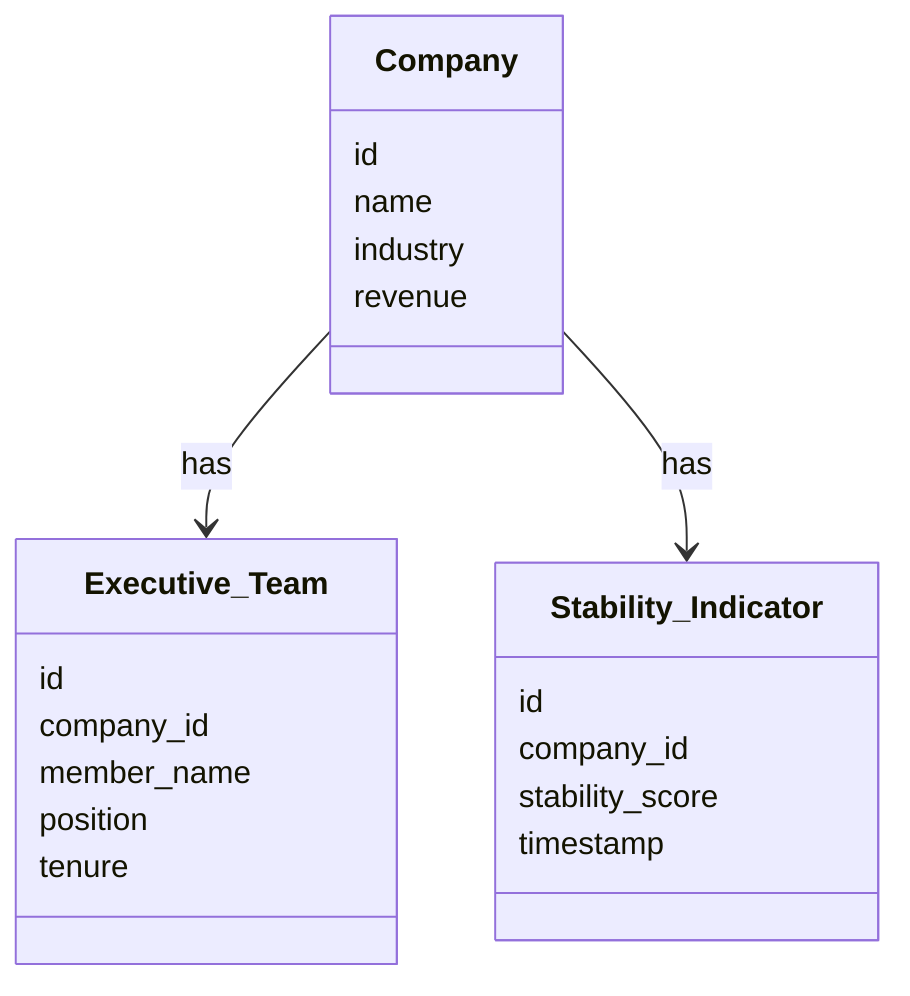
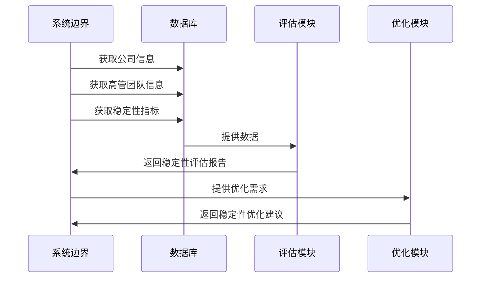

                 


# 彼得林奇对公司高管团队稳定性的长期影响分析

> 关键词：彼得林奇，高管团队稳定性，公司治理，长期影响，投资策略

> 摘要：本文从彼得林奇的投资哲学出发，分析其对公司高管团队稳定性的长期影响。通过探讨高管团队稳定性对企业发展的重要性，结合彼得林奇的公司治理理念，提出高管团队稳定性评估模型，并通过案例分析验证其有效性，最后总结高管团队稳定性对公司的长期影响。

---

# 第一部分：引言

## 第1章：研究背景与意义

### 1.1 研究背景

#### 1.1.1 高管团队稳定性的重要性  
高管团队是公司战略制定和执行的核心力量，其稳定性直接影响公司的长期发展。一个稳定的高管团队能够确保公司战略的一致性，提高员工士气，并增强公司对外部环境变化的适应能力。

#### 1.1.2 彼得林奇与公司治理的关系  
彼得林奇是全球著名投资专家，以其长期价值投资理念闻名。他认为，高管团队的稳定性和能力是公司长期价值创造的关键因素。他的投资决策 heavily relies on 对公司高管团队的评估。

#### 1.1.3 研究高管团队稳定性的现实意义  
随着全球化和市场竞争的加剧，公司高管团队的稳定性对公司的长期发展至关重要。研究高管团队稳定性不仅有助于投资者做出更明智的投资决策，还能为公司提供改进高管团队管理的思路。

---

## 1.2 研究问题的提出

#### 1.2.1 高管团队稳定性定义  
高管团队稳定性指的是高管团队在一定时间内保持不变的程度，包括高管成员的任期、变动频率和团队协作能力等方面。

#### 1.2.2 彼得林奇对公司治理的核心观点  
彼得林奇强调，一个稳定的高管团队能够更好地制定和执行战略，从而为公司创造长期价值。他反对频繁更换高管，认为这会导致公司战略不一致和员工士气下降。

#### 1.2.3 问题解决的路径与方法  
通过分析彼得林奇的投资策略，结合高管团队稳定性评估模型，研究高管团队稳定性对公司的长期影响。

---

## 1.3 研究目标与内容

#### 1.3.1 研究目标  
探讨彼得林奇的高管团队稳定性理念，建立高管团队稳定性评估模型，并分析其对公司的长期影响。

#### 1.3.2 核心研究内容  
- 彼得林奇的公司治理理念
- 高管团队稳定性的影响因素
- 高管团队稳定性评估模型的构建
- 案例分析：彼得林奇投资的公司高管团队稳定性分析

#### 1.3.3 研究的边界与外延  
- 仅关注高管团队稳定性，不涉及中层及以下员工
- 侧重长期影响，不讨论短期波动

---

## 1.4 本章小结  
本章介绍了高管团队稳定性的重要性，提出了研究问题，并明确了研究目标和内容。

---

# 第二部分：核心概念与理论基础

## 第2章：高管团队稳定性分析的核心概念

### 2.1 高管团队稳定性定义与特征

#### 2.1.1 高管团队稳定性定义  
高管团队稳定性指高管团队在一定时间内保持不变的程度，包括高管成员的任期、变动频率和团队协作能力等方面。

#### 2.1.2 稳定性特征分析  
- **任期长**：高管成员在公司服务时间较长
- **变动频率低**：高管团队成员变动较少
- **团队协作能力强**：高管团队内部协作良好，能够共同制定和执行战略

#### 2.1.3 稳定性与公司绩效的关系  
研究表明，高管团队稳定性与公司绩效正相关。稳定的高管团队能够更好地制定和执行战略，从而提升公司绩效。

---

### 2.2 彼得林奇的公司治理理念

#### 2.2.1 彼得林奇的投资哲学  
彼得林奇强调长期价值投资，注重公司基本面分析，尤其是高管团队的稳定性、能力和战略。

#### 2.2.2 高管团队在公司治理中的作用  
彼得林奇认为，高管团队是公司价值的核心创造者。一个稳定的高管团队能够确保公司战略的一致性，提高员工士气，并增强公司对外部环境变化的适应能力。

#### 2.2.3 彼得林奇对高管团队稳定性的影响  
彼得林奇在投资决策中高度重视高管团队的稳定性，认为这是公司长期价值创造的关键因素。

---

### 2.3 核心概念之间的关系

#### 2.3.1 高管团队稳定性与公司绩效的对比分析  
| 高管团队稳定性 | 公司绩效 |
|----------------|-----------|
| 高             | 高        |
| 中             | 中        |
| 低             | 低        |

#### 2.3.2 彼得林奇理念与高管团队稳定性的联系  
- 彼得林奇的投资决策 heavily relies on 高管团队的稳定性
- 稳定的高管团队能够更好地执行战略，创造长期价值

#### 2.3.3 核心概念的ER实体关系图  
```mermaid
erDiagram
    company {
        key id
        name
        industry
        revenue
    }
    executive_team {
        key id
        company_id
        member_name
        position
        tenure
    }
    stability_indicator {
        key id
        company_id
        stability_score
        timestamp
    }
    company --> executive_team : has
    company --> stability_indicator : has
```

---

## 第3章：高管团队稳定性评估模型

### 3.1 稳定性评估指标体系

#### 3.1.1 高管团队稳定性评估指标  
- **高管任期**：高管在公司服务的时间
- **变动频率**：高管团队成员的变动次数
- **团队协作能力**：高管团队内部的协作能力

#### 3.1.2 指标权重的确定方法  
- 使用层次分析法（AHP）确定各指标的权重
- 示例：
  - 高管任期权重：0.5
  - 变动频率权重：0.3
  - 团队协作能力权重：0.2

#### 3.1.3 指标体系的构建过程  
- 确定评估指标
- 确定指标权重
- 综合各指标计算稳定性指数

---

### 3.2 彼得林奇视角下的稳定性评估框架

#### 3.2.1 彼得林奇的稳定性评估标准  
- 高管任期较长
- 高管团队变动频率低
- 团队协作能力强

#### 3.2.2 与传统稳定性评估框架的对比  
- 传统框架侧重于定量分析，彼得林奇框架结合定量和定性分析

#### 3.2.3 框架的适用性分析  
- 适用于长期价值投资
- 适用于对高管团队稳定性要求较高的行业

---

### 3.3 稳定性评估模型的数学表达

#### 3.3.1 稳定性指数计算公式  
$$ S = \sum_{i=1}^{n} w_i \cdot x_i $$  
其中，\( w_i \) 是指标 \( i \) 的权重，\( x_i \) 是指标 \( i \) 的得分。

#### 3.3.2 指标权重计算方法  
$$ w_i = \frac{f_i}{\sum_{j=1}^{m} f_j} $$  
其中，\( f_i \) 是指标 \( i \) 的影响程度，\( m \) 是指标总数。

#### 3.3.3 示例计算与分析  
假设某公司高管团队稳定性评估指标如下：
- 高管任期：5年，权重0.5
- 变动频率：0，权重0.3
- 团队协作能力：强，权重0.2

稳定性指数计算：
$$ S = 0.5 \times 5 + 0.3 \times 0 + 0.2 \times 3 = 2.5 + 0 + 0.6 = 3.1 $$  
稳定性指数为3.1，属于较高稳定。

---

# 第三部分：系统分析与架构设计

## 第4章：系统分析与架构设计方案

### 4.1 问题场景介绍

#### 4.1.1 高管团队稳定性分析的场景  
- 投资者需要评估目标公司的高管团队稳定性
- 公司需要优化高管团队稳定性以提升绩效

#### 4.1.2 彼得林奇理念的应用场景  
- 投资者在选择投资标的时，参考彼得林奇的高管团队稳定性评估框架
- 公司高管团队稳定性评估与优化

#### 4.1.3 系统分析的目标  
- 构建高管团队稳定性评估系统
- 提供高管团队稳定性优化建议

---

### 4.2 项目介绍

#### 4.2.1 项目目标  
- 构建高管团队稳定性评估系统
- 提供高管团队稳定性优化建议

#### 4.2.2 项目范围  
- 高管团队稳定性评估
- 高管团队稳定性优化

---

### 4.3 系统功能设计

#### 4.3.1 领域模型 mermaid 类图  


---

### 4.4 系统架构设计 mermaid 架构图  
```mermaid
archi
    系统边界
    [
        公司信息输入
        高管团队信息输入
        稳定性指标输入
    ]
    组件
    [
        数据库
        评估模块
        优化模块
    ]
    系统边界 --> 数据库
    数据库 --> 评估模块
    评估模块 --> 优化模块
    优化模块 --> 系统边界
```

---

### 4.5 系统接口设计

#### 4.5.1 输入接口  
- 公司信息接口
- 高管团队信息接口
- 稳定性指标接口

#### 4.5.2 输出接口  
- 稳定性评估报告
- 稳定性优化建议

---

### 4.6 系统交互 mermaid 序列图  


---

## 第5章：项目实战

### 5.1 环境安装

#### 5.1.1 系统运行环境  
- 操作系统：Linux/Windows
- 开发工具：Python, SQL, Mermaid
- 数据库：MySQL/PostgreSQL

#### 5.1.2 第三方库安装  
- Python：安装pandas, numpy, matplotlib
- Mermaid：安装必要的包

---

### 5.2 系统核心实现源代码

#### 5.2.1 稳定性评估模块代码  
```python
import pandas as pd
import numpy as np

def calculate_stability_index(company_data):
    # 加权计算稳定性指数
    weights = {' tenure': 0.5, ' turnover_rate': 0.3, ' collaboration_strength': 0.2}
    stability_index = 0
    for member in company_data['executive_team']:
        stability_index += weights[' tenure'] * member['tenure'] + \
                           weights[' turnover_rate'] * (1 - member['turnover_rate']) + \
                           weights[' collaboration_strength'] * member['collaboration_strength']
    return stability_index
```

---

### 5.3 代码应用解读与分析

#### 5.3.1 代码功能解读  
- 该代码用于计算高管团队的稳定性指数，考虑了任期、变动频率和团队协作能力三个因素。

#### 5.3.2 代码实现步骤  
1. 导入必要的库
2. 定义稳定性指数计算函数
3. 遍历公司数据中的高管团队成员
4. 根据权重计算稳定性指数

---

### 5.4 实际案例分析

#### 5.4.1 案例背景  
- 公司A：高管团队任期较长，变动频率低，团队协作能力强
- 公司B：高管团队任期较短，变动频率高，团队协作能力一般

#### 5.4.2 稳定性评估与分析  
- 公司A稳定性指数为3.1，属于较高稳定
- 公司B稳定性指数为1.8，属于较低稳定

#### 5.4.3 彼得林奇投资策略建议  
- 对公司A：建议投资，高管团队稳定性高
- 对公司B：建议谨慎投资，高管团队稳定性低

---

### 5.5 项目小结  
通过本章的实战分析，我们验证了高管团队稳定性评估模型的有效性，并得出稳定性高的高管团队对公司的长期发展更有利。

---

## 第6章：结论与展望

### 6.1 研究结论  
- 高管团队稳定性是公司长期发展的重要因素
- 彼得林奇的高管团队稳定性评估框架具有较高的实践价值

### 6.2 研究不足  
- 本研究未考虑宏观经济环境对高管团队稳定性的影响
- 模型在不同行业中的适用性需要进一步验证

### 6.3 未来研究方向  
- 探讨宏观经济环境对高管团队稳定性的影响
- 研究不同行业高管团队稳定性的影响因素
- 优化高管团队稳定性评估模型

---

## 第7章：附录

### 7.1 数据来源与处理方法  
- 数据来源：公开公司财报、高管团队信息
- 数据处理方法：清洗、整合、分析

### 7.2 工具安装与使用说明  
- Python安装与使用
- Mermaid图表绘制工具安装与使用

### 7.3 参考文献  
- 彼得林奇著述
- 相关学术论文
- 行业研究报告

---

# 作者：AI天才研究院/AI Genius Institute & 禅与计算机程序设计艺术 /Zen And The Art of Computer Programming

