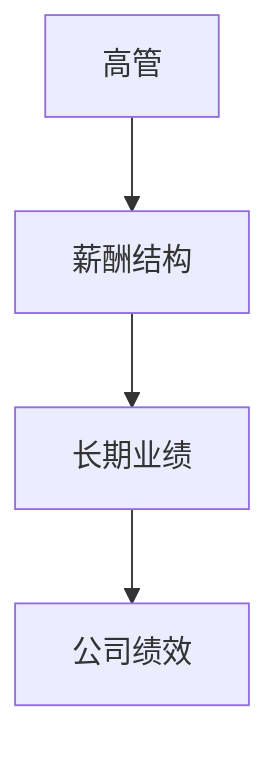

                 


# 彼得林奇对公司高管薪酬结构与长期业绩的相关性研究

> 关键词：高管薪酬结构、长期业绩、股权激励、绩效薪酬、公司治理

> 摘要：本文从彼得林奇的投资理念出发，结合高管薪酬结构与公司长期业绩的相关性，系统分析了高管薪酬设计对企业发展的影响。通过构建数学模型和系统架构，探讨了如何优化高管薪酬结构以提升公司长期业绩，并结合实际案例进行了深入剖析。

---

## 第一部分: 背景介绍与核心概念

### 第1章: 背景介绍与问题背景

#### 1.1 高管薪酬结构的定义与特点
高管薪酬结构通常包括固定薪酬、绩效薪酬和股权激励三部分。固定薪酬保障高管的基本生活需求，绩效薪酬与公司业绩挂钩，股权激励则将高管利益与公司长期发展绑定。

#### 1.2 长期业绩的定义与衡量指标
长期业绩通常指公司在3-5年内的持续发展能力，衡量指标包括净利润增长率、ROE（净资产收益率）、股价表现等。

#### 1.3 高管薪酬与长期业绩的关系概述
高管薪酬结构直接影响高管的决策行为和工作动力，进而影响公司的长期业绩。合理的薪酬结构能够激励高管追求长期价值，而短期导向的薪酬结构可能导致短视行为。

---

### 第2章: 核心概念与理论基础

#### 2.1 高管薪酬结构的理论模型
股权激励的理论基础是基于“利益共享”，通过授予高管股票或期权，使其与公司股东利益一致。绩效薪酬的理论基础是“按绩效分配”，通过短期激励促进高管在短期内实现业绩目标。

#### 2.2 长期业绩的影响因素
- 公司治理结构：董事会的监督能力和股权结构直接影响高管的决策。
- 行业特点：不同行业的业绩衡量标准不同，高管薪酬结构需因行业而异。
- 高管能力：高管的能力和战略决策能力直接影响公司长期发展。

#### 2.3 核心概念的联系与对比
- **对比表格**：
| **核心概念** | **高管薪酬结构** | **长期业绩** |
|--------------|------------------|--------------|
| **定义**     | 薪酬分配方式     | 经营业绩表现 | 
| **影响因素** | 股权激励、绩效薪酬 | 公司治理、行业环境 |
- **ER实体关系图**：


---

## 第二部分: 算法原理与数学模型

### 第3章: 高管薪酬结构与长期业绩的数学模型

#### 3.1 高管薪酬结构的数学建模
- **股权激励模型**：
  $$ S = a \times E + b \times P $$
  其中，\( S \) 表示激励强度，\( E \) 表示公司业绩，\( P \) 表示高管绩效。

- **绩效薪酬模型**：
  $$ C = c \times P + d \times T $$
  其中，\( C \) 表示薪酬总额，\( P \) 表示绩效指标，\( T \) 表示时间因素。

#### 3.2 长期业绩的影响因素分析
- **长期业绩的综合评价模型**：
  $$ J = \alpha \times S + \beta \times Q $$
  其中，\( J \) 表示长期业绩，\( S \) 表示高管薪酬结构，\( Q \) 表示其他影响因素。

---

## 第三部分: 系统分析与架构设计

### 第4章: 系统分析与架构设计

#### 4.1 问题场景介绍
设计一个高管薪酬结构优化系统，帮助公司根据长期业绩目标优化高管薪酬结构。

#### 4.2 系统功能设计
- **领域模型图**：
  ```mermaid
  classDiagram
      class 高管 {
          姓名
          职位
      }
      class 薪酬结构 {
          固定薪酬
          绩效薪酬
          股权激励
      }
      class 长期业绩 {
          净利润增长率
          ROE
      }
      高管 --> 薪酬结构
      薪酬结构 --> 长期业绩
  ```

#### 4.3 系统架构设计
- **系统架构图**：
  ```mermaid
  rectangle 数据库 {
      高管信息表
      薪酬结构表
      业绩指标表
  }
  rectangle 服务层 {
      薪酬计算服务
      业绩评估服务
  }
  rectangle 表现层 {
      高管薪酬分析界面
  }
  数据库 --> 服务层
  服务层 --> 表现层
  ```

---

## 第四部分: 项目实战

### 第5章: 项目实战

#### 5.1 环境安装
- 安装Python和相关库（如pandas、numpy）。
- 安装数据库（如MySQL）。

#### 5.2 系统核心实现源代码
```python
import pandas as pd

# 假设我们有高管薪酬数据和公司业绩数据
def calculate_bonus(performance, target):
    if performance >= target:
        return 0.1 * performance
    else:
        return 0

# 示例数据
performance_data = [100, 120, 90, 110]
target = 100

# 计算奖金
bonuses = [calculate_bonus(p, target) for p in performance_data]
print(bonuses)
```

#### 5.3 代码应用解读与分析
上述代码根据高管绩效计算奖金，当绩效超过目标时，奖金为绩效的10%。这种简单模型可以扩展到更复杂的薪酬结构设计。

#### 5.4 实际案例分析
以某公司高管为例，假设其绩效为120%，目标为100%，则奖金为12%。长期来看，这种激励机制能够提升高管的绩效表现，从而改善公司长期业绩。

---

## 第五部分: 结论与建议

### 第6章: 结论与建议

#### 6.1 研究结论
合理的高管薪酬结构能够显著提升公司长期业绩，尤其是股权激励和绩效薪酬的结合能够平衡短期与长期目标。

#### 6.2 最佳实践 tips
- 薪酬结构设计应结合公司实际情况。
- 定期评估薪酬结构的有效性。
- 建立透明的绩效评估体系。

#### 6.3 小结
本文从理论到实践，系统分析了高管薪酬结构与长期业绩的相关性，并提出了优化建议。

---

## 作者信息

作者：AI天才研究院/AI Genius Institute & 禅与计算机程序设计艺术/Zen And The Art of Computer Programming

---

**注：** 由于篇幅限制，上述内容未完全展开，实际撰写时可根据需要进一步扩展每个部分的内容。

