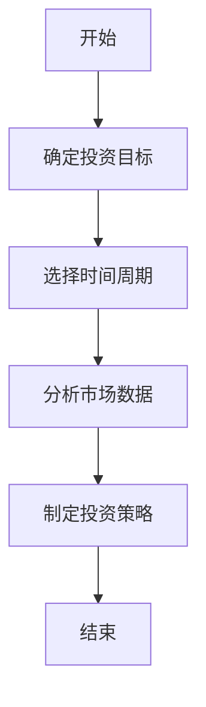
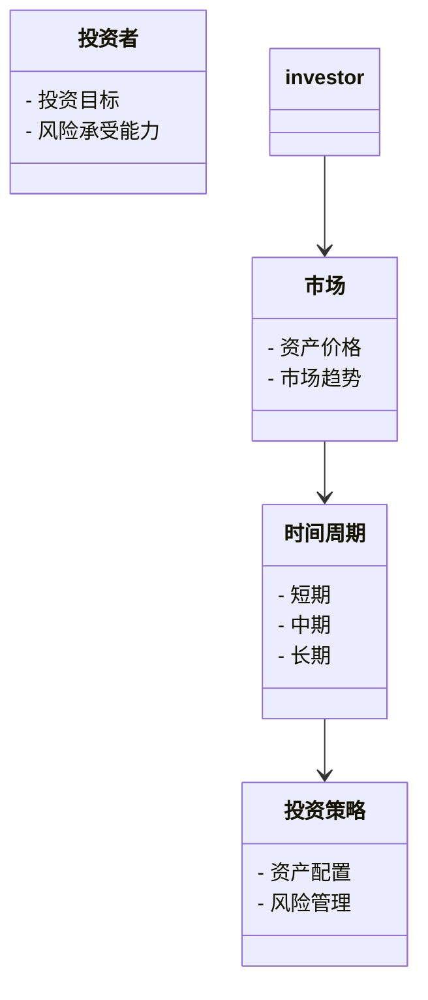
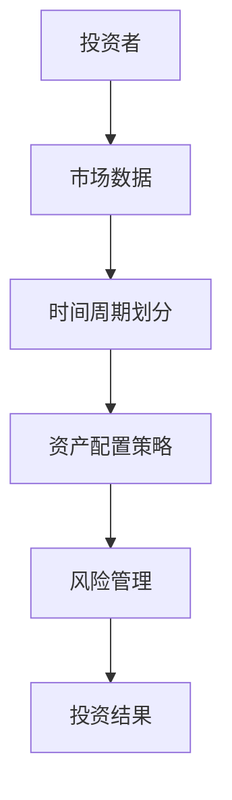

                 


# 彼得林奇对投资时间周期的看法

## 关键词：投资时间周期，彼得·林奇，投资策略，市场波动，资产配置

## 摘要：  
彼得·林奇是全球著名投资家，他提出了许多关于投资时间周期的重要观点。本文将深入分析彼得·林奇如何看待投资时间周期，探讨他在不同时间周期下的投资策略和理念，帮助读者更好地理解和应用这些观点。

---

## 第1章：彼得·林奇与投资时间周期的背景介绍

### 1.1 彼得·林奇的生平与投资理念  
彼得·林奇是美国著名的投资家和基金经理，曾管理富达麦哲伦基金，取得了卓越的投资业绩。他强调长期投资、分散投资和深入研究企业的理念，认为市场波动为投资者提供了买入优质资产的机会。  

**彼得·林奇的核心理念：**  
1. 长期投资：市场波动不可预测，但长期趋势可以通过基本面分析来把握。  
2. 分散投资：通过分散投资降低风险，避免过度依赖单一资产或行业。  
3. 深入研究：投资前需对企业进行深入研究，关注财务数据和管理层能力。  

### 1.2 投资时间周期的定义与分类  
投资时间周期是指投资者在不同时间段内进行投资决策的策略。常见的分类包括：  

| 时间周期 | 定义 | 适用场景 |  
|----------|------|----------|  
| 短期（1-3个月） | 短期交易或投机行为，关注市场波动和情绪变化 | 适合高风险承受能力的投资者，用于短期套利。 |  
| 中期（3-12个月） | 中期资产配置，关注宏观经济和行业趋势 | 适合中期资金需求，注重行业轮动和市场周期。 |  
| 长期（1年以上） | 长期资产配置，关注企业基本面和长期增长潜力 | 适合养老基金、机构投资者和个人长期理财。 |  

彼得·林奇认为，时间周期的选择直接影响投资策略的制定，投资者需根据自身目标和风险承受能力选择合适的时间周期。

---

## 第2章：投资时间周期的核心概念与联系

### 2.1 投资时间周期的核心原理  
1. **时间周期与市场波动：** 短期市场波动难以预测，但长期趋势可以通过基本面分析来把握。  
2. **时间周期与资产配置：** 不同时间周期下，资产配置的比例需动态调整。例如，长期投资中股票占比可能更高，而短期投资中现金占比可能更多。  
3. **时间周期与风险管理：** 长期投资可分散短期市场波动的风险，而短期投资需关注市场情绪和突发事件的影响。  

### 2.2 时间周期分析的数学模型与公式  
彼得·林奇的投资理念中，时间周期与复利效应密切相关。以下是两个关键公式：  

1. **复利计算公式：**  
   $$ FV = PV \times (1 + r)^t $$  
   其中，$FV$ 表示终值，$PV$ 表示现值，$r$ 表示年化收益率，$t$ 表示时间（年）。  

2. **时间周期与风险的对比：**  
   | 时间周期 | 风险 | 收益 |  
   |----------|------|------|  
   | 短期 | 高 | 低 |  
   | 中期 | 中 | 中 |  
   | 长期 | 低 | 高 |  

### 2.3 时间周期分析的ER实体关系图  


---

## 第3章：彼得·林奇投资时间周期的算法原理

### 3.1 时间周期分析的算法流程  
1. **确定投资目标：** 明确投资时间周期（短期、中期、长期）和收益目标。  
2. **选择时间周期：** 根据目标选择合适的时间周期，例如长期投资选择股票，短期投资选择债券。  
3. **分析市场数据：** 通过技术分析和基本面分析判断市场趋势。  
4. **制定投资策略：** 根据分析结果制定买入、持有或卖出的策略。  

**流程图：**  


### 3.2 投资时间周期的数学模型  
彼得·林奇认为，长期投资的复利效应是实现财富增长的关键。以下是两个关键公式：  

1. **复利增长率公式：**  
   $$ r_{\text{avg}} = \left( \frac{FV}{PV} \right)^{1/t} - 1 $$  

2. **时间周期与风险的对比：**  
   | 时间周期 | 风险 | 收益 |  
   |----------|------|------|  
   | 短期 | 高 | 低 |  
   | 中期 | 中 | 中 |  
   | 长期 | 低 | 高 |  

---

## 第4章：彼得·林奇投资时间周期的系统分析与架构

### 4.1 系统功能设计  
1. **时间周期划分：** 根据投资目标划分短期、中期和长期。  
2. **资产配置策略：** 根据时间周期选择合适的资产类别和比例。  
3. **风险管理模型：** 通过分散投资和止损策略降低风险。  

**领域模型：**  


### 4.2 系统架构设计  


---

## 第5章：彼得·林奇投资时间周期的项目实战

### 5.1 环境安装  
假设我们使用Python进行时间周期分析，安装必要的库：  
```bash
pip install pandas matplotlib numpy
```

### 5.2 核心实现代码  
以下是基于彼得·林奇理念的时间周期分析代码示例：  
```python
import pandas as pd
import matplotlib.pyplot as plt

# 示例数据：假设股票价格数据
data = {'日期': ['2020-01', '2020-02', '2020-03', '2020-04', '2020-05'],
         '价格': [100, 105, 98, 110, 115]}
df = pd.DataFrame(data)

# 计算短期（1个月）和中期（3个月）的收益率
df['短期收益率'] = df['价格'].pct_change().cumsum()
df['中期收益率'] = df['价格'].pct_change(periods=2).cumsum()

# 绘制时间周期分析图
plt.figure(figsize=(10, 6))
plt.plot(df['日期'], df['价格'], label='价格')
plt.plot(df['日期'], df['短期收益率'], label='短期收益率')
plt.plot(df['日期'], df['中期收益率'], label='中期收益率')
plt.xlabel('时间')
plt.ylabel('收益率')
plt.legend()
plt.show()
```

### 5.3 实际案例分析  
以彼得·林奇的经典投资案例——可口可乐为例：  
1. **长期投资：** 投资者选择长期持有可口可乐股票，关注其长期增长潜力。  
2. **中期投资：** 在市场波动中寻找买入机会，例如在股价下跌时增加仓位。  
3. **短期投资：** 通过技术分析捕捉短期价格波动，进行高频率交易。  

---

## 第6章：彼得·林奇投资时间周期的总结与展望

### 6.1 总结  
彼得·林奇的投资时间周期理念强调长期投资、分散投资和深入研究。通过合理选择时间周期，投资者可以在不同市场环境下优化资产配置，降低风险并实现长期收益。

### 6.2 展望  
未来，随着市场的变化和技术的发展，时间周期分析将更加精准和多样化。投资者需不断学习和适应，结合彼得·林奇的理念和其他先进方法，制定更科学的投资策略。

---

## 作者：AI天才研究院 & 禅与计算机程序设计艺术

