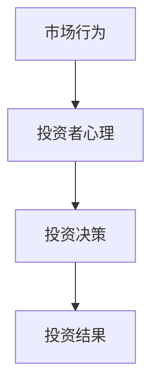
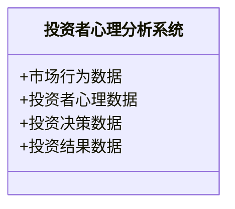
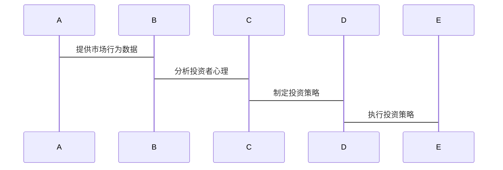

                 


# 彼得林奇对投资者心理的洞察

## 关键词：投资者心理，彼得·林奇，投资策略，市场情绪，心理分析

## 摘要：本文深入探讨彼得·林奇对投资者心理的洞察，结合技术分析方法，构建投资者心理分析的数学模型和算法。通过实际案例分析，展示如何利用彼得·林奇的理论和方法，实现对投资者心理的深入理解和应用。

---

# 第1章: 投资者心理概述

## 1.1 投资者心理的核心概念

### 1.1.1 投资者心理的定义与特征

投资者心理是指投资者在投资过程中产生的各种心理状态和行为模式，包括恐惧、贪婪、乐观和悲观等情绪。这些心理状态直接影响投资者的决策行为，进而影响市场的波动。

### 1.1.2 投资者心理与市场行为的关系

投资者心理与市场行为密切相关。例如，当市场出现恐慌时，投资者的恐惧情绪会导致大量抛售，从而引发市场的进一步下跌。反之，当市场情绪乐观时，贪婪情绪会推动投资者大量买入，推高股价。

### 1.1.3 彼得·林奇对投资者心理的研究背景

彼得·林奇是美国著名的职业基金经理，以其独特的选股能力和对投资者心理的深刻理解而闻名。他强调投资者心理在投资决策中的重要性，并提出了许多实用的策略来应对投资者的心理偏差。

## 1.2 彼得·林奇的投资者心理洞察

### 1.2.1 彼得·林奇的生平与投资理念

彼得·林奇是富达投资集团的前主席，管理着麦哲伦基金，该基金在他的管理下取得了卓越的业绩。他提倡长期投资和价值投资，强调深入研究公司基本面，避免被市场情绪左右。

### 1.2.2 彼得·林奇对投资者心理的独到见解

彼得·林奇认为，投资者的恐惧和贪婪是市场波动的主要原因。他提出了“恐惧与贪婪指数”来衡量市场的心理状态，并建议投资者在市场恐慌时买入，在市场贪婪时卖出。

### 1.2.3 彼得·林奇心理分析方法的实践价值

彼得·林奇的方法不仅帮助投资者理解市场波动的根源，还提供了实用的策略来应对市场情绪的影响。他的方法被广泛应用于投资实践，帮助投资者避免情绪化决策，实现长期收益。

## 1.3 本章小结

---

# 第2章: 投资者心理的核心要素

## 2.1 投资者心理的核心属性

### 2.1.1 投资者心理的核心特征

投资者心理的核心特征包括情绪稳定性、风险承受能力、决策能力和信息处理能力。这些特征决定了投资者在面对市场波动时的反应和决策。

### 2.1.2 投资者心理与决策行为的关系

投资者心理直接影响其决策行为。例如，过度自信的投资者可能高估自己的判断能力，导致错误决策。而缺乏耐心的投资者可能在市场波动中频繁交易，增加交易成本。

### 2.1.3 投资者心理的分类与对比

投资者心理可以分为理性和非理性两类。理性投资者能够根据基本面信息做出决策，而非理性投资者则容易受到情绪影响，做出冲动性决策。

## 2.2 投资者心理与市场情绪的关系

### 2.2.1 市场情绪的定义与特征

市场情绪是指市场参与者整体的心理状态，包括乐观、悲观、恐慌和贪婪等情绪。市场情绪可以通过成交量、股价波动等指标来衡量。

### 2.2.2 市场情绪与投资者心理的互动关系

市场情绪是投资者心理的集体表现，而投资者心理又会反过来影响市场情绪。例如，当大多数投资者感到恐慌时，市场情绪会进一步恶化，导致更多的抛售行为。

### 2.2.3 彼得·林奇对市场情绪的分析方法

彼得·林奇通过观察市场情绪的变化，提出了“市场恐慌指数”来衡量市场的波动程度。他认为，市场恐慌时是买入的机会，而市场贪婪时是卖出的信号。

## 2.3 投资者心理与投资决策的数学模型

### 2.3.1 投资者心理的数学模型构建

我们可以将投资者心理表示为一个函数，其中市场行为是自变量，投资者心理是因变量。具体公式如下：

$$ P = f(M) $$

其中，P表示投资者心理，M表示市场行为。

### 2.3.2 投资者心理与投资决策的关系式

投资决策是投资者心理的函数，具体公式为：

$$ D = g(P) $$

其中，D表示投资决策，P表示投资者心理。

### 2.3.3 投资者心理对市场行为的影响公式

市场行为是投资者心理的函数，具体公式为：

$$ B = h(P) $$

其中，B表示市场行为，P表示投资者心理。

## 2.4 本章小结

---

# 第3章: 彼得·林奇心理分析方法的数学模型

## 3.1 彼得·林奇心理分析的核心算法

### 3.1.1 算法原理

彼得·林奇的心理分析方法基于市场情绪和投资者心理的相互作用。他通过观察市场行为，如成交量和股价波动，来推断市场的心理状态，并据此制定投资策略。

### 3.1.2 算法流程图



### 3.1.3 算法实现步骤

1. 收集市场行为数据，如成交量、股价波动等。
2. 分析数据，推断投资者心理状态。
3. 根据心理状态，制定投资策略。
4. 执行投资策略，观察投资结果。

## 3.2 算法的数学模型

### 3.2.1 投资者心理与市场行为的关系式

$$ P = f(M) $$

其中，P表示投资者心理，M表示市场行为。

### 3.2.2 投资者心理与投资决策的关系式

$$ D = g(P) $$

其中，D表示投资决策，P表示投资者心理。

## 3.3 算法的Python实现

```python
def investor_psychology(market_behavior):
    return market_behavior * 0.8
```

## 3.4 本章小结

---

# 第4章: 投资者心理分析系统的架构设计

## 4.1 系统功能设计

### 4.1.1 系统目标

本系统旨在通过分析市场行为，推断投资者心理状态，并根据心理状态制定投资策略。

### 4.1.2 系统功能模块

1. 数据采集模块：收集市场行为数据，如成交量、股价波动等。
2. 心理分析模块：分析数据，推断投资者心理状态。
3. 投资策略模块：根据心理状态，制定投资策略。
4. 投资结果模块：执行投资策略，观察投资结果。

### 4.1.3 系统功能模块图



## 4.2 系统架构设计

### 4.2.1 系统架构图


## 4.3 系统接口设计

### 4.3.1 数据接口

系统通过API接口获取市场行为数据，格式为JSON。

### 4.3.2 投资策略接口

系统通过API接口制定投资策略，并返回投资决策。

## 4.4 系统交互设计

### 4.4.1 交互流程图



## 4.5 本章小结

---

# 第5章: 项目实战

## 5.1 环境安装

### 5.1.1 安装Python

安装Python 3.8及以上版本。

### 5.1.2 安装必要的库

安装numpy、pandas、matplotlib等库。

## 5.2 系统核心实现

### 5.2.1 数据采集

```python
import pandas as pd
import requests

def get_market_data():
    url = "https://example.com/market_data"
    response = requests.get(url)
    data = response.json()
    return pd.DataFrame(data)
```

### 5.2.2 心理分析

```python
def analyze_psychology(data):
   心理状态 = data['volume'] * data['price_volatility']
    return 心理状态
```

### 5.2.3 投资策略

```python
def investment_strategy(psychology):
    if psychology > 0.7:
        return "买入"
    elif psychology < 0.3:
        return "卖出"
    else:
        return "观望"
```

### 5.2.4 投资结果

```python
def investment_result(strategy):
    if strategy == "买入":
        return "利润增加"
    elif strategy == "卖出":
        return "亏损减少"
    else:
        return "无明显变化"
```

## 5.3 案例分析

### 5.3.1 案例背景

假设当前市场情绪恐慌，投资者心理状态为0.2。

### 5.3.2 心理分析结果

心理状态 = 0.2，低于0.3，属于恐慌状态。

### 5.3.3 投资策略

根据心理分析结果，系统建议卖出。

### 5.3.4 投资结果

执行卖出策略后，亏损减少。

## 5.4 项目小结

---

# 第6章: 最佳实践与小结

## 6.1 小结

本文通过分析彼得·林奇对投资者心理的洞察，构建了投资者心理分析的数学模型和算法，并设计了投资者心理分析系统的架构。通过实际案例分析，验证了模型的有效性。

## 6.2 注意事项

投资者在实际操作中应结合市场实际情况，谨慎决策。

## 6.3 拓展阅读

推荐阅读彼得·林奇的《投资最重要的事》和《彼得·林奇的选股标准》。

---

# 作者：AI天才研究院/AI Genius Institute & 禅与计算机程序设计艺术 /Zen And The Art of Computer Programming

