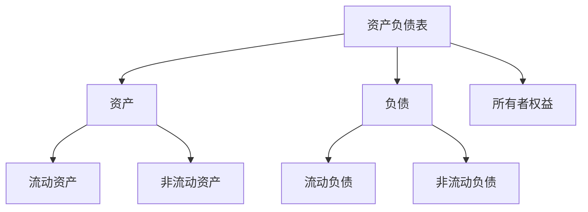
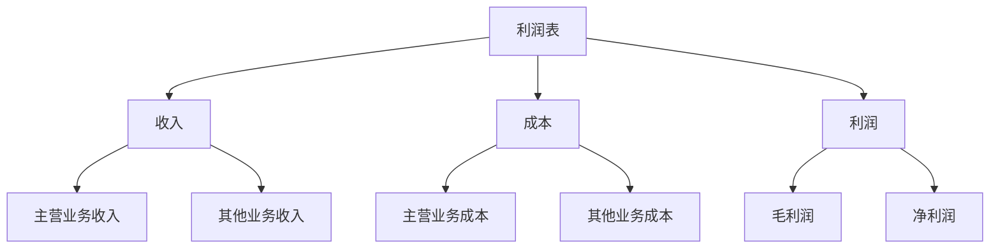
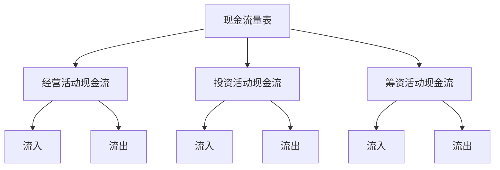
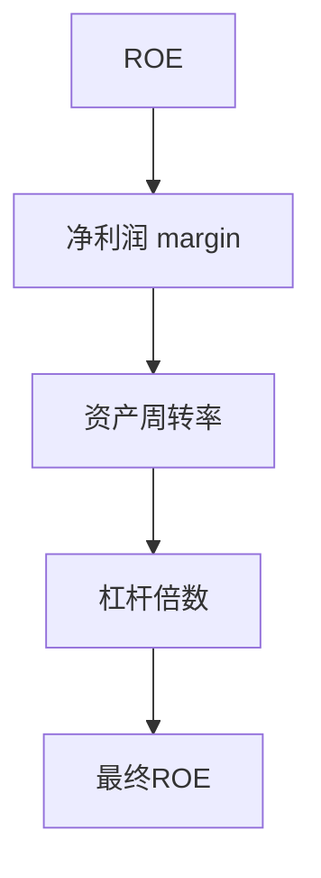
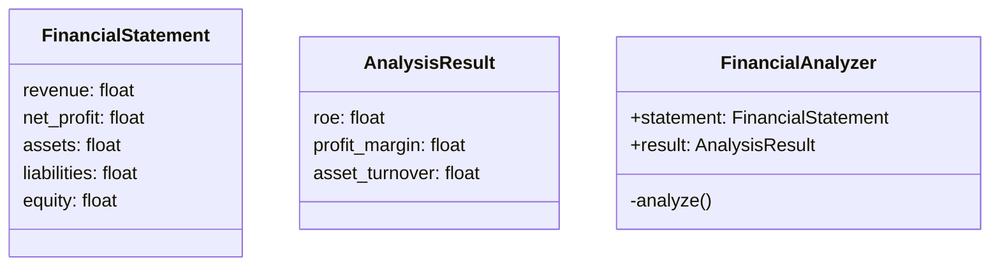
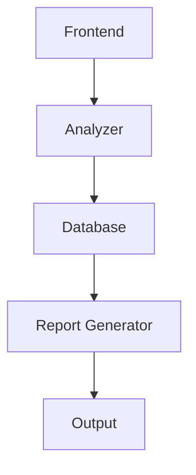

                 


# 彼得·林奇对财务报表分析的重视

## 关键词：财务报表分析，彼得·林奇，投资，财务比率，杜邦分析法

## 摘要：  
彼得·林奇是全球最著名的投资经理之一，他特别强调财务报表分析在投资决策中的重要性。本文将从财务报表分析的核心概念、算法原理、系统架构、项目实战等多方面进行详细解读，结合彼得·林奇的投资理念，深入分析财务报表分析的必要性和实际应用。

---

## 第一部分: 财务报表分析的背景与重要性

### 第1章: 财务报表分析概述

#### 1.1 财务报表分析的定义与核心概念

财务报表分析是通过对企业的财务报表（包括资产负债表、利润表和现金流量表）进行详细解读，评估企业的财务状况、盈利能力、偿债能力和运营效率的过程。它不仅是企业内部管理的重要工具，也是投资者进行投资决策的关键依据。

**核心概念：**
- **资产负债表**：反映企业在某一特定时点的资产、负债和所有者权益的状况。
- **利润表**：展示企业在一定会计期间内的收入、成本和利润情况。
- **现金流量表**：记录企业在一定会计期间内的现金流流入和流出情况。

**边界与外延：**
- 财务报表分析不仅关注企业的财务数据，还关注这些数据背后反映的经营状况和潜在风险。
- 外延包括对行业趋势、宏观经济环境和企业战略的综合考量。

#### 1.2 彼得·林奇的投资理念

彼得·林奇是富达投资集团的传奇经理人，他以卓越的投资业绩和对企业的深刻理解闻名。他的投资理念强调以下几个方面：

1. **长期投资**：林奇认为，成功的投资需要耐心和长期持有优质资产。
2. **深入研究**：他主张对企业的财务报表、行业地位和竞争优势进行深入分析。
3. **价值投资**：林奇寻找那些被市场低估的优质企业，并长期持有。

### 第2章: 财务报表分析的重要性

#### 2.1 财务报表分析在投资中的作用

- **评估企业价值**：通过分析财务报表，投资者可以评估企业的资产质量、盈利能力和发展潜力。
- **辅助投资决策**：财务报表分析帮助投资者识别高增长企业，避免投资风险。
- **风险控制**：通过分析企业的偿债能力和流动性，投资者可以避免投资于财务状况不佳的企业。

#### 2.2 财务报表分析的核心目标

- **评估财务健康状况**：分析企业的资产负债表，判断企业的偿债能力和财务稳定性。
- **分析盈利能力**：通过利润表，评估企业的盈利能力和发展潜力。
- **识别潜在风险**：发现企业财务报表中的异常情况，避免投资风险。

---

## 第二部分: 财务报表分析的核心概念与联系

### 第3章: 财务报表的结构与内容

#### 3.1 资产负债表

- **定义与结构**：资产负债表分为资产、负债和所有者权益三部分，反映企业在某一特定时点的财务状况。
- **分类与分析**：
  - **资产**：包括流动资产（现金、应收账款、存货等）和非流动资产（固定资产、无形资产等）。
  - **负债**：包括流动负债（应付账款、短期借款等）和非流动负债（长期借款、债券等）。
  - **所有者权益**：企业的净资产，包括股本、资本公积和未分配利润等。

**mermaid图表：**



#### 3.2 利润表

- **定义与结构**：利润表展示企业在一定会计期间内的收入、成本和利润情况。
- **分类与分析**：
  - **收入**：包括主营业务收入和其他业务收入。
  - **成本**：包括主营业务成本和其他业务成本。
  - **利润**：包括毛利润、净利润等。

**mermaid图表：**



#### 3.3 现金流量表

- **定义与结构**：现金流量表记录企业在一定会计期间内的现金流流入和流出情况，分为经营活动、投资活动和筹资活动三部分。
- **分类与分析**：
  - **经营活动现金流**：反映企业日常经营活动的现金流。
  - **投资活动现金流**：反映企业投资活动的现金流。
  - **筹资活动现金流**：反映企业筹资活动的现金流。

**mermaid图表：**



### 第4章: 财务比率分析

#### 4.1 流动性分析

- **流动比率**：流动资产与流动负债的比率，反映企业的短期偿债能力。
  - 公式：流动比率 = 流动资产 / 流动负债
  - 示例：如果企业流动资产为100万元，流动负债为50万元，流动比率 = 2。

- **速动比率**：速动资产（流动资产减去存货）与流动负债的比率，更保守地反映企业的短期偿债能力。
  - 公式：速动比率 = (流动资产 - 存货) / 流动负债

- **现金比率**：现金及现金等价物与流动负债的比率，反映企业支付短期债务的能力。
  - 公式：现金比率 = 现金及现金等价物 / 流动负债

**对比表格：**

| 比率名称      | 公式                     | 目的             |
|---------------|--------------------------|------------------|
| 流动比率      | 流动资产 / 流动负债      | 短期偿债能力     |
| 速动比率      | (流动资产 - 存货) / 流动负债 | 更保守的短期偿债能力 |
| 现金比率      | 现金及现金等价物 / 流动负债 | 支付能力         |

#### 4.2 偿债能力分析

- **负债比率**：负债总额与资产总额的比率，反映企业的杠杆程度。
  - 公式：负债比率 = 负债总额 / 资产总额

- **利息保障倍数**：息税前利润与利息支出的比率，反映企业支付利息的能力。
  - 公式：利息保障倍数 = 息税前利润 / 利息支出

- **资产负债率**：负债总额与资产总额的比率，衡量企业负债的高低。
  - 公式：资产负债率 = 负债总额 / 资产总额

#### 4.3 运营效率分析

- **应收账款周转率**：销售收入与应收账款的比率，反映企业应收账款的周转情况。
  - 公式：应收账款周转率 = 销售收入 / 应收账款

- **存货周转率**：成本与存货的比率，反映企业存货周转情况。
  - 公式：存货周转率 = 销售成本 / 存货

- **总资产周转率**：销售收入与总资产的比率，反映企业资产的使用效率。
  - 公式：总资产周转率 = 销售收入 / 总资产

---

## 第三部分: 财务报表分析的算法原理

### 第5章: 杜邦分析法

杜邦分析法是一种经典的财务分析方法，通过分解ROE（净资产收益率）来分析企业的盈利能力。以下是杜邦分析法的步骤：

1. **计算ROE**：ROE = 净利润 / 股东权益
2. **分解ROE**：ROE = 净利润 margin × 资产周转率 × 杠杆倍数
   - 净利润 margin = 净利润 / 收入
   - 资产周转率 = 收入 / 总资产
   - 杠杆倍数 = 股东权益 / 总资产

**mermaid图表：**



**Python代码实现：**

```python
def dupont_analysis(revenue, net_profit, assets, equity):
    # 计算净利润 margin
    net_profit_margin = net_profit / revenue
    # 计算资产周转率
    asset_turnover = revenue / assets
    # 计算杠杆倍数
    leverage = equity / assets
    # 计算ROE
    roe = net_profit_margin * asset_turnover * leverage
    return roe

# 示例数据
revenue = 10000000
net_profit = 2000000
assets = 5000000
equity = 2000000

# 调用函数
roe = dupont_analysis(revenue, net_profit, assets, equity)
print(f"ROE = {roe:.2f}")
```

---

## 第四部分: 系统分析与架构设计

### 第6章: 财务分析系统设计

#### 6.1 问题场景介绍

为了实现自动化财务分析，我们设计了一个基于Python的财务分析系统，用于自动读取财务报表数据并生成分析报告。

#### 6.2 系统功能设计

**领域模型：**



#### 6.3 系统架构设计

**系统架构：**



---

## 第五部分: 项目实战

### 第7章: 环境安装与核心代码实现

#### 7.1 环境安装

- Python 3.8+
- pandas库
- numpy库

#### 7.2 核心代码实现

```python
import pandas as pd
import numpy as np

def read_financial_statement(file_path):
    # 读取Excel文件
    df = pd.read_excel(file_path)
    # 提取数据
    revenue = df['Revenue'].values[0]
    net_profit = df['Net Profit'].values[0]
    assets = df['Assets'].values[0]
    liabilities = df['Liabilities'].values[0]
    equity = assets - liabilities
    return revenue, net_profit, equity

def calculate_roe(revenue, net_profit, equity):
    if equity == 0:
        return 0
    roe = (net_profit / equity) * 100
    return roe

# 示例运行
file_path = 'financial_statement.xlsx'
revenue, net_profit, equity = read_financial_statement(file_path)
roe = calculate_roe(revenue, net_profit, equity)
print(f"ROE = {roe:.2f}%")
```

---

## 第六部分: 最佳实践与小结

### 第8章: 最佳实践

- **持续学习**：财务报表分析是一门实践性很强的学科，需要不断学习和实践。
- **关注细节**：在分析财务报表时，要关注每一个数据背后的含义。
- **结合行业背景**：财务报表分析不能孤立进行，要结合行业趋势和宏观经济环境。

---

## 作者：AI天才研究院 & 禅与计算机程序设计艺术

