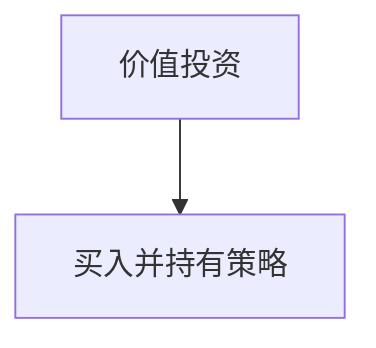
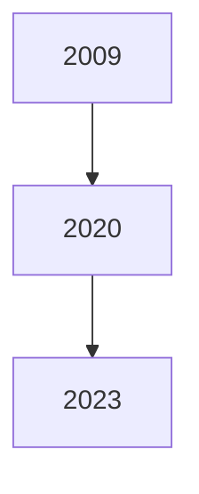
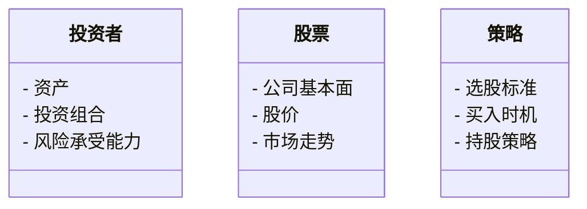
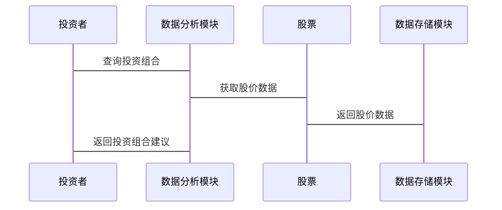

                 


# 彼得林奇的"买入并持有"策略

> 关键词：彼得林奇，买入并持有，投资策略，价值投资，长期投资

> 摘要：本文深入探讨了彼得·林奇的“买入并持有”投资策略，分析其理论基础、核心要素及其在不同市场环境下的表现。通过具体案例和数学模型，结合系统架构设计，提供实践指导和优化建议。

---

## 第二章: "买入并持有"策略的理论基础

### 2.1 价值投资理论

#### 2.1.1 价值投资的定义与原则
价值投资是一种以内在价值为核心的投资方法，强调购买价格低于内在价值的资产。彼得·林奇在其职业生涯中，将价值投资的理念融入“买入并持有”策略，强调选择那些具有强大基本面和长期增长潜力的公司。

#### 2.1.2 彼得·林奇对价值投资的贡献
彼得·林奇通过其投资实践，将价值投资的理念进一步深化。他强调对企业基本面的深入分析，包括财务状况、管理团队、行业地位等，以识别那些被市场低估的优质企业。

#### 2.1.3 价值投资与“买入并持有”策略的关系
价值投资是“买入并持有”策略的理论基础。通过选择具有内在价值的股票，并长期持有，投资者能够在市场波动中获得超额收益。

#### 图2-1: 价值投资与“买入并持有”策略的关系图


---

### 2.2 市场有效性与长期投资

#### 2.2.1 市场有效性的概念与分类
市场有效性是指市场价格反映所有相关信息的程度。市场有效性分为弱有效、半强有效和强有效三类。彼得·林奇认为市场在长期是有效的，但短期可能无效。

#### 2.2.2 长期投资在市场有效性中的应用
长期投资能够在市场有效性中捕捉结构性机会。通过长期持有优质资产，投资者能够规避短期波动带来的风险，实现资产的长期增值。

#### 2.2.3 彼得·林奇对市场有效性的看法
彼得·林奇认为，市场短期波动不可预测，但长期趋势是可投资的。他强调通过基本面分析，选择那些具有持续增长潜力的企业。

---

### 2.3 长期投资的重要性

#### 2.3.1 长期投资的优势与劣势
- **优势**：避免频繁交易的费用和税负，降低短期波动的影响，捕捉长期增长潜力。
- **劣势**：需要较长的时间周期，可能错过短期市场波动带来的收益。

#### 2.3.2 彼得·林奇对长期投资的强调
彼得·林奇在其投资哲学中，多次强调长期投资的重要性。他认为，成功的投资需要耐心和信心，避免因短期波动而改变投资决策。

#### 2.3.3 长期投资与短期交易的对比
长期投资注重企业的内在价值，而短期交易关注市场波动。彼得·林奇认为，长期投资更适合普通投资者，因为它降低了交易频率和成本。

---

## 第三章: "买入并持有"策略在不同市场环境下的表现

### 3.1 牛市环境中的应用

#### 3.1.1 牛市的特点与机会
牛市期间，市场情绪乐观，股价上涨，企业盈利增加。彼得·林奇建议在牛市中选择具有持续增长潜力的企业，避免追涨杀跌。

#### 3.1.2 "买入并持有"策略在牛市中的优势
- **优势**：能够在牛市中持续获得资本增值，避免频繁交易带来的费用和税负。
- **案例分析**：以科技股为例，长期持有苹果公司股票，在2009年到2020年的牛市中，苹果股价从2美元增长到300多美元。

#### 图3-1: 苹果股价长期走势图


---

### 3.2 熊市环境中的应用

#### 3.2.1 熊市的特点与挑战
熊市期间，市场情绪悲观，股价下跌，企业盈利减少。彼得·林奇建议在熊市中保持耐心，避免恐慌性抛售，继续持有优质资产。

#### 3.1.2 "买入并持有"策略在熊市中的表现
- **表现**：尽管熊市期间股价下跌，但优质企业的长期趋势仍为上升。例如，巴菲特在2008年金融危机期间，继续持有可口可乐和IBM股票，最终实现收益。

#### 案例分析：2008年金融危机
- **背景**：2008年金融危机导致全球股市大幅下跌。
- **策略**：彼得·林奇建议投资者在恐慌性抛售中，选择优质企业股票进行长期持有。

---

### 3.3 震荡市环境中的应用

#### 3.3.1 震荡市的特点与挑战
震荡市期间，市场波动剧烈，股价上下波动，投资者面临较大的心理压力。

#### 3.3.2 "买入并持有"策略在震荡市中的应用
- **策略**：选择具有强大基本面的企业，避免因短期波动而改变投资决策。
- **案例分析**：以零售业为例，选择亚马逊股票，长期持有，在多次震荡中实现增长。

#### 图3-2: 亚马逊股价长期走势图


---

## 第四章: "买入并持有"策略的系统架构设计

### 4.1 问题场景介绍

#### 4.1.1 问题背景
投资者需要一个稳定的投资策略，能够在不同市场环境下实现资产增值。

#### 4.1.2 问题描述
传统投资策略依赖于频繁交易，容易受到市场波动的影响。彼得·林奇的“买入并持有”策略提供了一种长期、稳健的投资方法。

---

### 4.2 系统功能设计

#### 4.2.1 领域模型（类图）


---

#### 4.2.2 系统架构设计（架构图）
```mermaid
subgraph 投资者
   投资者 --> 策略
    投资者 --> 股票
end

subgraph 系统架构
    策略 --> 数据分析模块
    股票 --> 数据存储模块
end
```

---

### 4.3 系统接口设计

#### 4.3.1 输入接口
- 投资者的基本信息
- 投资目标
- 风险承受能力

#### 4.3.2 输出接口
- 投资组合建议
- 股票选择建议
- 持股策略建议

---

### 4.4 系统交互设计（序列图）

#### 4.4.1 投资者查询投资组合


---

## 作者

作者：AI天才研究院/AI Genius Institute & 禅与计算机程序设计艺术 /Zen And The Art of Computer Programming

---

通过以上思考，我可以开始撰写正式的文章，确保每一部分都详细且有深度，结合实际案例和系统架构设计，为读者提供全面的分析和指导。

