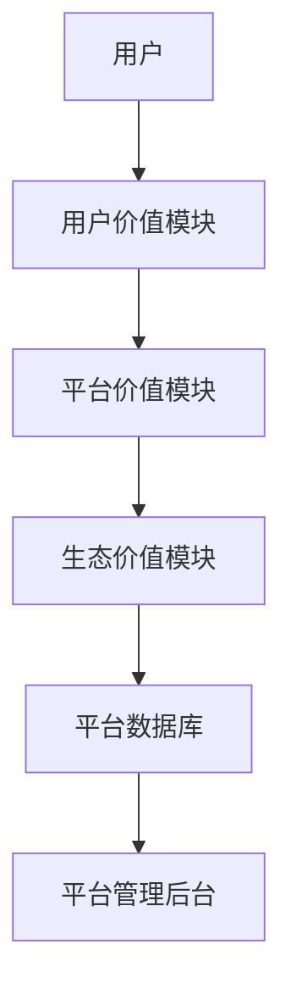
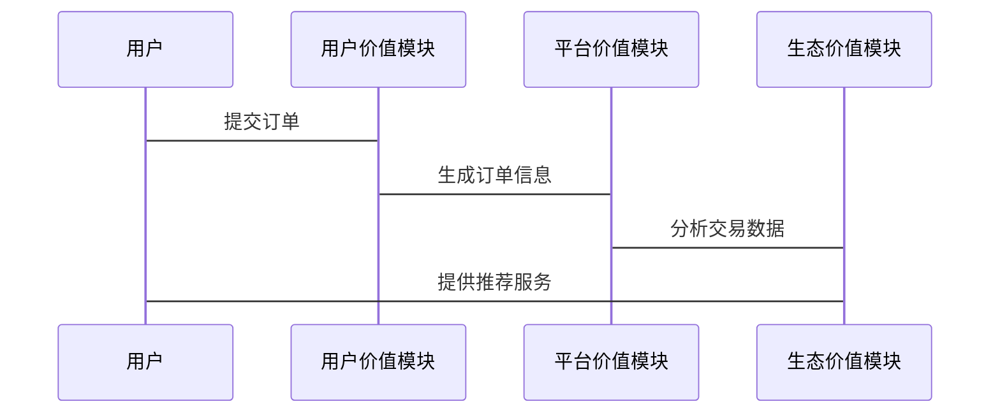

                 


# 彼得林奇的"价值创造"在平台经济中的新衡量标准

> 关键词：价值创造，平台经济，衡量标准，彼得林奇，投资理论，系统架构

> 摘要：本文探讨了彼得林奇的价值创造理论在平台经济中的应用，提出了一种新的价值衡量标准，并通过算法和数学模型进行了详细分析，最后结合实际案例进行了系统设计与实现。

---

## 第1章 彼得林奇的"价值创造"理论概述

### 1.1 彼得林奇投资理论的核心理念

#### 1.1.1 价值投资的基本概念
价值投资是一种以低于其内在价值的价格购买优质资产的投资策略，强调长期持有和价值发现。彼得林奇是这一领域的杰出代表，他强调通过深入研究企业基本面来寻找被市场低估的投资机会。

#### 1.1.2 彼得林奇的价值创造理论
彼得林奇认为，企业的价值不仅仅体现在财务数据上，更重要的是其长期创造价值的能力。他提出了以下核心观点：
1. **企业盈利能力**：企业必须能够持续创造利润，这是价值的核心来源。
2. **管理层能力**：管理层的战略眼光和执行力是企业价值增长的关键。
3. **行业地位**：企业在行业中的地位决定了其议价能力和竞争优势。

#### 1.1.3 价值创造与企业长期发展的关系
价值创造是企业长期发展的基石，只有能够持续创造价值的企业，才能在竞争中立于不败之地。彼得林奇强调，投资者应关注企业如何通过创新和优化运营来实现价值增长。

### 1.2 平台经济的基本概念与特征

#### 1.2.1 平台经济的定义
平台经济是一种基于互联网技术的商业模式，通过构建平台连接供需双方，提供撮合交易或增值服务。典型例子包括电商平台、社交媒体和在线支付平台。

#### 1.2.2 平台经济的核心特征
1. **双边市场**：平台连接多个利益相关者，形成双边或多边市场结构。
2. **网络效应**：用户数量的增加会提升平台的整体价值，产生正反馈效应。
3. **数据驱动**：通过收集和分析用户数据，平台能够优化服务和决策。

#### 1.2.3 平台经济与传统经济模式的区别
- **参与者关系**：传统经济中，企业与消费者是买卖关系；平台经济中，平台连接供需双方，形成多方协作的生态系统。
- **价值创造方式**：传统经济依赖于生产效率的提升；平台经济通过数据和技术创新实现价值倍增。
- **衡量标准**：传统经济关注单点效率，平台经济注重生态系统的整体价值。

### 1.3 价值创造在平台经济中的重要性

#### 1.3.1 平台经济中的价值来源
平台经济的价值来源于以下几个方面：
1. **用户价值**：通过满足用户需求，提升用户体验。
2. **平台价值**：通过撮合交易，获取佣金或服务费。
3. **生态价值**：通过构建完整的生态系统，形成协同效应。

#### 1.3.2 价值创造对平台用户的影响
价值创造不仅影响平台的收入，还直接关系到用户的满意度和忠诚度。一个能够持续创造价值的平台，能够吸引更多用户，形成良性循环。

#### 1.3.3 价值创造对平台经济的影响
- **用户增长**：价值创造能够吸引更多的用户加入平台。
- **收入增长**：通过创造更多的用户价值，平台能够获取更多的收入。
- **生态优化**：价值创造促进平台生态的优化，形成更强大的协同效应。

---

## 第2章 平台经济中的价值衡量标准

### 2.1 传统经济中的价值衡量标准

#### 2.1.1 财务指标在传统经济中的应用
传统经济中，企业的价值主要通过财务指标来衡量，如净利润、营业收入、毛利率等。这些指标能够反映企业的盈利能力和财务健康状况。

#### 2.1.2 传统企业价值衡量的局限性
传统价值衡量方法的局限性在于，它无法全面反映企业的创新能力、市场竞争力和长期发展潜力。特别是在平台经济中，传统的财务指标可能无法准确衡量企业的价值。

#### 2.1.3 价值衡量标准的演变
随着经济模式的多样化，价值衡量标准也在不断演变。从单一的财务指标到综合考虑创新能力和生态系统价值，衡量标准更加注重长期价值的创造。

### 2.2 平台经济中的新价值衡量标准

#### 2.2.1 用户价值
用户价值是平台经济中最重要的衡量指标之一。通过分析用户的活跃度、满意度和生命周期价值，可以评估平台创造用户价值的能力。

#### 2.2.2 平台价值
平台价值包括平台的交易量、用户基数、市场份额等指标。这些指标能够反映平台在市场中的竞争力和影响力。

#### 2.2.3 生态价值
生态价值是指平台通过构建完整的生态系统，实现多方利益相关者的协同效应。生态价值的衡量包括合作伙伴的数量、生态系统的协同发展能力等。

### 2.3 价值创造在平台经济中的实现路径

#### 2.3.1 技术创新
技术创新是平台经济中最主要的价值创造方式之一。通过引入新技术，平台能够提升服务质量和用户体验，从而创造更多价值。

#### 2.3.2 模式创新
模式创新是指通过改变商业模式，提升平台的收入来源和价值创造能力。例如，从单纯撮合交易向提供增值服务转型。

#### 2.3.3 用户参与
用户参与是平台经济中价值创造的重要途径。通过鼓励用户参与内容生成、社区互动等，平台能够增强用户粘性，创造更多的用户价值。

---

## 第3章 彼得林奇价值创造理论在平台经济中的应用

### 3.1 平台经济中的价值创造模型

#### 3.1.1 模型的构建逻辑
彼得林奇的价值创造理论强调企业的长期价值创造能力。在平台经济中，这一理论可以应用于以下几个方面：
1. **用户价值**：通过技术创新和优质服务，提升用户体验。
2. **平台价值**：通过优化运营和扩展市场，提升平台的交易量和市场份额。
3. **生态价值**：通过构建协同效应，增强生态系统的整体价值。

#### 3.1.2 模型的核心要素与关系
价值创造模型的核心要素包括：
- 用户需求
- 平台能力
- 生态协同

这些要素之间相互作用，共同推动价值的创造与提升。

#### 3.1.3 模型的适用范围与限制
该模型适用于各类平台经济，尤其是互联网平台。其限制在于，对于一些非平台型的商业模式，可能需要进行调整和优化。

### 3.2 平台经济中价值创造的关键因素

#### 3.2.1 技术创新
技术创新是平台经济中最主要的价值创造方式之一。通过引入新技术，平台能够提升服务质量和用户体验，从而创造更多价值。

#### 3.2.2 用户行为
用户行为直接影响平台的价值创造能力。通过分析用户的活跃度、满意度和生命周期价值，可以评估平台创造用户价值的能力。

#### 3.2.3 平台治理
平台治理是确保平台经济健康发展的关键。通过建立有效的治理机制，平台能够规范参与者行为，维护生态系统的稳定。

### 3.3 平台经济中价值创造的衡量指标

#### 3.3.1 用户满意度
用户满意度是衡量用户价值的重要指标。通过调查和数据分析，可以了解用户对平台服务的满意度，从而指导平台优化服务。

#### 3.3.2 平台交易量
平台交易量是衡量平台价值的重要指标。交易量的增加意味着平台的市场竞争力和影响力在提升。

#### 3.3.3 生态健康度
生态健康度是衡量生态价值的重要指标。通过分析生态系统的协同发展能力，可以评估平台生态的整体价值。

---

## 第4章 平台经济中的价值创造算法与数学模型

### 4.1 价值创造的量化方法

#### 4.1.1 价值创造的定义与量化维度
价值创造是指通过一系列活动和资源优化，提升经济主体的价值产出。在平台经济中，价值创造的量化需要考虑用户价值、平台价值和生态价值三个维度。

#### 4.1.2 价值创造的数学表达式
我们可以将价值创造（V）表示为以下公式：
$$
V = f(u, p, e)
$$
其中，u表示用户价值，p表示平台价值，e表示生态价值。

---

## 项目实战：平台价值创造的系统设计与实现

### 4.2 项目介绍
我们以一个典型的电商平台为例，设计一个价值创造系统。该系统将通过优化用户体验、提升平台交易量和构建生态系统来实现价值创造。

### 4.3 系统功能设计
#### 4.3.1 用户价值模块
- 用户注册与登录
- 用户画像与个性化推荐
- 用户反馈与满意度分析

#### 4.3.2 平台价值模块
- 交易撮合与订单管理
- 平台佣金计算与收益分析
- 平台数据分析与优化

#### 4.3.3 生态价值模块
- 合作伙伴管理
- 生态协同分析
- 生态系统优化建议

### 4.4 系统架构设计



### 4.5 系统接口设计
- 用户接口：API用于用户注册、登录、订单提交等。
- 平台接口：API用于平台数据采集、分析和优化。
- 生态接口：API用于合作伙伴的数据交互和协同。

### 4.6 系统交互设计



---

## 项目实战：价值创造算法的实现

### 4.7 项目环境安装
需要安装以下工具和库：
- Python 3.8+
- pandas、numpy、scikit-learn等数据处理库
- mermaid图示工具
- Jupyter Notebook用于数据分析和可视化

### 4.8 算法实现代码

```python
import pandas as pd
from sklearn.metrics import accuracy_score

# 数据加载
data = pd.read_csv('user_value.csv')

# 数据预处理
X = data.drop('label', axis=1)
y = data['label']

# 训练模型
from sklearn.model

