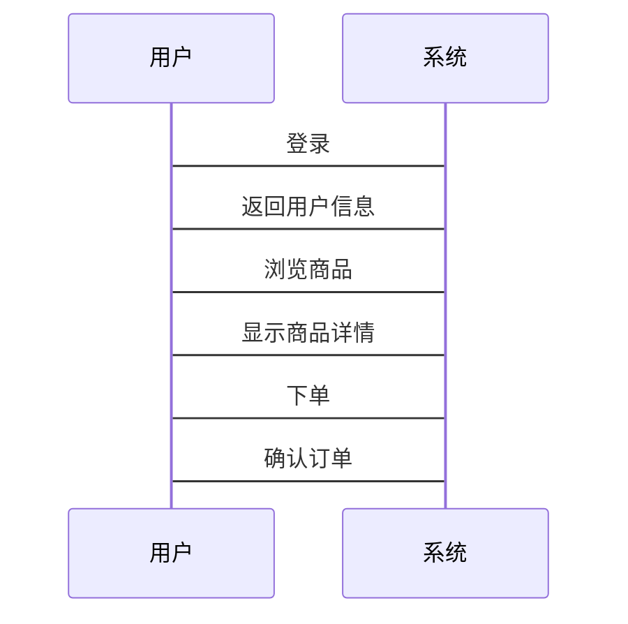

                 


# 彼得林奇的"价值创造"在平台经济中的新衡量维度

> 关键词：价值创造，平台经济，彼得·林奇，用户参与度，网络效应，数据资产

> 摘要：本文探讨了彼得·林奇的价值创造理论在平台经济中的应用，并提出了新的衡量维度，如用户参与度、生命周期价值、网络效应和数据资产价值，通过理论分析和实际案例，帮助读者理解如何在平台经济中进行价值衡量。

---

# 第一部分: 引言

## # 第1章: 价值创造与平台经济的结合

### 1.1 彼得·林奇的价值创造理论概述

#### 1.1.1 彼得·林奇的价值创造理论核心观点

彼得·林奇的价值创造理论强调企业通过创新和卓越的管理为股东创造价值。其核心观点包括：

1. **价值创造的核心是公司内在价值的增长**：林奇认为，股票价格最终由公司的内在价值决定，内在价值的增长来自于公司的盈利能力、市场地位和竞争优势。
2. **关注基本面分析**：他主张通过分析公司的财务数据、行业地位、管理团队等因素来评估其价值创造能力。
3. **长期投资视角**：林奇强调长期持有优质股票，避免短期市场波动的干扰。

#### 1.1.2 价值创造在传统经济中的应用

在传统经济中，价值创造主要通过以下方式实现：

1. **提高生产效率**：通过技术创新和管理优化降低成本，提高产品附加值。
2. **扩大市场份额**：通过市场拓展和品牌建设增加收入。
3. **提升客户满意度**：通过提供优质服务和用户体验增强客户忠诚度。

#### 1.1.3 平台经济的定义与特点

平台经济是一种通过数字技术构建的虚拟市场，连接供需双方，提供撮合交易、信息匹配等服务。其特点包括：

1. **双边市场结构**：平台连接两个或多个群体（如买家和卖家），通过网络效应实现价值。
2. **数据驱动**：平台通过收集和分析用户数据，优化匹配算法，提升用户体验。
3. **轻资产模式**：平台本身不持有实体资产，通过技术和服务创造价值。

---

## # 第2章: 价值创造的传统衡量维度

### 2.1 传统价值衡量维度的局限性

#### 2.1.1 财务指标的局限性

传统财务指标（如净利润率、ROE等）在衡量平台经济中的价值创造时存在以下问题：

1. **难以反映网络效应**：平台的价值不仅来自收入，还来自用户之间的互动和数据积累。
2. **忽略用户资产**：传统财务指标不考虑用户数据和网络效应等无形资产的价值。
3. **短期导向**：财务指标通常关注短期表现，而平台经济的价值创造往往需要长期积累。

#### 2.1.2 用户满意度的局限性

用户满意度虽然重要，但无法全面衡量平台的经济价值。例如，高满意度不一定带来高收入或市场份额。

#### 2.1.3 市场份额的局限性

市场份额在传统经济中是重要的衡量指标，但在平台经济中，市场份额可能被网络效应和用户粘性等因素影响，难以准确反映价值创造。

---

### 2.2 平台经济中的新衡量维度

#### 2.2.1 用户生命周期价值

用户生命周期价值（CLV）是衡量用户在平台上的长期价值的重要指标。计算公式如下：

$$ CLV = \text{平均收入} \times \text{用户生命周期长度} $$

例如，滴滴出行通过分析用户的使用频率和时长，优化定价策略和用户补贴，从而提高用户生命周期价值。

---

## # 第3章: 用户参与度与生命周期价值

### 3.1 用户参与度的定义与衡量

#### 3.1.1 用户活跃度的计算方法

用户活跃度可以通过以下指标衡量：

1. **日活跃用户数（DAU）**：每天使用平台的用户数量。
2. **月活跃用户数（MAU）**：每月使用平台的用户数量。
3. **活跃率**：DAU/MAU，反映用户的使用频率。

#### 3.1.2 用户留存率的分析

用户留存率是衡量用户粘性的重要指标。例如，淘宝通过优化用户体验和推荐算法，提高用户留存率。

#### 3.1.3 用户生命周期价值的公式推导

用户生命周期价值（CLV）的计算公式如下：

$$ CLV = \text{平均收入} \times \text{用户生命周期长度} $$

其中，用户生命周期长度可以通过用户留存率和流失模型估算。

---

## # 第4章: 网络效应与平台价值

### 4.1 网络效应的定义与分类

网络效应是指用户数量增加带来的边际收益递增的现象。网络效应可以分为：

1. **正向网络效应**：用户数量增加，平台价值提升。
2. **负向网络效应**：用户数量增加，平台成本上升。

例如，滴滴通过撮合司机和乘客的交易，形成正向网络效应。

---

## # 第5章: 数据资产价值

### 5.1 数据资产的定义与分类

数据资产是平台经济中的重要资源，可以分为：

1. **结构化数据**：如用户信息、交易记录。
2. **非结构化数据**：如文本、图片、视频。
3. **实时数据**：如实时位置、动态。

### 5.2 数据资产价值的衡量

数据资产价值可以通过以下方式衡量：

1. **数据的可变现能力**：数据是否可以用于广告、精准营销等业务。
2. **数据的质量**：数据的准确性、完整性。
3. **数据的规模**：数据的数量和覆盖范围。

例如，淘宝通过分析用户行为数据，优化推荐算法，提升用户购买转化率。

---

# 第二部分: 新衡量维度的构建

## # 第6章: 用户参与度的系统分析与架构设计

### 6.1 系统功能设计（领域模型）

用户参与度的系统功能设计包括：

1. **用户行为分析**：记录用户的操作行为。
2. **用户画像构建**：基于用户数据建立用户画像。
3. **用户分群**：根据用户行为和特征进行分群。

### 6.2 系统架构设计（Mermaid架构图）


### 6.3 用户行为序列图（Mermaid序列图）



---

## # 第7章: 网络效应与平台价值

### 7.1 网络效应的系统分析与架构设计

网络效应的系统分析包括：

1. **用户增长策略**：如何吸引更多用户加入平台。
2. **网络效应的量化**：通过指标如用户增长速率、交易频率等量化网络效应。

### 7.2 网络效应的数学模型

网络效应的数学模型可以表示为：

$$ N = \frac{k}{1 + e^{-r(t - t_0)}} $$

其中，$N$ 是用户数量，$k$ 是平台容量，$r$ 是增长速率，$t_0$ 是时间起点。

---

## # 第8章: 数据资产价值的系统分析与架构设计

### 8.1 数据采集与处理

数据资产价值的系统分析包括：

1. **数据采集**：通过API、日志等方式采集数据。
2. **数据清洗**：去除噪声数据，确保数据质量。
3. **数据存储**：将数据存储在数据库中，便于后续分析。

### 8.2 数据分析与挖掘

数据分析包括：

1. **描述性分析**：总结用户行为特征。
2. **预测性分析**：预测用户未来行为。
3. **诊断性分析**：分析用户流失原因。

---

## # 第9章: 项目实战

### 9.1 环境安装

需要安装以下工具：

1. **Python**：用于数据分析和建模。
2. **Mermaid**：用于绘制系统架构图和流程图。
3. **数据库**：用于存储和管理数据。

### 9.2 核心实现源代码

以下是用户生命周期价值计算的Python代码示例：

```python
def calculate_clv(revenue, retention_rate, period):
    clv = revenue * (1 - retention_rate) / (1 - retention_rate ** period)
    return clv

# 示例计算
revenue_per_user = 100
retention_rate = 0.8
period = 3

clv = calculate_clv(revenue_per_user, retention_rate, period)
print(f"用户生命周期价值为：{clv}")
```

---

## # 第10章: 总结与展望

### 10.1 总结

本文通过分析彼得·林奇的价值创造理论，提出了在平台经济中的新衡量维度，包括用户参与度、生命周期价值、网络效应和数据资产价值。这些维度为平台经济的价值衡量提供了新的视角。

### 10.2 展望

未来，随着人工智能和大数据技术的发展，平台经济的价值创造和衡量将更加依赖于数据驱动的分析和预测。同时，如何在平台经济中平衡短期收益与长期价值创造，仍然是一个值得深入研究的问题。

---

# 作者：AI天才研究院/AI Genius Institute & 禅与计算机程序设计艺术 /Zen And The Art of Computer Programming

---

**声明**：本文章内容来源于AI Genius Institute，禁止任何形式的商业用途，仅限于学习和研究。

