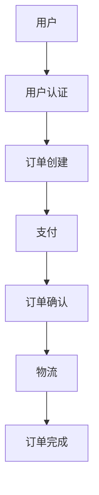

                 


# 彼得林奇的"价值创造"在平台经济中的衡量

> 关键词：彼得林奇，价值创造，平台经济，用户价值，投资回报率，撮合效率，系统架构

> 摘要：本文深入探讨了彼得林奇的"价值创造"理论在平台经济中的应用与衡量方法。通过分析平台经济的核心特征、价值创造的量化指标、算法原理与数学模型、系统架构设计以及项目实战案例，本文旨在为投资者和平台管理者提供理论支持与实践指导。

---

## 第一部分: 彼得林奇的"价值创造"理论概述

### 第1章: 彼得林奇的"价值创造"理论基础

#### 1.1 价值创造的定义与核心要素
价值创造是指通过企业的经营和投资活动，为用户或股东创造超出投入资源的价值。其核心要素包括：

1. **用户价值**：用户通过平台获得的实际利益。
2. **交易效率**：平台撮合交易的能力。
3. **企业盈利能力**：企业的长期盈利能力。

#### 1.2 彼得林奇的价值投资理念
彼得林奇强调，投资的本质是寻找能够持续创造价值的企业。他关注企业的基本面，包括市场需求、竞争优势和管理团队。

#### 1.3 平台经济的基本概念与特征
平台经济是一种依赖数字技术构建的商业模式，其特征包括：

1. **双边市场**：连接供需双方。
2. **网络效应**：用户数量增加，平台价值提升。
3. **数据驱动**：通过数据分析优化运营。

---

### 第2章: 价值创造在平台经济中的衡量方法

#### 2.1 平台经济中的价值衡量维度
价值创造的衡量可以从以下几个维度进行：

1. **用户价值**：通过用户留存率和活跃度衡量。
2. **交易效率**：通过成交笔数和撮合效率衡量。
3. **平台的撮合能力**：通过订单完成率衡量。
4. **企业的长期盈利能力**：通过净利润和投资回报率衡量。

#### 2.2 价值创造的量化指标
常用的量化指标包括：

1. **用户增长率**：用户数量的增长速度。
2. **用户留存率**：用户持续使用平台的比例。
3. **交易额（GMV）**：一定时期内平台上的交易总额。
4. **每用户平均收入（ARPU）**：每位用户带来的平均收入。
5. **净利润与投资回报率（ROI）**：企业的盈利能力。

---

### 第3章: 价值创造的算法原理与数学模型

#### 3.1 价值创造的算法原理
价值创造的算法通常包括以下步骤：

1. **数据收集**：收集用户行为数据和交易数据。
2. **数据处理**：清洗数据，提取关键指标。
3. **模型构建**：基于数学模型计算价值创造。
4. **结果分析**：分析结果并优化模型。

#### 3.2 数学模型与公式
以下是常用的数学公式：

1. **用户价值计算公式**：
$$ \text{用户价值} = \text{用户留存率} \times \text{用户活跃度} \times \text{交易频率} $$

2. **平台撮合效率计算公式**：
$$ \text{撮合效率} = \frac{\text{实际成交笔数}}{\text{潜在成交笔数}} $$

3. **投资回报率计算公式**：
$$ \text{ROI} = \frac{\text{净利润}}{\text{投资成本}} \times 100\% $$

---

### 第4章: 平台经济中的系统架构设计

#### 4.1 系统功能设计
平台系统主要包括以下几个功能模块：

1. **用户模块**：用户注册、登录、个人信息管理。
2. **交易模块**：订单创建、支付、订单状态查询。
3. **数据分析模块**：数据收集、分析、可视化。
4. **支付与结算模块**：支付处理、资金结算。

#### 4.2 系统架构图
以下是平台系统的架构图：



#### 4.3 系统接口设计
平台系统的主要接口包括：

1. **用户接口**：用户登录、注册、信息查询。
2. **交易接口**：订单创建、取消、查询。
3. **支付接口**：支付请求、支付结果通知。
4. **数据接口**：数据收集、分析结果返回。

---

### 第5章: 项目实战与案例分析

#### 5.1 环境安装与配置
开发环境搭建步骤如下：

1. **安装Python**：选择合适的Python版本，安装并配置环境。
2. **安装依赖库**：使用pip安装必要的库，如pandas、numpy、scikit-learn。

#### 5.2 核心代码实现
以下是用户价值计算的Python代码示例：

```python
import pandas as pd

# 数据加载
data = pd.read_csv('user_data.csv')

# 用户留存率计算
retention_rate = data['user_retained'].mean()

# 用户活跃度计算
activity = data['user_active'].mean()

# 用户价值计算
user_value = retention_rate * activity * data['transaction_frequency'].mean()

print(f"用户价值：{user_value}")
```

#### 5.3 案例分析
以滴滴出行为例，分析其价值创造的实现：

1. **用户价值**：通过高频使用和高留存率，滴滴提高了用户价值。
2. **撮合效率**：通过智能匹配算法，滴滴提升了订单撮合效率。
3. **盈利能力**：通过规模效应和成本优化，滴滴实现了盈利增长。

---

### 第6章: 最佳实践与注意事项

#### 6.1 投资与运营
1. **关注用户留存率**：高留存率是平台持续价值创造的关键。
2. **优化交易撮合算法**：通过技术手段提升订单匹配效率。
3. **数据驱动决策**：利用数据分析优化运营策略。

---

## 第七章: 小结

彼得林奇的"价值创造"理论为平台经济的衡量提供了重要思路。通过量化指标、算法模型和系统架构的设计，我们可以更好地评估平台的价值创造能力。未来，随着技术的进步，平台经济的价值创造将更加智能化和数据化。

---

作者：AI天才研究院/AI Genius Institute & 禅与计算机程序设计艺术 /Zen And The Art of Computer Programming

