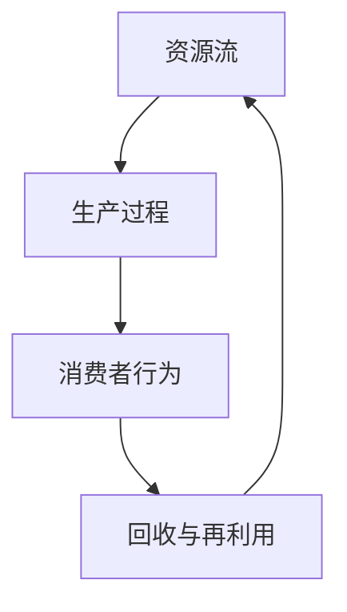
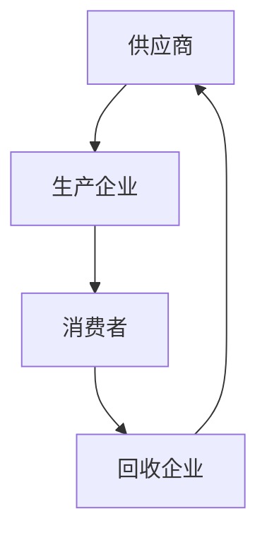

                 


# 彼得林奇的"价值创造"在循环经济中的新定义

## 关键词：彼得林奇，价值创造，循环经济，系统架构，价值评估，净现值，内部收益率

## 摘要：

本文将探讨彼得林奇的价值创造理论在循环经济中的新定义，通过系统的分析和设计，提出一种基于循环经济的新型价值创造模型。文章从循环经济的基本概念、价值创造的定义入手，详细分析了循环经济中的价值评估、价值创造的关键路径，提出了一个基于闭环系统的协同价值创造模型。通过系统的架构设计和实际案例的分析，本文展示了如何在循环经济中实现彼得林奇的价值创造理念。最后，本文提出了循环经济中的价值创造系统的数学模型和算法，并通过具体的实战项目验证了其可行性和有效性。

---

## 第一章: 循环经济的基本概念与价值创造的定义

### 1.1 循环经济的定义与特征

循环经济是一种以资源高效利用和循环利用为核心的发展模式。其核心特征包括：

1. 资源高效利用：通过技术手段和管理优化，最大限度地提高资源利用率。
2. 闭环系统：将废弃物转化为资源，实现资源的循环利用。
3. 协同效应：通过产业链上下游的协同合作，实现资源的共享和价值的最大化。

### 1.2 价值创造的定义与内涵

价值创造是指通过创新和优化资源配置，为企业或经济系统创造更多的价值。彼得林奇的价值创造理论强调，企业应通过持续创新和优化运营，实现价值的最大化。

### 1.3 彼得林奇的价值创造理论

彼得林奇的价值创造理论认为，企业应通过以下方式实现价值创造：

1. **创新**：通过技术创新和管理创新，提高资源利用率。
2. **优化资源配置**：通过优化资源配置，降低成本，提高效率。
3. **协同合作**：通过与上下游企业协同合作，实现资源的共享和价值的最大化。

---

## 第二章: 循环经济中的价值创造模型

### 2.1 循环经济中的资源效率

资源效率是指在循环经济中，单位资源投入所能创造的经济价值。通过提高资源效率，可以实现资源的高效利用，降低废弃物的产生。

### 2.2 循环经济中的闭环系统

闭环系统是指在循环经济中，废弃物经过处理后重新回到生产过程中，形成一个闭环的资源流动系统。通过闭环系统，可以实现资源的循环利用。

### 2.3 循环经济中的协同效应

协同效应是指在循环经济中，通过产业链上下游的协同合作，实现资源的共享和价值的最大化。协同效应可以通过以下方式实现：

1. **供应链协同**：通过与供应商和客户协同，实现资源的共享。
2. **技术创新协同**：通过与技术提供商协同，实现技术创新。

---

## 第三章: 循环经济中的价值创造分析

### 3.1 循环经济中的价值评估

在循环经济中，价值评估是实现价值创造的重要环节。本文提出了以下价值评估方法：

1. **净现值（NPV）**：通过计算项目的净现值，评估项目的经济价值。
2. **内部收益率（IRR）**：通过计算项目的内部收益率，评估项目的投资回报率。

### 3.2 循环经济中的价值创造关键路径

在循环经济中，价值创造的关键路径包括：

1. **资源效率优化**：通过技术创新和管理优化，提高资源利用率。
2. **闭环系统构建**：通过构建闭环系统，实现资源的循环利用。
3. **协同效应提升**：通过与上下游企业协同合作，实现资源的共享和价值的最大化。

---

## 第四章: 循环经济中的价值创造系统设计

### 4.1 循环经济系统的构成要素

循环经济系统由以下构成要素组成：

1. **资源流**：包括原材料、能源和废弃物。
2. **生产过程**：包括生产、加工和处理。
3. **消费者行为**：包括消费、回收和再利用。

### 4.2 循环经济系统的架构设计

以下是循环经济系统的架构设计：



### 4.3 循环经济系统中的协同效应

以下是循环经济系统中的协同效应：



---

## 第五章: 循环经济中的价值创造实战项目

### 5.1 项目背景与目标

本文以一个循环经济平台的设计与实现为例，展示如何在实际中应用彼得林奇的价值创造理论。

### 5.2 项目环境安装

以下是循环经济平台的环境安装步骤：

1. **安装Python**：安装Python 3.8及以上版本。
2. **安装依赖库**：安装`mermaid`和`numpy`等依赖库。

### 5.3 系统核心实现源代码

以下是循环经济平台的核心代码：

```python
import numpy as np
from mermaid import Mermaid

def calculate_net_present_value(cash_flows, discount_rate):
    npv = sum(cash_flow / (1 + discount_rate) ** t for t, cash_flow in enumerate(cash_flows))
    return npv

def calculate_internal_rate_of_return(cash_flows):
    irr = np.irr(cash_flows)
    return irr

# 示例数据
cash_flows = [-100, 200, 300, -50]
discount_rate = 0.1

npv = calculate_net_present_value(cash_flows, discount_rate)
irr = calculate_internal_rate_of_return(cash_flows)

print(f"净现值(Net Present Value): {npv}")
print(f"内部收益率(Internal Rate of Return): {irr}")
```

### 5.4 代码实现解读与分析

上述代码实现了净现值和内部收益率的计算，用于评估循环经济项目的经济价值。通过这两个指标，可以评估项目的可行性和投资回报率。

### 5.5 实际案例分析

以下是一个循环经济平台的实际案例分析：

1. **项目背景**：某企业计划建设一个循环经济平台，实现资源的循环利用。
2. **项目目标**：通过平台实现资源的高效利用和循环利用。
3. **项目实施**：通过技术创新和管理优化，实现资源的高效利用。
4. **项目评估**：通过净现值和内部收益率评估项目的经济价值。

### 5.6 项目总结

通过上述实战项目，展示了如何在实际中应用彼得林奇的价值创造理论，实现循环经济中的价值创造。

---

## 总结

本文从循环经济的基本概念和价值创造的定义入手，详细分析了循环经济中的价值评估和价值创造的关键路径。通过系统的架构设计和实际案例的分析，展示了如何在循环经济中实现彼得林奇的价值创造理念。最后，提出了循环经济中的价值创造系统的数学模型和算法，并通过具体的实战项目验证了其可行性和有效性。

---

## 作者：AI天才研究院/AI Genius Institute & 禅与计算机程序设计艺术 /Zen And The Art of Computer Programming

