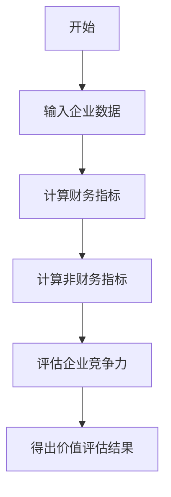
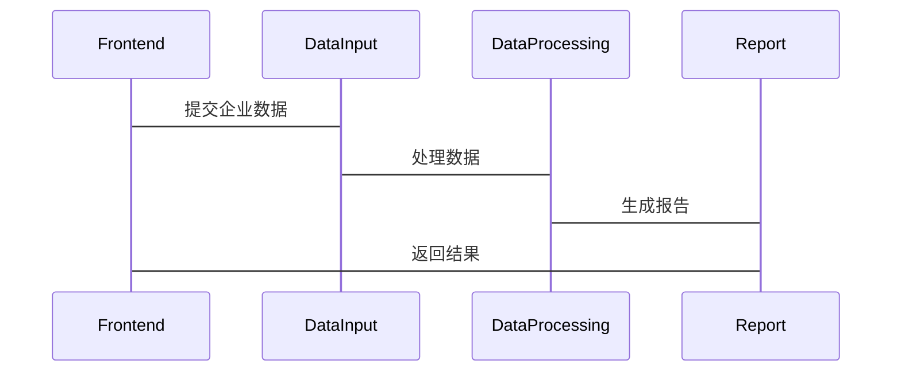

                 


# 彼得林奇的"价值创造"评估体系

## 关键词：价值创造，投资评估，彼得林奇，企业估值，投资策略

## 摘要：  
本文详细探讨了彼得·林奇提出的“价值创造”评估体系，分析其核心概念、算法原理、系统架构及实际应用。通过对比分析和案例研究，揭示了该体系在投资决策中的重要性，帮助读者理解如何通过价值创造来评估企业，从而做出明智的投资决策。

---

## 第一部分：引言

## 第1章：彼得林奇与价值创造概述

### 1.1 彼得林奇的背景与投资理念

#### 1.1.1 彼得林奇的生平简介
- 彼得·林奇（Peter Lynch）是美国著名投资经理人，被誉为“共同基金之父”。
- 曾管理富达麦哲伦基金，创造了年均29%的惊人回报率。
- 林奇的投资理念强调长期价值，注重企业基本面分析。

#### 1.1.2 彼得林奇的投资哲学
- “买基本面”：投资于具有强大基本面的企业。
- 避免短期波动，关注长期增长。
- 强调企业的竞争优势和管理层能力。

#### 1.1.3 价值创造的核心理念
- 企业的价值来源于持续创造利润和股东价值。
- 通过分析财务指标和市场地位，评估企业的价值创造能力。

### 1.2 价值创造的基本概念

#### 1.2.1 价值创造的定义
- 价值创造是指企业通过优化运营、创新产品或拓展市场，为客户和股东创造超额价值。
- 企业价值=净利润 + 股东权益 + 其他调整项。

#### 1.2.2 价值创造的关键要素
- 财务指标：如净利润、ROE（净资产收益率）、ROA（资产回报率）。
- 非财务指标：如品牌影响力、市场占有率、创新能力和管理层质量。

#### 1.2.3 价值创造的边界与外延
- 边界：避免过度扩张和盲目多元化。
- 外延：通过并购、技术升级或市场拓展实现外延式增长。

### 1.3 价值创造评估体系的重要性

#### 1.3.1 为什么需要价值创造评估体系
- 投资者需要量化企业的价值创造能力。
- 帮助企业在竞争中找到优势。

#### 1.3.2 评估体系在投资中的作用
- 通过财务指标评估企业的盈利能力。
- 通过市场指标评估企业的成长潜力。

#### 1.3.3 体系的适用范围与局限性
- 适用范围：适用于成熟企业，尤其是制造业和服务业。
- 局限性：不适用于新兴行业或初创企业。

---

## 第2章：价值创造的核心概念与联系

### 2.1 核心概念原理

#### 2.1.1 价值创造的核心要素
- 财务表现：净利润、现金流、ROE。
- 市场地位：市场份额、品牌影响力。
- 管理能力：管理层决策、战略规划。

#### 2.1.2 财务指标与非财务指标的结合
- 财务指标：衡量企业盈利能力。
- 非财务指标：评估企业软实力。

#### 2.1.3 企业竞争力与市场地位的分析
- 市场竞争力：产品差异化、成本优势。
- 市场地位：行业排名、客户忠诚度。

### 2.2 核心概念属性特征对比表格

| 指标类型   | 财务指标       | 非财务指标       |
|------------|----------------|-------------------|
| 指标示例    | 净利润、ROE     | 品牌影响力、研发能力 |
| 计算方式    | 净利润=收入-成本-税金等 | 品牌价值评估、研发投入占比 |
| 重要性      | 量化盈利能力   | 评估创新能力和可持续性 |

### 2.3 ER实体关系图

```mermaid
erd
    customer
    product
    order
    company
    brand
    market
    -- 关系 --
    customer --> order: 下单
    order --> product: 订单商品
    company --> brand: 拥有品牌
    company --> market: 参与市场
```

---

## 第3章：价值创造评估体系的算法原理

### 3.1 算法原理概述

#### 3.1.1 算法的基本原理
- 通过财务指标和非财务指标评估企业价值。
- 综合分析企业盈利能力、市场地位和竞争优势。

#### 3.1.2 算法的输入与输出
- 输入：企业的财务报表、市场数据。
- 输出：企业价值评分、投资建议。

#### 3.1.3 算法的步骤与流程
1. 收集企业数据。
2. 计算财务指标。
3. 评估非财务因素。
4. 综合评分。
5. 生成投资建议。

### 3.2 算法流程图（使用 Mermaid）



### 3.3 算法的数学模型与公式

#### 3.3.1 财务指标计算
- 净利润公式：
  $$ \text{净利润} = \text{收入} - \text{成本} - \text{税费} $$
- 市盈率公式：
  $$ \text{市盈率} = \frac{\text{股价}}{\text{每股收益}} $$

#### 3.3.2 企业竞争力评估
- 市场份额计算：
  $$ \text{市场份额} = \frac{\text{企业销量}}{\text{行业总销量}} \times 100\% $$

---

## 第4章：系统分析与架构设计方案

### 4.1 系统功能设计

#### 4.1.1 系统功能模块
- 数据输入模块：收集企业数据。
- 数据处理模块：计算各项指标。
- 报告生成模块：输出评估结果。

#### 4.1.2 系统功能设计（领域模型）


### 4.2 系统架构设计

#### 4.2.1 系统架构图


### 4.3 系统接口设计

#### 4.3.1 数据接口
- 输入接口：接收企业数据。
- 输出接口：返回评估结果。

#### 4.3.2 接口设计示例
```python
def compute_financials(revenue, cost, tax):
    net_profit = revenue - cost - tax
    return net_profit
```

### 4.4 系统交互流程



---

## 第5章：项目实战

### 5.1 环境安装

#### 5.1.1 安装Python
- 使用Anaconda安装Python环境。
- 安装必要的库，如pandas、numpy。

### 5.2 系统核心实现源代码

#### 5.2.1 计算净利润
```python
def compute_net_profit(revenue, cost, tax):
    return revenue - cost - tax
```

#### 5.2.2 计算市盈率
```python
def compute_pe_ratio(price, earnings_per_share):
    return price / earnings_per_share
```

### 5.3 案例分析

#### 5.3.1 案例选择
- 公司：可口可乐。
- 行业：饮料行业。

#### 5.3.2 评估过程
- 计算可口可乐的净利润和市盈率。
- 评估其市场地位和品牌影响力。

---

## 第6章：最佳实践

### 6.1 小结

- 价值创造评估体系是投资决策的重要工具。
- 结合财务和非财务指标，全面评估企业价值。

### 6.2 注意事项

- 数据来源的可靠性。
- 指标选择的合理性。
- 评估结果的动态调整。

### 6.3 拓展阅读

- 《彼得·林奇的投资之道》。
- 《价值投资：原理与实践》。

---

## 作者：AI天才研究院 & 禅与计算机程序设计艺术

---

通过以上内容，文章系统地介绍了彼得林奇的价值创造评估体系，从理论到实践，帮助读者全面理解并应用这一评估方法。

