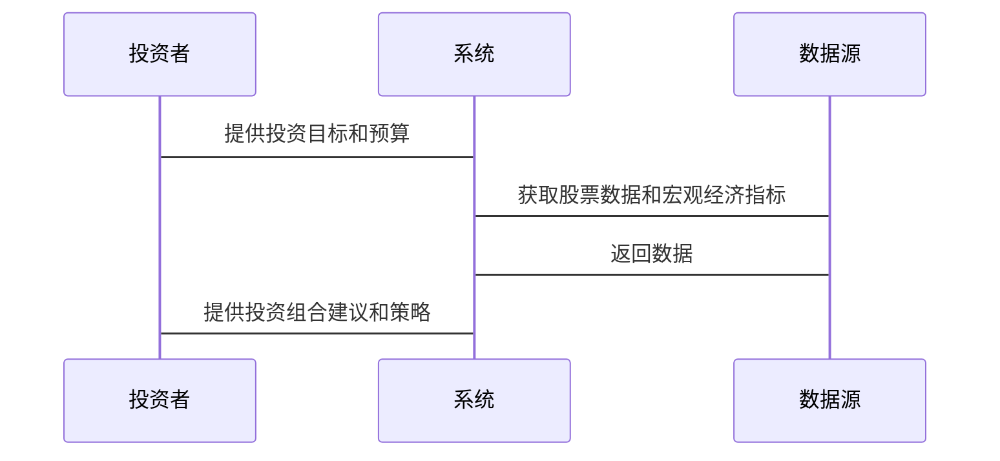

                 


# 彼得林奇的"价值投资"在不同经济周期的应用

## 关键词：
- 彼得·林奇，价值投资，经济周期，投资策略，股票分析

## 摘要：
本文深入探讨了彼得·林奇的价值投资理念在不同经济周期中的应用。通过分析经济周期的各个阶段，揭示了如何调整投资策略以适应市场变化，帮助投资者在不同环境下做出明智的投资决策。

---

# 第一部分: 价值投资与经济周期的背景

## 第1章: 价值投资的基本概念

### 1.1 价值投资的定义与核心理念
- **1.1.1 投资的基本概念**
  - 投资是将资金投入到能够产生收益的资产中，如股票、债券、房地产等。
  - 投资的目标是通过资产增值或收益最大化，实现财富增长。
  - 投资者需要关注市场趋势、企业基本面和宏观经济环境。

- **1.1.2 价值投资的定义**
  - 价值投资是一种以基本面分析为基础的投资策略，强调购买被市场低估的资产。
  - 投资者关注企业的内在价值，而非市场的短期波动。
  - 价值投资的核心理念是寻找“烟屁股”股票，即具有低估值、高分红的公司。

- **1.1.3 彼得·林奇的价值投资理念**
  - 彼得·林奇是价值投资的代表人物之一，强调长期投资和选择具有强大基本面的公司。
  - 他认为，投资者应该投资于自己理解的公司，并长期持有，避免频繁交易。
  - 林奇强调安全边际，即购买价格低于内在价值，以降低风险。

### 1.2 彼得·林奇的生平与成就
- **1.2.1 彼得·林奇的个人经历**
  - 彼得·林奇出生于美国马萨诸塞州，毕业于宾夕法尼亚大学和哈佛商学院。
  - 他是富达投资集团的共同基金 manager，管理着麦哲伦基金，创造了卓越的投资业绩。
  - 林奇以其成功的投资策略和对市场的深刻理解而闻名。

- **1.2.2 彼得·林奇的投资风格**
  - 价值投资：林奇注重基本面分析，寻找被市场低估的公司。
  - 长期投资：他主张长期持有优质资产，避免短期市场波动的干扰。
  - 分散投资：通过投资多个行业和公司，降低风险。

- **1.2.3 彼得·林奇的经典投资案例**
  - **案例1：美国运通**：林奇在20世纪80年代买入美国运通股票，因为该公司具有强大的竞争优势和低估的股价。
  - **案例2：可口可乐**：林奇长期持有可口可乐，认为该公司具有稳定的收益和强大的品牌影响力。
  - **案例3：IBM**：林奇在IBM股价低迷时买入，认为该公司具有技术创新能力和市场领导地位。

### 1.3 经济周期的基本概念
- **1.3.1 经济周期的定义**
  - 经济周期是指经济活动的波动，通常分为扩张期、衰退期、复苏期和稳定期。
  - 经济周期对市场和企业的影响深远，投资者需要根据周期调整投资策略。

- **1.3.2 经济周期的阶段划分**
  - **扩张期**：经济快速增长，企业盈利上升，市场情绪乐观。
  - **衰退期**：经济增速放缓，企业盈利下降，市场情绪低迷。
  - **复苏期**：经济开始恢复，企业盈利逐步回升。
  - **稳定期**：经济保持平稳增长，市场波动较小。

- **1.3.3 不同经济周期对投资的影响**
  - 在扩张期，高增长行业（如科技、消费）表现较好。
  - 在衰退期，防御性行业（如公用事业、医疗）可能更具投资价值。
  - 在复苏期，周期性行业（如制造业、房地产）可能反弹。
  - 在稳定期，平衡型投资策略更为适合。

---

## 第2章: 价值投资的核心概念与联系

### 2.1 价值投资的核心原理
- **2.1.1 内在价值的计算**
  - 内在价值是指公司未来现金流的现值，是评估股票价值的重要指标。
  - 计算公式：
    $$ \text{内在价值} = \sum_{t=1}^{\infty} \frac{\text{现金流}_t}{(1 + r)^t} $$
  - 其中，\( r \) 是折现率，通常基于市场的无风险利率和风险溢价。

- **2.1.2 安全边际的概念**
  - 安全边际是指购买价格低于内在价值的部分，用于降低投资风险。
  - 林奇建议投资者购买价格至少低于内在价值的20%，以确保安全边际。

- **2.1.3 市场先生的比喻**
  - 林奇将市场比作“市场先生”，认为市场的短期波动反映了非理性投资者的行为。
  - 投资者应利用市场的非理性波动，寻找低估的资产。

### 2.2 经济周期与价值投资的关系
- **2.2.1 经济周期对市场的影响**
  - 在扩张期，市场情绪乐观，股票估值可能偏高。
  - 在衰退期，市场情绪悲观，股票估值可能被低估。
  - 在复苏期，市场情绪逐渐恢复，股票估值可能逐步回升。
  - 在稳定期，市场情绪平稳，股票估值趋于合理。

- **2.2.2 不同经济周期下价值投资的策略调整**
  - **扩张期**：选择具有高增长潜力的公司，关注市盈率和市净率。
  - **衰退期**：寻找基本面稳固、估值低的公司，关注股息率。
  - **复苏期**：逐步增加对周期性行业的投资，关注行业复苏的信号。
  - **稳定期**：均衡投资，关注具有稳定收益的公司。

- **2.2.3 经济周期与企业估值的关系**
  - 在扩张期，企业估值可能偏高，需要谨慎选择。
  - 在衰退期，企业估值可能被低估，提供投资机会。
  - 在复苏期，企业估值逐步回升，投资机会增加。
  - 在稳定期，企业估值趋于合理，投资机会较为均衡。

### 2.3 核心概念对比表格
- **2.3.1 不同经济周期下的投资策略对比**

| 经济周期阶段 | 投资策略                        | 关注点                          |
|--------------|--------------------------------|----------------------------------|
| 扩张期       | 选择高增长行业，关注市盈率     | 科技、消费、金融                 |
| 衰退期       | 寻找低估公司，关注股息率       | 公用事业、医疗、能源             |
| 复苏期       | 逐步增加周期性行业投资         | 制造业、房地产                   |
| 稳定期       | 均衡投资，关注稳定收益         | 非周期性行业，如消费品、科技     |

- **2.3.2 不同行业在经济周期中的表现对比**

| 行业         | 经济周期阶段 | 表现               |
|--------------|--------------|--------------------|
| 科技行业     | 扩张期       | 高增长              |
| 公用事业     | 衰退期       | 稳定收益            |
| 制造业       | 复苏期       | 逐步复苏            |
| 非必需消费品 | 稳定期       | 稳定增长            |

### 2.4 实体关系图（ER图）

```mermaid
erd
 投资者
    + 投资组合: 投资者持有的股票
    + 市场: 投资者参与的股票市场
    + 经济周期: 当前的经济周期阶段
    + 公司: 投资的公司

 公司
    + 股票: 公司发行的股票
    + 内在价值: 公司的未来现金流现值
    + 市场价值: 公司股票的当前市场价格

 市场
    + 股票价格: 股票的当前市场价格
    + 市场情绪: 市场投资者的整体情绪

 经济周期
    + 阶段: 当前的经济周期阶段
    + 影响: 对市场和公司的具体影响
```

---

## 第3章: 价值投资的算法原理

### 3.1 价值投资的量化分析
- **3.1.1 市盈率（P/E）的计算与应用**
  - 市盈率公式：
    $$ \text{市盈率} = \frac{\text{股价}}{\text{每股收益}} $$
  - 市盈率反映了市场对公司盈利能力的估值，通常用于比较不同公司的相对估值。

- **3.1.2 市净率（P/B）的计算与应用**
  - 市净率公式：
    $$ \text{市净率} = \frac{\text{股价}}{\text{每股净资产}} $$
  - 市净率适用于评估资产密集型行业的公司，如银行、房地产。

- **3.1.3 股息率的计算与应用**
  - 股息率公式：
    $$ \text{股息率} = \frac{\text{每股股息}}{\text{股价}} $$
  - 股息率高的公司通常具有稳定的收益和较低的增长潜力。

### 3.2 内在价值的计算方法
- **3.2.1 自由现金流的计算**
  - 自由现金流公式：
    $$ \text{自由现金流} = \text{营业收入} - \text{运营成本} - \text{资本支出} $$
  - 自由现金流是评估公司财务健康状况的重要指标。

- **3.2.2 折现率的确定**
  - 折现率通常基于无风险利率和风险溢价，公式为：
    $$ \text{折现率} = \text{无风险利率} + \text{风险溢价} $$
  - 无风险利率通常取国债收益率，风险溢价根据行业和公司风险确定。

- **3.2.3 内在价值的公式推导**
  - 内在价值公式：
    $$ \text{内在价值} = \sum_{t=1}^{\infty} \frac{\text{自由现金流}_t}{(1 + r)^t} $$
  - 通过计算未来现金流的现值，确定股票的合理估值。

### 3.3 算法流程图（mermaid）

```mermaid
graph TD
    A[开始] -> B[计算自由现金流]
    B -> C[确定折现率]
    C -> D[计算内在价值]
    D -> E[比较市场价格与内在价值]
    E -> F[决定是否投资]
    F -> G[结束]
```

---

## 第4章: 系统分析与架构设计方案

### 4.1 项目介绍
- 本项目旨在构建一个基于彼得·林奇价值投资理念的投资决策系统，帮助投资者在不同经济周期中选择合适的投资策略。

### 4.2 系统功能设计
- **数据收集模块**
  - 收集股票的财务数据、市场数据和经济指标。
  - 数据来源包括股票市场、财务报表和宏观经济数据。

- **分析模块**
  - 计算市盈率、市净率和股息率等指标。
  - 评估公司的内在价值和安全边际。
  - 确定当前的经济周期阶段。

- **策略制定模块**
  - 根据经济周期和公司基本面，制定投资策略。
  - 生成投资组合建议。

### 4.3 系统架构设计
- **分层架构**
  - 数据层：存储股票数据和宏观经济指标。
  - 业务逻辑层：处理数据和计算指标。
  - 用户界面层：展示分析结果和投资建议。

### 4.4 系统接口设计
- **API接口**
  - 数据接口：从外部数据源获取股票数据。
  - 计算接口：计算市盈率、市净率和内在价值。
  - 策略接口：根据经济周期制定投资策略。

### 4.5 系统交互流程图（mermaid）



---

## 第5章: 项目实战

### 5.1 环境安装
- **工具安装**
  - 安装Python和必要的库（如pandas、numpy、scikit-learn）。
  - 安装Jupyter Notebook用于数据分析和可视化。

### 5.2 核心代码实现
- **数据收集**
  ```python
  import pandas as pd
  import numpy as np

  # 示例数据：假设我们有以下数据
  data = {
      '公司名称': ['公司A', '公司B', '公司C'],
      '股价': [50, 30, 40],
      '每股收益': [10, 5, 8],
      '每股净资产': [20, 15, 12],
      '自由现金流': [100, 50, 80],
      '无风险利率': [0.05, 0.05, 0.05],
      '风险溢价': [0.05, 0.05, 0.05]
  }

  df = pd.DataFrame(data)
  ```

- **内在价值计算**
  ```python
  def calculate_intrinsic_value(fcf, discount_rate):
      # 假设自由现金流以固定增长率为5%
      growth_rate = 0.05
      return fcf / (discount_rate - growth_rate)

  df['折现率'] = df['无风险利率'] + df['风险溢价']
  df['内在价值'] = df.apply(lambda x: calculate_intrinsic_value(x['自由现金流'], x['折现率']), axis=1)
  ```

- **投资决策**
  ```python
  df['投资建议'] = df.apply(lambda x: '买入' if x['股价'] < x['内在价值'] else '卖出', axis=1)
  ```

### 5.3 案例分析
- **案例：经济衰退期的投资决策**
  - 市场处于衰退期，投资者选择防御性行业，如公用事业。
  - 通过计算市盈率和股息率，选择股息率高且股价低于内在价值的公司。

### 5.4 详细解读与分析
- **数据可视化**
  - 使用matplotlib绘制市盈率和股价的关系图。
  - 使用seaborn绘制箱线图，展示不同行业公司的市盈率分布。

### 5.5 项目小结
- 通过项目实战，投资者可以掌握价值投资的核心算法和策略。
- 学会如何在不同经济周期中调整投资组合，降低风险并提高收益。

---

## 第6章: 总结与展望

### 6.1 总结
- 彼得·林奇的价值投资理念强调基本面分析和长期投资。
- 在不同经济周期中，投资者需要根据市场环境调整投资策略。
- 通过量化分析和系统设计，可以更科学地进行投资决策。

### 6.2 展望
- 随着人工智能和大数据技术的发展，价值投资将更加精准和高效。
- 未来的投资决策将结合传统价值分析和现代技术手段，提供更强大的工具和方法。

---

## 注意事项
- 价值投资需要长期坚持，避免短期波动的干扰。
- 投资者应根据自身的风险承受能力和投资目标制定策略。
- 在实际操作中，建议结合多种投资策略，分散风险。

---

## 最佳实践 tips
- 定期复盘投资组合，评估策略的有效性。
- 关注宏观经济指标，及时调整投资策略。
- 学习行业动态，了解公司基本面。

---

## 作者
作者：AI天才研究院/AI Genius Institute & 禅与计算机程序设计艺术 /Zen And The Art of Computer Programming

