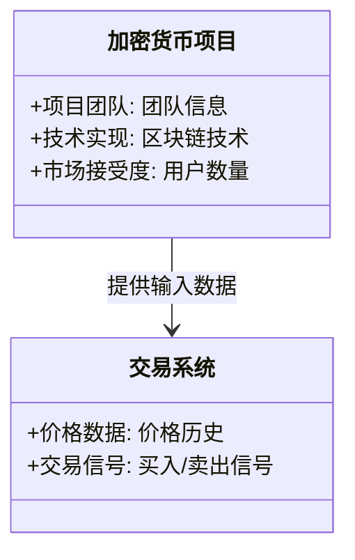
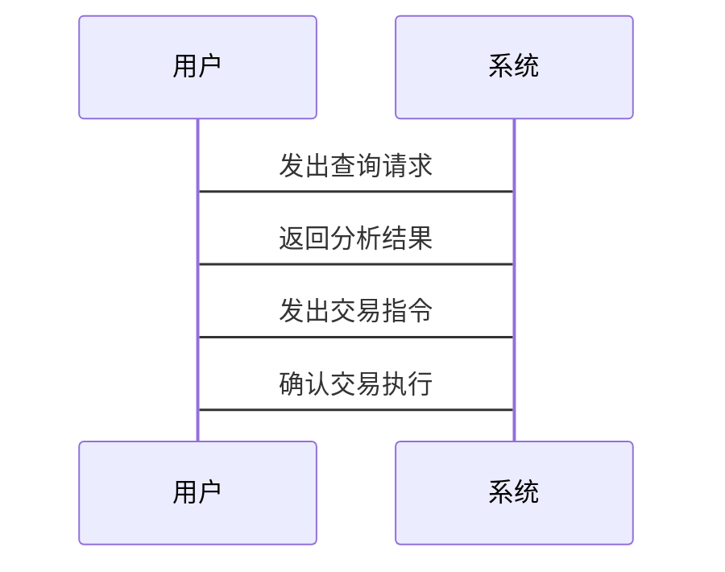

                 


# 彼得林奇的"价值投资"在加密货币时代的新思考

> **关键词**: 价值投资, 加密货币, 彼得林奇, 算法交易, 量化分析

> **摘要**: 本文探讨了彼得林奇的价值投资理念在加密货币时代的应用与演变。通过对加密货币市场的特点分析，结合传统价值投资的核心理念，提出了新的价值评估方法和量化交易策略。文章详细介绍了算法交易的实现原理，提供了实际案例分析，并总结了加密货币时代价值投资的新方向。

---

## 第1章: 加密货币的兴起与价值投资的演变

### 1.1 加密货币的定义与特点

#### 1.1.1 加密货币的基本概念
加密货币是一种基于密码学技术的数字货币，具有去中心化、匿名性和不可篡改的特点。与传统货币不同，加密货币通过区块链技术实现价值的点对点传输。

#### 1.1.2 加密货币的核心特点
- **去中心化**: 不依赖于中央银行或金融机构，通过区块链技术实现价值转移。
- **匿名性**: 交易记录在区块链上公开，但用户身份匿名。
- **可编程性**: 加密货币可以通过智能合约实现自动化交易和价值转移。

#### 1.1.3 加密货币与传统货币的对比
| 特性         | 加密货币                     | 传统货币                   |
|--------------|------------------------------|-----------------------------|
| 中心化程度   | 去中心化                     | 中心化                     |
| 交易速度     | 快速                        | 较慢                      |
| 成本          | 低                          | 高                          |
| 安全性        | 高（区块链技术）             | 中等                      |

### 1.2 价值投资的核心理念

#### 1.2.1 价值投资的定义与历史
价值投资是一种长期投资策略，强调以低于内在价值的价格买入优质资产。彼得林奇是该领域的代表人物，他通过深入研究公司基本面，寻找被市场低估的投资标的。

#### 1.2.2 彼得林奇的价值投资策略
彼得林奇的核心策略包括：
1. **基本面分析**: 通过研究公司财务数据、行业地位和管理层能力，寻找具有持续盈利能力和成长性的公司。
2. **分散投资**: 避免过度集中投资，降低风险。
3. **长期持有**: 不盲目追涨杀跌，耐心等待价值回归。

#### 1.2.3 价值投资在现代金融中的应用
价值投资不仅是选股策略，更是一种投资哲学。在传统金融中，价值投资帮助投资者在市场波动中实现长期收益。

### 1.3 加密货币时代的价值投资新思考

#### 1.3.1 加密货币市场的特点
- **高波动性**: 加密货币价格波动剧烈，短期内可能暴涨或暴跌。
- **市场参与者多样性**: 包括机构投资者、散户和矿工等。
- **技术创新驱动**: 区块链技术的不断进步推动市场发展。

#### 1.3.2 传统价值投资在加密货币中的适用性
- **优势**: 价值投资的长期视角和基本面分析方法在加密货币市场中仍然有效。
- **挑战**: 加密货币市场的高波动性和去中心化特性增加了分析难度。

#### 1.3.3 加密货币时代价值投资的演变
加密货币时代，价值投资需要结合技术分析和量化方法。投资者需要关注项目的技术实现、社区支持和市场接受度。

---

## 第2章: 加密货币的价值评估方法

### 2.1 传统价值投资的评估指标

#### 2.1.1 市盈率（P/E）与市净率（P/B）
- **市盈率**: 用于衡量股票价格与每股收益的比率，反映市场对公司盈利能力的预期。
- **市净率**: 用于衡量股票价格与每股净资产的比率，反映市场对公司资产价值的评估。

#### 2.1.2 股息率与股息支付率
- **股息率**: 每股股息与股票价格的比率，反映投资回报率。
- **股息支付率**: 股息支付与公司净利润的比率，反映公司的分红能力。

#### 2.1.3 企业盈利能力和成长性
- **盈利能力**: 通过净利润率、毛利率等指标衡量。
- **成长性**: 通过收入增长率、净利润增长率等指标衡量。

### 2.2 加密货币的价值评估模型

#### 2.2.1 市场供需模型
市场供需模型认为，加密货币的价格由市场供需关系决定。供需模型可以通过交易量和市场深度分析来预测价格走势。

#### 2.2.2 技术分析与基本面分析的结合
- **技术分析**: 通过价格走势、成交量等技术指标预测市场走势。
- **基本面分析**: 通过项目团队、技术实现、市场接受度等基本面因素评估项目价值。

#### 2.2.3 加密货币项目的团队与背景评估
- **团队实力**: 项目团队的经验、背景和过往成就。
- **社区支持**: 社区活跃度、参与度和共识程度。

### 2.3 加密货币市场的波动性与风险管理

#### 2.3.1 加密货币市场的波动性特点
加密货币市场波动剧烈，价格受市场情绪和新闻事件影响较大。

#### 2.3.2 价值投资中的风险管理策略
- **分散投资**: 通过投资不同类型的加密货币降低风险。
- **止损策略**: 设置止损点，避免亏损过大。

#### 2.3.3 加密货币市场的周期性分析
加密货币市场具有周期性，投资者需要关注市场周期变化，抓住投资机会。

---

## 第3章: 量化分析与算法交易

### 3.1 量化分析的基本原理

#### 3.1.1 数据收集与清洗
- **数据来源**: 交易所API、区块链浏览器等。
- **数据清洗**: 去除异常值、填补缺失值。

#### 3.1.2 数据特征提取与建模
- **特征提取**: 通过技术指标、市场情绪等特征提取有用信息。
- **建模**: 使用机器学习算法（如随机森林、支持向量机）进行预测。

#### 3.1.3 模型的验证与优化
- **回测**: 在历史数据上验证模型效果。
- **优化**: 调整参数，提高模型准确率。

### 3.2 算法交易的实现

#### 3.2.1 简单移动平均线（SMA）策略
- **原理**: 通过计算一定周期内的平均价格，判断买入或卖出信号。
- **实现**: 使用Python编写代码，调用交易所API。

#### 3.2.2 布林带（Bollinger Bands）策略
- **原理**: 通过计算价格的波动范围，判断价格是否偏离正常范围。
- **实现**: 结合布林带和移动平均线，制定买卖策略。

#### 3.2.3 机器学习算法在交易中的应用
- **算法选择**: 使用LSTM进行时间序列预测。
- **实现**: 通过训练模型，预测未来价格走势。

### 3.3 量化交易的风险与挑战

#### 3.3.1 算法交易的优缺点
- **优点**: 高效、自动化。
- **缺点**: 高频交易可能导致市场操纵，算法错误可能带来重大损失。

#### 3.3.2 算法交易的数学模型
$$
\text{预测价格} = \alpha \cdot \text{历史价格} + \beta \cdot \text{成交量} + \gamma \cdot \text{时间因素}
$$

#### 3.3.3 算法交易的注意事项
- **模型过拟合**: 避免在历史数据上过度优化。
- **交易成本**: 考虑手续费和滑点影响。

---

## 第4章: 系统分析与架构设计

### 4.1 项目介绍
本文旨在探讨彼得林奇的价值投资理念在加密货币时代的应用，提出了一种结合基本面分析和技术分析的量化交易系统。

### 4.2 系统功能设计

#### 4.2.1 领域模型


#### 4.2.2 系统架构设计


### 4.3 系统接口设计
- **输入接口**: 数据采集模块，从交易所获取实时数据。
- **输出接口**: 交易执行模块，根据分析结果发出交易指令。

### 4.4 系统交互设计


---

## 第5章: 项目实战

### 5.1 环境安装
- **工具安装**: 安装Python、Pandas、Matplotlib、Scikit-learn等库。
- **交易所API**: 使用Coinbase或Binance的API接口。

### 5.2 系统核心实现源代码
```python
import pandas as pd
import numpy as np
from sklearn.linear_model import LinearRegression

# 数据加载
data = pd.read_csv('price_data.csv')

# 特征提取
features = data[['open', 'high', 'low', 'volume']]
target = data['close']

# 模型训练
model = LinearRegression()
model.fit(features, target)

# 预测价格
predicted_price = model.predict(features)
```

### 5.3 实际案例分析
- **案例选择**: 以比特币为例，分析其价格走势和交易信号。
- **案例解读**: 通过模型预测价格，制定买卖策略。

### 5.4 项目小结
本项目实现了加密货币市场的量化交易系统，验证了价值投资理念在新时代的可行性。

---

## 第6章: 结论与展望

### 6.1 结论
彼得林奇的价值投资理念在加密货币时代仍然具有重要价值。通过结合基本面分析和技术分析，投资者可以在高波动性市场中实现稳定收益。

### 6.2 展望
未来，价值投资在加密货币领域的应用将更加广泛。随着区块链技术的发展，价值投资将与量化交易深度融合，为投资者提供更多机会。

---

## 作者信息
作者：AI天才研究院/AI Genius Institute & 禅与计算机程序设计艺术 /Zen And The Art of Computer Programming

