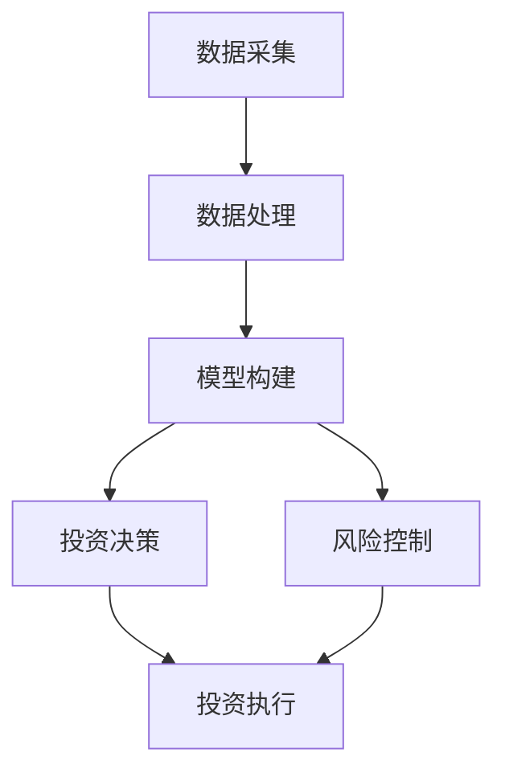

                 

# 彼得林奇的"价值投资"在高通胀环境下的调整

## 关键词：价值投资、高通胀、投资策略、彼得林奇、市场分析、投资组合优化、风险管理

## 摘要：本文探讨了彼得林奇价值投资理念在高通胀环境下的调整策略。通过分析高通胀对股市的影响，结合价值投资的核心理论，提出了优化估值指标和投资组合的具体方法。本文还结合数学模型和系统架构，给出了应对高通胀的投资策略框架，并通过实际案例验证了调整策略的有效性。

---

## 第1章: 高通胀环境下的投资背景分析

### 1.1 高通胀的定义与特征

#### 1.1.1 通货膨胀的基本概念
通货膨胀是指物价总水平在一段时间内持续上涨，通常用消费者价格指数（CPI）或生产者价格指数（PPI）衡量。高通胀意味着CPI或PPI在较短时间内大幅上涨。

#### 1.1.2 高通胀对经济的影响
高通胀会导致货币购买力下降，企业成本上升，消费者信心减弱。此外，高通胀通常伴随着利率上升，这会增加企业的融资成本，影响股市表现。

#### 1.1.3 高通胀与投资环境的关系
高通胀会改变市场的估值逻辑，传统的市盈率（P/E）和市净率（P/B）等估值指标可能失效，投资者需要重新调整投资策略。

### 1.2 高通胀对股市的影响

#### 1.2.1 股价波动的特征
高通胀环境下，股市波动性显著增加，个股表现分化，周期性股票可能受益，而成长股可能面临估值压力。

#### 1.2.2 高通胀与企业盈利能力
高通胀可能导致企业成本上升，利润率下降，但部分行业（如能源、原材料）可能受益于价格上涨。

#### 1.2.3 投资者的决策挑战
投资者需要在通胀上升周期中平衡风险与收益，避免被高估值股票的泡沫所误导。

---

## 第2章: 彼得林奇价值投资的核心理念

### 2.1 价值投资的定义与原则

#### 2.1.1 价值投资的基本概念
价值投资是一种以低于内在价值的价格买入优质股票的投资策略，核心在于寻找市场先生的错误定价。

#### 2.1.2 彼得林奇的投资策略
彼得林奇强调长期投资、分散投资和深入研究企业基本面。他寻找那些具有持续竞争优势且估值合理的公司。

#### 2.1.3 价值投资的核心要素
- 深入研究企业基本面
- 以合理价格买入优质股票
- 长期持有，耐心等待价值实现

### 2.2 价值投资与传统投资策略的对比

#### 2.2.1 传统投资策略的特点
传统投资策略包括技术分析和短期交易，注重市场的短期波动，风险较高。

#### 2.2.2 价值投资的独特优势
价值投资注重长期逻辑，通过深入研究企业基本面，能够在市场波动中找到低估的投资机会。

#### 2.2.3 两种策略的适用场景
- 价值投资适用于市场估值偏低、个股基本面良好的情况。
- 传统策略适用于短期趋势明确、市场波动较大的情况。

---

## 第3章: 高通胀对价值投资的影响

### 3.1 高通胀下企业估值的变化

#### 3.1.1 企业估值的基本模型
常用的估值模型包括市盈率（P/E）、市净率（P/B）和现金流折现模型（DCF）。这些模型在高通胀下可能需要调整。

#### 3.1.2 高通胀对企业价值的影响
高通胀可能导致企业成本上升，利润率下降，影响其内在价值的评估。

#### 3.1.3 估值指标的调整方向
- 调整市盈率：在高通胀下，企业实际盈利可能被低估，需要考虑通胀对净利润的影响。
- 调整市净率：高通胀可能导致资产重估，需要重新评估企业的净资产价值。

### 3.2 高通胀对投资组合的影响

#### 3.2.1 投资组合的构成要素
价值投资组合通常包括低估的蓝筹股、成长股和周期性股票。在高通胀下，周期性股票可能表现较好。

#### 3.2.2 高通胀对投资组合的影响
- 高通胀可能导致债券收益率上升，影响债券价格。
- 股票表现分化，需要重新评估组合的风险和收益。

#### 3.2.3 投资组合的风险管理
在高通胀环境下，需要增加对冲工具（如期货、期权）的使用，以降低组合的整体风险。

---

## 第4章: 高通胀环境下的价值投资调整策略

### 4.1 调整估值指标的策略

#### 4.1.1 传统估值指标的局限性
高通胀可能导致传统估值指标失效，例如市盈率可能无法准确反映企业的实际价值。

#### 4.1.2 高通胀下的替代估值指标
可以引入通胀调整后的市盈率（Real P/E）或现金流折现模型（DCF），以更准确地评估企业价值。

#### 4.1.3 新估值指标的应用案例
通过具体案例分析，展示如何在高通胀环境下使用新的估值指标筛选投资标的。

### 4.2 投资组合优化的策略

#### 4.2.1 投资组合的再平衡
在高通胀环境下，需要定期调整投资组合的权重，以适应市场变化。

#### 4.2.2 高通胀下的资产配置调整
增加对周期性股票（如能源、原材料）的配置，同时减少对成长股的配置。

#### 4.2.3 风险控制的强化措施
引入对冲工具，降低组合的波动性，同时分散投资标的，避免过度集中。

---

## 第5章: 高通胀环境下的投资系统架构

### 5.1 系统设计的目标

#### 5.1.1 系统设计的基本原则
构建一个能够适应高通胀环境的投资系统，帮助投资者实现长期稳健的收益。

#### 5.1.2 高通胀环境下的系统需求
系统需要实时监测通胀指标，动态调整投资策略。

#### 5.1.3 系统架构的核心要素
- 数据采集与处理：实时获取通胀数据和市场数据。
- 策略执行：根据通胀水平动态调整投资组合。
- 风险控制：通过量化手段降低组合风险。

### 5.2 系统功能设计

#### 5.2.1 数据收集与处理
系统需要收集通胀数据、市场数据和企业基本面数据，并进行清洗和预处理。

#### 5.2.2 模型构建与分析
基于通胀数据和市场数据，构建动态资产配置模型，优化投资组合。

#### 5.2.3 投资决策支持
系统提供实时的决策支持，帮助投资者在高通胀环境下做出最优投资决策。

### 5.3 系统架构图

---

## 第6章: 高通胀环境下的投资策略实战案例

### 6.1 实战背景

#### 6.1.1 项目介绍
通过一个具体案例，展示如何在高通胀环境下调整投资策略。

#### 6.1.2 数据来源
使用历史通胀数据和市场数据，构建一个模拟投资组合。

### 6.2 核心实现

#### 6.2.1 数据预处理
将历史通胀数据与股票价格数据进行匹配，分析高通胀期间股票的表现。

#### 6.2.2 策略实现
基于调整后的估值指标，筛选出低估的股票，构建投资组合。

#### 6.2.3 系统实现
通过Python编写代码，实现数据采集、估值指标计算和投资组合优化。

### 6.3 案例分析

#### 6.3.1 案例介绍
以某段时间的高通胀环境为例，分析投资组合的表现。

#### 6.3.2 数据分析
通过具体数据，展示调整后的策略在高通胀环境下的有效性。

#### 6.3.3 优化建议
总结经验，提出进一步优化投资策略的建议。

---

## 第7章: 总结与展望

### 7.1 本章总结

#### 7.1.1 核心观点回顾
本文探讨了彼得林奇价值投资理念在高通胀环境下的调整策略，提出了优化估值指标和投资组合的具体方法。

#### 7.1.2 重要结论
高通胀环境下，投资者需要重新调整估值指标和投资组合，引入新的系统架构和工具，以应对市场变化。

### 7.2 未来展望

#### 7.2.1 长期影响
高通胀可能成为常态化现象，投资者需要持续关注价值投资策略的调整。

#### 7.2.2 研究方向
未来可以进一步研究高通胀环境下的动态资产配置模型，以及如何利用机器学习等技术优化投资策略。

---

## 作者：AI天才研究院/AI Genius Institute & 禅与计算机程序设计艺术 /Zen And The Art of Computer Programming

---

通过以上目录结构和内容规划，我们能够系统地探讨彼得林奇价值投资在高通胀环境下的调整策略，并结合实际案例和系统架构，为投资者提供有价值的参考。

