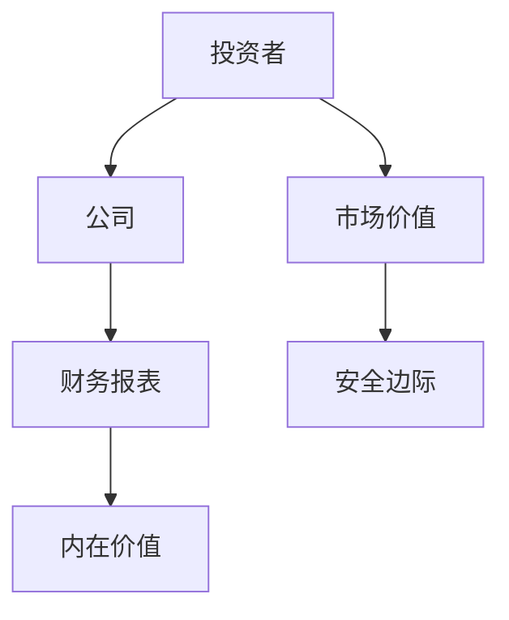
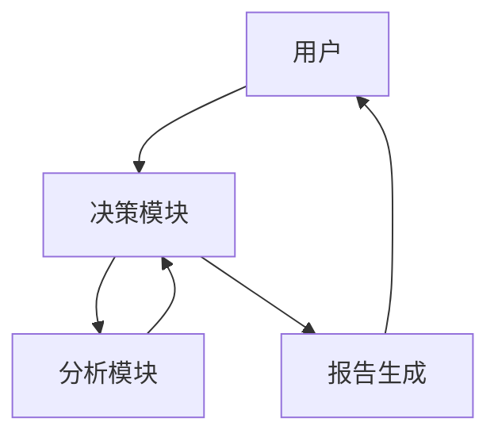

                 


# 彼得林奇的"价值投资"实践指南

> 关键词：价值投资，彼得·林奇，内在价值，安全边际，投资策略，风险管理

> 摘要：本文系统地介绍了彼得·林奇的"价值投资"理念和实践方法。通过分析价值投资的核心概念、算法原理、系统架构及项目实战，为读者提供一套完整的投资指南。文章深入探讨了价值投资的哲学基础、投资策略、风险管理及实际案例，帮助投资者掌握价值投资的精髓。

---

## 第一部分: 价值投资的背景与核心概念

### 第1章: 价值投资的定义与背景

#### 1.1 价值投资的基本概念

价值投资是一种以基本面分析为基础的投资策略，旨在通过识别市场中被低估的股票，长期持有，等待其价值回归。其核心在于寻找具有持续竞争优势、良好管理和合理估值的公司。

##### 1.1.1 价值投资的定义

价值投资并非仅指购买廉价的股票，而是基于对公司内在价值的深刻理解，选择价格低于其内在价值的股票进行投资。这种策略强调长期持有，避免短期市场的波动干扰。

##### 1.1.2 价值投资的核心要素

- **内在价值**：公司未来现金流的现值。
- **安全边际**：投资价格与内在价值之间的差额，提供额外的保护空间。
- **竞争优势**：公司相对于竞争对手的独特优势，确保其长期盈利能力。

##### 1.1.3 价值投资的哲学基础

价值投资的哲学基础源于格雷厄姆和多德的价值投资理论，强调安全性和确定性，而非市场波动和短期收益。

#### 1.2 彼得·林奇与价值投资

##### 1.2.1 彼得·林奇的生平简介

彼得·林奇（Peter Lynch）是美国著名投资家，曾管理富达麦哲伦基金，创造了卓越的投资业绩。他的投资理念深受价值投资的影响，但更加注重对行业和公司的深入研究。

##### 1.2.2 彼得·林奇的投资理念

- **深入研究**：彼得·林奇强调对公司基本面的深入分析，尤其是行业地位、财务状况和管理层能力。
- **逆向思维**：在市场恐慌时寻找机会，避免跟随市场情绪。
- **分散投资**：通过分散投资降低风险，同时集中于具有竞争优势的公司。

##### 1.2.3 彼得·林奇的投资风格

- **长期持有**：彼得·林奇倾向于长期持有优质股票，避免频繁交易。
- **行业聚焦**：他特别关注那些被市场忽视但具有成长潜力的行业和公司。

#### 1.3 价值投资的适用场景

##### 1.3.1 价值投资的市场环境

价值投资在市场低估时表现尤为突出，但在高估市场中仍需谨慎选择。

##### 1.3.2 价值投资的行业选择

优先选择具有稳定需求、低竞争和高壁垒的行业，如公用事业、消费品等。

##### 1.3.3 价值投资的投资者类型

适合风险承受能力强、具备分析能力和长期投资耐心的投资者。

#### 1.4 价值投资与其他投资策略的对比

##### 1.4.1 价值投资与成长投资的区别

- **目标**：价值投资寻找被低估的股票，成长投资关注高增长公司。
- **风险**：价值投资风险较低，成长投资风险较高。

##### 1.4.2 价值投资与技术分析的差异

价值投资注重基本面分析，技术分析则关注价格走势和成交量。

##### 1.4.3 价值投资与指数投资的对比

价值投资主动选股，指数投资被动跟踪市场指数。

#### 1.5 本章小结

价值投资是一种长期有效的策略，彼得·林奇的成功证明了其可行性。理解其核心概念和投资理念，是成功实践的基础。

---

### 第2章: 价值投资的核心概念与分析工具

#### 2.1 核心概念原理

##### 2.1.1 内在价值的计算方法

内在价值是未来现金流的现值，常用公式为：

$$ V = \frac{CF}{(r - g)} $$

其中：
- \( CF \) 表示未来现金流
- \( r \) 表示折现率
- \( g \) 表示增长率

##### 2.1.2 市场价值与内在价值的关系

市场价值受情绪影响，而内在价值基于基本面分析。当市场价值低于内在价值时，投资机会出现。

##### 2.1.3 安全边际的概念与应用

安全边际是投资价格与内在价值之间的差额，提供额外的保护空间，减少市场波动的影响。

#### 2.2 核心概念属性对比表

| 属性 | 描述 |
|------|------|
| 内在价值 | 股票的真实价值，基于公司基本面计算 |
| 安全边际 | 投资价格低于内在价值的部分 |
| 市场价值 | 市场对股票的定价，受市场情绪影响 |

#### 2.3 ER实体关系图



#### 2.4 本章小结

理解内在价值、市场价值和安全边际的关系，是进行价值投资的关键。

---

### 第3章: 价值投资的算法与数学模型

#### 3.1 算法原理

##### 3.1.1 内在价值计算算法

```python
def calculate_intrinsic_value(cash_flow, discount_rate, growth_rate):
    return cash_flow / (discount_rate - growth_rate)
```

##### 3.1.2 安全边际计算算法

```python
def calculate_margin_of_safety(intrinsic_value, market_price):
    return intrinsic_value - market_price
```

#### 3.2 数学模型与公式

##### 内在价值计算公式

$$ V = \frac{CF}{(r - g)} $$

##### 安全边际计算公式

$$ MOS = V - P $$

其中：
- \( MOS \) 表示安全边际
- \( V \) 表示内在价值
- \( P \) 表示市场价格

---

## 第二部分: 价值投资的系统架构与项目实战

### 第4章: 系统架构设计

#### 4.1 系统功能设计

##### 4.1.1 数据收集模块

- 从财务报表中提取数据，包括收入、利润、现金流等。

##### 4.1.2 分析模块

- 计算内在价值、市盈率、市净率等指标。

##### 4.1.3 决策模块

- 根据分析结果生成投资建议。

#### 4.2 系统架构设计



#### 4.3 系统接口设计

- 数据接口：连接财务数据库，获取公司数据。
- 分析接口：调用算法模块，计算内在价值。
- 决策接口：根据分析结果生成投资建议。

---

### 第5章: 项目实战

#### 5.1 案例分析

##### 5.1.1 公司背景

选择一家具有竞争优势、财务状况稳定的公司进行分析。

##### 5.1.2 数据分析

计算公司的内在价值，评估其市场价格是否低于内在价值。

##### 5.1.3 投资决策

基于分析结果，决定是否投资该公司。

#### 5.2 投资策略

- 选择低估的股票。
- 长期持有，避免频繁交易。

---

## 第三部分: 最佳实践与总结

### 第6章: 最佳实践

#### 6.1 关键点总结

- 深入研究公司基本面。
- 保持安全边际。
- 长期持有优质股票。

#### 6.2 投资建议

- 定期评估投资组合。
- 保持耐心和纪律。

#### 6.3 注意事项

- 避免过度分散投资。
- 警惕市场泡沫。

#### 6.4 拓展阅读

推荐书籍：
- 《价值》——雪球网
- 《投资之道》——乔尔·蒂施

---

## 结论

彼得·林奇的"价值投资"实践指南提供了一套系统的方法论，帮助投资者在市场中找到被低估的股票，实现长期稳定的收益。通过深入理解价值投资的核心概念、算法原理和系统架构，投资者可以在实际操作中避免常见错误，提高投资成功率。

---

## 作者

作者：AI天才研究院/AI Genius Institute & 禅与计算机程序设计艺术 /Zen And The Art of Computer Programming

