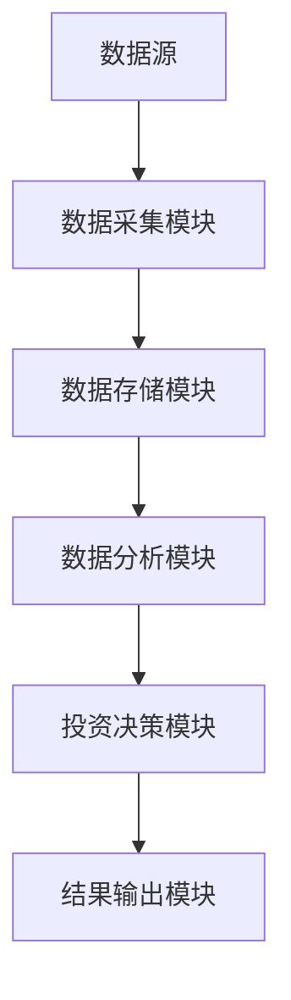

                 


# 彼得林奇的"价值陷阱"vs"价值机会"

## 关键词：价值陷阱，价值机会，彼得林奇，投资策略，财务分析，系统架构

## 摘要：本文探讨彼得林奇提出的“价值陷阱”和“价值机会”概念，分析两者区别及识别方法，结合系统架构和算法实现，提供投资策略和实战案例。通过详细分析财务指标和数学模型，结合实际案例，帮助投资者有效识别价值陷阱和机会，制定长期价值投资策略。

---

## 第1章：彼得林奇的投资哲学

### 1.1 彼得林奇的基本投资理念

彼得·林奇是全球著名投资专家，以其价值投资理念闻名。他强调深入分析公司基本面，寻找具有长期增长潜力的企业。本文将探讨他的“价值陷阱”和“价值机会”概念，分析其在投资中的应用。

---

## 第2章：价值陷阱与价值机会的核心概念

### 2.1 价值陷阱的定义与特征

价值陷阱是指表面上看似便宜，但实际存在严重问题的股票。其特征包括低估值、高负债、盈利能力下降等。识别这些陷阱需要全面分析公司财务状况和行业环境。

### 2.2 价值机会的定义与特征

价值机会指被市场低估，但具备高成长性和竞争优势的股票。其特征包括高ROE、稳定的现金流、强大的市场地位等。识别这些机会需要关注财务健康和行业趋势。

---

## 第3章：识别价值陷阱与机会的系统架构

### 3.1 系统架构设计

系统分为数据采集、分析模块和决策模块。使用Python进行数据处理，结合机器学习算法进行预测。系统架构如下：



### 3.2 数据分析模块实现

使用Python代码分析财务指标：

```python
import pandas as pd

# 假设data是数据框
data['ROE'] = data['净利润'] / data['净资产']
data['毛利率'] = (data['营业收入'] - data['营业成本']) / data['营业收入']
```

---

## 第4章：价值陷阱与机会的识别步骤

### 4.1 价值陷阱的识别步骤

1. **初步筛选**：通过ROE、毛利率等指标筛选低估值股票。
2. **深度分析**：检查资产负债表，识别高负债企业。
3. **投资决策**：避免投资存在严重问题的企业。

### 4.2 价值机会的识别步骤

1. **初步筛选**：寻找高ROE、稳定现金流的企业。
2. **深度分析**：评估企业竞争优势和行业前景。
3. **投资决策**：长期投资具有成长性的企业。

---

## 第5章：数学模型与算法实现

### 5.1 财务指标分析模型

使用以下公式计算关键指标：

$$ROE = \frac{\text{净利润}}{\text{净资产}}$$
$$毛利率 = \frac{\text{营业收入} - \text{营业成本}}{\text{营业收入}}$$

### 5.2 机器学习算法实现

使用回归分析预测价值机会：

```python
from sklearn.linear_model import LinearRegression

# 训练模型
model = LinearRegression()
model.fit(X_train, y_train)

# 预测
y_pred = model.predict(X_test)
```

---

## 第6章：项目实战与案例分析

### 6.1 环境配置与代码实现

安装必要的库：

```bash
pip install pandas scikit-learn matplotlib
```

实现数据处理代码：

```python
import pandas as pd
from sklearn.model_selection import train_test_split
from sklearn.metrics import accuracy_score

# 数据加载与预处理
data = pd.read_csv('stock_data.csv')
X = data[['ROE', '毛利率']]
y = data['是否价值机会']

X_train, X_test, y_train, y_test = train_test_split(X, y, test_size=0.2)
model = LinearRegression()
model.fit(X_train, y_train)
y_pred = model.predict(X_test)
print(accuracy_score(y_test, y_pred))
```

### 6.2 案例分析

以实际案例为例，分析某公司的财务数据，判断其是价值陷阱还是机会。通过数据可视化展示分析结果：

```python
import matplotlib.pyplot as plt

plt.scatter(X_test, y_pred)
plt.title('Value Opportunity Prediction')
plt.xlabel('ROE')
plt.ylabel('Prediction')
plt.show()
```

---

## 第7章：总结与展望

### 7.1 投资策略总结

- 价值陷阱：避免投资具有严重财务问题的企业。
- 价值机会：投资具有长期成长性和竞争优势的企业。

### 7.2 未来展望

随着技术进步，AI在投资分析中的应用将更加广泛。未来可以开发更复杂的模型，结合更多数据源，提升识别准确率。

---

## 作者：AI天才研究院 & 禅与计算机程序设计艺术

---

## 版权声明

本文版权归作者所有，未经授权不得转载。

