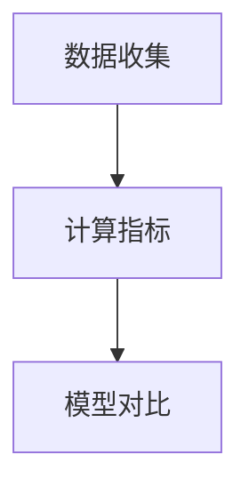

                 


# 彼得林奇的"价值陷阱"修正方法

## 关键词：价值陷阱、彼得林奇、投资分析、修正方法、风险管理

## 摘要：本文详细探讨了彼得林奇提出的“价值陷阱”概念，分析其形成原因、识别方法及修正策略。通过系统化的分析框架和实际案例，展示了如何利用技术手段识别和修正价值陷阱，帮助投资者避免误判，提升投资决策的准确性。

---

# 第1章: 价值陷阱的定义与背景

## 1.1 价值陷阱的核心概念

### 1.1.1 价值陷阱的定义

价值陷阱是指某些股票或资产由于市场失灵、信息不对称或投资者误判等原因，表面上看似具有较高的投资价值，但实际上隐藏着严重的内在问题，可能导致投资损失。彼得林奇在投资实践中总结出许多识别和避免价值陷阱的方法。

### 1.1.2 价值陷阱的形成背景

价值陷阱通常出现在市场低迷或行业周期性低谷时。此时，一些公司由于暂时的困境或市场情绪影响，其股价被低估，但公司基本面可能存在问题，如高负债、低利润率或管理问题，导致其难以长期维持价值。

### 1.1.3 价值陷阱的解决方法

识别价值陷阱的关键在于深入分析公司的财务状况、行业地位和管理团队。投资者应避免仅依赖市盈率、市净率等简单估值指标，而需结合多种分析方法，如SWOT分析、 Porter's Five Forces模型等，全面评估公司前景。

### 1.1.4 价值陷阱的边界与外延

价值陷阱的外延包括高估值陷阱、流动性陷阱等其他投资风险。投资者需区分这些不同陷阱，制定针对性的应对策略。

---

## 1.2 价值陷阱的特征与分类

### 1.2.1 价值陷阱的特征

价值陷阱通常表现出低估值、高负债、盈利能力下降、行业地位下滑等特征。公司可能面临技术落后、管理不善或市场需求萎缩等问题。

### 1.2.2 价值陷阱的分类

1. **基本面恶化型**：公司财务状况持续恶化，如净利润率下降、负债率上升。
2. **行业衰退型**：所在行业整体衰退，市场需求萎缩。
3. **管理问题型**：公司管理层出现问题，如内耗严重或战略失误。

### 1.2.3 价值陷阱与其他投资陷阱的对比

| 投资陷阱类型 | 特征描述                     | 解决方法                          |
|--------------|------------------------------|------------------------------------|
| 价值陷阱     | 低估值但基本面差             | 深入分析公司财务和行业状况         |
| 高估值陷阱   | 高股价但基本面一般           | 采用合理估值指标，如PEG法          |
| 流动性陷阱   | 难以变现的资产               | 评估资产流动性，避免投资非流动资产 |

---

## 1.3 价值陷阱的识别与解决方法

### 1.3.1 价值陷阱的识别标准

识别价值陷阱需结合定量分析和定性分析：

1. **定量分析**：关注市盈率（P/E）、市净率（P/B）、股息率等指标，寻找估值显著低于行业平均水平的公司。
2. **定性分析**：研究公司的财务健康状况、行业地位、管理团队和竞争优势。

### 1.3.2 价值陷阱的解决思路

解决价值陷阱的关键在于修正估值方法，避免仅依赖单一指标。投资者应采用多维度分析，结合财务报表和行业趋势，识别潜在风险。

### 1.3.3 价值陷阱的修正策略

通过调整估值模型，引入修正后的指标，如调整后的市盈率（PEG）或市净率，避免误判。

---

## 1.4 价值陷阱的案例分析

### 1.4.1 经典价值陷阱案例

以某家陷入财务困境的制造企业为例，其股价因市场低估而看似便宜，但实际上公司面临订单减少、成本上升等问题。

### 1.4.2 案例分析与经验总结

通过分析该案例，投资者需警惕表面低估值下的潜在风险，深入研究公司基本面。

### 1.4.3 案例的启示与借鉴

案例表明，价值陷阱通常伴随着行业衰退或公司管理问题，投资者需保持警惕。

---

## 1.5 本章小结

本章详细介绍了价值陷阱的定义、特征及分类，探讨了识别和解决价值陷阱的方法，通过案例分析帮助投资者理解如何避免误判。

---

# 第2章: 价值陷阱修正的核心原理

## 2.1 价值陷阱修正的基本原理

### 2.1.1 修正原理的概述

通过调整估值模型，引入修正后的指标，如PEG，来更准确地评估公司价值。

### 2.1.2 修正原理的关键要素

1. **财务指标调整**：如修正后的市盈率。
2. **行业基准对比**：将公司估值与行业平均水平进行对比。

---

## 2.2 价值陷阱修正的数学公式

### 2.2.1 核心公式推导

修正后的市盈率（PEG）公式：

$$ PEG = \frac{Price}{Earnings \times Growth} $$

### 2.2.2 公式应用实例

以某公司为例，计算其PEG值，判断其是否为价值陷阱。

### 2.2.3 公式的局限性与改进方向

PEG法在某些情况下可能失效，需结合其他指标进行验证。

---

## 2.3 价值陷阱修正的算法流程

### 2.3.1 算法步骤分解

1. 数据收集：获取公司财务数据和行业信息。
2. 指标计算：计算修正后的估值指标。
3. 模型对比：将公司估值与行业平均水平进行对比。

### 2.3.2 算法的流程图



### 2.3.3 算法的实现代码

```python
def calculate_pe(stock_price, earnings, growth):
    pe = stock_price / earnings
    peg = pe / growth
    return peg
```

---

## 2.4 价值陷阱修正的系统架构

### 2.4.1 系统架构设计

1. 数据层：获取实时数据。
2. 计算层：计算修正指标。
3. 展示层：显示结果。

### 2.4.2 系统功能模块

1. 数据处理模块。
2. 指标计算模块。
3. 结果展示模块。

### 2.4.3 系统接口设计

1. 数据接口：获取公司数据。
2. 计算接口：计算PEG值。

---

## 2.5 本章小结

本章详细讲解了价值陷阱修正的核心原理，包括数学模型和算法流程，帮助投资者更准确地评估公司价值。

---

# 第3章: 价值陷阱修正的系统实现

## 3.1 系统实现的环境配置

### 3.1.1 开发环境的选择

建议使用Python和相关数据分析库。

### 3.1.2 开发工具的安装

安装Jupyter Notebook、Pandas、Matplotlib等工具。

### 3.1.3 数据库的配置

选择合适的数据库存储和处理数据。

---

## 3.2 系统实现的核心代码

### 3.2.1 核心算法的实现

```python
import pandas as pd

def calculate_pe(stock_data):
    stock_data['PEG'] = stock_data['Price'] / (stock_data['Earnings'] * stock_data['Growth'])
    return stock_data
```

### 3.2.2 数据处理的代码

```python
data = pd.read_csv('stocks.csv')
data = calculate_pe(data)
print(data.head())
```

---

## 3.3 系统实现的案例分析

### 3.3.1 案例背景介绍

分析某行业内的公司数据，识别是否存在价值陷阱。

### 3.3.2 案例的实现过程

使用代码计算PEG值，判断是否存在价值陷阱。

### 3.3.3 案例的结果分析

通过结果展示，识别并修正价值陷阱。

---

## 3.4 本章小结

本章通过实际案例展示了如何利用系统实现修正价值陷阱，帮助投资者做出更明智的投资决策。

---

# 第4章: 价值陷阱修正的最佳实践

## 4.1 最佳实践的要点总结

### 4.1.1 投资策略的选择

建议采用多元化投资策略，避免过度集中。

### 4.1.2 数据分析的技巧

使用多种指标和模型进行分析，避免单一指标误导。

### 4.1.3 风险控制的方法

设置止损点，及时止损，避免重大损失。

---

## 4.2 投资中的注意事项

1. **持续学习**：保持对市场的敏感性。
2. **分散投资**：降低风险。
3. **长期视角**：关注公司长期价值。

---

## 4.3 拓展阅读

推荐相关书籍和资源，帮助读者深入学习。

---

# 作者：AI天才研究院/AI Genius Institute & 禅与计算机程序设计艺术 /Zen And The Art of Computer Programming

---

通过本文的详细分析，投资者可以系统地识别和修正价值陷阱，提升投资决策的准确性。希望本文能为投资者提供有价值的参考和指导。

