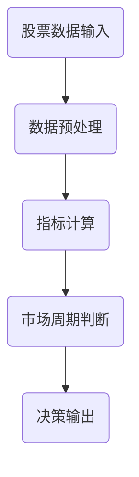

                 


# 彼得林奇的“价值陷阱”在不同市场周期的表现

## 关键词：价值陷阱，市场周期，彼得·林奇，投资策略，股票分析

## 摘要：彼得·林奇提出的“价值陷阱”是指投资者在市场波动中可能误判股票价值的情况。本文分析了价值陷阱在牛市、熊市和震荡市中的表现，结合数学模型和实际案例，探讨其在不同市场周期中的识别与应对策略，帮助投资者做出更明智的投资决策。

---

## 第一部分：彼得林奇的“价值陷阱”概述

### 第1章：价值陷阱的基本概念

#### 1.1 价值陷阱的定义
##### 1.1.1 价值陷阱的起源
彼得·林奇在《彼得·林奇的投资习惯》中首次提出“价值陷阱”概念，指出投资者在市场波动时容易误判股票价值，导致投资失误。

##### 1.1.2 价值陷阱的核心特征
价值陷阱通常出现在高估值但基本面不佳的股票中，投资者误以为价格下跌是买入机会，实则可能继续下跌。

##### 1.1.3 价值陷阱与市场周期的关系
市场周期波动影响价值陷阱的表现，牛市中高估，熊市中低估，震荡市中表现不一。

#### 1.2 市场周期的基本概念
##### 1.2.1 市场周期的定义
市场周期包括牛市、熊市和震荡市，每个阶段投资者行为和市场表现不同。

##### 1.2.2 不同市场周期的特点
牛市：价格上升，投资者乐观；熊市：价格下跌，投资者悲观；震荡市：价格波动大，市场不确定性高。

##### 1.2.3 市场周期对投资决策的影响
不同市场周期中，投资者需调整策略，避免误判股票价值。

#### 1.3 彼得林奇的投资策略
##### 1.3.1 彼得林奇的投资理念
长期投资，注重基本面分析，避免短期波动干扰。

##### 1.3.2 彼得林奇的价值评估方法
使用市盈率、市净率等指标评估股票价值，寻找被低估的投资标的。

##### 1.3.3 彼得林奇对价值陷阱的定义
价值陷阱是高估值但基本面不佳的股票，投资者需警惕。

---

### 第2章：价值陷阱的识别与分析

#### 2.1 价值陷阱的识别方法
##### 2.1.1 财务指标分析法
使用市盈率（P/E）、市净率（P/B）等指标评估股票价值，识别高估值股票。

##### 2.1.2 市场情绪分析法
通过市场情绪指标（如恐慌指数）判断投资者情绪，避免盲目跟风。

##### 2.1.3 行业周期分析法
分析行业周期，判断股票是否处于衰退期，避免买入衰退行业股票。

#### 2.2 价值陷阱的形成机制
##### 2.2.1 市场波动的影响
市场波动导致股票价格偏离真实价值，投资者可能误判。

##### 2.2.2 投资者心理的作用
投资者情绪波动（如贪婪和恐惧）影响决策，导致误判。

##### 2.2.3 公司基本面的变化
公司业绩下滑或行业变化可能导致股票价值下降，形成价值陷阱。

#### 2.3 价值陷阱的案例分析
##### 2.3.1 典型价值陷阱案例
例如，某公司因业绩下滑导致股价下跌，但市盈率仍高于行业平均水平。

##### 2.3.2 案例分析与经验总结
分析案例，总结如何识别价值陷阱，避免投资失误。

---

### 第3章：价值陷阱在不同市场周期的表现

#### 3.1 牛市中的价值陷阱
##### 3.1.1 牛市的特点与投资者行为
牛市中投资者乐观，可能忽视高估值股票的风险。

##### 3.1.2 牛市中价值陷阱的表现形式
高价股、市盈率过高等现象常见，投资者可能误判为投资机会。

##### 3.1.3 牛市中价值陷阱的典型案例
分析某行业在牛市中的高估情况，提醒投资者警惕。

#### 3.2 熊市中的价值陷阱
##### 3.2.1 熊市的特点与投资者行为
熊市中投资者悲观，可能错判低估值股票的价值。

##### 3.2.2 熊市中价值陷阱的表现形式
低估值但基本面不佳的股票可能继续下跌，投资者需谨慎。

##### 3.2.3 熊市中价值陷阱的典型案例
分析某行业在熊市中的表现，提醒投资者避免抄底过早。

#### 3.3 震荡市中的价值陷阱
##### 3.3.1 震荡市的特点与投资者行为
市场波动大，投资者易受情绪影响，误判股票价值。

##### 3.3.2 震荡市中价值陷阱的表现形式
股票价格大幅波动，投资者可能误判短期趋势。

##### 3.3.3 震荡市中价值陷阱的典型案例
分析某行业在震荡市中的表现，提醒投资者注意短期波动。

---

## 第二部分：价值陷阱的算法与系统分析

### 第4章：价值陷阱的算法原理

#### 4.1 价值陷阱识别的数学模型
##### 4.1.1 市盈率模型
$$市盈率 = \frac{股票价格}{每股收益}$$
高市盈率可能意味着高估值，需警惕。

##### 4.1.2 市净率模型
$$市净率 = \frac{股票价格}{每股净资产}$$
高市净率可能意味着资产高估。

##### 4.1.3 市销率模型
$$市销率 = \frac{股票价格}{每股销售收入}$$
低市销率可能意味着被低估。

#### 4.2 价值陷阱检测算法
##### 4.2.1 算法步骤
1. 收集股票数据。
2. 计算市盈率、市净率等指标。
3. 比较指标与行业平均水平，判断是否为价值陷阱。

##### 4.2.2 Python实现
```python
import pandas as pd

# 假设data是股票数据
data['市盈率'] = data['股票价格'] / data['每股收益']
data['市净率'] = data['股票价格'] / data['每股净资产']
```

---

### 第5章：系统分析与架构设计

#### 5.1 价值陷阱检测系统的项目介绍
系统旨在帮助投资者识别价值陷阱，优化投资决策。

#### 5.2 系统功能设计
##### 5.2.1 领域模型


#### 5.3 系统架构设计


---

## 第三部分：项目实战与总结

### 第6章：价值陷阱的项目实战

#### 6.1 环境安装
安装Python、Pandas等库，准备股票数据。

#### 6.2 核心代码实现
##### 6.2.1 数据预处理
```python
data = pd.read_csv('股票数据.csv')
data = data.dropna()
```

##### 6.2.2 指标计算
```python
data['市盈率'] = data['股票价格'] / data['每股收益']
```

#### 6.3 案例分析
分析某股票在牛市中的表现，判断是否为价值陷阱。

#### 6.4 项目小结
总结项目成果，强调算法的有效性。

---

## 第四部分：总结与展望

### 第7章：最佳实践与小结

#### 7.1 最佳实践
投资者应结合市场周期，谨慎分析股票价值，避免价值陷阱。

#### 7.2 投资注意事项
避免盲目跟风，定期评估投资组合，及时调整策略。

#### 7.3 拓展阅读
推荐相关书籍和文章，进一步学习价值评估方法。

---

## 作者：AI天才研究院 & 禅与计算机程序设计艺术

---

通过以上结构，文章详细探讨了彼得·林奇的“价值陷阱”在不同市场周期中的表现，结合理论分析和实际案例，帮助投资者识别和避免价值陷阱，优化投资策略。

