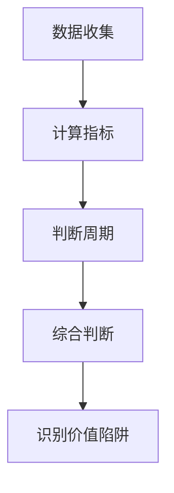
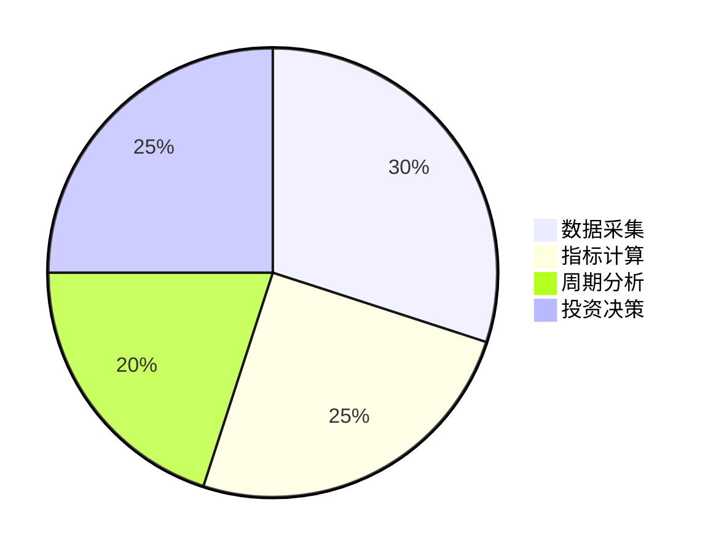

                 


# 彼得林奇的"价值陷阱"在周期性行业的识别

## 关键词：价值陷阱, 周期性行业, 彼得林奇, 财务指标, 投资策略, 行业分析

## 摘要：  
彼得林奇在投资领域提出了“价值陷阱”的概念，指的是那些看似具有投资价值但实际上存在潜在问题的股票。本文将探讨如何在周期性行业中识别这些价值陷阱，通过分析行业特点、财务指标和市场情绪等多方面因素，帮助投资者避免误判，制定有效的投资策略。

---

## 第一部分：背景介绍

### 第1章：价值陷阱的概念与特征

#### 1.1 价值陷阱的定义  
价值陷阱是指投资者误判企业价值，买入看似便宜但实际上存在根本性问题的股票。这些股票可能在短期内看似具有吸引力，但由于公司基本面问题或行业周期性波动，长期表现不佳。

#### 1.2 周期性行业的特点  
周期性行业受经济周期波动影响较大，通常在繁荣期表现良好，而在衰退期面临压力。这类行业包括制造业、能源、材料和部分科技行业。周期性行业的波动性为价值陷阱提供了滋生的土壤。

#### 1.3 价值陷阱与周期性行业的关联  
在周期性行业中，价值陷阱常见于企业盈利波动大、负债过高或行业处于下行周期时。投资者容易在市场低谷时误判企业价值，买入看似廉价但实际上前景黯淡的股票。

---

## 第2章：价值陷阱的识别方法

### 2.1 财务指标分析法

#### 2.1.1 常用财务指标  
- **市盈率（P/E）**：用于评估股票价格是否合理。  
- **市净率（P/B）**：衡量股价与账面价值的关系。  
- **ROE（净资产收益率）**：反映企业的盈利能力。  

#### 2.1.2 财务指标在识别中的应用  
通过分析这些指标，投资者可以识别企业是否处于周期性底部，是否存在虚假的低估值。例如，市盈率过低可能意味着企业盈利前景不佳，而非真正的价值。

#### 2.1.3 财务指标分析的注意事项  
财务指标需结合行业背景分析，避免单一指标误导。例如，制造业的低市盈率可能反映行业周期性底部，但也可能是企业竞争力下降的结果。

### 2.2 行业周期分析法

#### 2.2.1 行业周期的判断  
通过分析行业历史波动、宏观经济指标（如GDP增长率）和行业数据（如产能利用率），判断行业所处周期阶段。

#### 2.2.2 行业周期与企业盈利的关系  
在行业衰退期，企业盈利可能大幅下降，但市盈率可能看似诱人。此时需警惕企业盈利的可持续性。

#### 2.2.3 行业周期分析工具  
使用经济周期模型和行业数据分析工具，帮助投资者更准确地判断行业周期。

### 2.3 市场情绪分析法

#### 2.3.1 市场情绪的影响  
市场情绪高涨时，投资者可能忽视周期性行业的潜在风险；市场情绪低落时，可能误判企业的长期价值。

#### 2.3.2 市场情绪与价值陷阱的关系  
在市场底部，投资者可能因过度悲观而忽视周期性行业的复苏潜力，或因过度乐观而误判企业的短期价值。

#### 2.3.3 市场情绪分析工具  
利用市场情绪指标（如恐慌指数）和投资者行为分析，辅助判断市场是否存在过度反应。

---

## 第3章：价值陷阱的案例分析

### 3.1 制造业的价值陷阱案例

#### 3.1.1 案例背景  
某制造业企业在经济衰退期间订单骤减，但市盈率却异常低，吸引了投资者的关注。

#### 3.1.2 财务指标分析  
- **市盈率**：低于行业平均水平。  
- **ROE**：连续两年下降。  
- **负债率**：大幅上升。  

#### 3.1.3 结论  
该企业因行业衰退和管理不善，存在价值陷阱风险，投资者应避免买入。

### 3.2 能源行业的价值陷阱案例

#### 3.2.1 案例背景  
某能源企业在油价暴跌期间股价大幅下降，市净率接近行业最低水平。

#### 3.2.2 行业周期分析  
能源行业受全球经济波动影响显著，油价暴跌可能反映全球经济衰退，需警惕行业复苏的不确定性。

#### 3.2.3 投资决策  
投资者需综合考虑油价长期走势和企业的成本控制能力，避免仅因低市净率而买入。

### 3.3 科技行业的价值陷阱案例

#### 3.3.1 案例背景  
某科技企业在行业周期底部股价大幅下跌，市盈率接近历史最低水平。

#### 3.3.2 财务指标分析  
- **市盈率**：低于行业平均水平。  
- **研发支出**：占收入比例大幅下降。  
- **收入增长**：连续多个季度下降。  

#### 3.3.3 结论  
该企业可能因行业周期性底部和自身竞争力下降存在价值陷阱，投资者需谨慎。

---

## 第4章：算法与系统分析

### 4.1 价值陷阱识别算法

#### 4.1.1 算法步骤  
1. **数据收集**：获取目标行业和企业的财务数据、行业周期数据和市场情绪数据。  
2. **指标计算**：计算市盈率、市净率、ROE等关键指标。  
3. **周期判断**：分析行业所处周期阶段。  
4. **综合判断**：结合财务指标、行业周期和市场情绪，判断是否存在价值陷阱。  

#### 4.1.2 算法流程图  


### 4.2 系统架构设计

#### 4.2.1 系统功能模块  
- 数据采集模块：收集行业数据和企业财务数据。  
- 指标计算模块：计算关键财务指标。  
- 周期分析模块：分析行业周期阶段。  
- 投资决策模块：综合判断是否存在价值陷阱。  

#### 4.2.2 系统架构图  


---

## 第5章：项目实战

### 5.1 环境安装

#### 5.1.1 Python环境安装  
安装Python和必要的库（如Pandas、NumPy、Matplotlib）。  
```bash
pip install pandas numpy matplotlib
```

#### 5.1.2 数据获取  
使用Python爬取行业数据和企业财务数据。

### 5.2 核心代码实现

#### 5.2.1 数据处理代码  
```python
import pandas as pd

# 假设df为数据框，包含'市盈率'、'市净率'、'ROE'等列
def is_value_trap(df):
    # 判断市盈率是否显著低于行业平均水平
    if df['市盈率'] < df['行业市盈率']:
        return True
    # 判断ROE是否持续下降
    if df['ROE'].rolling(3).mean().iloc[-1] < 5:
        return True
    return False
```

#### 5.2.2 行业周期分析代码  
```python
import matplotlib.pyplot as plt

def plot_industry_cycle(data):
    plt.plot(data['时间'], data['行业指数'])
    plt.xlabel('时间')
    plt.ylabel('行业指数')
    plt.title('行业周期分析')
    plt.show()
```

### 5.3 案例分析与解读

#### 5.3.1 制造业案例分析  
使用上述代码分析某制造业企业的数据，发现其市盈率虽低，但ROE持续下降，判断存在价值陷阱。

#### 5.3.2 能源行业案例分析  
分析某能源企业数据，发现其市净率虽低，但行业周期处于衰退期，判断存在价值陷阱风险。

### 5.4 项目小结  
通过代码实现，投资者可以更系统地识别周期性行业中的价值陷阱，避免盲目投资。

---

## 第6章：最佳实践与小结

### 6.1 投资策略建议  
1. **分散投资**：避免将所有资金投入单一周期性行业。  
2. **长期观察**：周期性行业的波动较大，需长期跟踪企业表现。  
3. **关注行业趋势**：定期分析行业周期和宏观经济指标，调整投资组合。  

### 6.2 注意事项  
- 避免仅依赖单一指标判断价值陷阱。  
- 在经济衰退期间，周期性行业中的企业可能面临更大风险。  
- 投资前需深入研究企业基本面和行业前景。  

### 6.3 拓展阅读  
推荐阅读彼得林奇的《投资学入门：_stock up Rookie》和《投资组合的构建与优化》。

---

## 作者：AI天才研究院/AI Genius Institute & 禅与计算机程序设计艺术 /Zen And The Art of Computer Programming

---

通过以上分析，投资者可以更好地识别周期性行业中的价值陷阱，制定科学的投资策略，避免潜在的财务损失。

