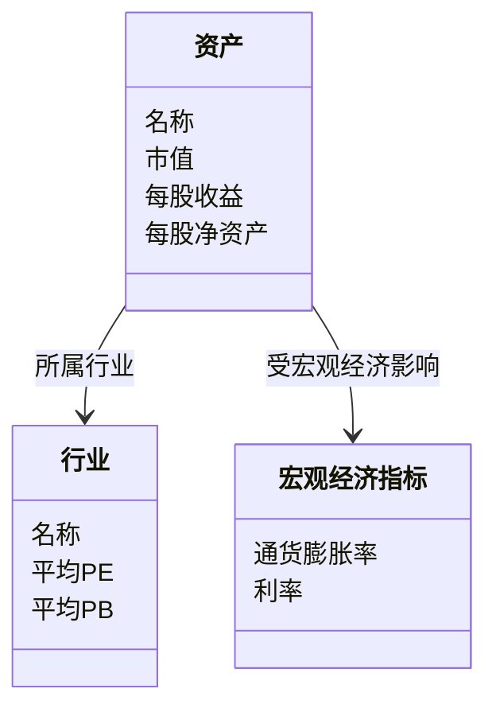

                 


# 彼得林奇的"价值陷阱"在新兴市场中的识别技巧

> **关键词**: 彼得林奇，价值陷阱，新兴市场，投资策略，风险管理

> **摘要**: 本文深入探讨了彼得林奇提出的"价值陷阱"概念，并结合新兴市场的特点，分析了如何在复杂的新兴市场环境中识别和规避价值陷阱。文章从价值陷阱的基本概念、新兴市场的特点与挑战、价值陷阱在新兴市场的表现形式、彼得林奇识别价值陷阱的核心方法、新兴市场中的识别技巧、算法设计与实现、系统分析与架构设计、项目实战、总结与最佳实践等方面进行了详细阐述。通过实际案例分析和具体的操作步骤，本文为投资者提供了一套在新兴市场中识别和规避价值陷阱的系统化方法。

---

## 第一部分: 彼得林奇的"价值陷阱"概述

### 第1章: 价值陷阱的基本概念

#### 1.1 价值陷阱的定义与特征

**1.1.1 价值陷阱的定义**  
价值陷阱是指那些表面上看似具有投资价值，但实际上由于企业基本面恶化、行业周期性波动或宏观经济环境的影响，投资这些资产可能会导致投资者陷入亏损的陷阱。彼得林奇在其投资生涯中总结出许多识别价值陷阱的经验和方法。

**1.1.2 价值陷阱的核心特征**  
价值陷阱的核心特征包括：  
- 企业基本面持续恶化（如盈利能力下降、债务负担加重）；  
- 行业周期性波动导致企业估值偏离实际价值；  
- 宏观经济环境变化对企业经营的影响。  

**1.1.3 价值陷阱与价值投资的区别**  
价值投资强调以低于内在价值的价格买入优质资产，而价值陷阱则是表面上看似具有价值，实则存在严重问题的资产。两者的区别在于资产的质量和潜在风险。

#### 1.2 彼得林奇与价值陷阱

**1.2.1 彼得林奇的投资理念**  
彼得林奇是一位著名的价值投资者，他强调通过基本面分析来寻找具有长期增长潜力的优质企业。他提出的"价值陷阱"概念提醒投资者要警惕那些看似便宜但实际存在严重问题的资产。

**1.2.2 价值陷阱的核心定义**  
彼得林奇认为，价值陷阱是指那些表面上看似具有投资价值，但由于企业自身问题、行业周期性波动或宏观经济环境的影响，实际存在巨大风险的资产。

**1.2.3 价值陷阱识别的核心方法**  
彼得林奇提出了一系列方法来识别价值陷阱，包括：  
1. 企业基本面分析；  
2. 相对估值法；  
3. 行业趋势分析。  

---

### 第2章: 新兴市场的特点与挑战

#### 2.1 新兴市场的定义与分类

**2.1.1 新兴市场的定义**  
新兴市场是指那些经济快速增长、市场机制逐步完善、但尚未完全成熟的国家或地区的金融市场。这些市场通常具有较高的增长潜力，但也伴随着较高的风险。

**2.1.2 新兴市场的分类**  
新兴市场可以分为以下几类：  
- 东南亚市场（如中国、印度、越南等）；  
- 东欧市场（如波兰、俄罗斯等）；  
- 拉丁美洲市场（如巴西、墨西哥等）。  

**2.1.3 新兴市场的典型案例**  
以中国为例，中国市场的快速增长和巨大潜力吸引了全球投资者的关注，但也伴随着剧烈的行业波动和宏观经济不确定性。

#### 2.2 新兴市场的投资机会与风险

**2.2.1 新兴市场的投资机会**  
新兴市场通常具有较高的经济增长潜力，尤其是在科技、消费、制造等领域，存在大量投资机会。

**2.2.2 新兴市场的投资风险**  
新兴市场也伴随着较高的风险，包括：  
- 经济波动风险（如汇率波动、通货膨胀）；  
- 行业周期性风险；  
- 政治经济不确定性。  

**2.2.3 新兴市场与成熟市场的对比**  
与成熟市场相比，新兴市场具有更高的增长潜力，但也存在更高的波动性和不确定性。投资者需要更加谨慎地分析和评估风险。

#### 2.3 价值陷阱在新兴市场的表现形式

**2.3.1 企业基本面恶化型**  
- 企业盈利能力下降；  
- 债务负担加重；  
- 竞争力减弱。  

**2.3.2 行业周期性波动型**  
- 行业周期性波动的定义；  
- 行业周期性波动对价值陷阱的影响；  
- 如何通过行业周期分析识别价值陷阱。  

**2.3.3 宏观经济环境影响型**  
- 宏观经济波动对价值陷阱的影响；  
- 如何通过宏观经济指标识别价值陷阱；  
- 典型案例分析。  

---

## 第二部分: 价值陷阱的识别与规避策略

### 第3章: 彼得林奇识别价值陷阱的核心方法

#### 3.1 企业基本面分析

**3.1.1 企业财务报表分析**  
通过分析企业的财务报表（如资产负债表、利润表、现金流量表）来评估企业的财务健康状况。  
- 资产负债表：分析企业的资产结构、负债情况和所有者权益；  
- 利润表：评估企业的盈利能力；  
- 现金流量表：了解企业的现金流情况。  

**3.1.2 企业估值方法**  
常用的估值方法包括：  
- 市盈率（P/E）= 市价 / 每股收益；  
- 市净率（P/B）= 市价 / 每股净资产；  
- 企业价值（EV）= 企业市值 + 债务 - 现金。  

**3.1.3 企业盈利能力和成长性分析**  
分析企业的盈利能力（如净利率、毛利率）和成长性（如收入增长率、净利润增长率）。  

#### 3.2 相对估值法

**3.2.1 相对估值法的定义**  
相对估值法是通过比较资产的相对估值指标（如市盈率、市净率）来判断资产是否被高估或低估。

**3.2.2 相对估值法的具体应用**  
- 比较同行业公司的市盈率和市净率；  
- 分析资产的相对估值指标是否处于历史高位或低位。  

**3.2.3 相对估值法的优缺点**  
优点：简单易懂，操作性强；缺点：容易受到市场波动的影响，存在一定的局限性。  

#### 3.3 行业比较法

**3.3.1 行业比较法的定义**  
行业比较法是通过比较同一行业内的公司，分析其相对估值和基本面情况，以识别潜在的价值陷阱。

**3.3.2 行业比较法的具体应用**  
- 比较行业内的市盈率、市净率等指标；  
- 分析行业内的公司盈利能力、成长性和财务状况。  

**3.3.3 行业比较法的优缺点**  
优点：能够发现行业内估值异常的公司；缺点：需要大量的行业数据支持，操作复杂性较高。  

---

### 第4章: 新兴市场中的识别技巧

#### 4.1 企业财务指标分析

**4.1.1 主要财务指标的定义与计算**  
- 净利润率 = 净利润 / 收入；  
- 毛利率 = 毛利润 / 收入；  
- 速动比率 = （流动资产 - 存货） / 流动负债。  

**4.1.2 财务指标在识别价值陷阱中的应用**  
- 通过分析利润率和毛利率判断企业的盈利能力；  
- 通过速动比率等指标判断企业的财务健康状况。  

**4.1.3 财务指标分析的注意事项**  
- 财务指标需要结合行业特点和宏观经济环境进行分析；  
- 财务指标的异常可能是价值陷阱的信号。  

#### 4.2 行业趋势分析

**4.2.1 行业趋势分析的定义**  
行业趋势分析是通过分析行业的市场规模、增长潜力、竞争格局等因素，判断行业的发展趋势。

**4.2.2 行业趋势分析的具体方法**  
- 分析行业的市场规模和增长率；  
- 分析行业的竞争格局和市场集中度；  
- 分析行业的周期性波动。  

**4.2.3 行业趋势分析的案例**  
以科技行业为例，分析行业趋势对价值陷阱的影响。  

#### 4.3 宏观经济环境分析

**4.3.1 宏观经济环境分析的定义**  
宏观经济环境分析是通过分析宏观经济指标（如GDP增长率、通货膨胀率、利率等）来判断宏观经济环境对市场的影响。

**4.3.2 宏观经济指标对价值陷阱的影响**  
- 高通货膨胀率可能导致企业成本上升，影响盈利能力；  
- 利率上升可能增加企业的债务负担，影响财务状况。  

**4.3.3 宏观经济环境分析的案例**  
以中国为例，分析宏观经济环境对新兴市场的影响。  

---

## 第三部分: 算法设计与实现

### 第5章: 价值陷阱识别算法的设计与实现

#### 5.1 算法设计

**5.1.1 算法设计的目标**  
设计一个能够自动识别价值陷阱的算法，帮助投资者快速筛选出具有潜在风险的资产。

**5.1.2 算法设计的步骤**  
1. 收集企业的财务数据；  
2. 计算关键财务指标（如市盈率、市净率、利润率等）；  
3. 分析行业趋势和宏观经济环境；  
4. 综合评估企业的风险和潜在价值陷阱。  

**5.1.3 算法的核心逻辑**  
通过比较企业的财务指标和行业趋势，判断企业是否处于价值陷阱状态。  

#### 5.2 算法实现

**5.2.1 Python代码实现**  
```python
import pandas as pd
import numpy as np

def identify_value_traps(financial_data, industry_data, macroeconomic_data):
    # 计算市盈率
    financial_data['PE'] = financial_data['市值'] / financial_data['每股收益']
    # 计算市净率
    financial_data['PB'] = financial_data['市值'] / financial_data['每股净资产']
    # 计算行业平均PE和PB
    industry_avg_pe = industry_data.groupby('行业')['PE'].mean()
    industry_avg_pb = industry_data.groupby('行业')['PB'].mean()
    # 判断市盈率和市净率是否偏离行业平均水平
    financial_data['PE偏离'] = (financial_data['PE'] - industry_avg_pe[financial_data['行业']]).abs()
    financial_data['PB偏离'] = (financial_data['PB'] - industry_avg_pb[financial_data['行业']]).abs()
    # 结合宏观经济因素进行综合评估
    financial_data['综合风险'] = financial_data['PE偏离'] + financial_data['PB偏离'] + macroeconomic_data['通货膨胀率']
    # 筛选出综合风险较高的资产
    value_traps = financial_data[financial_data['综合风险'] > financial_data['综合风险'].quantile(0.75)]
    return value_traps
```

**5.2.2 算法的优缺点**  
优点：能够快速筛选出潜在的价值陷阱；缺点：需要大量数据支持，且模型的准确性依赖于数据质量和算法设计。  

---

## 第四部分: 系统分析与架构设计

### 第6章: 系统分析与架构设计

#### 6.1 问题场景介绍

**6.1.1 问题背景**  
在新兴市场中，由于市场波动大、信息不透明，识别价值陷阱的难度较高。因此，需要设计一个高效的系统来帮助投资者识别和规避价值陷阱。

**6.1.2 系统目标**  
设计一个能够实时监控市场数据、分析企业基本面和行业趋势的系统，帮助投资者识别价值陷阱。

#### 6.2 系统功能设计

**6.2.1 领域模型设计**  
使用Mermaid绘制领域模型类图，展示系统的各个实体及其关系。



**6.2.2 系统架构设计**  
使用Mermaid绘制系统架构图，展示系统的各个模块及其关系。


**6.2.3 系统接口设计**  
- 数据收集模块：从数据库或API获取市场数据；  
- 数据处理模块：对数据进行清洗和预处理；  
- 数据分析模块：使用算法进行分析和评估；  
- 决策支持模块：生成报告并提供决策支持。  

---

## 第五部分: 项目实战

### 第7章: 项目实战

#### 7.1 环境安装与数据收集

**7.1.1 环境安装**  
安装Python和相关库（如Pandas、NumPy、Matplotlib）。  

**7.1.2 数据收集**  
从互联网获取新兴市场的财务数据、行业数据和宏观经济数据。  

#### 7.2 系统核心实现

**7.2.1 数据处理与分析**  
使用Python代码对数据进行处理和分析，计算市盈率、市净率等指标，并进行行业和宏观经济分析。  

**7.2.2 算法实现**  
根据前面设计的算法，实现价值陷阱识别的功能。  

#### 7.3 实际案例分析

**7.3.1 案例背景**  
以东南亚市场为例，分析某公司的财务数据和行业趋势，判断是否存在价值陷阱。

**7.3.2 数据分析与结果解读**  
通过数据分析，识别出存在价值陷阱的公司，并分析其潜在风险。  

---

## 第六部分: 总结与最佳实践

### 第8章: 总结与最佳实践

#### 8.1 总结

**8.1.1 全文回顾**  
本文详细探讨了彼得林奇的"价值陷阱"概念，并结合新兴市场的特点，分析了如何在复杂的市场环境中识别和规避价值陷阱。

**8.1.2 核心观点总结**  
- 价值陷阱是指那些表面上看似具有投资价值，但实际上存在严重问题的资产；  
- 新兴市场由于其特殊性，更容易出现价值陷阱；  
- 通过基本面分析、相对估值法和行业趋势分析，可以有效识别价值陷阱。  

#### 8.2 最佳实践 tips

**8.2.1 投资者注意事项**  
- 在新兴市场中，要更加关注企业的基本面和行业趋势；  
- 避免盲目跟风，要结合宏观经济环境进行分析；  
- 定期评估投资组合，及时调整投资策略。  

**8.2.2 案例分析与小结**  
通过实际案例分析，总结识别价值陷阱的经验和教训。

---

## 作者信息

作者：AI天才研究院/AI Genius Institute & 禅与计算机程序设计艺术 /Zen And The Art of Computer Programming

---

**本文通过详细分析彼得林奇的"价值陷阱"概念，并结合新兴市场的特点，为投资者提供了一套在新兴市场中识别和规避价值陷阱的系统化方法。通过实际案例分析和具体的操作步骤，本文帮助投资者更好地理解价值陷阱的本质，并掌握在复杂市场环境中识别和规避风险的技巧。**

