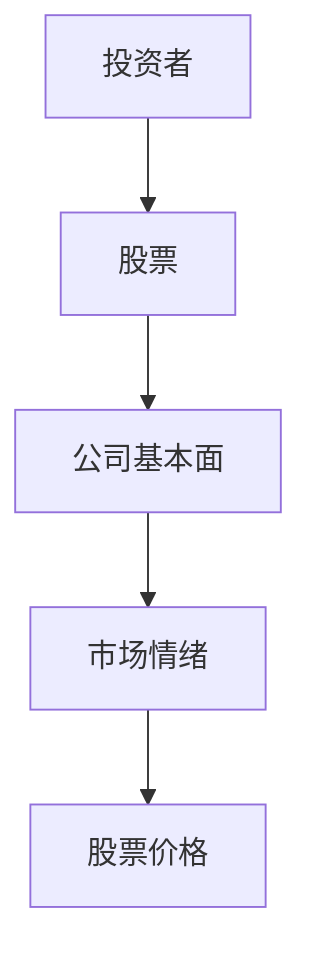
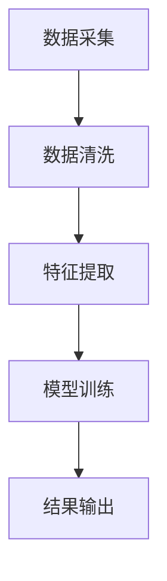
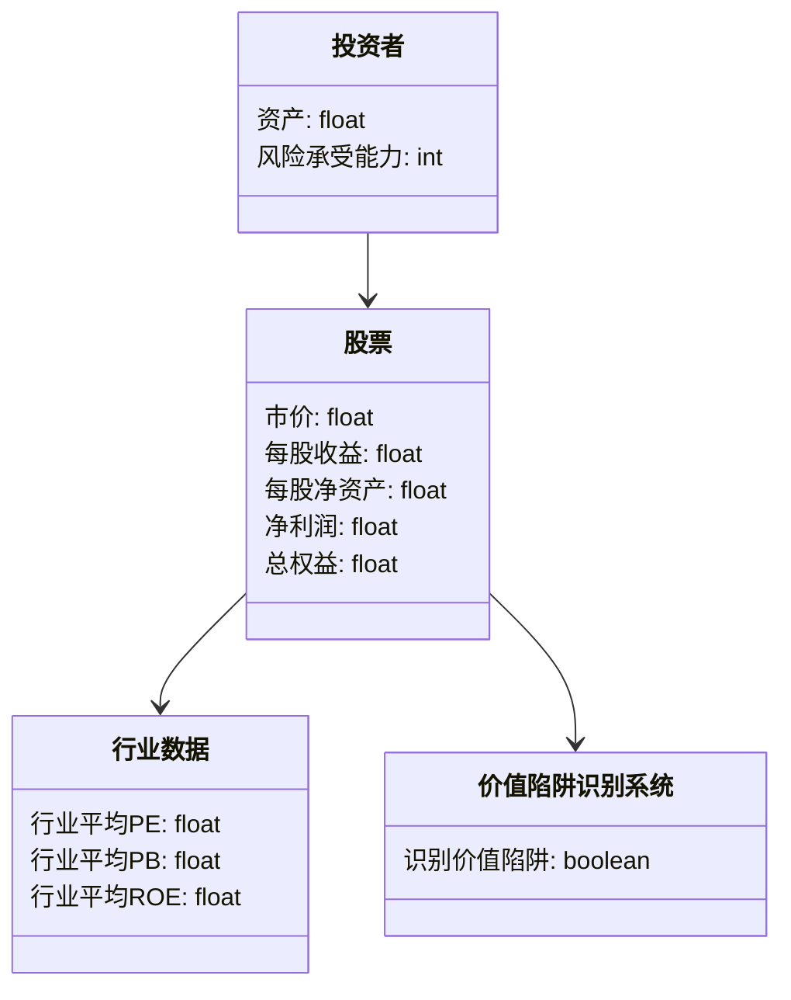
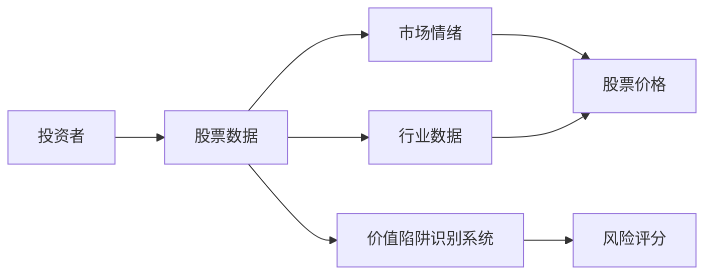

                 


# 彼得林奇的"价值陷阱"在新兴科技股中的识别

> 关键词：价值陷阱，彼得林奇，科技股，投资分析，风险管理

> 摘要：本文旨在深入探讨彼得林奇提出的“价值陷阱”概念在新兴科技股投资中的识别与应用。通过分析价值陷阱的定义、特征及识别方法，结合具体案例，探讨如何在科技股投资中规避价值陷阱，实现稳健投资收益。文章从理论分析到实际操作，详细阐述了价值陷阱的识别逻辑、算法原理及系统架构，并通过项目实战展示具体实现过程。

---

## 第1章 价值陷阱的定义与背景

### 1.1 价值陷阱的核心概念

#### 1.1.1 价值陷阱的定义
价值陷阱是指那些表面上看似估值低廉，但实际上存在重大问题，可能导致投资亏损的股票。这类股票往往被市场低估，但其基本面或行业环境存在严重问题，使得其难以实现预期的回报。

#### 1.1.2 彼得林奇的价值投资理念
彼得林奇是全球著名的价值投资者，他认为投资者应选择具有持续增长潜力的公司，并在市场恐慌时买入低估的股票。然而，他也提醒投资者要警惕那些看似估值低但实际存在严重问题的公司，即价值陷阱。

#### 1.1.3 价值陷阱在科技股中的特殊性
科技股具有高成长性和高波动性的特点，其估值往往基于未来预期。然而，这也意味着许多科技股可能存在泡沫或虚假的低估值，使得价值陷阱在科技股中尤为隐蔽。

---

### 1.2 价值陷阱的背景与问题背景

#### 1.2.1 科技股投资的高风险性
科技行业的技术变革迅速，竞争激烈，许多公司可能因技术落后或管理不善而迅速衰落，导致股价大幅下跌。

#### 1.2.2 价值陷阱的形成机制
价值陷阱的形成通常与市场情绪、行业周期、公司管理问题等因素有关。例如，在市场低迷时，一些基本面不佳的科技公司可能因为估值过低而被误认为是投资机会。

#### 1.2.3 价值陷阱的边界与外延
价值陷阱不仅限于科技股，但科技股的高成长性和不确定性使其成为价值陷阱的高发区。本文将重点分析科技股中的价值陷阱。

---

## 第2章 价值陷阱的核心概念与联系

### 2.1 核心概念的原理

#### 2.1.1 价值陷阱的识别逻辑
识别价值陷阱的核心在于分析公司的基本面、行业环境以及市场情绪。具体包括以下步骤：
1. 评估公司财务状况：关注市盈率、市净率、ROE等指标。
2. 分析行业前景：判断公司所在行业的成长性和竞争地位。
3. 考虑市场情绪：避免因市场恐慌而买入基本面不佳的股票。

#### 2.1.2 价值陷阱的数学模型
以下是一个简化的价值陷阱识别模型：

$$
\text{价值陷阱指数} = \frac{\text{市盈率}}{\text{行业平均市盈率}} \times \frac{\text{ROE}}{\text{行业平均ROE}}
$$

如果价值陷阱指数显著小于1，则该股票可能是价值陷阱。

#### 2.1.3 价值陷阱与其他投资陷阱的对比

| 投资陷阱类型 | 定义 | 特征 |
|--------------|------|------|
| 价值陷阱     | 表面估值低，实际有问题 | 市盈率、市净率低，ROE低 |
| 成长陷阱     | 表面高增长，实际增长不可持续 | 收入增长快，但净利润率低 |
| 周期陷阱     | 受周期性影响大 | 行业波动大，公司抗周期能力弱 |

### 2.2 ER实体关系图



---

## 第3章 价值陷阱的算法原理

### 3.1 算法原理概述

#### 3.1.1 数据采集与处理
数据采集包括从股票市场获取历史价格、财务指标、行业数据等信息。数据处理包括清洗、标准化和特征提取。

#### 3.1.2 价值陷阱识别的指标体系
以下是常用的指标体系：

| 指标名称 | 计算公式 | 作用 |
|----------|----------|------|
| 市盈率   | PE = 市价 / 每股收益 | 判断估值是否过低 |
| 市净率   | PB = 市价 / 每股净资产 | 判断资产是否被低估 |
| ROE      | ROE = 净利润 / 总权益 | 判断盈利能力 |

#### 3.1.3 风险评估与决策模型
基于指标体系构建风险评估模型：

$$
\text{风险评分} = 0.4 \times \text{PE评分} + 0.3 \times \text{PB评分} + 0.3 \times \text{ROE评分}
$$

如果风险评分超过70分，则该股票可能是价值陷阱。

### 3.2 算法流程图



### 3.3 Python实现

```python
import pandas as pd
import numpy as np

def calculate_pe(stock_data):
    return stock_data['市价'] / stock_data['每股收益']

def calculate_pb(stock_data):
    return stock_data['市价'] / stock_data['每股净资产']

def calculate_roe(stock_data):
    return stock_data['净利润'] / stock_data['总权益']

def identify_value_traps(stock_data):
    pe = calculate_pe(stock_data)
    pb = calculate_pb(stock_data)
    roe = calculate_roe(stock_data)
    
    pe_threshold = stock_data['行业平均PE']
    pb_threshold = stock_data['行业平均PB']
    roe_threshold = stock_data['行业平均ROE']
    
    value_trap_indicator = (
        (pe < pe_threshold) &
        (pb < pb_threshold) &
        (roe < roe_threshold)
    )
    return value_trap_indicator

# 示例数据
data = {
    '市价': [100, 80, 120],
    '每股收益': [10, 8, 12],
    '每股净资产': [20, 15, 25],
    '净利润': [20, 16, 24],
    '总权益': [100, 80, 120],
    '行业平均PE': [15, 15, 15],
    '行业平均PB': [2, 2, 2],
    '行业平均ROE': [15, 15, 15]
}

stock_data = pd.DataFrame(data)
result = identify_value_traps(stock_data)
print(result)
```

---

## 第4章 系统分析与架构设计

### 4.1 问题场景介绍
本文构建一个基于价值陷阱识别的科技股投资分析系统，旨在帮助投资者识别科技股中的价值陷阱，避免投资损失。

### 4.2 系统功能设计

#### 4.2.1 领域模型类图



### 4.3 系统架构设计

#### 4.3.1 系统架构图



---

## 第5章 项目实战

### 5.1 环境安装

#### 5.1.1 安装Python环境
```bash
python --version
pip install pandas numpy
```

### 5.2 核心代码实现

#### 5.2.1 价值陷阱识别函数
```python
def calculate_pe(stock_data):
    return stock_data['市价'] / stock_data['每股收益']
```

#### 5.2.2 风险评分计算
```python
def calculate_risk_score(stock_data):
    pe_threshold = stock_data['行业平均PE']
    pb_threshold = stock_data['行业平均PB']
    roe_threshold = stock_data['行业平均ROE']
    
    pe_score = (stock_data['市盈率'] < pe_threshold) * 50
    pb_score = (stock_data['市净率'] < pb_threshold) * 30
    roe_score = (stock_data['ROE'] < roe_threshold) * 20
    return pe_score + pb_score + roe_score
```

---

## 第6章 最佳实践与总结

### 6.1 最佳实践 tips
1. 定期更新行业数据和市场情绪指标。
2. 结合多种指标进行综合评估。
3. 避免单一依赖算法，结合人工判断。

### 6.2 小结
本文通过理论分析和实际案例，详细探讨了彼得林奇的价值陷阱概念在科技股投资中的识别与应用。通过算法实现和系统设计，为投资者提供了一套可行的投资策略。

### 6.3 注意事项
1. 价值陷阱识别模型仅供参考，实际投资需结合市场环境。
2. 科技股波动较大，需谨慎操作。

### 6.4 拓展阅读
- 彼得林奇《投资最重要的事情》
- 《科技股投资策略》

---

作者：AI天才研究院 & 禅与计算机程序设计艺术

