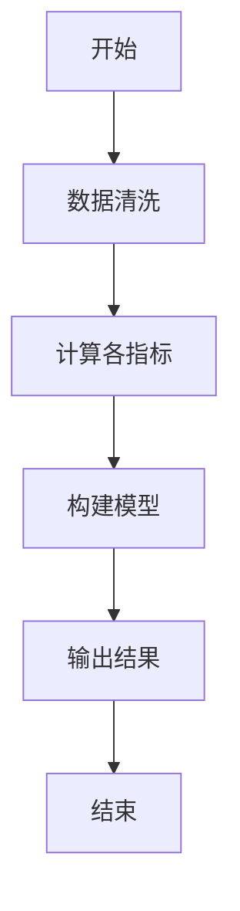
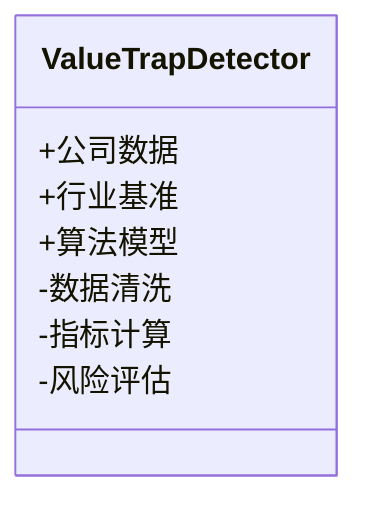
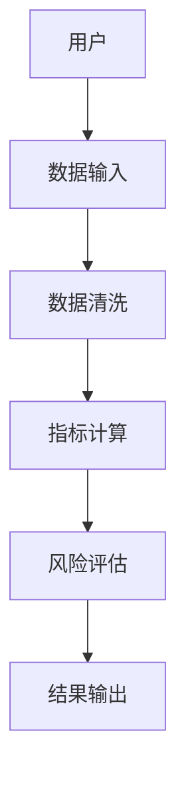

                 


# 彼得林奇的"价值陷阱"在新兴科技股中的识别指标体系

## 关键词：彼得林奇, 价值陷阱, 新兴科技股, 估值指标, 投资策略, 股票分析

## 摘要：  
本文旨在探讨彼得·林奇提出的“价值陷阱”概念在新兴科技股中的识别方法，并构建一套基于多维度指标的识别体系。通过分析新兴科技股的特点，结合定量分析和定性分析，提出了一套综合性的识别指标，帮助投资者有效识别和规避价值陷阱。文章还详细介绍了算法原理、系统架构设计以及实际案例分析，为投资者提供了切实可行的策略。

---

## 第一部分：背景介绍

### 第1章：彼得林奇"价值陷阱"的核心概念

#### 1.1 价值陷阱的定义与特征  
价值陷阱是指那些表面上看似估值低廉，但实际上存在严重问题的公司或股票。投资者容易被低估值吸引，却忽视了其潜在的风险和问题，最终导致投资失败。  

**核心特征：**  
- 低估值：市盈率、市净率等指标远低于行业平均水平。  
- 高负债：资产负债率过高，财务健康状况不佳。  
- 低增长：收入和利润持续下滑或增长停滞。  

#### 1.2 价值陷阱的形成机制  
价值陷阱的形成通常与市场情绪、行业周期和公司基本面密切相关。  
- **市场情绪：** 投资者往往在市场恐慌时买入低估值股票，却忽视了其基本面问题。  
- **行业周期：** 某些行业可能因周期性衰退，导致公司利润大幅下滑。  
- **公司基本面：** 公司管理层问题、产品质量问题或技术创新不足等。  

#### 1.3 价值陷阱与新兴科技股的特殊性  
新兴科技股具有高成长性和高波动性的特点，但也更容易成为价值陷阱的重灾区。  
- **高成长性：** 新兴科技公司可能因技术创新或市场需求而快速扩张，但这种增长可能不可持续。  
- **高波动性：** 科技股的股价波动较大，容易被市场情绪左右。  
- **高估值特性：** 新兴科技公司可能因高增长预期而被高估，但也可能因实际表现不佳而成为价值陷阱。  

---

## 第二部分：新兴科技股的估值指标体系

### 第2章：常见估值指标分析

#### 2.1 市盈率（P/E）  
市盈率=股价/每股净利润。用于衡量股票的估值是否合理，但需结合行业和公司发展阶段来看。  

#### 2.2 市净率（P/B）  
市净率=股价/每股净资产。适用于评估资产密集型行业，但在科技行业中的适用性较低。  

#### 2.3 市销率（P/S）  
市销率=股价/每股收入。适合用于收入增长快但尚未盈利的公司。  

#### 2.4 股息率  
股息率=每股股息/股价。用于评估股票的收益能力，但科技公司通常不派发高股息。  

#### 2.5 EV/EBITDA  
EV/EBITDA=企业价值/息税折旧及摊销前利润。用于衡量企业的整体估值，适用于不同规模和行业的公司。  

### 第3章：新兴科技股的特殊估值指标

#### 3.1 市盈率增长比（PEG）  
PEG=市盈率/净利润增长率。用于衡量市盈率与公司成长性的匹配程度。  

#### 3.2 研发投入占比  
研发投入占比=研发费用/营业收入。用于评估公司技术创新能力，高研发投入可能意味着更强的竞争力。  

#### 3.3 产品生命周期  
产品生命周期分析帮助判断公司的增长潜力，尤其是新兴科技公司，产品能否持续迭代至关重要。  

#### 3.4 市场占有率  
市场占有率=公司销售额/行业销售额。用于衡量公司在行业中的地位和竞争优势。  

#### 3.5 创新能力评估  
创新能力评估包括专利数量、技术领先性等指标，用于判断公司的长期发展潜力。  

---

## 第三部分：价值陷阱识别的指标体系构建

### 第4章：指标体系构建的原则

#### 4.1 可操作性  
指标应易于计算和获取，避免过于复杂的分析。  

#### 4.2 代表性  
指标应能够全面反映公司的财务状况、市场地位和管理能力。  

#### 4.3 综合性  
综合考虑定量指标和定性指标，避免单一指标的片面性。  

---

## 第四部分：算法原理讲解

### 第5章：算法概述

#### 5.1 算法目标  
通过多维度指标筛选，识别出潜在的价值陷阱公司。  

#### 5.2 算法输入  
- 公司财务数据（收入、利润、研发投入等）  
- 股价数据（市盈率、市净率等）  
- 行业基准数据  

#### 5.3 算法输出  
- 价值陷阱风险评分  
- 价值陷阱概率预测  

### 第6章：算法实现

#### 6.1 算法流程图  


#### 6.2 Python代码实现  
```python
import pandas as pd

# 示例数据
data = {
    '公司': ['A', 'B', 'C'],
    '市盈率': [15, 20, 30],
    '市净率': [2, 3, 4],
    '研发投入占比': [10, 15, 20],
    '市场占有率': [20, 25, 30],
    '净利润增长率': [5, 10, 15]
}

df = pd.DataFrame(data)

# 计算PEG
df['PEG'] = df['市盈率'] / df['净利润增长率']

# 筛选价值陷阱
value_traps = df[df['PEG'] > 2]
print(value_traps)
```

#### 6.3 数学模型  
$$PEG = \frac{市盈率}{净利润增长率}$$  
$$价值陷阱风险评分 = \sum (指标权重 \times 指标得分)$$  

---

## 第五部分：系统分析与架构设计

### 第7章：系统架构设计

#### 7.1 系统功能设计  


#### 7.2 系统架构图  


---

## 第六部分：项目实战

### 第8章：环境安装与核心代码实现

#### 8.1 环境安装  
- 安装Python和相关库（Pandas、Scikit-learn）  
- 数据获取：使用Yahoo Finance API获取股票数据  

#### 8.2 核心代码实现  
```python
import yfinance as yf
import pandas as pd

# 下载股票数据
def get_data(tickers):
    data = yf.download(tickers, start='2022-01-01', end='2023-12-31')
    return data

tickers = ['AAPL', 'MSFT', 'GOOGL']
df = get_data(tickers)
print(df.head())
```

---

## 第七部分：总结与展望

### 第9章：最佳实践

#### 9.1 小结  
通过多维度指标体系和算法模型，可以有效识别新兴科技股中的价值陷阱。  

#### 9.2 注意事项  
- 数据来源要可靠  
- 指标权重需根据实际情况调整  
- 定期更新模型以适应市场变化  

#### 9.3 拓展阅读  
建议阅读彼得·林奇的《投资最重要的事》和《 stocks for the long run》。

---

## 作者：AI天才研究院/AI Genius Institute & 禅与计算机程序设计艺术 /Zen And The Art of Computer Programming  

---

希望这篇文章能帮助投资者更好地识别新兴科技股中的价值陷阱，避免投资决策中的重大失误。

