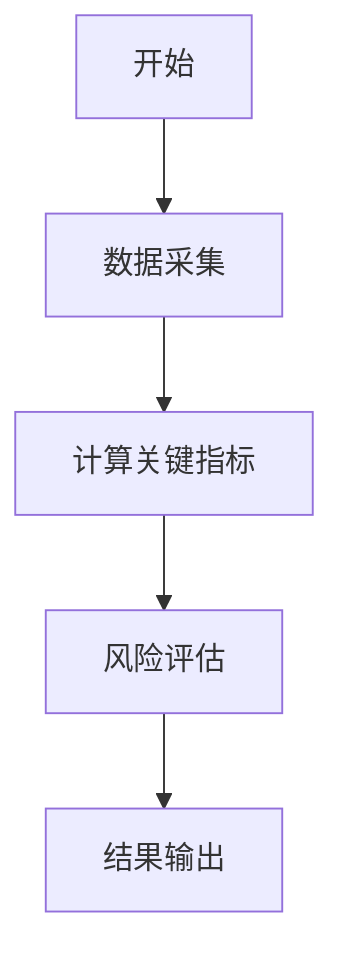
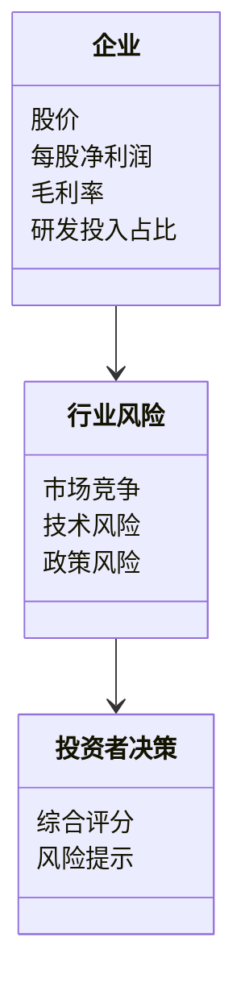
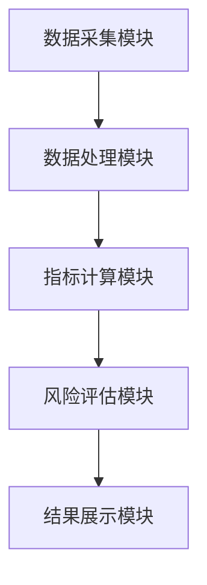

                 


```markdown
# 彼得林奇的"价值陷阱"在新能源汽车行业中的识别指标

> 关键词：价值陷阱、彼得林奇、新能源汽车、投资分析、风险评估

> 摘要：本文将深入探讨彼得林奇提出的“价值陷阱”概念，并结合新能源汽车行业的特点，系统性地分析如何识别这些陷阱。通过理论分析、算法设计、案例研究等多维度探讨，为投资者提供科学的识别指标和策略建议。

---

## 第一部分: 价值陷阱的定义与核心概念

### 第1章: 价值陷阱的定义与核心概念

#### 1.1 价值陷阱的定义与特征
- **价值陷阱**是指表面上看似具有投资价值，实则暗藏重大风险的公司或行业。
- 其特征包括：低估值、高增长预期、潜在的行业风险或政策风险。

#### 1.2 彼得林奇对价值陷阱的定义
- 彼得林奇认为，价值陷阱通常出现在行业周期性波动、公司基本面恶化或外部环境突变的情况下。
- 他强调，投资者应关注公司的财务健康状况、管理团队和行业竞争格局。

#### 1.3 新能源汽车行业中的价值陷阱
- 新能源汽车行业是一个高成长性但竞争激烈的行业。
- 价值陷阱可能出现在技术落后、政策变化频繁或市场渗透不足的企业中。

---

### 第2章: 新能源汽车行业的现状与挑战

#### 2.1 新能源汽车行业的现状
- **全球市场**：全球新能源汽车销量持续增长，中国、欧洲和北美是主要市场。
- **中国市场**：中国是全球最大的新能源汽车市场，补贴政策和产业政策推动了行业的快速发展。
- **技术趋势**：电池技术的进步、充电设施的完善和智能驾驶技术的提升是行业发展的主要方向。

#### 2.2 新能源汽车行业的挑战
- **市场竞争**：行业内企业数量激增，价格战激烈，盈利能力下降。
- **技术瓶颈**：电池技术突破缓慢，充电设施仍需完善。
- **政策风险**：补贴政策的调整和环保政策的变化对行业影响深远。

---

## 第二部分: 价值陷阱识别的核心指标

### 第3章: 价值陷阱识别的理论基础

#### 3.1 彼得林奇投资理论的逻辑框架
- **投资者心理**：投资者往往过于乐观，忽视潜在风险。
- **市场行为**：市场的非理性波动和信息不对称是价值陷阱形成的重要原因。
- **行业特殊性**：新能源汽车行业具有高技术和高风险的特点，价值陷阱的表现形式更为复杂。

#### 3.2 价值陷阱识别的核心指标
- **财务指标**：关注企业的盈利能力、成长能力、偿债能力。
- **市场指标**：市盈率（P/E）、市净率（P/B）、市销率（P/S）等。
- **技术指标**：研发投入占比、专利数量、技术领先性。

---

### 第4章: 价值陷阱识别的算法原理

#### 4.1 价值陷阱识别的算法框架


#### 4.2 算法实现
- 数据采集：收集企业的财务数据、市场数据和技术数据。
- 指标计算：计算市盈率、毛利率、研发投入占比等关键指标。
- 风险评估：通过综合评分模型判断企业是否为价值陷阱。

#### 4.3 数学模型与公式
- 市盈率公式：
  $$
  P/E = \frac{\text{股价}}{\text{每股净利润}}
  $$
- 综合评分模型：
  $$
  \text{综合评分} = 0.4 \times P/E + 0.3 \times 毛利率 + 0.3 \times 研发投入占比
  $$

---

## 第三部分: 系统分析与架构设计

### 第5章: 系统功能设计

#### 5.1 领域模型


#### 5.2 系统架构


---

## 第四部分: 项目实战

### 第6章: 项目实战

#### 6.1 环境安装
- 安装Python和相关库（pandas、numpy、matplotlib）。

#### 6.2 核心代码实现
```python
import pandas as pd

# 数据采集
data = pd.read_csv('新能源汽车公司.csv')

# 计算关键指标
data['P/E'] = data['股价'] / data['每股净利润']
data['综合评分'] = 0.4 * data['P/E'] + 0.3 * data['毛利率'] + 0.3 * data['研发投入占比']

# 风险评估
data['是否价值陷阱'] = data['综合评分'] < 3
```

#### 6.3 案例分析
- 以某新能源汽车公司为例，计算其P/E、毛利率和研发投入占比，评估其是否为价值陷阱。

#### 6.4 项目小结
- 通过实际案例分析，验证算法的有效性。

---

## 第五部分: 最佳实践与总结

### 第7章: 最佳实践

#### 7.1 小结
- 彼得林奇的价值陷阱理论在新能源汽车行业中的应用具有重要意义。
- 投资者应关注企业的财务健康、技术实力和政策环境。

#### 7.2 注意事项
- 避免单一指标分析，注重多维度综合评估。
- 定期更新数据和模型，适应市场变化。

#### 7.3 拓展阅读
- 推荐阅读彼得林奇的《选股的艺术》和相关行业分析报告。

---

## 作者信息

作者：AI天才研究院/AI Genius Institute  
联系邮箱：contact@aitalentinstitute.com  
更多内容请访问：https://www.zenofprogramming.com
```

