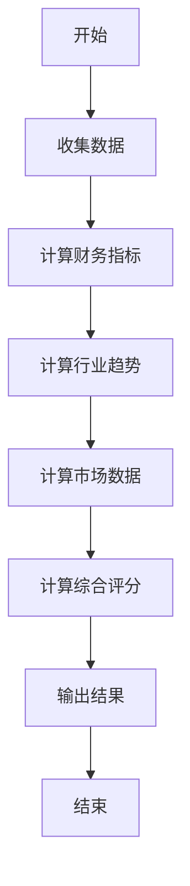

                 


# 彼得林奇的"价值陷阱"在新能源行业中的识别方法

## 关键词：彼得林奇、价值陷阱、新能源行业、投资分析、风险管理、算法识别

## 摘要

本文将探讨彼得·林奇的价值投资理论中“价值陷阱”的概念，并分析其在新能源行业中的识别方法。通过系统的分析和实际案例，本文将提供一种基于算法的方法，帮助投资者识别和避免价值陷阱，从而在新能源行业中做出更明智的投资决策。

---

# 第1章：价值陷阱与新能源行业的结合

## 1.1 价值陷阱的定义与特征

彼得·林奇在他的投资理论中提出了“价值陷阱”的概念，指的是那些看似具有吸引力，但实际上存在根本性缺陷的公司或行业。价值陷阱的核心特征包括：

1. **低估值**：表面上看，公司的市盈率、市净率等估值指标似乎低于行业平均水平，但这种低估值可能是由于公司基本面恶化或行业结构性问题导致的。
2. **虚假成长**：公司通过财务造假或其他不正当手段营造出虚假的业绩增长，这种增长不可持续。
3. **行业困境**：行业整体处于衰退期，市场需求下降，竞争激烈，企业难以维持盈利能力。

---

## 1.2 新能源行业的特点与投资机会

### 1.2.1 行业现状

新能源行业涵盖太阳能、风能、电动汽车、储能等多个领域，近年来受到政策支持和技术进步的推动，行业增长迅速。然而，行业内部也存在竞争加剧、技术更新快、政策变化频繁等问题。

### 1.2.2 投资机会与风险

新能源行业的投资机会主要体现在技术进步带来的成本下降、政策支持带来的市场扩大，以及环保需求带来的替代效应。然而，行业也面临政策风险、技术风险和市场风险。

---

# 第2章：价值陷阱的识别框架

## 2.1 识别框架的构建逻辑

为了在新能源行业中识别价值陷阱，我们可以构建一个基于财务指标、行业趋势和市场数据的多维度识别框架。以下是框架的核心步骤：

1. **数据收集**：收集目标公司或行业的财务数据、市场数据和技术数据。
2. **财务分析**：通过市盈率（P/E）、市净率（P/B）、ROE（净资产收益率）等指标分析公司的估值水平。
3. **行业分析**：研究行业的市场容量、竞争格局和政策环境。
4. **风险评估**：评估公司或行业面临的技术风险、政策风险和市场风险。

---

## 2.2 识别框架的核心要素

### 2.2.1 财务指标

- **市盈率（P/E）**：公司股价与每股收益的比率，反映市场对公司盈利能力的评估。
- **市净率（P/B）**：公司股价与每股净资产的比率，反映公司资产的估值水平。
- **ROE**：净资产收益率，反映公司的盈利能力。

### 2.2.2 行业趋势

- **市场需求**：行业的市场规模和增长率。
- **政策支持**：政府对新能源行业的政策支持力度。
- **技术进步**：行业技术的更新速度和成本下降潜力。

### 2.2.3 市场数据

- **股价波动**：股价的波动性反映市场的不确定性。
- **成交量**：成交量的变化可以揭示市场的交易活跃度。

---

# 第3章：价值陷阱识别的算法原理

## 3.1 算法的核心思想

基于多维度数据的分析，构建一个综合评分模型，通过量化的方法识别价值陷阱。模型的核心思想是将财务指标、行业趋势和市场数据转化为可量化的指标，并通过加权评分的方式综合评估公司的风险等级。

---

## 3.2 算法实现的代码示例

### 3.2.1 数据预处理与特征提取

```python
import pandas as pd

# 假设我们有一个包含财务指标和市场数据的数据框
data = pd.DataFrame({
    '公司': ['公司A', '公司B', '公司C'],
    '市盈率': [15, 20, 30],
    '市净率': [1.5, 2.0, 3.0],
    'ROE': [5, 10, 8],
    '市场需求': [80, 70, 60],
    '政策支持': [90, 80, 70],
    '技术进步': [70, 80, 90]
})

# 定义评分标准
def calculate_score(row):
    score = 0
    # 市盈率：低于行业平均水平得1分
    if row['市盈率'] < 20:
        score += 1
    # 市净率：低于行业平均水平得1分
    if row['市净率'] < 2.5:
        score += 1
    # ROE：高于行业平均水平得1分
    if row['ROE'] > 7:
        score += 1
    # 市场需求：高于60得1分
    if row['市场需求'] > 60:
        score += 1
    # 政策支持：高于70得1分
    if row['政策支持'] > 70:
        score += 1
    # 技术进步：高于80得1分
    if row['技术进步'] > 80:
        score += 1
    return score

# 计算每个公司的评分
data['评分'] = data.apply(calculate_score, axis=1)
print(data)
```

### 3.2.2 算法流程图



---

# 第4章：系统分析与架构设计

## 4.1 问题场景介绍

### 4.1.1 问题背景

在新能源行业中，投资者需要识别那些表面上具有低估值，但实际上存在根本性缺陷的公司或行业。这可以通过构建一个基于多维度数据的识别系统来实现。

---

## 4.2 系统功能设计

### 4.2.1 功能模块划分

1. **数据采集模块**：从公开数据源获取公司的财务数据、市场数据和行业数据。
2. **数据处理模块**：对数据进行清洗、转换和特征提取。
3. **模型计算模块**：基于构建的评分模型计算公司的综合评分。
4. **结果可视化模块**：将评分结果以图表形式展示。

---

## 4.3 系统架构设计

### 4.3.1 架构总体设计


---

# 第5章：项目实战与案例分析

## 5.1 项目环境安装与配置

### 5.1.1 环境搭建

- 安装Python和必要的库（如pandas、numpy、matplotlib）。
- 获取新能源行业的相关数据（如财务数据、市场数据）。

---

## 5.2 系统核心实现源代码

### 5.2.1 数据预处理与特征提取

```python
import pandas as pd

# 假设我们有一个包含财务指标和市场数据的数据框
data = pd.DataFrame({
    '公司': ['公司A', '公司B', '公司C'],
    '市盈率': [15, 20, 30],
    '市净率': [1.5, 2.0, 3.0],
    'ROE': [5, 10, 8],
    '市场需求': [80, 70, 60],
    '政策支持': [90, 80, 70],
    '技术进步': [70, 80, 90]
})

# 定义评分标准
def calculate_score(row):
    score = 0
    # 市盈率：低于行业平均水平得1分
    if row['市盈率'] < 20:
        score += 1
    # 市净率：低于行业平均水平得1分
    if row['市净率'] < 2.5:
        score += 1
    # ROE：高于行业平均水平得1分
    if row['ROE'] > 7:
        score += 1
    # 市场需求：高于60得1分
    if row['市场需求'] > 60:
        score += 1
    # 政策支持：高于70得1分
    if row['政策支持'] > 70:
        score += 1
    # 技术进步：高于80得1分
    if row['技术进步'] > 80:
        score += 1
    return score

# 计算每个公司的评分
data['评分'] = data.apply(calculate_score, axis=1)
print(data)
```

---

## 5.3 项目小结

通过构建一个基于多维度数据的识别系统，我们可以有效地识别新能源行业中的价值陷阱。然而，需要注意的是，这种方法只是一个辅助工具，实际投资决策还需要结合更全面的分析和专业的投资建议。

---

# 作者

作者：AI天才研究院/AI Genius Institute & 禅与计算机程序设计艺术 /Zen And The Art of Computer Programming

